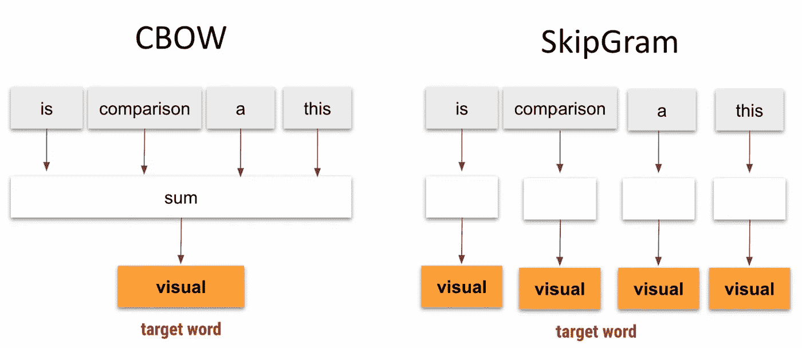
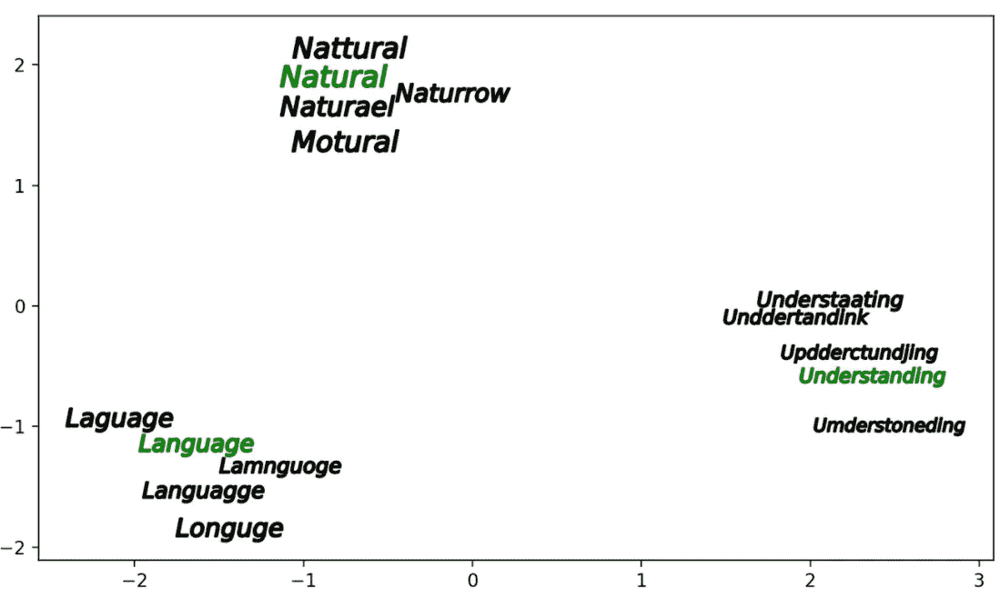
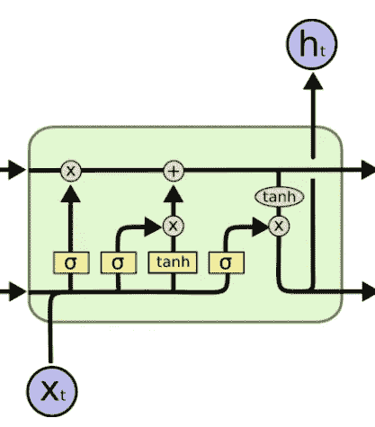
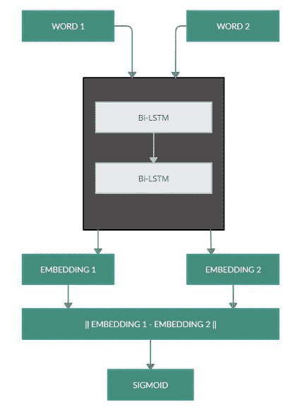
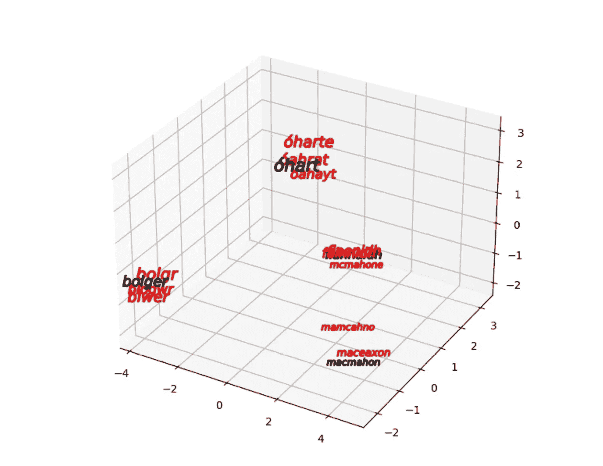
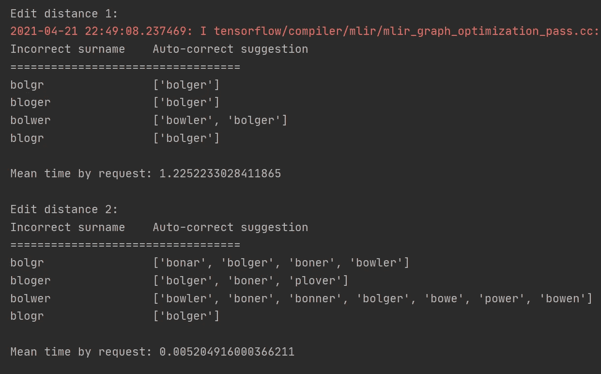
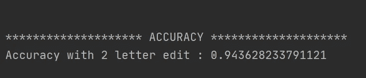

# 基于 LSTM 的 Char2Vec 模型的自动校正及建议

> 原文：<https://medium.com/version-1/auto-correction-and-suggestion-using-lstm-based-char2vec-model-e276d24471ea?source=collection_archive---------1----------------------->

# 介绍

你有没有好奇过你的手机是如何自动纠正你的短信的？或者谷歌如何在你拼错单词之前就知道你拼错了？

让我告诉你，这是基于广为人知的自动纠错这个话题。在这篇文章中，我将带您浏览一个类似的基于字符的语言模型，这个模型是我为建议和自动更正单词而构建的。

**问题陈述:**

我和我在 Version1 创新实验室的团队一起参与了一个理解各种手写表单的项目。即使对于市场上最先进的玩家来说，理解手写文本也是一项艰巨的任务。原因有很多，包括没有标准的书写方式，字符之间的噪声和失真，扫描不良的表格图像或书写方向因人而异。由于这些挑战，我们在表单中得到了许多不正确识别的字段值。

为了解决这个问题，我们在现有流程的基础上增加了一个额外的层，称为后处理阶段，它可以纠正这些表单字段。我已经使用了基于 **Bi-LSTM** 的 **Char2Vec** 模型来纠正这些单词(在本例中是爱尔兰姓氏)，并且对于两个字母的编辑单词(有两个字母拼错的单词)实现了 94.36%的准确率**。**

在我们深入研究技术细节和我如何构建这个模型之前，让我们先在下一节中简要了解一些基本原理。

# 基本原则

1.  **什么是单词嵌入？**

它只是单词的向量表示。具体来说，向量空间模型(VSM)是一种空间，其中文本被表示为向量，使得具有相似上下文和语义的单词彼此靠近。

Fig 1: Word Embedding with similar context have close proximity

相关词占用的空间更近，如上图所示。为了找到单词在空间中的位置，计算它们各自向量之间的距离。

**2。如何计算单词嵌入？**

可以使用各种方法来计算，这些方法可以大致分为两类:

1.  **基于频率的嵌入:**基于计数的方法计算某个单词与其相邻单词共现的频率统计，然后将这些计数统计映射到每个单词的一个小而密集的向量。这些方法是**计数向量**、 **TF-IDF 向量**和**同现向量**
2.  **基于预测的嵌入:**预测模型根据学习到的小而密集的嵌入向量，直接尝试预测来自其邻居的单词。方法有**连续包字(CBOW)** 和**跳克。**

讨论所有的方法超出了这篇文章的范围。要了解更多，请点击 [*链接*](https://www.analyticsvidhya.com/blog/2017/06/word-embeddings-count-word2veec/) 。现在，我们将专注于基于神经网络的方法，通常称为 **Word2Vec** ，它是 **CBOW** 和 **Skip-Gram** 的混合。为了从这些算法中获得每个单词的嵌入，他们使用一个简单的三层神经网络:输入层、隐藏层和输出层。**隐层和输出层之间的权重作为单词的单词向量表示。**

让我们简要了解两种基于预测的方法:

**i.** **CBOW** :这个模型学习使用其邻域中的所有术语来预测目标单词。使用上下文向量的数量来预测目标单词。所考虑的相邻项由围绕目标单词的预定义窗口大小来确定。

**二。** **Skip-Gram** :另一方面，这个模型学习根据一个相邻的单词来预测一个单词。简单来说，给定一个单词，它就学会在上下文中预测另一个单词。

Fig 2: CBOW and Skip-Gram by Kavita Ganesan

**3。Word2Vec 模型的挑战？**

如前所述，Word2Vec 使用神经网络模型从大量文本中学习单词关联。该模型在对大型文本语料库进行训练时提取了一些关于词义的语义信息，但它们是在一个**固定词汇**中操作的(通常缺少一些很少使用的词)。

在解决某些 NLP 问题时，这是一个巨大的缺点。如果文本中的几个重要术语不属于语义语言模型的词汇表，那么语义语言模型在解决某些类型的 NLP 任务时是低效的——该模型将无法解释这些单词。如果我们试图处理人类写的文本，我们可能会陷入这种境地(这些可能是回复、评论、文档或网上的帖子)。这些文本可能包括错别字、俚语、来自独特位置的生僻字，或者不包括在语言词典中的名字，因此也不包括在语义模型中。

**4。Char2Vec 模型介绍？**

为了解决上面提到的问题，[直觉工程](https://hackernoon.com/chars2vec-character-based-language-model-for-handling-real-world-texts-with-spelling-errors-and-a3e4053a147d)创建了一个语言模型，该模型仅基于单词的拼写来创建单词嵌入，并收集相似矢量来相似地拼写单词。

该模型用一个固定长度的向量来表示符号(单词)序列，单词拼写的相似性用向量之间的距离度量来表示。由于该模型不基于字典(不存储固定的具有对应向量表示的术语字典)，其初始化和使用不需要大量的计算能力。

在下图中，绿色的单词是正确的，黑色的是拼写相似但不在字典中的错别字。该模型能够根据向量距离度量对它们进行分组。

Fig 3: Similarly spelt words are grouped

我开发了一个类似的基于语言的字符模型，有一些改进，如使用**双 LSTM** 来获得嵌入和组合 **KNN** 和 **Levenshtein** 距离来找到最近的邻居，而不是基于余弦的相似性，这导致了准确性的显著提高。

**5。莱文斯坦距离**

**Levenshtein 距离**是一个[字符串度量](https://en.wikipedia.org/wiki/String_metric)，用于测量两个序列之间的差异。非正式地，两个单词之间的 Levenshtein 距离是将一个单词变成另一个单词所需的单个字符编辑(插入、删除或替换)的最小数量。例如,“小猫”和“坐着”之间的 Levenshtein 距离是 3，因为至少需要 3 次编辑才能将一个变成另一个。

1.  **k**itten→**s**itten(用“s”代替“k”)
2.  sitt**e**n→sitt**I**n(用“I”代替“e”)
3.  sittin → sittin **g** (在末尾插入“g”)。

我已经使用 Levenshtein 距离在所有最近的邻居中找到与当前单词向量最接近的匹配。为了计算最近邻，我使用了基于人工神经网络搜索的 k-最近邻([近似最近邻](https://en.wikipedia.org/wiki/Nearest_neighbor_search#Approximation_methods))使用 [nmslib](https://github.com/nmslib/nmslib) 。

6。LSTM 和比-LSTM

**长短期记忆** ( **LSTM** )是一种用于深度学习领域的人工递归神经网络(RNN)架构。与标准的前馈神经网络不同，LSTM 有反馈连接。它不仅可以处理单个数据点，还可以处理整个数据序列。一个普通的 LSTM 单元由一个**单元**、一个**输入门**、一个**输出门**和一个**遗忘门**组成。该单元记忆任意时间间隔内的值，三个*门*调节进出该单元的信息流。我强烈推荐这个[博客](https://colah.github.io/posts/2015-08-Understanding-LSTMs/)来更详细地了解 LSTM。

Fig 4: LSTM Unit

**双向 LSTMs(双 LSTM)** ，也使用相同的 LSTM 单位，但数据向两个方向流动，这意味着，我们从开始到结束和从结束到开始分别向学习算法提供一次原始数据。我使用这种双 LSTM 架构作为生成嵌入的基础模型，结果非常好。现在让我们在下一节看看我是如何实现这个模型的。

# 履行

我所使用的方法是受[*Lettria*](https://lettria.com/fr)*在这篇*文章中所做工作的启发。方法如下:**

*   **创建一个训练数据集。**
*   **训练一个给出字符级单词嵌入的模型。**
*   **对整个词典进行矢量化处理，并为高效搜索建立索引。**
*   **向量化拼写错误的单词，并寻找它们最近的邻居。**

1.  ****训练数据集创建****

**训练数据已经使用 **6K+单词**(爱尔兰姓氏)的字典创建。我使用插入、删除、置换和替换原始单词中的字符生成了几个拼写错误的单词。这导致为每个正确的单词创建四个相似的单词，从而产生 **24K+** 相似的元组。例如:(Ankit，Ankt)，(Ankit，Anikt)，(Ankit，Ankeit)，(Ankit，Abkit)。**

**类似地，我为每个正确的单词创建了四个不相似的单词，这导致了 **24k+** 不相似的元组。例如:(安基特，苏米特)，(安基特，约翰)，(安基特，罗伯特)，(安基特，亚历山大)。所以整个训练数据集变成围绕 **48K+** 元组。**最后，** **我把相似对的目标赋值为 0，不相似对的目标赋值为 1。****

****2。模型训练和架构****

**该模型使用两层双 LSTM 来构建选定大小的嵌入。更高的维数以更长的计算时间为代价提供了更精确的结果。对于这个模型，我们已经满足于 300 维。**

**该模型通过传递一组单词来训练，这些单词或者是 ***两个完全不同的单词，或者是一个单词和它的一个拼写错误，如上面的*** *部分所述。*训练目标是 ***对于相似元组最小化两个嵌入之间的差异，对于不同单词*** *最大化两个嵌入之间的差异。***

****

**Fig 5: Training Model Architecture**

**我已经在 [*数据块*](https://azure.microsoft.com/en-us/services/databricks/) 上训练了这个模型 50 个时期。为了训练整个基于双 LSTM 的 Char2Vec 模型，使用 GPU 花费了大约 3 个小时。在典型的 CPU 机器上，这可能需要长达 8 个小时。**

****3。可视化****

**一旦我们训练了我们的模型，下一步就是检查它是否能聚类拼写相似的单词。首先，我定义了一些正确的和错误的(拼写错误的)单词，然后通过训练好的模型对这些单词进行矢量化。通过用 PCA 将它们投影到 2D 平面上，我们得到了下面的图:**

****

**Fig 6: Similar Irish last names are grouped together**

**大获成功！黑色的名字是正确的，红色的是拼写错误的。可以看出，拼写相似的单词彼此更接近。**

***注:“麦克马洪”这个词看起来与实际的姓氏相去甚远，但事实并非如此。如果我们从右边看，我们会发现它更接近实际的姓氏。***

****4。用法修正****

**下一步是检查我们是否能纠正这些拼写错误的单词。为此，我们将对 6K+单词的整个字典进行矢量化。根据单词的大小，这个过程可能需要一些时间，但对于我的字典来说，在我的 CPU 上只需要 1 分钟。**

**最后一步是构建一个索引，使我们能够有效地搜索最近的向量。为此，我们使用了一个专门用于近似最近邻(ANN)搜索的库。**

**一旦我们对字典进行了矢量化并创建了索引，下一步就是使用这些索引找到当前拼写错误的单词的 k 个最近邻。在我的例子中，我保持 k=80，这是默认值，它工作得非常好。一旦我们得到 k 个(这里是 80 个)邻居，我们就检查拼写错误的单词与其邻居的 Levenshtein 距离，并过滤距离最小的单词。**

****

**Fig 7: Auto-correct suggestion output**

**在上面的输出中，我们可以看到该模型能够在所有情况下给出正确的姓氏“bolger”。编辑距离 1 表示输入中有一个错误或缺失的字母，编辑距离 2 表示输入中有两个错误或缺失的字母(拼写错误的单词)。**

****5。评估****

**上面的结果只是对一个单词(姓氏)进行了两次不同的编辑，但是我想对所有拼写错误的单词进行评估。**

**为了做到这一点，我使用了一个定制的指标来检查实际的单词是否出现在模型的自动更正建议中，如图 7 所示。如果实际的单词出现在建议中，我认为这个预测是正确的，否则就是不正确的。**

****

**Fig 8: Accuracy with 2 letter edit**

**最后，我用正确预测的总数除以预测的总数来计算准确度。如图 8 所示，我达到的总体精度是 **94.36%** 。**

# **限制**

*   **这个模型对于长度小于 3 的单词不太适用。**
*   **如果嵌入和训练集大小增加，则训练时间显著增加。**
*   **如果单词量很大，字典的矢量化需要时间。**

# **其他一些应用**

*   **改进了数据输入的表单验证，即该模型可用于纠正用户输入数据时的错误。**
*   **数据清理:修复数据库表中的坏数据**
*   **引人入胜的见解:许多问答平台，如 Reddit、Quora 和 Stack Overflow，都有基于用户的输入。很多时候，用户在写作时会犯错别字或使用渣滓。机器很难理解这些词，这使得它很难进行分析。使用我们当前的模型，通过找到与这些错别字最接近的正确单词，可以解决这个问题。**

# **结论**

**字符级嵌入提供了出色的整体效率，尤其是对于较长的单词。双 LSTM 甚至更好地理解了序列和嵌入。未来的工作包括在各种其他场景中测试该模型并测量其准确性。**

**希望这篇文章对你有帮助。如果你喜欢它，请在 medium 上关注我，为这个帖子鼓掌，并关注我未来的帖子。也可以在[***LinkedIn***](https://www.linkedin.com/in/ankitk2109/)***或***[***Github***](https://github.com/ankitk2109)***上与我联系。*****

# **参考**

*   **[https://hacker noon . com/chars 2 vec-character-based-language-model-for-handling-real-world-texts-with-spelling-errors-and-a3e 4053 a 147d](https://hackernoon.com/chars2vec-character-based-language-model-for-handling-real-world-texts-with-spelling-errors-and-a3e4053a147d)**
*   **[https://www . analyticsvidhya . com/blog/2017/06/word-embeddings-count-word 2 veec](https://www.analyticsvidhya.com/blog/2017/06/word-embeddings-count-word2veec)**
*   **[https://towards data science . com/embedding-for-spelling-correction-92c 93 f 835d 79](https://towardsdatascience.com/embedding-for-spelling-correction-92c93f835d79)**
*   **[https://israelg 99 . github . io/2017-03-22-Vector-Representations-of-Words/](https://israelg99.github.io/2017-03-22-Vector-Representations-of-Words/)**
*   **[https://kavita-ganesan . com/comparison-between-cbow-skip gram-subword/](https://kavita-ganesan.com/comparison-between-cbow-skipgram-subword/)**
*   **[https://github.com/Lettria/Char2Vec](https://github.com/Lettria/Char2Vec)**
*   **[https://en.wikipedia.org/wiki/Levenshtein_distance](https://en.wikipedia.org/wiki/Levenshtein_distance)**
*   **[https://colah.github.io/posts/2015-08-Understanding-LSTMs/](https://colah.github.io/posts/2015-08-Understanding-LSTMs/)**

****关于作者****

***Ankit Kumar 目前是爱尔兰 CeADAR 的一名数据科学家，在* [*Version 1 的创新实验室*](https://www.version1.com/innovation/) *工作，作为一名创新数据科学家，他为企业提供创造性的解决方案和概念证明，以确保 Version 1 处于突破性创新的前沿。***