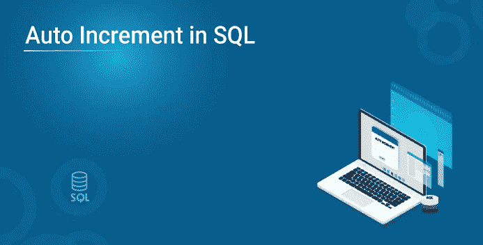
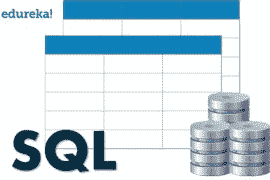
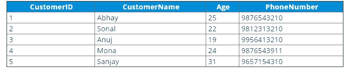

# 如何在 SQL 中使用自动增量？

> 原文：<https://medium.com/edureka/auto-increment-in-sql-2c53903a90a7?source=collection_archive---------2----------------------->



众所周知，数据库以逻辑格式存储海量数据。但是，您有没有想过这样一种情况，在这种情况下，您必须为表中的每个新记录提供一个唯一的编号？嗯，我认为，手动输入数字实际上是不可能的。因此，您可以在 SQL 中使用 Auto Increment，为表中的每个新记录自动输入一个惟一的数字。



本文将涵盖以下主题:

1)什么是 SQL 中的自动增量？

2)如何设置自动增量？

*   SQL Server
*   关系型数据库
*   MS Access
*   神谕
*   一种数据库系统

# 什么是 SQL 中的自动增量？

我确信这个名字本身就暗示了它的功能。自动增量是一个字段，用于为添加到表中的每个新记录生成一个唯一的编号。这通常用于主键列，因为开发人员可以很容易地为每个新记录自动生成一个唯一的编号。

现在，你知道了什么是 SQL 中的自动增量，让我们讨论如何在各种 DBMS 中使用这个字段。

# 如何设置自动增量？

为了让您更好地理解，我将考虑下表:


## SQL Server 的语法和示例

要使用自动递增字段，在 SQL Server 中，您必须使用 **IDENTITY** 关键字。

## 语法:

```
CREATE TABLE TableName (
Column1 DataType IDENTITY(starting value, increment by),
Column2 DataType,
);
```

## 示例:

创建一个名为 Customers、列为 CustomerID、CustomerName、Age 和 PhoneNumber 的表。这里，自动递增 CustomerID，并使其成为表的主键。

```
CREATE TABLE Customers (
CustomerID int IDENTITY(1,1) PRIMARY KEY,
CustomerName varchar(255),
Age int,
PhoneNumber int);
```

在上面的例子中，同样，要在上表中插入值，您必须使用标识的**起始值为 1** ，它应该以如下方式插入查询:**每增加一条新记录，就增加 1** 。你可以根据你的愿望提到这些值。

```
INSERT INTO Customers (CustomerName,Age, PhoneNumber)
VALUES ('Abhay','25','9876543210');
```

在这里，如果您注意到，我没有提到 CustomerID 列，因为 ID 是自动生成的。因此，如果您看到使用以下查询再插入 4 个值:

```
INSERT INTO Customers (CustomerName,Age, PhoneNumber)
VALUES ('Sonal','22','9812313210');INSERT INTO Customers (CustomerName,Age, PhoneNumber)
VALUES ('Anuj','19','9956413210');INSERT INTO Customers (CustomerName,Age, PhoneNumber)
VALUES ('Mona','24','9876543911');INSERT INTO Customers (CustomerName,Age, PhoneNumber)
VALUES ('Sanjay','31','9657154310');
```

然后，您将看到下面的输出:



接下来，在这篇关于 SQL 自动递增的文章中，让我们看看如何在 MySQL 中自动递增一列。

## MySQL 的语法和示例

要使用自动增量字段，在 MySQL 中，必须使用 **AUTO_INCREMENT 关键字**。AUTO_INCREMENT **的**起始值**默认为 1**，每增加一条记录**增加 1** 。

## 语法:

```
CREATE TABLE TableName ( Column1 DataType AUTO_INCREMENT, Column2 DataType, );
```

## 示例:

创建一个名为 Customers、列为 CustomerID、CustomerName、Age 和 PhoneNumber 的表。这里，自动递增 CustomerID，并使其成为表的主键。

```
CREATE TABLE Customers ( CustomerID int AUTO_INCREMENT PRIMARY KEY, CustomerName varchar(255), Age int, PhoneNumber int);
```

如果您希望以任何其他数字开始 AUTO_INCREMENT 值，则可以按以下方式使用关键字:

## 语法:

```
ALTER TABLE TableName AUTO_INCREMENT=50;
```

## 示例:

```
ALTER TABLE Customers AUTO_INCREMENT=50;
```

与 SQL Server 类似，您可以使用 INSERT 语句将值插入到表中。在插入值时，您将看到与上表相同的输出。接下来，在这篇关于 SQL 自动递增的文章中，让我们看看如何在 MS Access 中自动递增列。

# MS 访问的语法和示例

要使用自动递增字段，在 MS Access 中，必须使用**自动递增**关键字。

## 语法:

```
CREATE TABLE TableName ( Column1 DataType AUTOINCREMENT, Column2 DataType, );
```

## 示例:

创建一个名为 Customers、列为 CustomerID、CustomerName、Age 和 PhoneNumber 的表。这里，自动递增 CustomerID，并使其成为表的主键。

```
CREATE TABLE Customers ( CustomerID int AUTOINCREMENT PRIMARY KEY, CustomerName varchar, Age int, PhoneNumber int);
```

**自动递增的**默认起始值**为 1** ，每记录一次**也会递增 1** 。但是，如果您希望改变这一点，比如说，您希望将起始值设置为 20，增量为 2，您可以使用自动增量功能，如下所示:

```
AUTOINCREMENT(20,2)
```

与 SQL Server 类似，您可以使用 INSERT 语句将值插入到表中。在插入值时，您将看到与上表相同的输出。接下来，在这篇关于 SQL 自动递增的文章中，让我们看看如何在 Oracle 中自动递增列。

# Oracle 的语法和示例

要使用自动递增字段，在 Oracle 中，您必须使用 sequence 对象创建一个自动递增字段。sequence 对象生成一个数字序列。

## 创建序列的语法:

```
CREATE SEQUENCE name_of_sequence MINVALUE 1 START WITH 1 INCREMENT BY 1 CACHE 10;
```

在上面的语法中，

1.  **序列名称** —创建名为序列名称的序列
2.  **开始** —提及开始值
3.  **增量** —提及增量值
4.  **缓存** —提及为更快访问而存储的值的最大数量。

**例如:**

创建一个 sequence 对象，其中起始值为 1，增量为 3，要存储的最大值为 20。

```
CREATE SEQUENCE seq_customers MINVALUE 1 START WITH 1 INCREMENT BY 3 CACHE 20;
```

与 MySQL 和 SQL Server 类似，您可以使用 INSERT 语句将值插入到表中。在插入值时，您将看到与上表相同的输出。接下来，在这篇关于 SQL 自动递增的文章中，让我们看看如何在 PostgreSQL 中自动递增列。

# PostgreSQL 的语法和示例

要使用自动递增字段，在 PostgreSQL 中，必须用 sequence 对象创建一个自动递增字段。sequence 对象生成一个数字序列。

## 语法:

```
CREATE TABLE TableName ( Column1 DataType SERIAL PRIMARY KEY, Column2 DataType, );
```

**示例:**

创建一个名为 Customers、列为 CustomerID、CustomerName、Age 和 PhoneNumber 的表。这里，自动递增 CustomerID，并使其成为表的主键。

```
CREATE TABLE Customers ( CustomerID int SERIAL PRIMARY KEY, CustomerName varchar(255), Age int, PhoneNumber int);
```

与 MySQL、SQL Server 和其他 DBMS 类似，您可以使用 INSERT 语句将值插入到表中。在插入值时，您将看到与上表相同的输出。我希望你们喜欢这篇文章，并理解所有的差异。如果你想查看更多关于人工智能、DevOps、道德黑客等市场最热门技术的文章，你可以参考 Edureka 的官方网站。

请留意本系列中的其他文章，它们将解释 SQL 的各个方面。

> *1。*[*SQL 之间的差异& NoSQL 数据库*](/edureka/sql-vs-nosql-db-5d9b69ace6ac)
> 
> *2。*[*SQL For Data Science*](/edureka/sql-for-data-science-a8fe10fe2ef9)
> 
> [*3。前 65 名 SQL 面试问题*](/edureka/sql-interview-questions-162f97f37ac2) *s*

*原载于 2019 年 9 月 3 日 https://www.edureka.co**的* [*。*](https://www.edureka.co/blog/sql-auto-increment/)