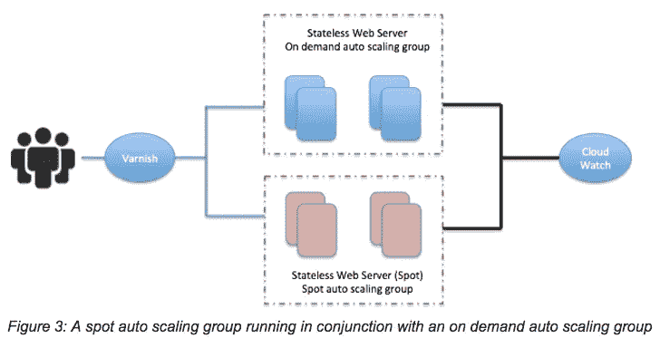
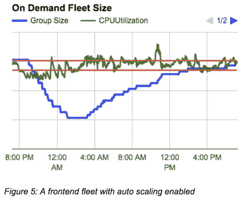

# 自动缩放 Pinterest

> 原文：<https://medium.com/pinterest-engineering/auto-scaling-pinterest-df1d2beb4d64?source=collection_archive---------1----------------------->

Jinru He | Pinterest 基础设施工程师

在 Pinterest，基础设施效率是我们的首要任务之一。在高峰时段，每秒请求数(RPS)可能是非高峰时段的两倍。过去，我们在车队中维护了固定数量的实例，以便在高峰时段提供服务，并确保车队不会出现容量不足的情况。然而，随着 RPS 在非高峰时段减少，我们的大多数实例都在利用不足的情况下运行。由于 Pinterest 建立在 AWS 之上，我们决定将 [Amazon Auto Scaling](https://aws.amazon.com/autoscaling/) 应用到我们的服务中。

## 第一次尝试

我们在 2013 年首次尝试亚马逊自动扩展，但是车队没有正确扩展。需要使用特定于 Pinterest 的图像在 AWS 中启动的实例也需要使用特定于服务的代码进行部署，但是我们看到新的实例无法安装配置或部署服务代码。这些故障阻碍了实例处理生产流量，也阻碍了车队的扩展。车队将继续在容量不足的情况下运行，但最终会随着 RPS 的增加而融化。那么，我们是如何让自动缩放为我们服务的呢？

## 构建自动缩放引擎

去年，我们又尝试了一次自动缩放，并开始构建一个新的自动缩放引擎。下图显示了系统的一些主要组件。

我们在自动扩展引擎中内置了标准组件，例如用于自动扩展的 UI 配置控制台、扩展活动通知和独特的功能，以便于工程师采用。

**一前一后自动缩放。** AWS 提供现货实例，可以以低得多的价格投标。由于 spot 实例更具成本效益，我们实现了一个 spot 自动伸缩组，与按需实例一起运行，以减少高峰时段运行的按需实例的数量。高层次结构如下图所示。我们还详细介绍了 spot 自动缩放组设计中的几个特性。

*   **斑例比率。**spot 实例的自动伸缩能力应小于保留实例的自动伸缩能力，以确保当大量 spot 实例因现货价格飙升而被 AWS 终止时，不会对站点造成重大影响。自动缩放引擎确保聚光灯实例的数量不超过该比率。
*   **缩放触发器。**我们对两个自动缩放组使用相同的指标源，但具有不同的放大和缩小阈值。“即时自动缩放”组的两个度量阈值都低于“按需自动缩放”组的阈值。这确保了现场自动缩放比按需自动缩放组更积极。

**建立可靠的形象管道。**为了减少实例启动时间，我们与可靠性工程师密切合作，改进我们的映像构建管道，以便将所有必要的配置纳入我们的基本映像。这大大提高了实例启动成功率，有效地减少了实例启动时间。

**健康检查流程。**为了确保实例能够成功启动，我们构建了一个运行状况检查流程，每次启动时都会使用最新的映像、配置和服务代码启动新的实例。同时，该过程还运行一系列健康检查脚本，这些脚本涵盖了从系统级网络检查到应用程序级服务集成测试的所有内容。以下任何情况都会将运行状况检查过程标记为失败:

*   任何系统级或应用程序级运行状况检查脚本失败
*   服务代码未成功部署
*   该实例无法在预定义的时间内开始提供流量服务

可以通过两种方式触发运行状况检查过程:

1.  **AMI 引发。**每当图像从图像构建管道发布到自动缩放引擎时，将开始运行状况检查，以验证新图像是否可以安全使用。如果运行状况检查失败，引擎将不会更新组启动配置，服务所有者将会收到通知。
2.  **时间触发。**该过程也在每个自动缩放组中定期运行。当运行状况流程失败时，自动缩放引擎会立即禁用该组的缩减流程。一旦运行状况检查通过，缩减过程将恢复。当连续几次运行状况检查失败时，将触发警报并通知服务所有者。

**优雅关机。**我们将 AWS 生命周期挂钩集成到我们的自动扩展引擎和部署服务中。服务所有者可以提供特定于服务的停止脚本，以便在 AWS 终止服务之前正常停止实例上的服务。相反，AWS 暂停实例终止过程，并向自动缩放引擎发送 SQS 通知，该引擎将实例状态标记为 PENDING_TERMINATED，并在实例上执行停止脚本。一旦停止脚本完成，自动缩放引擎恢复实例终止过程，实例被 AWS 终止。

**支持自动扩展的定制指标。**除了 AWS 提供的指标，我们还增加了应用指标监控支持。服务所有者可以使用定制的指标作为向上和向下扩展的指示器。为了让开发人员的生活更轻松，我们还整合了我们的内部指标体系。开发人员可以在自动缩放控制台上指定指标名称，一个专门的工作人员定期在后台运行，从我们自己的指标系统中提取指标数据，并将它们发送到 AWS cloudwatch。

## 结果

自从启用自动扩展以来，我们看到了有希望的收益，因为我们车队的平均 CPU 利用率持平。

我们还为涉及数千个实例的几十个内部服务启用了自动伸缩。例如，以上面的图表为例，它显示了每天的空闲保留实例计数。红色实线是预留实例阈值，红线上方是可用的空闲预留实例，线下方是正在运行的需求实例。红色虚线表示如果没有启用自动伸缩，我们将每天持续运行一定数量的按需实例。图中的红色区域是我们每天从自动扩展中节省的实例小时数。如您所见，自动伸缩每天可以节省大量的实例时间，每年可以节省数百万美元。

*鸣谢:自动缩放引擎的主要贡献者包括来自云管理平台团队的 Linda Lo、Nick Dechant、Baogang Song 和 Jinru He，云管理平台团队是基础设施团队的一个子团队，致力于提高 Pinterest 及其基础设施的可靠性、速度、效率和安全性。*