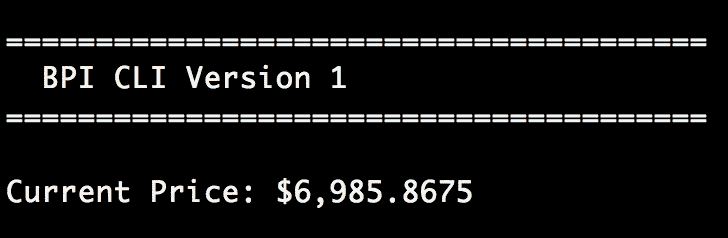
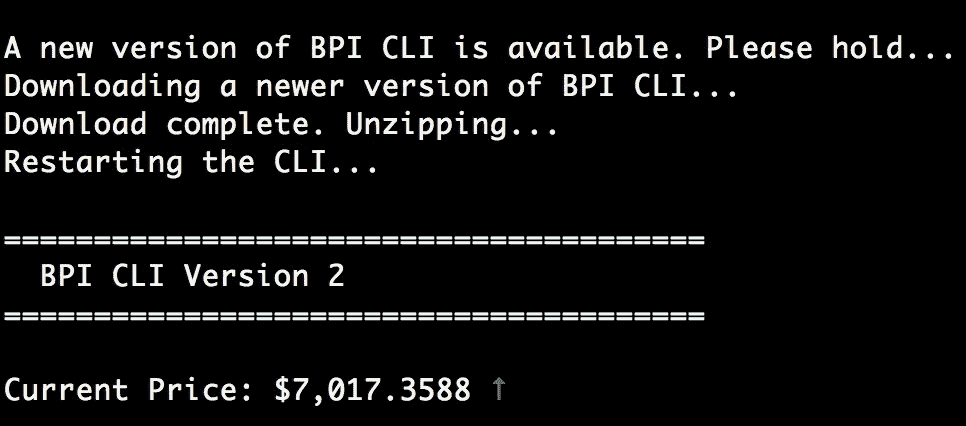

# 带 Java 11 的可自动更新的独立 CLI

> 原文：<https://medium.com/oracledevs/auto-updatable-self-contained-cli-with-java-11-765afb545e52?source=collection_archive---------0----------------------->


Photo by [Joshua Sortino](https://unsplash.com/photos/LqKhnDzSF-8?utm_source=unsplash&utm_medium=referral&utm_content=creditCopyText) on [Unsplash](https://unsplash.com/search/photos/code?utm_source=unsplash&utm_medium=referral&utm_content=creditCopyText)

# 介绍

在过去的 11 个月中，我们已经看到了 Java 的两个主要版本——Java 9 和 Java 10。到 9 月份，我们将会以 Java 11 的形式发布另一个版本，这都要归功于新的 6 个月发布系列。每个新版本都引入了激动人心的特性来帮助现代 Java 开发人员。让我们尝试一下这些特性，构建一个可自动更新的、自包含的命令行界面。

我们 CLI 的最低可行功能集定义如下:

*   通过调用免费币台 API 显示当前比特币价格指数
*   检查是否有新的更新，如果有，自动更新 CLI
*   为 CLI 提供定制的 Java 运行时映像，使其自包含

# 先决条件

为了跟进，你需要一份 JDK 11 号早期版本的拷贝。您还需要 gradle 的最新版本(撰写本文时为 4.9)。当然，您可以使用自己喜欢的方式构建 Java 应用程序。虽然不是必需的，但是熟悉 [JPMS](http://openjdk.java.net/projects/jigsaw/) 和 [JLink](https://docs.oracle.com/javase/10/tools/jlink.htm) 会很有帮助，因为我们将使用模块系统来构建一个定制的运行时映像。

# 我们走吧

我们首先创建一个提供最新比特币价格指数的类。在内部，它读取一个配置文件来获取 coin desk REST API 的 URL，并构建一个 http 客户端来检索最新价格。该类利用了新的 fluent HTTP 客户端类，这些客户端类是“java.net.http”模块的一部分。

```
var bpiRequest = HttpRequest.newBuilder()
        .uri(new URI(config.getProperty("bpiURL")))
        .GET()
        .build();

var bpiApiClient = HttpClient.newHttpClient();

bpiApiClient
    .sendAsync(bpiRequest,
        HttpResponse.BodyHandlers.ofString())
    .thenApply(response -> toJson(response))
    .thenApply(bpiJson -> 
        bpiJson.getJsonObject("usd").getString("rate"));
```

按照 Java 标准，这段代码实际上非常简洁。我们使用新的 fluent builders 创建一个 GET 请求，调用 API，将响应转换为 JSON，并以美元货币拉动当前的比特币价格。

为了构建一个模块化的 jar 并设置我们使用“jlink ”,我们需要添加一个“module-info.java”文件来指定 CLI 对其他模块的依赖性。

```
module ud.bpi.cli {
    requires java.net.http;
    requires org.glassfish.java.json;
}
```

从代码片段中，我们观察到我们的 CLI 模块需要 Java 11 中附带的 http 模块和一个外部 JSON 库。

现在，让我们把注意力转向实现一个自动更新类。这个类应该提供一些方法。一种方法是与中央存储库通信并检查是否有较新版本的 CLI，另一种方法是下载最新版本。下面的代码片段显示了使用新的 HTTP 客户端接口下载远程文件是多么容易。

```
CompletableFuture<Boolean> update(String downloadToFile) {
    try {
        HttpRequest request = HttpRequest.*newBuilder*()
                .uri(new URI("http://localhost:8080/2.zip"))
                .GET()
                .build();

        return HttpClient.*newHttpClient*()
                .sendAsync(request, HttpResponse.BodyHandlers
                        .*ofFile*(Paths.*get*(downloadToFile)))
                .thenApply(response -> {
                    unzip(response.body());
                    return true;
                });

    } catch (URISyntaxException ex) {
        return CompletableFuture.*failedFuture*(ex);
    }
}
```

Java 11 中新的预定义 HTTP 主体处理程序可以将响应主体转换成常见的高级 Java 对象。我们使用了 HttpResponse。BodyHandlers.ofFile()方法下载一个包含最新版本 CLI 的 zip 文件。

让我们通过使用一个启动器类将这些类放在一起。它为我们的 CLI 提供了一个入口点，并实现了应用程序流。当应用程序启动时，这个类调用它的 launch()方法来检查新的更新。

```
void launch() {
    var autoUpdater = new AutoUpdater();

    try {

        if (autoUpdater.check().get()) {
            System.*exit*(autoUpdater.update().get() ? 100 : -1);
        }

    } catch (InterruptedException | ExecutionException ex) {
        throw new RuntimeException(ex);
    }
}
```

如您所见，如果有新版本的 CLI 可用，我们下载新版本并通过传入自定义退出代码 100 来退出 JVM。一个简单的包装器脚本将检查这个退出代码并重新运行 CLI。

```
**#!/bin/sh**...start
EXIT_STATUS=$?

**if [ $**{EXIT_STATUS} **-eq** 100 **]**; **then** *start* **fi**
```

最后，我们将使用“jlink”创建一个运行时映像，其中包含执行 CLI 所需的所有内容。jlink 是 Java 提供的一个新的命令行工具，它将查看传递给它的选项，以将一组模块及其依赖项组装和优化到一个定制的运行时映像中。在这个过程中，它会构建一个自定义的 JRE，从而使我们的 CLI 变得独立。

```
*jlink* --module-path build/libs/:**$**{JAVA_HOME}/jmods \
      --add-modules ud.bpi.cli,org.glassfish.java.json \
      --launcher bpi=ud.bpi.cli/ud.bpi.cli.Launcher \
      --output images
```

让我们看看传递给 jlink 的选项:

*   “module-path”告诉 jlink 查看包含 java 模块的指定文件夹
*   “add-modules”告诉 jlink 哪些用户定义的模块将包含在自定义映像中
*   “launcher”用于指定将用于启动我们的 CLI 的脚本的名称，以及包含应用程序的 main 方法的类的完整路径
*   “输出”用于指定保存新创建的自包含自定义图像的文件夹名称

当我们运行第一个版本的 CLI 时，如果没有可用的更新，CLI 将显示如下内容:



假设我们发布了 CLI 的新版本(2)并将其推送到中央回购。现在，当您重新运行 CLI 时，您将看到如下内容:



瞧啊。应用程序发现有新版本可用，并自动更新自己。然后，它会重新启动 CLI。正如你所看到的，新版本增加了一个向上/向下箭头指示器，让用户知道比特币价格指数的表现如何。

前往 [GitHub](https://github.com/udaychandra/auto-updater-demo) 获取源代码并进行实验。