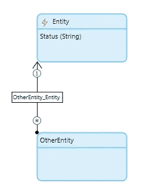

# 自动提交和提交前事件—引人深思

> 原文：<https://medium.com/mendix/autocommit-and-before-commit-events-not-a-love-story-2dc70b3aad05?source=collection_archive---------0----------------------->

我只是偶然发现了一些困难的事情。也许这篇文章可以帮助其他人不要碰到同样的问题。但是让我们重新开始。

# 典型的提交前模式

下面是一个我以前见过很多次的场景:

如果数据记录的某个属性发生变化，就会触发一个动作。这方面的一个例子是一个具有状态的对象，每次状态改变时都应该创建一个通知。

一个相当实用的模式是在提交前事件中从数据库中检索要提交的对象的旧状态，并将其与当前状态进行比较。如果检测到更改，将生成通知。

整个事情看起来会像这样:

只要这个 Before Commit 事件在数据库中更新对象之前运行，这就很好。不幸的是，这里的自动提交可能会碍事。

# Mendix 自动提交功能

Mendix 努力帮助低代码开发人员尽可能保持数据的一致性。为此，有一个称为自动提交的特性。

如果在一个对象上设置了与另一个对象的关联，而该另一个对象此时在数据库中尚不存在，则自动提交该不存在的对象。这意味着开发人员不必担心设置了数据库中不存在的关联。

如果在本例中，OtherEntity 类型的对象被提交，该对象引用了 Entity 类型的未提交对象，则后者被自动提交。

# 问题是

Mendix 不会在自动提交期间触发事件。它只是将数据写入数据库。这很有用，因为开发人员没有触发提交。然而，**存在一个风险，即提交前事件可能需要在提交**之前运行(类似于上面描述的模式)。如果先前自动提交的对象再次被显式提交，则它已经在数据库中。新旧状态之间的比较不会产生有用的结果。

# 注意提交顺序

在此示例中，OtherEntity 的提交导致实体的自动提交。只有在微流中提交实体时，才会触发实体上的 Before Commit 事件。此时，更改已经在数据库中。通知模式在任何情况下都会失败。

在这种情况下，首先执行对实体的提交。通知模式按预期工作。没有自动提交。

# 结论

我学到了两件事

1.  **对象提交的顺序很重要**。不同的顺序会导致不同的结果。这里要做的最理想的事情是尽量防止订单自动提交。
2.  首先，由于这并不总是可能的(例如，3 个或更多的对象可能以无法阻止自动提交的方式指向彼此)，所以在使用如上所述的模式时应该非常小心。如果你真的想确保在一个定义良好的数据集上执行某些动作，最好不要在提交前事件中执行这些动作，而是在提交对象的微流中执行。理想情况下是在自动提交发生之前。

*原文于 2020 年 6 月 12 日* [*以德语发表 https://mendixamme . de*](https://mendixandme.de/index.php/2020/06/12/autocommit-und-before-commit-events-keine-liebesgeschichte/?preview=true)*。*