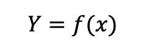
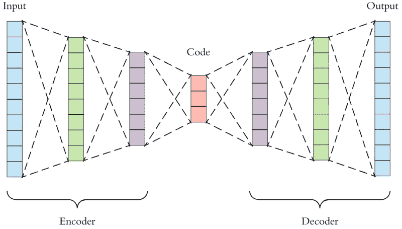
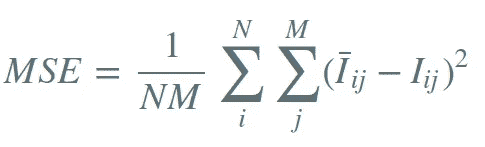

# 自动编码器在商店退货异常检测中的应用

> 原文：<https://medium.com/walmartglobaltech/autoencoders-applications-in-store-returns-anomaly-detection-ea71b5e6a62e?source=collection_archive---------1----------------------->

# **零售商商店退货**

零售巨头每天处理全美各地的大量销售，也产生大量的商店退货，尽管退货仅占销售额的一小部分。为了进一步改善客户购物和退货体验，必须使用最先进的机器学习技术来分析潜在的客户退货模式，特别是异常退货。

但是，在对商店退货进行异常检测时，需要克服一些挑战:

1.  如前所述，对于大型零售商来说，由于销售量巨大，店内退货量可能会很大。因此，商店退货数据集非常大。
2.  让人类专家审查每一次商店退货并识别退货异常是不可行的。因此，这类预测问题很少有预定义的标签。

您可能已经知道，监督学习是使用一种算法来学习映射函数。)从输入 *x* 到输出 *Y* :

没有输出 *Y* ，我们必须应用**无监督学习**或**半监督学习**方法来表征或揭示输入 *x* 的底层分布和结构。

3.数据是巨大的，然而，回报异常是非常罕见的识别。识别和调查退货异常可能有助于提高商品质量，优化退货流程，最重要的是提供世界级的客户体验。

4.商店销售和退货总是有季节性的。因此，回报率异常确实是不断变化的目标，而且在各个地区变化很快。为了应对波动性和不确定性，当涉及到商店退货异常检测时，**无监督学习**或**半监督学习**方法优于**监督学习**。

# 为什么选择自动编码器？

Autoencoder 作为无监督的神经网络，将输入数据压缩成低维表示/嵌入，然后基于该表示/嵌入重构原始输入。

具体来说，自动编码器由三个组件组成:

**编码器**:该部分包括全连接的前馈神经网络，将输入数据压缩成降维的潜在表示。

**代码**或**瓶颈**或**压缩表示**:该部分包括关于输入数据的重要特征和表示，允许解码器尽可能恢复输入。

**解码器**:这部分也由完全连接的前馈神经网络组成，它从潜在表示中重建输出。

An example of autoencoders architecture

自动编码器具有对称的体系结构，并且学习输入和嵌入之间的非线性关系。自动编码器的目的是将数据压缩成潜在特征，并尽可能精确地重建原始输入，主要采用一种损失函数，如下所示:

**【均方误差(MSE)** ，也被称为**重构误差**，被定义为输入和输出之间的平均差:

MSE formula

其中 ***M*** 为特征维数， ***N*** 为数据集中的数据点数。

我们选择自动编码器作为退货异常检测的首选技术，因为:

自动编码器不需要预定义的标签，因为它通过潜在特征压缩输入并重构输出。

作为一种基于深度学习的方法，当数据变大时，自动编码器优于传统的机器学习方法。

**auto encoder 在常见模式的商店退货上接受训练，因此它将学习大多数退货交易的模式，并识别它们的潜在特征。当返回异常出现时，该模型预计会产生较高的重建误差，因为它的行为不同于大多数返回。**

# ****在商场退货异常检测和绩效中的应用****

****数据****

**我们在具有常见模式的返回数据上训练了 autoencoder 深度学习模型。我们在另一个超时返回数据上测试了模型性能。**

**特征是关于当前回访的一些信息，例如项目类别、一天中进行回访的时间等。，以及其他一些有价值的信息，如商店/区域级退货模式等。**

****模型架构****

**我们实现的 autoencoder 模型有 6 层，拥有简单的对称架构设计，每层的节点数为 **279 — 128 — 64 — 64 — 128 — 279** ，其中 279 是输入和输出维度，128 是编码和解码维度，64 是隐藏/潜在维度。**

**激活函数是 **ReLu** 并且 **Adam** 被用作优化器。最后，该模型被训练 200 个时期。**

****型号性能和对比****

**我们将 autoencoder 模型与已经投入生产的**梯度推进机(GBM)** 模型进行了比较，该模型支持商店退货异常检测。以下是我们如何评估 autoencoder 型号的性能:**

*   **通过自动编码器模型和梯度推进机器模型运行测试数据集，并记录每个悬挂物返回输入的重建误差和 GBM 模型分数。**
*   **基于自动编码器重构误差分布和 GBM 模型分数带，我们将商店退货分成不同的桶。例如，商店退货输入分为前 X% (X = 0.01%、0.05%、0.1%等)。)自动编码器重构误差的桶(以降序排列)。同样，商店退货输入被映射到前 X% (X = 0.01%，0.05%，0.1%，等等)。)GBM 分数桶(降序排列)。**
*   **在 autoencoder 模型和 GBM 模型的每个存储桶中，领域专家彻底检查了每个商店退货，并决定是否发现了异常情况。我们招募了几个领域专家来审查所有的测试用例。**
*   **接下来，我们根据领域专家的决定计算了回报率异常的百分比，以及 autoencoder 模型的前 X%桶和 GBM 模型的前 X%桶之间的重叠百分比。**

****重要发现和进一步措施****

1.  **在 autoencoder 模型和 GBM 模型的退货异常率都超过 80%的前几个时段(即 0.01%、0.05%和 0.1%)中，商店退货输入几乎没有重叠。这表明 autoencoder 模型可以捕获与 GBM 模型不同的回报异常，因此提供了有希望的增量提升。**
2.  **在 autoencoder 模型的前几个桶中，我们将研究回报及其行为，这是我们之前从未注意到的。我们将获得数据和业务洞察力，并产生可操作的项目。**

# ****结论****

**总之，自动编码器是异常检测的特别有用的无监督深度学习模型，当与传统的监督学习模型结合时，它将提供有前途的增量提升。**

# **参考**

**【https://www.deeplearningbook.org/contents/autoencoders.html **

** [## 在 Keras 中构建自动编码器

### 这个帖子写于 2016 年初。因此，它已经严重过时了。在本教程中，我们将回答一些常见的…

blog.keras.io](https://blog.keras.io/building-autoencoders-in-keras.html)**