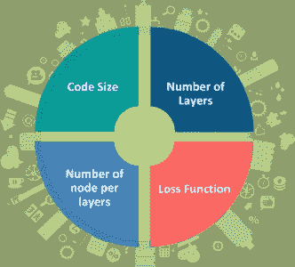

# 如何使用自动编码器执行数据压缩？

> 原文：<https://medium.com/edureka/autoencoders-tutorial-cfdcebdefe37?source=collection_archive---------0----------------------->


Autoencoders Tutorial — Edureka

人工智能涵盖了广泛的技术和技巧，使计算机系统能够解决数据压缩等问题，这些问题用于计算机视觉、计算机网络、计算机体系结构和许多其他领域。**自动编码器**是*无监督的神经网络*，它使用机器学习来为我们进行压缩。本**自动编码器教程**将按以下顺序为您提供对自动编码器的全面了解:

*   什么是自动编码器？
*   对自动编码器的需求
*   自动编码器的应用
*   自动编码器的体系结构
*   属性和超参数
*   自动编码器的类型
*   使用自动编码器进行数据压缩(演示)

让我们从最基本的问题开始，什么是自动编码器？

# 什么是自动编码器？

自动编码器神经网络是一种**无监督机器学习**算法，它应用反向传播，将目标值设置为等于输入。自动编码器用于将我们的输入缩减为更小的表示形式。如果有人需要原始数据，他们可以从压缩数据中重建它。


我们有类似的机器学习算法 ie。完成相同任务的 PCA。所以你可能会想为什么我们需要自动编码器呢？让我们继续这个自动编码器教程，并找出使用自动编码器背后的原因。

# 自动编码器的需求

自动编码器优于 PCA，因为:


*   自动编码器可以利用**非线性激活函数**和多个层来学习**非线性** **变换**。
*   它不需要学习密集的层。它可以使用**卷积层**来学习视频、图像和系列数据哪个更好。
*   用自动编码器学习几个层比用 PCA 学习一个巨大的变换更有效。
*   自动编码器提供每一层的表示作为输出。
*   它可以利用来自另一个模型的**预训练层**来应用迁移学习以增强编码器/解码器。

现在让我们来看看自动编码器的一些工业应用。

# 自动编码器的应用

## 图像着色


自动编码器用于将任何黑白图片转换成彩色图像。根据图片中的内容，可以判断出应该是什么颜色。

## 特征变化


它只提取图像所需的特征，并通过消除任何噪声或不必要的干扰来生成输出。

## 降维


重建的图像与我们的输入相同，但是维数减少了。它有助于提供像素值减少的相似图像。

## 图像去噪


自动编码器看到的输入不是原始输入，而是随机损坏的版本。去噪自动编码器因此被训练来从有噪声的版本中重建原始输入。

## 水印去除


它还用于在拍摄视频或电影时去除图像中的水印或任何物体。

现在你已经对自动编码器的不同工业应用有了一个概念，让我们继续我们的文章，理解自动编码器的复杂架构。

# 自动编码器的体系结构

自动编码器由三层组成:

1.  **编码器**
2.  **代号**
3.  **解码器**


*   **编码器:**这部分网络将输入压缩成一个**潜在空间表示**。编码器层**将输入图像编码**为缩减维度的压缩表示。压缩图像是原始图像的失真版本。
*   **代码:**网络的这一部分代表输入解码器的压缩输入。
*   **解码器:**该层**将**编码后的图像解码回原始尺寸。解码图像是原始图像的有损重建，并且是从潜在空间表示中重建的。


编码器和解码器之间的层，即。该代码也被称为**瓶颈**。这是一个设计良好的方法，用于确定观察数据的哪些方面是相关信息，哪些方面可以丢弃。它通过平衡两个标准来做到这一点:

*   表示的紧密度，以可压缩性来衡量。
*   它从输入中保留了一些行为相关的变量。

现在您已经对自动编码器的架构有了一个概念。让我们继续我们的文章，理解在训练自动编码器时涉及的不同属性和超参数。

# 属性和超参数

## **自动编码器的属性:**

*   **特定于数据的**:自动编码器只能压缩类似于它们被训练过的数据。
*   **有损:**与原始输入相比，解压缩后的输出质量会下降。
*   **从实例中自动学习:**很容易训练算法的专门实例，这些实例将在特定类型的输入上表现良好。

## **自动编码器的超参数:**

在训练自动编码器之前，我们需要设置 **4** 个超参数:



*   **码长**:表示中间层的节点数。尺寸越小，压缩越大。
*   **层数**:自动编码器可以包含我们想要的层数。
*   **每层的节点数量**:每层的节点数量随着编码器的每个后续层而减少，并在解码器中增加。就层结构而言，解码器与编码器是对称的。
*   **损失函数:**我们要么用均方差，要么用二进制交叉熵。如果输入值在范围[0，1]内，那么我们通常使用交叉熵，否则，我们使用均方误差。

既然您已经知道了自动编码器训练中涉及的属性和超参数。让我们继续我们的文章，了解不同类型的自动编码器以及它们之间的区别。

# 自动编码器的类型

## **卷积自动编码器**

传统公式中的自动编码器没有考虑到一个信号可以被视为其他信号的总和的事实。卷积自动编码器使用卷积运算符来利用这种观察。他们学习将输入编码成一组简单的信号，然后尝试从这些信号中重建输入，修改图像的几何形状或反射率。


**CAE 用例:**

*   图像重建
*   图像彩色化
*   潜在空间聚类
*   生成更高分辨率的图像

## **稀疏自动编码器**


稀疏自动编码器为我们提供了引入信息瓶颈**的替代方法，而不需要减少隐藏层的节点数量**。相反，我们将构建我们的损失函数，以便我们惩罚层内的激活。

## **深度自动编码器**

简单自动编码器的扩展是**深度自动编码器**。深度自动编码器的第一层用于**原始输入**中的一阶特征。第二层用于一阶特征外观中对应于**图案**的二阶特征。深度自动编码器的更深层倾向于学习甚至更高阶的特征。

深度自动编码器由两个对称的深度信任网络组成

1.  前四或五个浅层代表网络的编码部分。
2.  构成解码一半的第二组四或五层。


**深度自动编码器的使用案例**

*   图像搜索
*   数据压缩
*   主题建模与信息检索

## **收缩自动编码器**

**收缩自动编码器**是一种无监督的深度学习技术，可以帮助神经网络对未标记的训练数据进行编码。这是通过构建一个**损失项**来实现的，该损失项惩罚我们的隐藏层激活相对于输入训练示例的大导数，**实质上惩罚**输入的小变化导致编码空间的大变化的情况。


现在你对什么是自动编码器有了一个概念，它有不同的类型和属性。让我们继续我们的文章，理解在 Python 中使用 TensorFlow 的简单实现。

# 使用自动编码器进行数据压缩(演示)


**让我们导入所需的库**

```
import numpy as np
from keras.layers import Input, Dense
from keras.models import Model
from keras.datasets import mnist
import matplotlib.pyplot as plt
```

**隐藏层和变量的声明**

```
# this is the size of our encoded representations
encoding_dim = 32 # 32 floats -> compression of factor 24.5, assuming the input is 784 floats

# this is our input placeholder
input_img = Input(shape=(784,))
# "encoded" is the encoded representation of the input
encoded = Dense(encoding_dim, activation='relu')(input_img)
# "decoded" is the lossy reconstruction of the input
decoded = Dense(784, activation='sigmoid')(encoded)
# this model maps an input to its reconstruction
autoencoder = Model(input_img, decoded)
# this model maps an input to its encoded representation
encoder = Model(input_img, encoded)
# create a placeholder for an encoded (32-dimensional) input
encoded_input = Input(shape=(encoding_dim,))
# retrieve the last layer of the autoencoder model
decoder_layer = autoencoder.layers[-1]
# create the decoder model
decoder = Model(encoded_input, decoder_layer(encoded_input))
# configure our model to use a per-pixel binary crossentropy loss, and the Adadelta optimizer:
autoencoder.compile(optimizer='adadelta', loss='binary_crossentropy')
```

**准备输入数据(MNIST 数据集)**

```
(x_train, _), (x_test, _) = mnist.load_data()
# normalize all values between 0 and 1 and we will flatten the 28x28 images into vectors of size 784.
x_train = x_train.astype('float32') / 255.
x_test = x_test.astype('float32') / 255.
x_train = x_train.reshape((len(x_train), np.prod(x_train.shape[1:])))
x_test = x_test.reshape((len(x_test), np.prod(x_test.shape[1:])))
print x_train.shape
print x_test.shape
```

**为 50 个时期训练自动编码器**

```
autoencoder.fit(x_train, x_train,
epochs=50,
batch_size=256,
shuffle=True,
validation_data=(x_test, x_test))
# encode and decode some digits
# note that we take them from the *test* set
encoded_imgs = encoder.predict(x_test)
decoded_imgs = decoder.predict(encoded_imgs)
```

**使用 Matplotlib 可视化重构输入和编码表示**

```
n = 20 # how many digits we will display
plt.figure(figsize=(20, 4))
for i in range(n):
# display original
ax = plt.subplot(2, n, i + 1)
plt.imshow(x_test[i].reshape(28, 28))
plt.gray()
ax.get_xaxis().set_visible(False)
ax.get_yaxis().set_visible(False)

# display reconstruction
ax = plt.subplot(2, n, i + 1 + n)
plt.imshow(decoded_imgs[i].reshape(28, 28))
plt.gray()
ax.get_xaxis().set_visible(False)
ax.get_yaxis().set_visible(False)
plt.show()
```

**输入**在第一行，**输出**在第二行。参考下文。


现在到此，我们结束这篇文章。我希望你们喜欢这篇文章，并理解 Tensorflow 的力量，以及解压图像是多么容易。所以，如果你读过这篇文章，你就不再是自动编码器的新手了。尝试这些例子，如果您在部署代码时遇到任何挑战，请告诉我。

如果你想查看更多关于人工智能、DevOps、道德黑客等市场最热门技术的文章，你可以参考 Edureka 的官方网站。

请留意本系列中的其他文章，它们将解释深度学习的各个其他方面。

> 1.[张量流教程](/edureka/tensorflow-tutorial-ba142ae96bca)
> 
> 2. [PyTorch 教程](/edureka/pytorch-tutorial-9971d66f6893)
> 
> 3.[感知器学习算法](/edureka/perceptron-learning-algorithm-d30e8b99b156)
> 
> 4.[神经网络教程](/edureka/neural-network-tutorial-2a46b22394c9)
> 
> 5.什么是反向传播？
> 
> 6.[卷积神经网络](/edureka/convolutional-neural-network-3f2c5b9c4778)
> 
> 7.[胶囊神经网络](/edureka/capsule-networks-d7acd437c9e)
> 
> 8.[递归神经网络](/edureka/recurrent-neural-networks-df945afd7441)
> 
> 9.[tensor flow 中的物体检测](/edureka/tensorflow-object-detection-tutorial-8d6942e73adc)
> 
> 10.[受限玻尔兹曼机教程](/edureka/restricted-boltzmann-machine-tutorial-991ae688c154)
> 
> 11. [PyTorch vs TensorFlow](/edureka/pytorch-vs-tensorflow-252fc6675dd7)
> 
> 12.[用 Python 进行深度学习](/edureka/deep-learning-with-python-2adbf6e9437d)
> 
> 13.[人工智能教程](/edureka/artificial-intelligence-tutorial-4257c66f5bb1)
> 
> 14.[张量流图像分类](/edureka/tensorflow-image-classification-19b63b7bfd95)
> 
> 15.[人工智能应用](/edureka/artificial-intelligence-applications-7b93b91150e3)
> 
> 16.[如何成为一名人工智能工程师？](/edureka/become-artificial-intelligence-engineer-5ac2ede99907)
> 
> 17.[问学习](/edureka/q-learning-592524c3ecfc)
> 
> 18. [Apriori 算法](/edureka/apriori-algorithm-d7cc648d4f1e)
> 
> 19.[用 Python 实现马尔可夫链](/edureka/introduction-to-markov-chains-c6cb4bcd5723)
> 
> 20.[人工智能算法](/edureka/artificial-intelligence-algorithms-fad283a0d8e2)
> 
> 21.[机器学习的最佳笔记本电脑](/edureka/best-laptop-for-machine-learning-a4a5f8ba5b)
> 
> 22.[12 大人工智能工具](/edureka/top-artificial-intelligence-tools-36418e47bf2a)
> 
> 23.[人工智能(AI)面试问题](/edureka/artificial-intelligence-interview-questions-872d85387b19)
> 
> 24. [Theano vs TensorFlow](/edureka/theano-vs-tensorflow-15f30216b3bc)
> 
> 25.[什么是神经网络？](/edureka/what-is-a-neural-network-56ae7338b92d)
> 
> 26.[模式识别](/edureka/pattern-recognition-5e2d30ab68b9)
> 
> 27.[人工智能中的阿尔法贝塔剪枝](/edureka/alpha-beta-pruning-in-ai-b47ee5500f9a)

*原载于 2018 年 10 月 12 日*[*www.edureka.co*](https://www.edureka.co/blog/autoencoders-tutorial/)*。*