# 在 Oracle 云上使用 WireMock 自动执行 API 存根

> 原文：<https://medium.com/oracledevs/automate-api-stubbing-using-wiremock-on-oracle-cloud-83986d35195e?source=collection_archive---------0----------------------->

本博客将帮助您了解如何使用 Oracle Developer Cloud Service 来自动化测试 API。它将展示如何使用 Oracle Developer Cloud Service 和 Application Container Cloud Service 来自动化 WireMock 安装和 API 存根配置。


什么是 WireMock？

WireMock 是一个基于 HTTP 的 API 模拟器。有些人可能认为它是服务虚拟化工具或模拟服务器。当我们依赖的 API 不存在或不完整时，它使我们能够继续开发和测试。它支持测试实际 API 不会可靠产生的边缘情况和故障模式。因为它很快，可以将我们的构建时间从几个小时减少到几分钟。下面是 url，您可以在这里找到更多关于 WireMock 的信息。

【http://wiremock.org 号

**为什么要自动化 API 模拟？**

随着微服务架构越来越受欢迎，以缩短组件的开发生命周期，DevOps 中的自动化变得至关重要。对交付的质量和时间线有巨大影响的自动化的一部分是测试自动化。在依赖于尚未开发或尚未访问的服务的情况下，除非有人编写一个模拟服务，否则无法实现测试自动化。这里 WireMock 可以给我们很大的帮助。它有一个独立的模拟 API 服务器，您可以在其中设置模拟 API，而无需编写一行代码。借助 Oracle Developer Cloud，您可以以自动化的方式实现这一点，作为 CI & CD 管道的一部分。

**使用的技术堆栈:**

1. **Oracle 开发者云服务**:云 DevOps 平台

2. **Oracle 应用容器云服务:**云部署

3. **Grunt:** 构建工具

4. **WireMock** : API 模拟器

**注意:**我们将使用 Git cli 将代码推送到 Oracle Developer Cloud Service 上托管的 Git 存储库。

**wire mock 设置的项目结构:**

您需要从这个[链接](http://repo1.maven.org/maven2/com/github/tomakehurst/wiremock-standalone/2.12.0/wiremock-standalone-2.12.0.jar)下载 WireMock 独立 jar。其余的文件必须被创建。这些文件的用途以及每个文件所需的代码/脚本将在下面的博客中详细讨论。

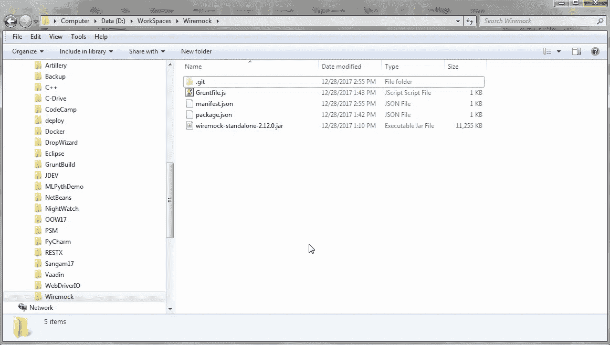

要将代码推送到托管在 Oracle developer Cloud Service 上的 Git 存储库，请确保您的开发机器上安装了 Git CLI。打开命令提示符，导航到 Wiremock 工件文件夹，然后从初始化 Git 存储库开始。这可以通过使用以下命令来完成:

git 初始化

如下图所示。使用以下命令将文件添加到 git 存储库中:

git 添加

参考下面的屏幕截图。确保将所有文件添加到 Git 存储库中。然后使用以下命令一次性提交所有添加的文件:

Git 提交–m“第一次提交”

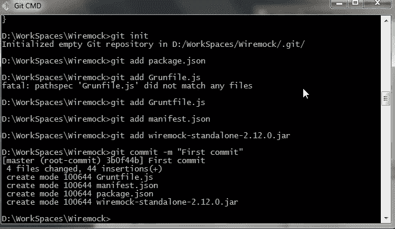

现在，从开发者云服务的项目选项卡获取 Git 存储库 URL，如下图所示:

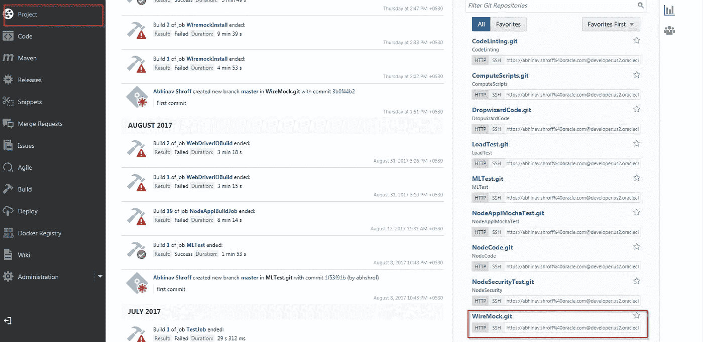

现在，使用以下命令添加远程存储库:

Git 远程添加原点

然后使用:

git push origin master '命令将代码推送到 DevCS 托管的 git 存储库的 master 分支，如下面的屏幕截图所示。

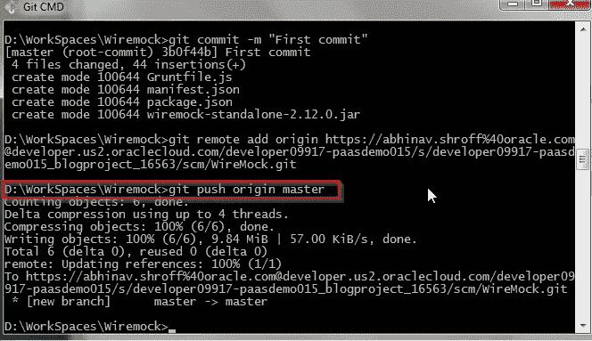

**项目中文件的描述:**

**wiremock-standalone-2 . 12 . 0 . jar**

这是一个 jar 文件，它将部署在 Oracle 应用程序容器云上，并作为独立的 WireMock 服务器运行。WiremMock 独立 jar 文件可以从这个[链接](http://repo1.maven.org/maven2/com/github/tomakehurst/wiremock-standalone/2.12.0/wiremock-standalone-2.12.0.jar)下载。

**manifest.json**

这是我们能够在 Oracle 应用程序容器上部署 WireMock 独立 jar 的最重要的文件。它包含要使用的 Java 版本(配置为 8)和执行 Jar 文件的命令。以下是供参考的片段:

```
{"runtime": {"majorVersion": "8"},"command": "java -jar wiremock-standalone-2.12.0.jar","notes": "Mock Service"}
```

**package.json**

因为 Grunt 是一个基于 Nodejs 的构建工具，它需要一些依赖来执行构建。因此，我们需要 package.json 来配置执行 Grunt 所需的 Nodejs 模块依赖关系。以下是供参考的片段:

```
{"name": "WireMock","version": "0.0.1","private": true,"scripts": {"start": "java -jar wiremock-standalone-2.12.0.jar"},"dependencies": {"grunt": "^0.4.5","grunt-contrib-compress": "^1.3.0","grunt-hook": "^0.3.1","load-grunt-tasks": "^3.5.2"}}
```

**Gruntfile.js**

在这个 JavaScript 文件中，我们配置了 Grunt 任务，它将由构建服务器上的 Grunt 构建工具执行。Grunt 将帮助我们用 WireMock jar 和 manifest.json 构建一个 zip 文件，以部署在 Oracle 应用程序容器云上。该文件还包含 Grunt 任务要压缩的源代码的声明。以下是供参考的片段:

```
module.exports = function(grunt) {require('load-grunt-tasks')(grunt);grunt.initConfig({compress: {main: {options: {archive: 'wiremock.zip',pretty: true},expand: true,cwd: './',src: ['wiremock-standalone-2.12.0.jar','./manifest.json'],dest: './'}}});grunt.registerTask('default', ['compress']);};
```

**用于构建和部署 WireMock jar 的开发人员云构建作业配置**

下面是 WiremockInstall 构建作业的构建作业配置的屏幕截图，该作业将执行 Grunt build 来构建一个 zip 文件并将其部署到 Oracle Application Container Cloud Service 上。还要创建另一个构建作业 WiremockConfigure 作为

因为此作业需要存在于 WiremockInstall 生成作业的后期生成配置中。

为构建作业选择一个名称。出于这个博客的目的，我将其命名为“WiremockInstall”。您可以在下拉列表中保留 JDK 版本的默认值，如下图所示:

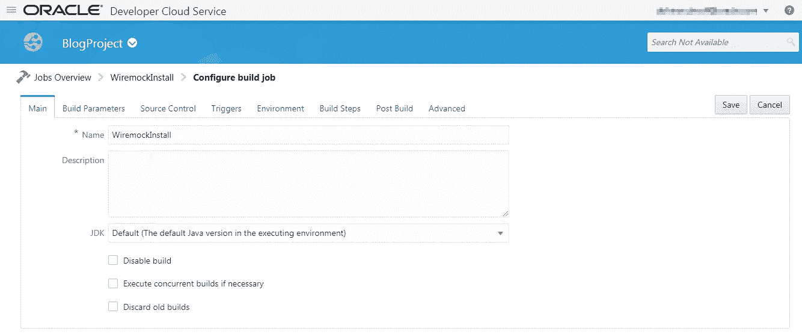

选择已经上传了 WireMock jar 和其他部署相关文件的存储库。

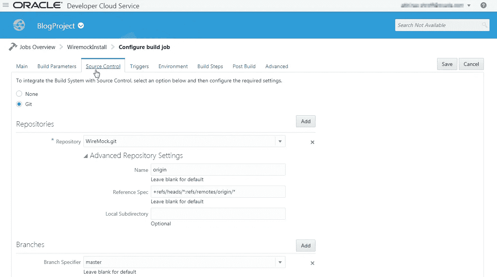

这里我们将 SCM 轮询设置为触发器。这确保了每次我们上传代码到 Git 仓库时，都会触发**‘wiremocksinstall’**构建任务。

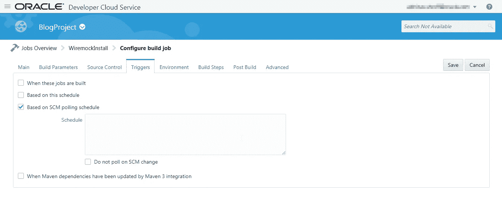

在下拉列表中配置 Nodejs 版本，如下面的屏幕截图所示。

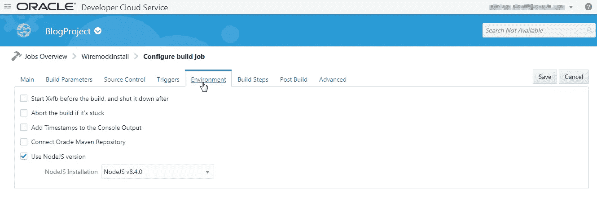

从下拉列表中添加执行 Shell 构建步骤，并在执行 grunt 命令之前使用 npm install 命令安装 Grunt 依赖项。

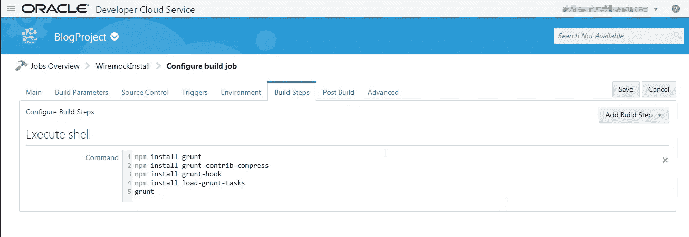

在 Post Build 选项卡中，将构建作业 WiremockConfigure 配置为“要构建的作业”，同时选中“归档工件”，以归档生成的 zip 文件，如下所示。

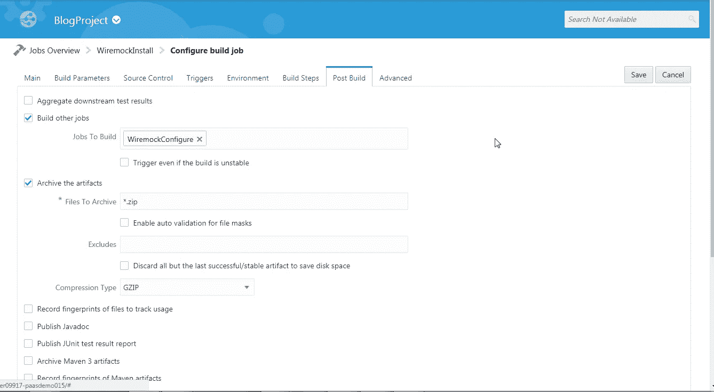

**WireMock 部署**

现在转到 Deploy 选项卡，单击新的配置来配置构建作业生成的 zip 文件的部署。

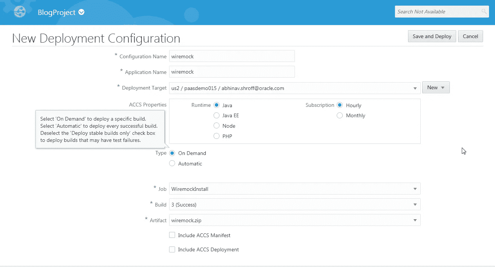

成功部署后，您可以单击顶部的“wiremock”链接来获取 WireMock 服务器 URL。

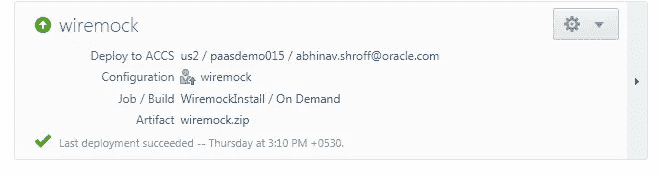

**wire mock 配置构建作业**

这个构建作业将在应用程序容器云上执行已部署的 WireMock 服务器的 HTTP API，以配置一个模拟 API。

将生成作业命名为“WiremockConfigure”。您可以保留其他字段的默认值。

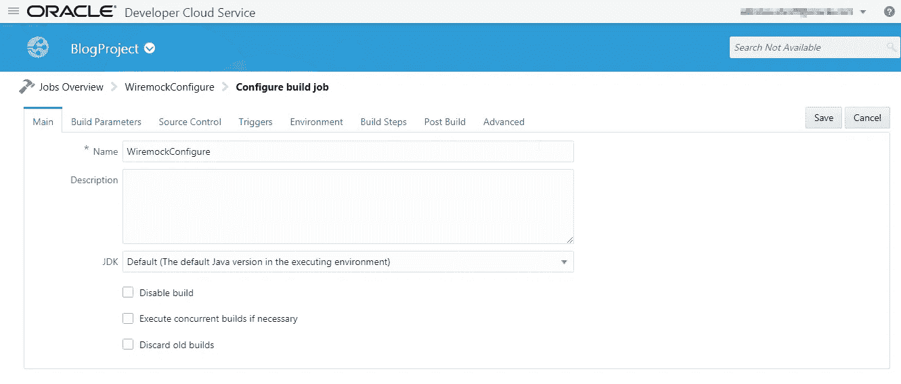

现在将触发器设置为 WiremockInstall，如下所示。

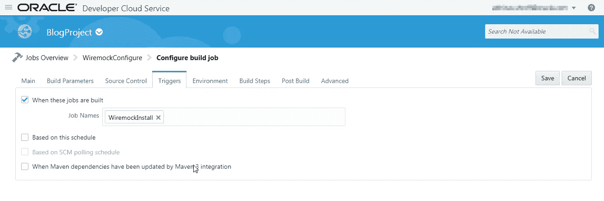

使用执行 Shell 构建步骤并添加下面的 curl 命令。您需要有 WireMock 服务器的 URL，如博客中所述。

curl-X POST—data ' { " request ":{ " URL ":"/GET/this "，" method": "GET" }，" response": { "status": 200，" body ":"在这里！\ n " } } '<wiremock server="" url="">/_ _ admin/mappings/new</wiremock>

这里为请求配置的资源应该是 **/get/this** 。

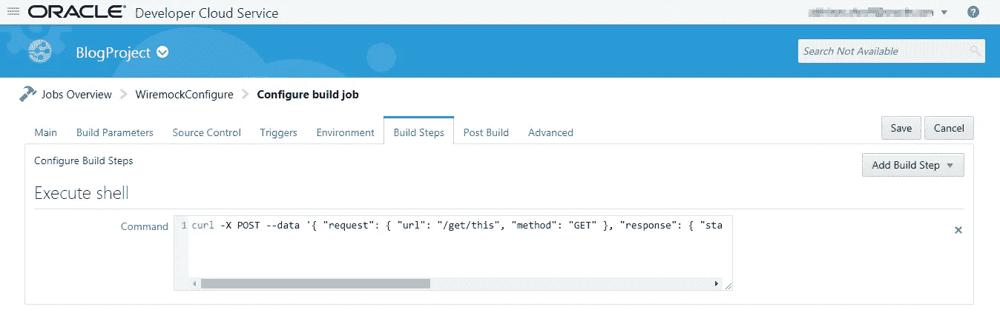

这将配置模拟服务，该服务可用于开发和测试需要访问服务的代码。下面是 URL 的解析，您可以使用它来访问模拟服务。

<wiremock server="" url="">/得到/这个</wiremock>

下面的屏幕截图描述了浏览器中 URL 的输出。

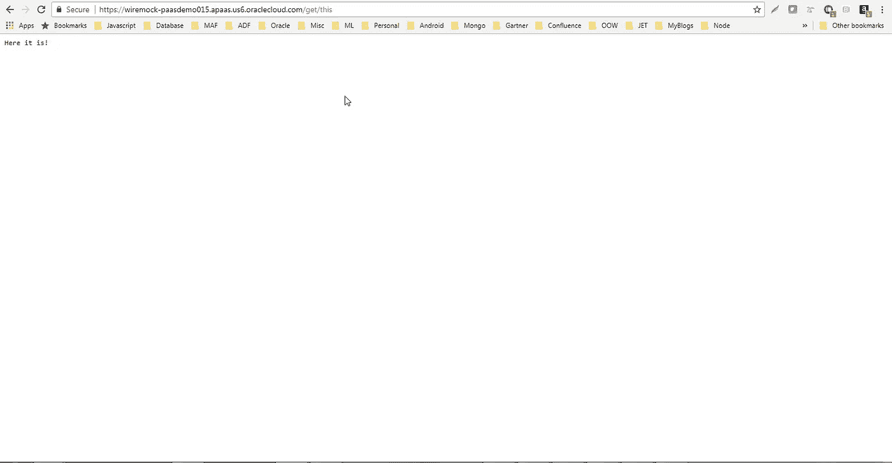

编码快乐！

* *本文表达的观点是我个人的观点，不一定代表甲骨文的观点