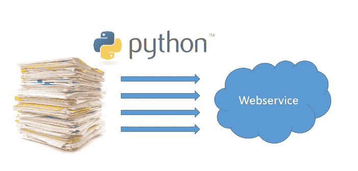
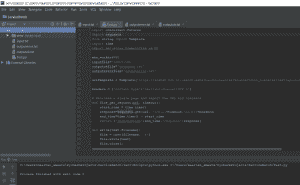

# 使用简单的 Python 脚本自动调用 SOAP 和 REST 服务

> 原文：<https://medium.com/oracledevs/automate-calls-to-soap-and-rest-webservices-using-simple-python-scripts-79888ed371be?source=collection_archive---------0----------------------->

可能没有多少人会告诉你通过 webservices 运行批处理是一个好主意。不过，有时候，使用一个脚本来基于带有变量的模板消息生成 webservice 调用并自动处理响应消息会很方便。此外，如果您有大量的调用，如果您的服务平台能够处理并发性，那么并行执行这些调用可能会节省您很多时间。

像这样的脚本可能有助于弥合老式的面向批处理的世界和服务世界之间的部分差距。例如，您可以使用它来调用基于旧系统的文本文件导出的服务，从而在提供 API 的现代系统中创建某些实体。诸如此类的脚本当然不应该用于实际执行结构化的常规集成，但是作为一次性解决方案是有价值的。提供的脚本当然没有任何性质的担保或保证。很可能您需要使它们适合您的特定用例。

# Python 设置

以下脚本需要安装了请求模块(pip 安装请求)的 Python 3.6。默认情况下，其他使用的模块存在于您通常的 Python 安装中。我用 JetBrains 的 PyCharm 作为 IDE。如果没有 IDE，你也可以从 python.org[这里](https://www.python.org/downloads/)安装 Python 3.6 来运行脚本。

# 执行对 SOAP 服务的调用

SOAP 服务对所有请求使用相同的端点。根据操作(SOAPAction HTTP 头)，执行服务的不同部分。消息内容可以不同。例如，您想为一系列不同的客户调用服务。模板消息非常适合这种情况。下面的 Python 3.6 脚本将会做到这一点。基于模板和输入文件生成消息，并在具有指定数量的并发线程的服务端点上触发它们。收到响应后，对其进行解析，并将响应中的特定字段保存在输出文件中。错误保存在单独的文件中。

你可以在这里查看剧本。该脚本略多于 50 行，包含以下内容的 Python 示例:

*   如何用请求模块执行 SOAP 调用(带有 HTTP 头的 POST 请求)
*   如何使用消息模板和字符串变量。模板
*   如何使用 concurrent.futures 并发执行调用
*   如何用 xml.etree.ElementTree 解析 SOAP 响应

如果调用成功，input.txt 中的 Maarten 行将在 outputok.txt 文件中给出 Maarten : Hello Maarten。我使用了一个简单的 SOA 套件测试服务，您也可以在提到的目录中找到它。

# 执行对 REST 服务的调用

当使用 REST 服务时，通常 URL 包含变量。在这个例子中，我调用了荷兰商会的一个在线公开 API，根据公司的文件编号(KvK 编号)来搜索公司。当我收到结果时，我将查看它是否被找到并且只有一个位置。在其他情况下，我会认为这是一个错误。

你可以在这里查看脚本[。它包含了如何操作 URL 和获取请求的例子。这个示例的响应解析非常简单。我只是检查结果文档是否包含特定的文本字符串。对于一个“真正的”REST 服务，您可能想要做一些更彻底的 JSON 解析。对于这个例子，我尽可能保持代码简单/简短。](https://github.com/MaartenSmeets/pythonscripts/tree/master/webservice-batch/rest)

*原载于 2018 年 1 月 26 日*[*technology . amis . nl*](https://technology.amis.nl/2018/01/26/automate-batch-calls-to-soap-and-rest-webservices-using-simple-python-scripts/)*。*