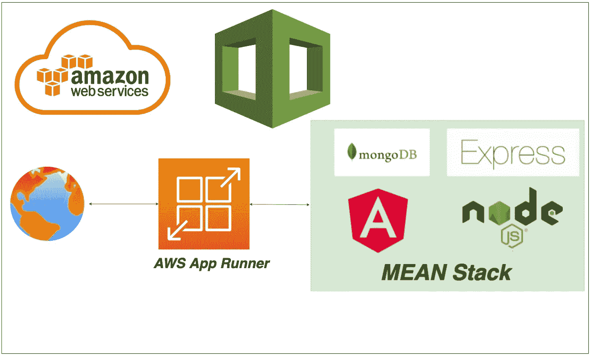

# 通过 CloudFormation 在 AWS App Runner 上自动部署 MEAN Stack Docker 映像

> 原文：<https://medium.com/bb-tutorials-and-thoughts/automate-deploying-mean-stack-docker-image-on-aws-app-runner-through-cloudformation-3b7cbfc3cc63?source=collection_archive---------3----------------------->

## 包含示例项目的分步指南

如果您希望通过选择运行时在托管平台上部署应用程序，AWS App Runner 是正确的选择。您可以使用 Docker runtime 运行整个 API，而不用担心您这边的配置。AWS 应用程序运行程序是一个…