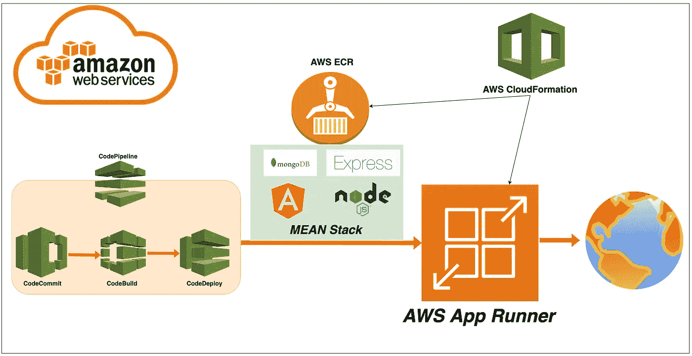

# 通过 AWS 代码管道在 AWS App Runner 上自动部署均值堆栈

> 原文：<https://medium.com/bb-tutorials-and-thoughts/automate-deploying-mean-stack-on-aws-app-runner-with-aws-code-pipeline-fd565e1f26a6?source=collection_archive---------1----------------------->

## 包含示例项目的分步指南

如果您希望通过选择运行时在托管平台上部署应用程序，AWS App Runner 是正确的选择。您可以使用 Docker runtime 运行整个 API，而不用担心您这边的配置。AWS App Runner 是一项 AWS 服务，它…