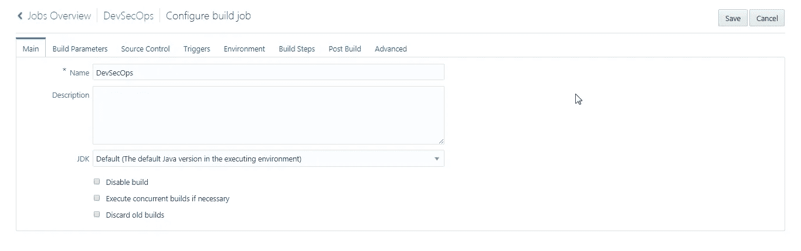
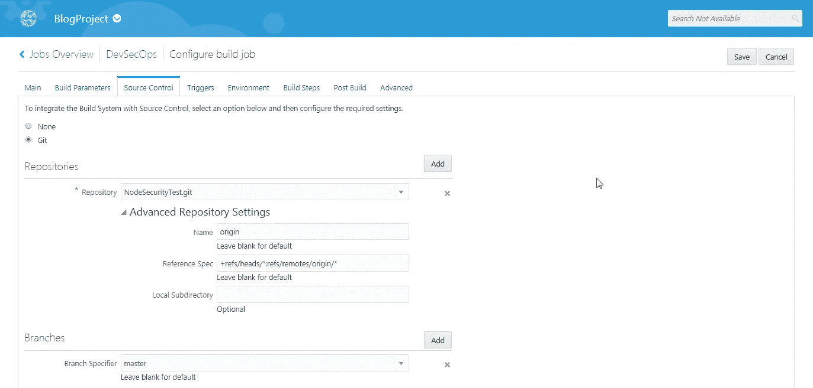
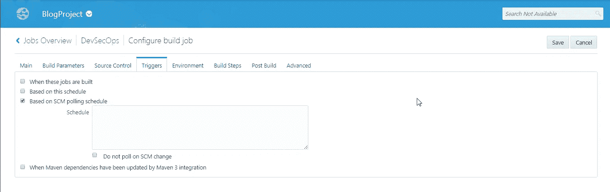
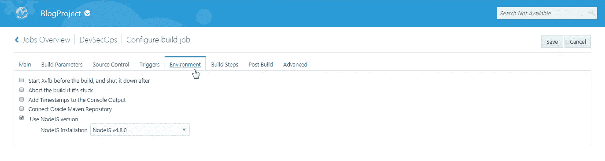
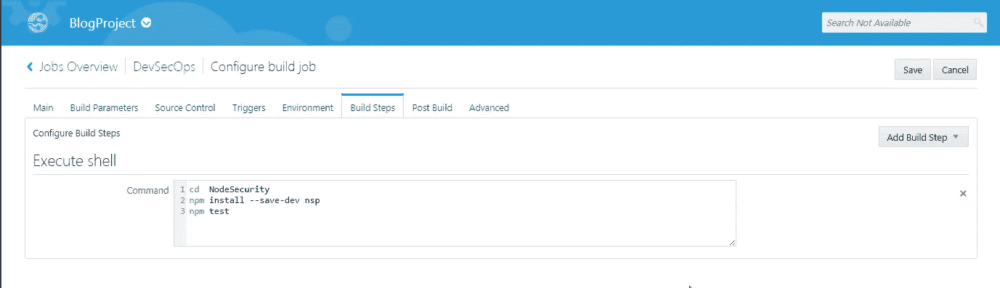
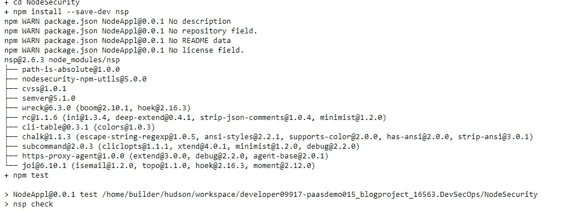
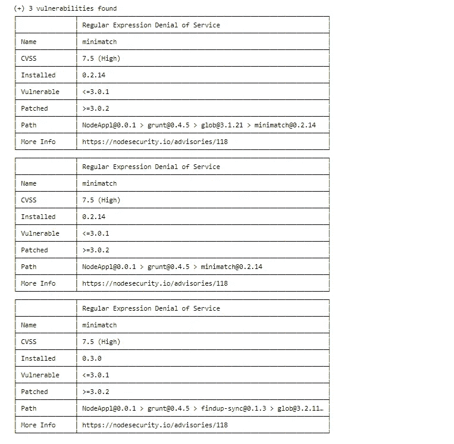

# 使用 Oracle Cloud 为您的 Node.js 应用程序自动化 DevSecOps

> 原文：<https://medium.com/oracledevs/automate-devsecops-for-your-nodejs-application-using-oracle-developer-cloud-service-6f75f8e8f9a1?source=collection_archive---------0----------------------->

本博客将帮助您了解如何在 Oracle Developer Cloud Service 上使用 NodeSecurity 为 Node.js 应用程序执行 DevSecOps automation。它将涵盖如何使用开发者云服务来使 DevSecOps 成为 Node.js 应用程序的 CI 和 CD 管道的一部分。这篇博客是这个系列的第一篇，它将提供关于如何一步步进入 DevSecOps 领域的见解。


**关于 DevSecOps**

DevOps 的出现带来了文化变革，缩小了开发和运营之间的鸿沟，同样，DevSecOps 的目的是创造一种思维模式，将安全性作为开发过程的一部分。目标是让每个人都对安全负责，并在不牺牲所需安全性的情况下，快速、大规模地将安全决策分配给掌握最高级别上下文的人。

DevSecOps 思维模式需要提供有助于安全决策制定的工具和流程，以及支持使用和调整这些工具的安全人员。通过这种方式，DevSecOps 带来了在恶意攻击者发现缺陷之前持续监控、攻击和确定缺陷的能力。为 DevSecOps 引入标准工具和平台，将允许更容易地采用并将其作为开发和运营的一部分。

**博客使用的技术栈和平台:**

*   **甲骨文开发者云服务** —作为持续集成和交付的云平台
*   **Node.js** —示例项目开发栈
*   **节点安全平台或 NSP** — Node.js 安全工具

**关于节点安全**

这是一个安全审计工具，可以用来防止已知的漏洞潜入您的项目。它读取项目中的 package.json 文件，并给出为项目列出的每个依赖项中的漏洞。

**节点安全配置文件:**

**package.json**

nsp 模块应该作为 dev 依赖项与其他依赖项一起包含在项目中。npm 测试将使用它来执行“脚本”中的命令“nsp check ”,以审核所有依赖项，从而列出每个依赖项的已知漏洞。

下面是这个博客使用的 **package.json** 示例:

```
{
  "name": "NodeAppl", "version": "0.0.1", "scripts": 
   { "start": "node main.js", "test": "nsp check"
   }, "dependencies": 
  { "body-parser": "^1.13.2", "express": "^4.13.1", "grunt": "^0.4.5", "grunt-contrib-compress": "^1.3.0", "grunt-hook": "^0.3.1", "load-grunt-tasks": "^3.5.2", "request": ""
  }, "devDependencies":
  { "mocha": "^3.3.0", "nsp": "" }}
```

**构建用于执行 NSP 工具的作业配置，以审核并列出所列模块中的漏洞:**

为构建作业选择一个名称。对于这个博客，我将其命名为“DevSecOps”。因为这是针对 Node.js 应用程序的，所以可以将 JDK 保留为默认值。



选择已上传 Node.js 应用程序代码的存储库。



这里我们将 SCM 轮询设置为触发器。这确保了每次我们将代码上传到 Git 存储库时，都会触发 DevSecOps 构建作业。



从下拉列表中选择版本为 4.8.0 的 Node.js，选中“使用 NodeJS 版本”复选框。



我们也将在这里使用执行 shell 构建步骤。我们将文件夹更改为“NodeSecurity”。我们将安装 NSP 模块作为开发依赖项，并使用 npm 测试来触发 package.json 中的“nsp check”命令执行，这是脚本的一部分。这将执行 nsp 工具进行审计，并列出 package.json 中列出的依赖模块的漏洞。



**NSP 工具执行后，下面的截图描述了审计报告:**



使用这些步骤，通过 Oracle Developer Cloud Service 自动检查 Node.js 模块的漏洞。

编码快乐！

> * *本文表达的观点是我个人的观点，不一定代表甲骨文的观点。