# 使用 Datree、AWS CodeBuild 和 Terraform 自动执行 K8s 策略检查

> 原文：<https://medium.com/globant/automate-k8s-policy-checks-using-datree-aws-codebuild-and-terraform-ea3ae76b7277?source=collection_archive---------0----------------------->

# **简介**

G itops 是优化 Kubernetes 集群中应用生命周期的最佳策略之一。它的基础在于以声明的方式定义 Git 存储库中应用程序和集群配置的期望状态。采用基于 [GitOps practices](https://www.weave.works/technologies/gitops/) 的部署工作流将使我们受益，包括版本控制、更简单的安全性、审计和合规性控制自动化、更强的稳定性和一致性、更快的部署以及促进协作贡献，等等。

> "手动配置中发生的事情，将保留在手动配置中."“一切如代码是关键，GitOps 实践解决方案。”

根据具体情况，存储库中的版本化代码可以是 Kubernetes 在 Kustomize、Helm Charts 中定义的应用程序，或者仅仅是 YAML 文件中的清单，这些文件将是 GitOps 连续交付工具的理想来源，这些工具专注于自动化部署，以确保所需的声明状态。例如， [ArgoCD](https://argo-cd.readthedocs.io/en/stable/) 和 [FluxCD](https://fluxcd.io/) 支持各种有趣的基于分支、标签、文件夹等的多集群和多环境部署策略。

在将变更集成到主分支之前，如何保证高代码质量？高代码质量包括遵守安全策略以及语法和语义验证。

嗯，我们可以信任…或者更好，我们可以**信任，但以自动方式验证**。🚀

让我们通过 GitOps 实践和使用一些 GitOps 工具来探索一种无限的方法来自动化这些验证。

本文将回顾以下部分:

*   架构概述
*   先决条件
*   履行
*   考虑
*   结论

# 概观

魔术替代品满足以下要求:

*   主分支中包含版本化 K8s 清单的 Git 存储库。
*   在将新的变更集成到主分支之前，自动验证它们的方法。
*   如果自动验证失败，新的变更就不能集成到主分支中。
*   另外:一种跨多个 K8s 存储库轻松复制自动化资源的方法

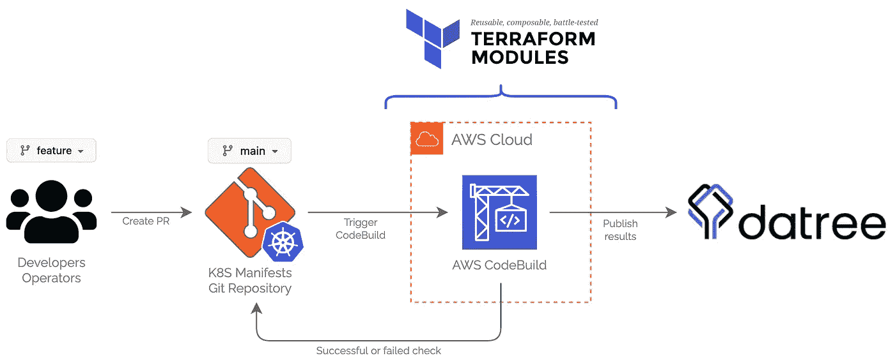

Diagram of the magic solution

如图所示，该流程包括以下步骤:

1.  开发人员或操作人员团队基于主分支在 Git 存储库中创建特性分支，并对 K8s 清单做出必要的贡献。主分支是一个受保护的分支，所以他们必须创建一个从特性到主分支的拉请求。
2.  当 PR 被创建到主分支时，一个 **AWS CodeBuild** 项目被触发，它使用 **Datree CLI** 分析来自特性分支的代码。
3.  分析结果的详细信息被发送到 **Datree** 云后端，并显示在策略检查仪表板中。或者您可以简单地在 CodeBuild 项目日志中查看它们。
4.  如果 **Datree** 策略检查通过，那么 **AWS CodeBuild** 将返回对 PR 的成功检查，否则，将返回失败的检查，并且 PR 不能被合并。
5.  在 **AWS** 中作为 **CodeBuild** 项目提供的所有自动化资源已经被抽象到 **Terraform 模块**中，这将允许我们为任何 K8s 存储库重用和复制这些配置。

记住这一点，让我们澄清一下，一些 GitOps 使用的工具和服务。

## 曼陀罗

[Datree](https://www.datree.io/) 是一款专注于验证 K8s 清单的工具，结合其 CLI，我们可以在 K8s 管道中自动执行策略检查。[验证过程](https://hub.datree.io/welcome/how-datree-works)由三个阶段组成:YAML 验证、模式验证和策略检查。此外，[集中式策略](https://hub.datree.io/setup/centralized-policy)的 Datree 概念支持使用内置规则甚至我们自己的自定义规则来验证策略。

一些类似的备选方案有 [Kube-score](https://github.com/zegl/kube-score) 、 [Kubeval](https://kubeval.instrumenta.dev/) 、 [Conftest](https://www.conftest.dev/) 和 [Trivy](https://github.com/aquasecurity/trivy) 。

## AWS 代码构建

[AWS CodeBuild](https://aws.amazon.com/codebuild/) 是 AWS DevOps 服务，用于在通过 CodeBuild 项目和 git 存储库之间的 webhook 向主受保护分支创建 Pull 请求时执行 Datree 验证。

根据构建的结果是成功还是失败，CodeBuild 本身支持将检查返回到 GitHub 中的 Pull 请求。

## 将（行星）地球化（以适合人类居住）

作为“*一切如代码*”概念的一部分，为了支持著名的 [DRY](https://en.wikipedia.org/wiki/Don%27t_repeat_yourself) 原则，AWS 上提供的所有资源都被抽象成了一个 [Terraform](https://www.terraform.io/) 模块。因此，我们可以为我们所有的 K8s 仓库复制代码构建项目。作为一个 IaC 工具，您现在将获得管道代码。🚀

## Git 储存库

到目前为止，只提到了 K8s 清单存储库。这是一个 GitHub 库。但是，您可以使用 AWS CodeBuild 支持的任何源代码[(比如 GitHub、GitHub Enterprise、AWS CodeCommit 或 BitBucket)](https://aws.amazon.com/codebuild/faqs/?nc1=h_ls#:~:text=Q%3A%20Which%20source%20repositories%20does%20CodeBuild%20support%3F%20%3E%3E)

同样重要的是，用于提供 AWS 资源的 Terraform 模块(主要是执行 Datree 策略检查的 CodeBuild 项目)有自己的 GitHub 存储库。因此，有两个 GitHub 库:

*   [K8s 清单库](https://github.com/Kirmito/k8s-apps)
*   [AWS code build&Datree terra form 模块库](https://github.com/Kirmito/terraform-aws-k8s-datree-codebuild)

# 先决条件

*   Terraform v1.0 版或更早版本
*   AWS 云帐户
*   带有 K8S 清单的 Git 存储库。本案中的 GitHub 回购协议。
*   [为 AWS 代码版本配置 GitHub 认证](https://docs.aws.amazon.com/codebuild/latest/userguide/access-tokens.html)
*   Datree 账户。看看[官方数据入门](https://hub.datree.io/)或者直接创建[账号](https://app.datree.io/login)。

# 开始吧！

替代解决方案将包含在以下 5 个步骤中:

1.  创建 K8s 清单库。
2.  Datree 预配置。
3.  Terraform 模块结构和供应。
4.  最终的 GitHub 配置。
5.  一、二、三…开拍！🎬策略检查的结果。

## 步骤 1:创建 K8s 清单存储库

正如您在[K8s 清单存储库结构](https://github.com/Kirmito/k8s-apps/tree/main/apps)中看到的，有两个 Kubernetes 应用程序，它们的清单被声明为 YAML 文件。

```
apps
├── demo-app
│   ├── base
│   │   ├── deployment.yaml
│   │   ├── ingress.yaml
│   │   ├── kustomization.yaml
│   │   ├── namespace.yaml
│   │   └── service.yaml
│   └── overlays
│       └── develop
│           ├── config.json
│           └── kustomization.yaml
└── lab-app
    ├── base
    │   ├── deployment.yaml
    │   ├── ingress.yaml
    │   ├── kustomization.yaml
    │   ├── namespace.yaml
    │   └── service.yaml
    └── overlays
        └── develop
            ├── config.json
            └── kustomization.yaml
```

因此，当任何开发者或操作者想要通过拉请求做出贡献时，其想法是分析这些现有的和未来的清单。

## 步骤 2: Datree 预配置

一旦您创建了 Datree 帐户并完成了[先决条件部分中详述的正式 Datree 入门](https://hub.datree.io/)，一个良好的安全实践是创建一个新的 **read** 令牌，CodeBuild 项目稍后将使用它来访问 Datree 后端。

转到`the Datree Web Console > Settings > Token Management`，然后点击`Create Token`。确保令牌类型为 **Read。**

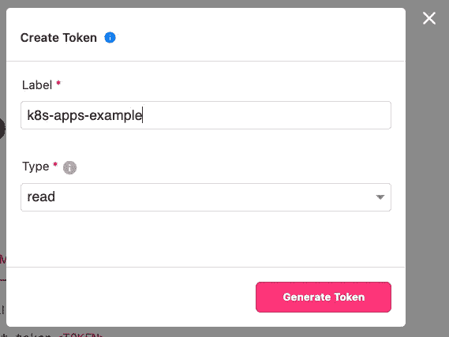

Create a Read Datree Token

若要安全地存储此标记并确保 CodeBuild 项目可以接受它，请将该值作为 SecureString 加载到 SSM 参数存储区中。

```
/k8s-apps-example/datree/APP_TOKEN 
```

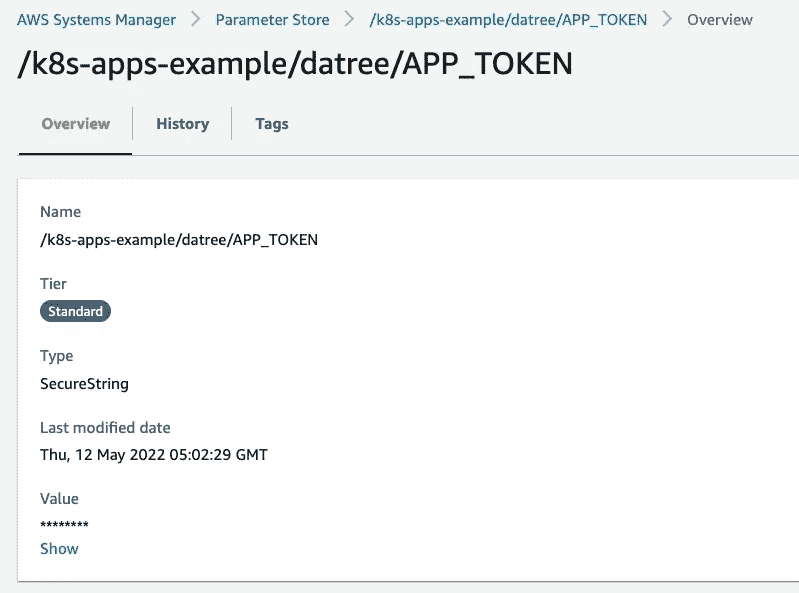

为了与 Datree 的集中式策略控制台进行交互，让我们为此示例创建一个新策略。转到策略选项卡，然后创建一个名为`k8s_apps_example`的新策略。请注意这个名称，因为它稍后将用于 CodeBuild 项目。

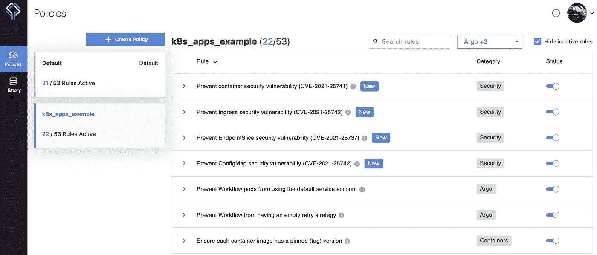

Datree’s Centralized policy console

现在是时候激活规则了，这些规则将在 CodeBuild 项目中由策略检查自动验证。如上所示，53 个规则中的 22 个已经被激活，其中一些属于安全、Argo 和容器类别。

## 步骤 3: Terraform 模块结构和供应

首先，克隆[terra form 模块库](https://github.com/Kirmito/terraform-aws-k8s-datree-codebuild)并查看将要提供的资源。

*   [代码构建项目](https://github.com/Kirmito/terraform-aws-k8s-datree-codebuild/blob/main/codebuild_pr.tf#L1-L59)
*   [CodeBuild Webhook](https://github.com/Kirmito/terraform-aws-k8s-datree-codebuild/blob/main/codebuild_pr.tf#L61-L76)
*   [Webhook SSM 参数](https://github.com/Kirmito/terraform-aws-k8s-datree-codebuild/blob/main/ssm.tf)(有效载荷 URL 和秘密)
*   [代号通知](https://github.com/Kirmito/terraform-aws-k8s-datree-codebuild/blob/main/codestar_notifications.tf)

除了模块创建的资源之外，还需要以下资源作为模块调用的输入。

*   [KMS 密钥加密 SSM 参数](https://github.com/Kirmito/terraform-aws-k8s-datree-codebuild/blob/main/examples/complete/main.tf#L21-L28)
*   [代码构建项目将承担的 IAM 角色和 IAM 策略](https://github.com/Kirmito/terraform-aws-k8s-datree-codebuild/blob/main/examples/complete/main.tf#L81-L91)

在[完整的](https://github.com/Kirmito/terraform-aws-k8s-datree-codebuild/tree/main/examples/complete)示例的 [main.tf](https://github.com/Kirmito/terraform-aws-k8s-datree-codebuild/blob/main/examples/complete/main.tf) 文件中，声明了所需的资源和 Terraform 模块的调用。

该模块支持许多[输入变量](https://github.com/Kirmito/terraform-aws-k8s-datree-codebuild/blob/main/variables.tf)；但是，最相关的变量是资源名称的前缀、要分析的存储库和分支、Datree 策略名称以及先前创建 Datree 令牌的参数存储路径。

克隆了 repo 之后，设置 AWS 凭证，让我们继续到终端，看看 Terraform 的神奇之处。

```
cd examples/complete
terraform init
terraform apply 
```

在**地形应用**中输入**是**后的预期输出:

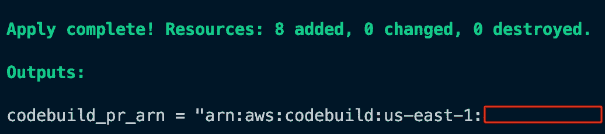

最后，已经提供了 AWS CodeBuild 项目。🎉

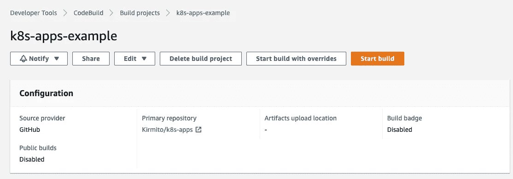

CodeBuild project

从[地形模板](https://www.terraform.io/language/functions/templatefile?_ga=2.106572672.2087542934.1652304655-572813180.1649204332)构建`buildspec.yml`文件，最终结果如下所示。如您所见，首先所有 YAML 文件被递归列出，然后执行包含`--only-k8s-files`标志的`datree test`命令，从存储库根递归验证所有与 K8s 清单相关的 YAML 文件。

类似地，CodeBuild webhook 也被添加到了 K8s 清单存储库中。

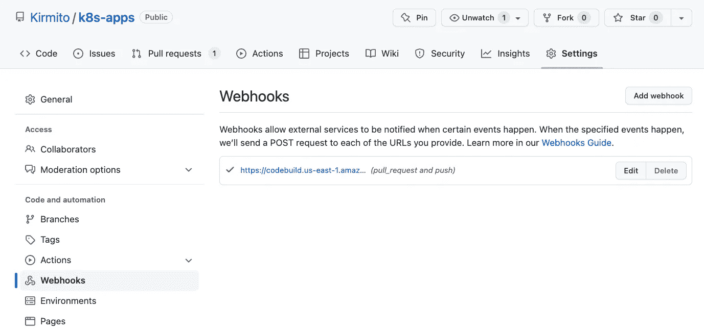

CodeBuild Webhook created in Github repository

## 步骤 4:最终的 GitHub 配置

为了确保开发人员或运营团队只能通过拉请求对主分支做出贡献，必须在功能分支合并到主分支之前通过代码构建检查。在 K8s 清单报告中，创建一个与主分支相关联的受保护分支规则，并在状态清单中选择 CodeBuild 检查。

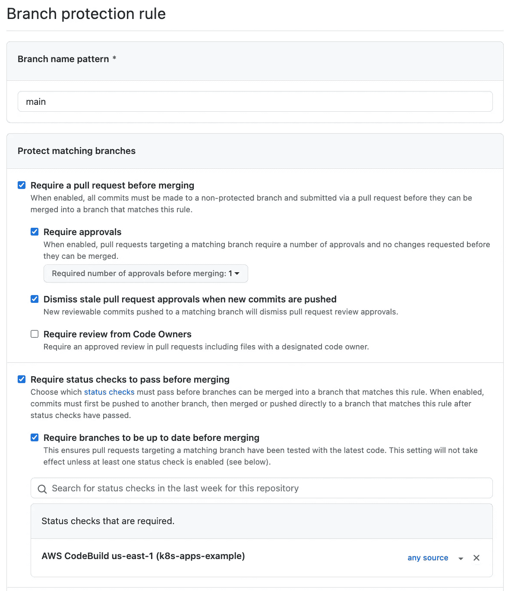

## 第五步:1，2，3…开始！🎬策略检查的结果

最后，如果我们创建了一个从特性分支到主分支的拉请求，并做了一些修改，那么就会自动触发一个代码构建来分析特性分支的代码。

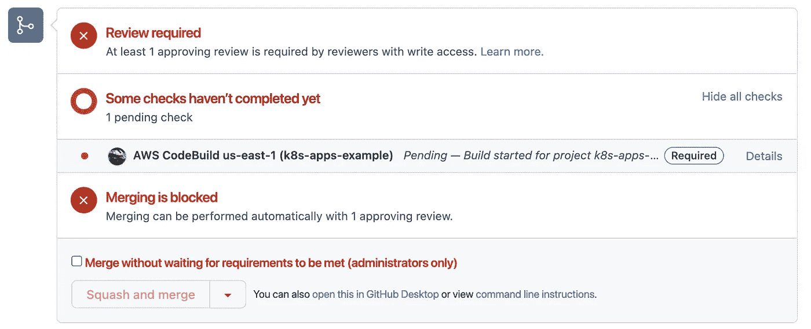

根据 CodeBuild 执行的状态，AWS 将向 PR 返回失败或成功检查的状态。在这种情况下，由于检查失败，因此不允许合并。

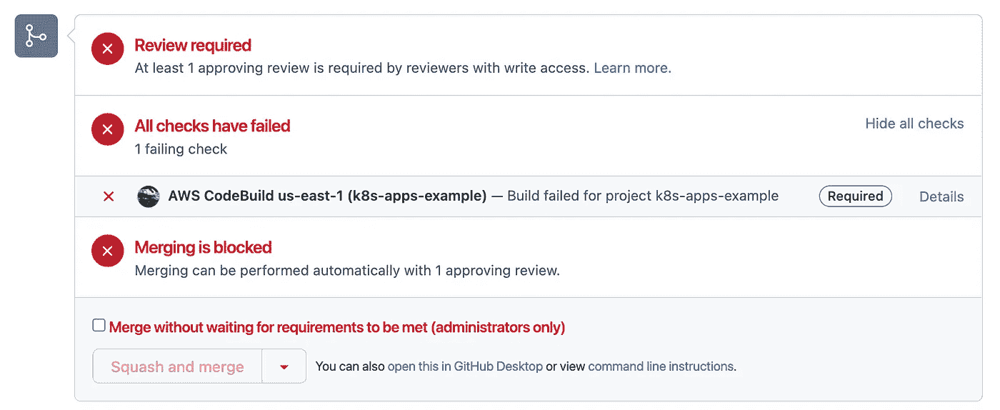

要详细说明构建状态，只需单击 **Details** 标签，它会将您重定向到 AWS 上的 CodeBuild 日志或直接访问 CodeBuild 项目的运行历史。

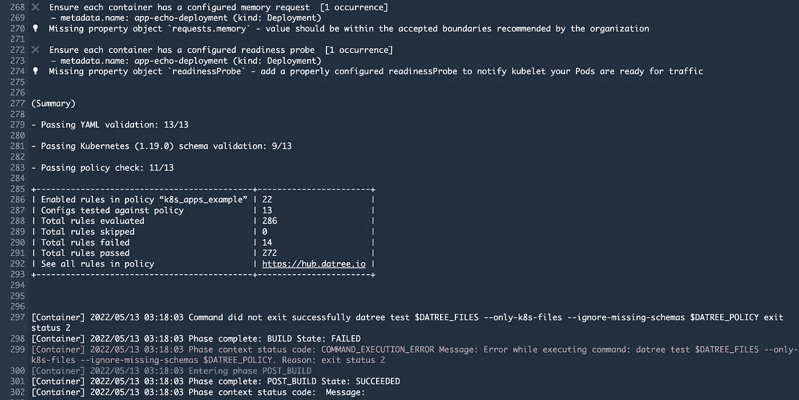

CodeBuild logs

在代码构建日志中，您可以详细描述以下内容:

*   基于先前创建的 Datree 策略中启用的规则尚未通过的规则。
*   三个连续阶段(YAML 验证、模式验证和策略检查)的摘要。
*   在策略检查阶段评估、跳过、失败和通过的规则的总结果。

同样，如果您访问 Datree 中的“历史记录”选项卡，您可以轻松跟踪所有不同的策略检查执行情况。

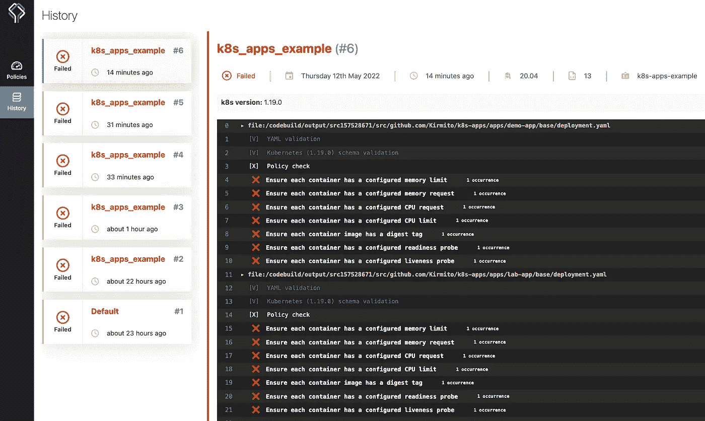

Datree policy check history

# 记住

*   运行 Datree CLI 不需要创建 Datree 帐户，但是，要访问集中策略功能，Datree 帐户是必需的。
*   Datree 的免费模式仅支持 GitHub 和 Google SSO 用户，因此最好创建一个新的自动化用户或考虑企业模式。
*   如前所述，在这个例子中，存储库中的所有 k8s 清单都被验证。但是，Datree 支持在[舵图](https://github.com/datreeio/helm-datree)和 [Kustomize](https://hub.datree.io/integrations/kustomize-support) 中验证应用。
*   terraform 模块支持创建 CodeStar 通知，以向松弛通道发送状态。这需要创建一个聊天机器人通知，并将其添加为一个[输入变量](https://github.com/Kirmito/terraform-aws-k8s-datree-codebuild/blob/main/variables.tf#L91-L101)。
*   当它是 Github.com 存储库时，webhook 是由 Codebuild 通过个人访问令牌自动创建的。但是，当它是 GitHub 企业存储库时，必须单独创建。因此，webhook 的有效负载 URL 和秘密存储在 SSM 参数存储中。

# 结论

在本文中，我们探索了一种基于 GitOps 实践的解决方案，在部署之前，自动分析在 git 存储库中声明的 K8s 应用程序清单。该实施依赖于一些 GitOps 工具，如 Datree，以通过策略检查来验证 K8s 的错误配置，AWS Codebuild 以自动触发检查，Terraform 模块用于抽象和提供与该解决方案相关的基础设施，最后，GitHub 中的一些配置以确保基于拉请求的流程。

最后，我想对约尔曼和唐·奥斯卡林的宝贵支持表示最深切的感谢。

# 参考

*   [GitOps 实践](https://www.weave.works/technologies/gitops/)
*   [Datree 入门](https://hub.datree.io/)
*   [Datree CLI 输出](https://hub.datree.io/setup/cli-output)
*   [AWS —配置 GitHub 个人访问令牌](https://docs.aws.amazon.com/codebuild/latest/userguide/access-tokens.html)
*   [AWS —为 GitHub 拉请求配置代码构建](https://docs.aws.amazon.com/codebuild/latest/userguide/sample-github-pull-request.html)
*   [地形模块](https://www.terraform.io/language/modules/syntax)