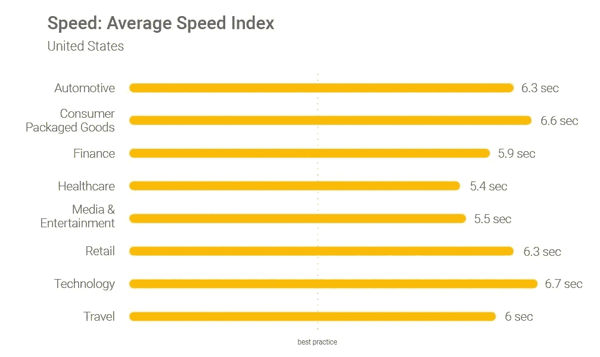
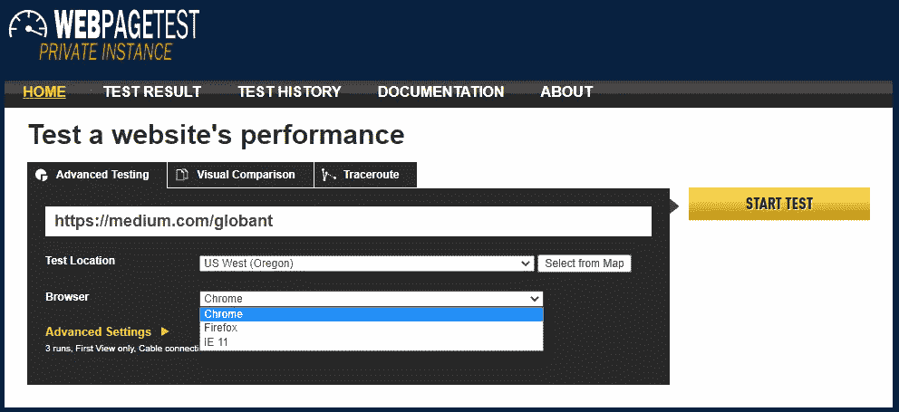
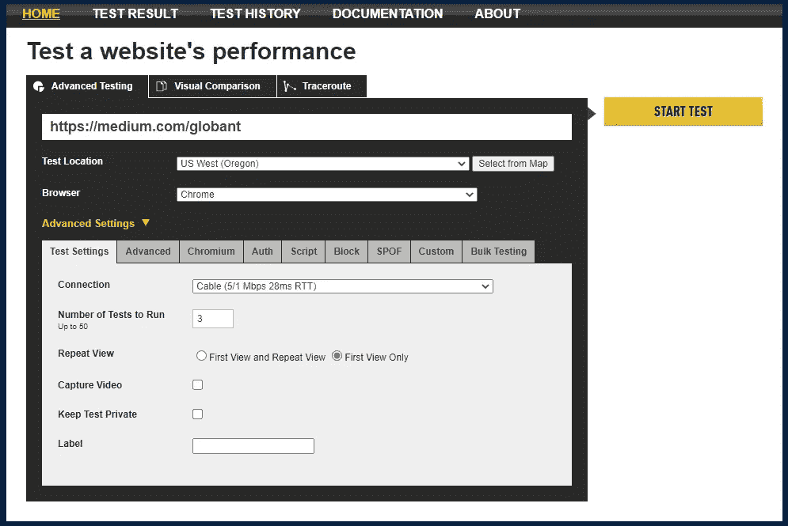
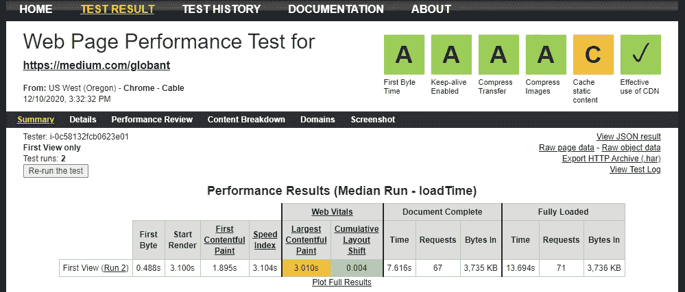
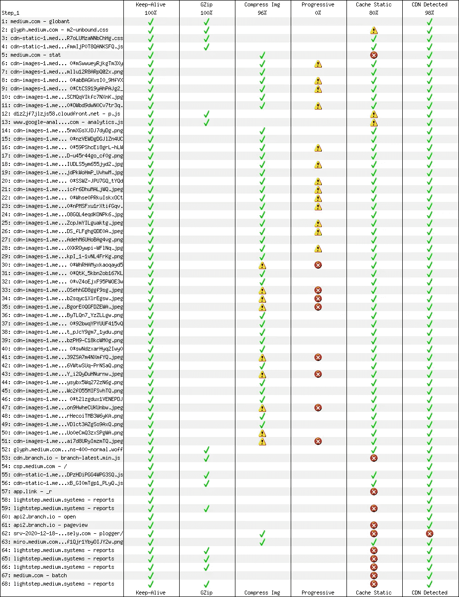

# 用 WPT 自动化页面性能测试

> 原文：<https://medium.com/globant/automate-page-performance-test-with-wpt-10310543184f?source=collection_archive---------1----------------------->

# 关于文章

在这篇文章中，你将了解页面性能的重要性，以及如何使用 WPT 工具来测量页面速度。本文将涵盖以下主题:

*   介绍
*   绩效不达标的影响
*   绩效事实
*   测量页面速度
    — WPT 工具
*   运行网页测试
    —使用 WPT 门户网站进行手动页面测试
    —使用 PowerShell 脚本进行自动化页面测试

# 介绍

页面性能是指页面内容在 web 浏览器中加载和呈现的速度。业绩在任何在线风险投资的成功中扮演着重要角色。高性能网站比低性能网站更能吸引和留住用户。

# 绩效不达标的影响

## 转化率低

用户完成所需操作的速度。许多公司发现，页面加载时间减少几毫秒就能提高转化率。

*   在将页面加载时间缩短一半后，零售商自动测试的销售额增加了 12-13%
*   沃尔玛发现，将页面加载时间缩短一秒，转化率就会提高 2%

## 高跳出率

跳出率是仅浏览一个页面就离开网站的用户的百分比。BBC 发现，他们的页面加载每多花一秒钟，就会损失 10%的用户。

## 低搜索引擎优化排名

谷歌倾向于优先让用户尽快获得相关信息，网站性能是谷歌搜索排名的一个重要因素。

## 用户体验差

页面加载时间长，对用户操作的响应时间慢，会造成糟糕的用户体验。

# 让您大吃一惊的性能事实

*   一旦你的页面加载完毕，用户会在 0.05 秒内形成意见
*   近 70%的消费者承认网页速度会影响他们的购买意愿
*   只有 15%的网站以可接受的页面速度运行
*   如果加载时间超过 3 秒，57%的访问者会离开网站
*   四大搜索引擎优化 UX 信号中有三个是页面速度相关的
*   美国各行业的平均页面速度



# 测量页面速度

为了测量一个页面，我们有很多工具，但我们将专门讨论网页测试(WPT)

## 为什么是 WPT？

*   它是开源工具
*   公共实例在[https://www.webpagetest.org](https://www.webpagetest.org)对所有人开放
*   预配置的映像可在云上作为私有实例运行(AWS/GCP)
*   它是独立于平台的，可以安装在 Windows 和 Linux 上
*   与 CI/自动化工具集成的 API 的可用性

# 运行**网页测试**

## **使用 WPT 门户网站进行手动页面测试**

要运行测试，请转到 webpagetest.org 或私有实例 URL，如本例所示。

**输入如下概述的详细信息**

*   输入您的网站 URL —确保您输入的有效 URL 与应该输入的完全一致
*   测试地点——选择离你的访问者最近的地方。
*   选择浏览器—从不同的可用浏览器选项中进行选择



*   高级设置—这是可选的，但我们希望运行 3 个测试
*   连接—这模拟了您的访问者可能拥有的互联网连接类型。您可以使用这个选项，但是让我们将它设置为有线，因为这是非常标准的。



*   点击开始测试

您将看到许多其他选项卡和选项，可以根据测试需要加以利用。

**性能结果**

结果显示为我们使用页面优化等级运行的 3 个测试的平均加载时间。



## 使用 PowerShell 自动化测试

WPT 提供了一个 API 来自动化页面测试。我们将通过在下面的 PowerShell 脚本中执行 POST 请求来向私有 WPT 服务器提交页面测试。作为回报，我们将得到一个 XML 响应。

我们通过初始化服务器 URL 和 API 键来启动脚本。向私有实例进行身份验证需要 API 密钥。

```
*$APIKey   = '<API Key>'
$ServerURL  = "<Private WPT Server URL>"*
```

设置身份验证参数后，我们定义测试配置，如浏览器、网络速度、测试数量和结果类型中值/平均值等。

*   浏览器:从 Chrome、Firefox 和 IE 11 中选择，列表因代理和地区而异。
*   从可用选项 FIOS、电缆、3G、4G 中设置适当的网络模拟。选项因地区和 WPT 代理商而异。
*   URL2Test 是被测试的实际 URL。

```
*$Browser  = 'Chrome'**# FIOS = 20 Mbps, Cable = 5 Mbps**$Connection  = 'FIOS'**$URL2Test  = 'https://medium.com/globant'**$NumberOfTests  = 3*
```

在一个名为 OtherOptions 的新变量中根据要求定义附加设置，有很多调整，但我们使用的很少，如保持测试结果私密，将整个页面负载捕获为视频，并抓取所有标题细节，以便敏感数据不会作为结果的一部分存储。我们还想考虑中值结果，因此我们将中值度量设置为 1。

```
*$OtherOptions = '&private=1&video=1&noheaders=1&medianMetric=1'*
```

一旦定义了所有的测试配置，通过按照 WPT 的标准 API 格式连接参数来创建请求 URL“Test request”。

```
*# Setting Location parameter as per the URL syntax**$Location = $TestRegion + ':' + $Browser + '.' + $Connection**# Creating the Request URL**$TestRequest = $ServerURL + "runtest.php?url=$URL2Test" + "&f=xml&runs=$NumberOfTests" + "&location=$Location" + "&k=$APIKey" + $OtherOptions*
```

现在用上一步中创建的请求 URL 发出 POST 请求。作为回报，我们得到一个 XML 响应，其中包含测试 ID、可读格式的结果 URL 和原始 JSON 格式。

```
*# Invoking the Post method to start Test**$ExecuteTestRequest = Invoke-WebRequest -Uri $TestRequest -UseBasicParsing**$TestID = ([xml]$ExecuteTestRequest.Content).response.data.testId**$HumanReadableURL = ([xml]$ExecuteTestRequest.Content).response.data.userUrl**$JsonURL = ([xml]$ExecuteTestRequest.Content).response.data.jsonUrl*
```

根据测试代理的可用性、页面大小、区域和网络选择，测试需要几分钟才能完成。等待测试完成，这由响应代码 200 指示。

```
$*ExecutionStatus* = $ServerURL + 'testStatus.php?f=xml&test=' + $TestID*Do {**Start-Sleep -Seconds 30**$TestResult = Invoke-WebRequest -Uri $ExecutionStatus -UseBasicParsing**} while (([xml]$TestResult.Content).response.statusCode -ne 200)*
```

测试完成后，请求 WPT 服务器生成整个测试记录的视频，并在视频生成后下载。

```
*$RequestVideo = $ServerURL + 'video/create.php?tests=' + $TestID + '-r:1-c:0&id=' + $TestID +'.1.0'**# Request WPT server to make video available for downloading**Invoke-WebRequest -Uri $RequestVideo -Method Get -UseBasicParsing | Out-Null*# Download the Video file*$VideoURL = $ServerURL + "video/download.php?id=$TestID" + '.1.0'**Invoke-WebRequest -Uri "$VideoURL" -OutFile "PerfTest_Video.mp4" -UseBasicParsing*
```

此外，下载优化清单，其中包括建议，并作为改善页面性能的指南。

```
*$OptimizationCheckListURL = $ServerURL + '/results/'  + $DateFromTestID + $($TestID.Replace($TestID.Split('_')[0],"")).replace('_','/') + '/1_optimization.png'**Invoke-WebRequest -Uri "$OptimizationCheckListURL" -OutFile "OptmizationCheckList.png" -UseBasicParsing*
```



*OptmizationCheckList.png*

为了获取详细的结果，我们将下载原始的 JSON 数据，并挑选一些用于发送通知的属性。

```
*Invoke-WebRequest -Uri $JsonURL -Method Get -UseBasicParsing -OutFile "PerformanceResult.json"**$ResultJsonData = ConvertFrom-Json -InputObject (Get-Content -Raw -Path "PerformanceResult.json")**$ResultJsonData = $ResultJsonData.data.median.firstView*
```

对于最后一部分，我们希望提取数据，如总加载时间、页面开始呈现的时间、页面上的资源总数和资源未找到错误，我们将创建一个具有上述属性的对象，该对象将在下一步由 Slack notifier 使用。请注意，结果以毫秒表示。

```
 *$SlackHook = "<Slack Hook>"**$SlackNotitificationContent =@"**TestedURL            : $URL2Test**fullyLoaded          : $($ResultJsonData."fullyLoaded")**render               : $($ResultJsonData."render")**requestsFull         : $ResultJsonData."requestsFull"**responses_404        : $ResultJsonData."responses_404"**"@*
```

最后，使用 POST 请求和 slack 挂钩通过 slack 发送结果作为 Slack 通知。

```
*# Sending Slack notification**$body = ConvertTo-Json @{**pretext = "URL: $URL2Test"**username = "<SlackUsername>"**text = "$SlackNotitificationContent"**channel = "<Channel to Notify>"**}**Invoke-RestMethod -uri $SlackHook -Method Post -body $body -ContentType 'application/json' -UseBasicParsing*
```

# 结论

Web 性能就是让网站变得更快。确保网站快速加载，允许用户快速开始与它互动。我们已经到了故事的结尾，留下了绩效对业务有什么影响的例子。

*   重建 Pinterest 页面以提高性能的结果是，等待时间减少了 40%，SEO 流量增加了 15%，注册转化率增加了 15%。
*   COOK 将平均页面加载时间减少了 850 毫秒，从而提高了 7%的转化率，降低了 7%的跳出率，并提高了 10%的每次会话页面数。

在接下来的文章中，我们将介绍不同的测试选项，并详细分析性能结果。

# 参考

*   [https://www.2dogsdesign.com/how-to-webpagetest](https://www.2dogsdesign.com/how-to-webpagetest/#:~:text=Webpagetest%20is%20a%20free%20tool,as%20well%20as%20repeat%20visits)
*   https://www.bluecorona.com/blog/how-fast-should-website-be