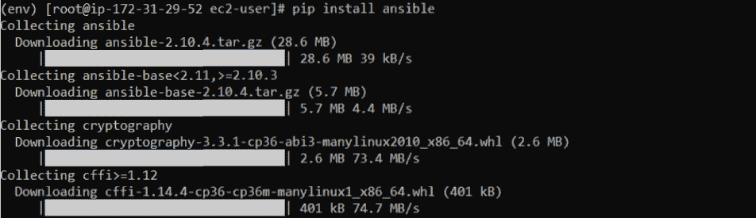

# 使用 Ansible 自动化远程 Windows 主机服务

> 原文：<https://medium.com/globant/automate-remote-windows-host-services-using-ansible-8f4dc1a7a3f?source=collection_archive---------0----------------------->

Ansible 是一个非常简单的 IT 自动化引擎，可以自动化云供应、配置管理、应用程序部署、基础设施服务编排和许多其他需求。


# 介绍

这篇文章是关于使用 Ansible 管理远程 Windows 主机服务的。为了在工作中带来良好的实践，我们可以使用 Ansible 创建自动化，而不是手工操作。这解决了很多问题，比如在 Windows 环境中管理和执行核心功能。有多种工具可以做到这一点，但这里我们使用 Ansible，因为它为服务的自动化提供了一个服务模块。

让我们从设置开始。

**先决条件*:***

1.安装了 Ansible 的 Centos 8 操作系统。

2.Windows 10 远程主机。

# 安装步骤:

应在 Centos 上运行以下步骤:

***第一步:*** 在 Ansible 控制节点上安装 Python3。

```
sudo dnf install python3
```


***第二步:*** 验证是否安装了 python3。

```
python3 --version
```


***第三步:*** 安装虚拟环境运行 Ansible。

```
sudo dnf install python3-virtualenv
```


***第四步:*** 创建虚拟工作空间环境

```
virtualenv env
```


***第五步:*** 激活虚拟环境

```
source env/bin/activate
```


***第六步:*** 安装 Ansible

```
pip install ansible
```



***第七步:*** 验证 Ansible 已安装。

```
ansible --version
```


***第八步:*** 打开默认的 hosts 文件，定义 windows 主机规范。

```
vi /etc/ansible/hosts
```


**注意**:确保在指向 Windows 主机的文件中放置正确的凭证，这是为了避免连接问题。

***第九步:*** 安装 Pywinrm

```
pip install pywinrm
```

**注意** : WinRM (Windows 远程管理)是微软 WS-Management 的实现，这是一个基于 SOAP 的协议，用于管理设备和服务器。它可用于连接到远程 Windows 服务器并在其上运行命令。


应在 Windows 上运行以下步骤:

***步骤 10:*** 使用下面的链接在远程 Windows 主机上下载 WinRM 脚本。

```
[https://raw.githubusercontent.com/ansible/ansible/devel/examples/scripts/ConfigureRemotingForAnsible.ps1](https://raw.githubusercontent.com/ansible/ansible/devel/examples/scripts/ConfigureRemotingForAnsible.ps1)
```

***步骤 11:*** 在远程 Windows 主机上运行 WinRM 脚本。

若要在远程 Windows 主机上运行 WinRM 脚本，请以管理员身份打开 Windows PowerShell。


现在切换回 Centos。

***第十二步:*** 主机列表

```
ansible all --list-hosts
```


***步骤 13:*** 检查并测试远程 Windows 主机与 Ansible 控制节点之间的连接。

```
ansible webserver -m win_ping
```


***步骤 14:*** 创建一个剧本，并在剧本中创建一个任务，该任务将在远程主机上自动执行服务。在本行动手册中，我们使用 Ansible win_service 模块来启动和停止服务。

```
touch service.yml
```


***第十五步:*** 执行剧本。

```
ansible-playbook service.yml
```


上面的输出显示剧本已经成功执行。这意味着我们现在可以使用 Ansible 行动手册自动化远程 Windows 主机服务。如果您遇到任何问题，请遵循以下故障排除链接。

**故障排除链接:**

*   [https://docs . ansi ble . com/ansi ble/latest/collections/ansi ble/windows/win _ service _ module . html](https://docs.ansible.com/ansible/latest/collections/ansible/windows/win_service_module.html)
*   [https://argon sys . com/Microsoft-cloud/articles/configuring-ansi ble-manage-windows-servers-step-step/](https://argonsys.com/microsoft-cloud/articles/configuring-ansible-manage-windows-servers-step-step/)

**注意**:如果您使用来自任何一家知名公共云供应商的本地机器或虚拟机，请确保您添加了下述**入站规则**以避免连接问题。


**结论:**

因此，本文总结了如何使用 Ansible 自动化远程 Windows 主机服务。当我们想要管理远程 Windows 主机的服务时，当手动更改的范围有限时，这种简单可行的自动化会产生奇迹。因此，如果您正在寻找云环境中的托管远程 Windows 主机，Ansible 是一个理想的选择。