# 自动化您的测试管道和基础设施生命周期

> 原文：<https://medium.com/oracledevs/automate-your-test-pipeline-and-infrastructure-life-cycle-using-oracle-developer-cloud-10c2b3c55903?source=collection_archive---------2----------------------->

这篇博客通过一个例子展示了如何在**云**中创建一个包含单元测试和集成测试的测试管道。需要注意的是，云服务实例(用于测试)是按需启动的，然后在测试执行后停止/终止

*   将**基础设施视为代码**，并在我们的管道中控制它
*   **按需付费** =成本控制

我们将利用以下 Oracle 云服务

*   Oracle 开发人员云
*   Oracle 数据库云
*   Oracle 应用容器云

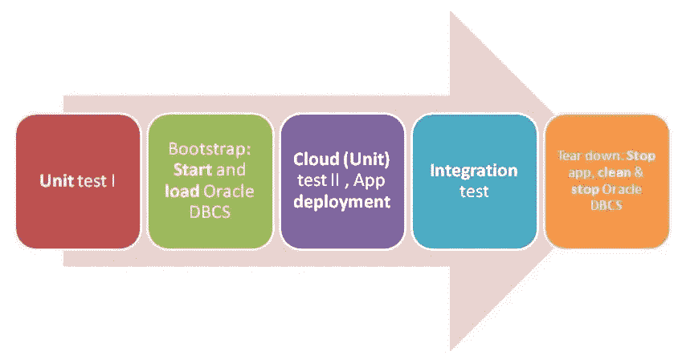

# Oracle 开发人员云:关键促成因素

以下功能起着关键作用

以下提到的特性在**构建**模块中可用

*   与 **Oracle PaaS 服务管理器** (PSM)的集成:可以添加一个 ***PSMcli*** 构建步骤，在构建运行时调用 Oracle PaaS 服务管理器命令行界面(cli)命令。文档中的更多[细节](http://docs.oracle.com/en/cloud/paas/developer-cloud/csdcs/managing-project-jobs-and-builds-oracle-developer-cloud-service.html#GUID-E4E58D36-E869-41B5-9D7D-5EA9E353F316)
*   与 **SQLcl** 的集成:这使得在构建运行时调用 Oracle 数据库上的 SQL 语句成为可能。[详情在此](http://docs.oracle.com/en/cloud/paas/developer-cloud/csdcs/managing-project-jobs-and-builds-oracle-developer-cloud-service.html#GUID-9D31DDA7-2EB8-496E-9228-2588F636CE84)

# 应用

示例应用程序使用 JAX-RS(Jersey implementation)通过 REST 和 JPA 公开数据，作为 ORM 解决方案与 Oracle 数据库云服务进行交互(更多信息请参见 Github

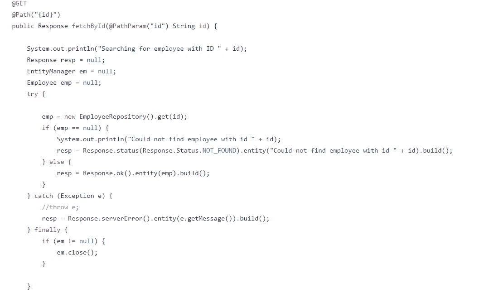

这是测试设置

# 试验

## 单元测试

应用程序中有两个不同的单元测试使用 Maven Surefire 插件

*   使用内存/嵌入式( **Derby** )数据库:这是使用`mvn test`调用的
*   使用(远程)Oracle 数据库云服务实例:通过使用 pom.xml 中的特定概要文件激活该测试，并使用`mvn test –Pdbcs-test`执行该测试

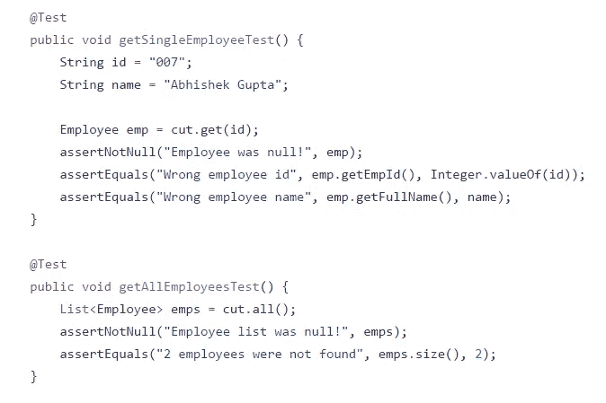

pom.xml 摘录

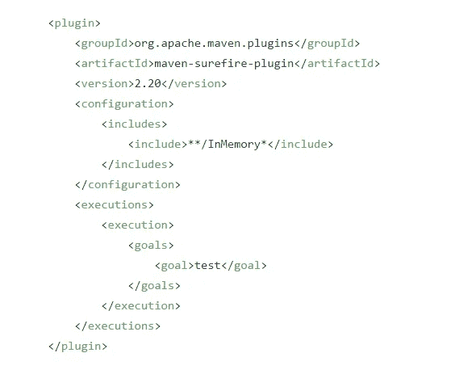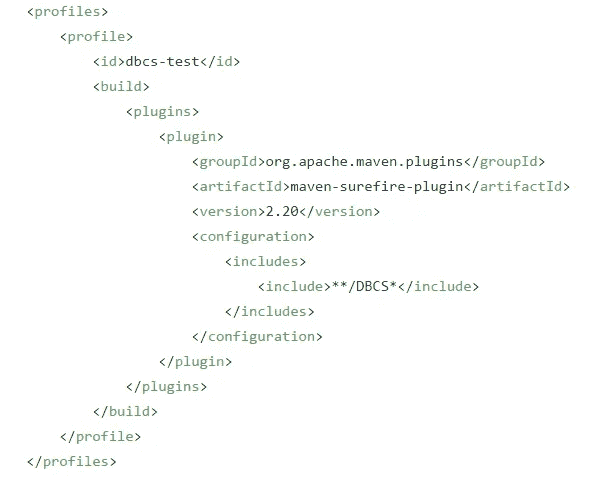

## 整合测试

除了单元测试，我们还有一个集成测试层，使用 Maven 故障保护插件来处理

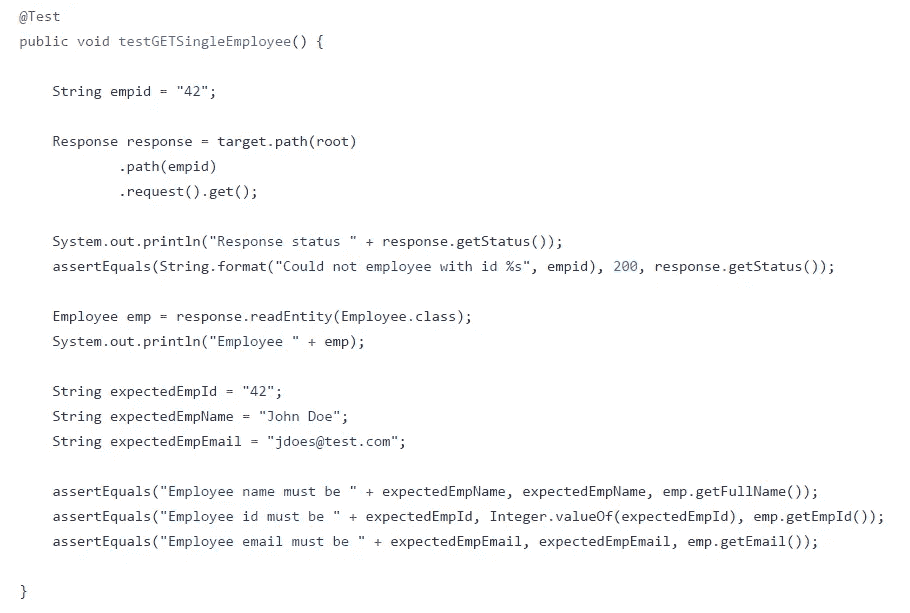

由`mvn integration-test`或`mvn verify`调用

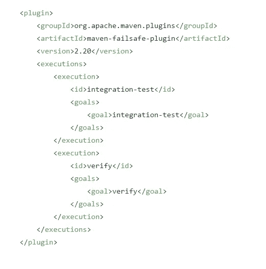

# 包装

它是用 Maven Shade 插件(fat JAR)和 Maven assembly 插件(用`manifest.json`创建一个 zip 文件)处理的

# Oracle 开发人员云服务配置

在我们深入了解细节之前，让我们先从较高的层面了解一下如何进行设置

## 项目和代码库创建

请参考开发者云服务博客中的[跟踪 JUnit 测试结果中的项目和代码库创建部分，或者查看产品](https://community.oracle.com/community/cloud_computing/oracle-cloud-developer-solutions/blog/2016/10/05/junit-testing-using-oracle-developer-cloud)[文档](http://docs.oracle.com/cloud/latest/devcs_common/CSDCS/GUID-3317B279-A9C0-4566-A289-BD651A89D7B5.htm#GUID-7B30C8EC-6CDA-4F14-9791-8AE3BB3E8343)了解更多细节

## 在 Git 存储库中配置源代码

[将项目](http://docs.oracle.com/cloud/latest/devcs_common/CSDCS/GUID-B4C03296-8497-4356-8C74-2031D1FB96FC.htm#CSDCS-GUID-A33E83CE-845C-4393-8C93-936527033715)从您的本地系统推送到您刚刚创建的开发人员云 Git repo。我们将通过命令行来完成，您所需要的就是在您的本地机器上安装 Git 客户端。你可以使用 Git 或者任何你选择的工具

```
cd <project_folder> //where you unzipped the source code git init git remote add origin <developer_cloud_git_repo>  
//e.g. [https://john.doe@developer.us.oraclecloud.com/developer007-foodomain/s/developer007-foodomain-project_2009/scm/sample.git//john.doe@developer.us.oraclecloud.com/developer007-foodomain/s/developer007-foodomain-project_2009/scm/sample.git](https://john.doe@developer.us.oraclecloud.com/developer007-foodomain/s/developer007-foodomain-project_2009/scm/sample.git//john.doe@developer.us.oraclecloud.com/developer007-foodomain/s/developer007-foodomain-project_2009/scm/sample.git) git add . git commit -m "first commit" git push -u origin master  //Please enter the password for your Oracle Developer Cloud account when prompted
```

一旦完成，我们现在可以开始配置我们的**构建**

*   ***管道*** 被分成多个 ***阶段*** ，每个阶段对应一个构建
*   这些单独的阶段/构建然后被缝合在一起，以创建一个端到端的测试流程。让我们探索每个阶段及其相应的构建配置

# 阶段

## 单元测试:第一部分

JPA 逻辑使用嵌入式 Derby 数据库进行测试。它链接到我们推送代码的 Git repo，还连接到 Oracle Maven 存储库

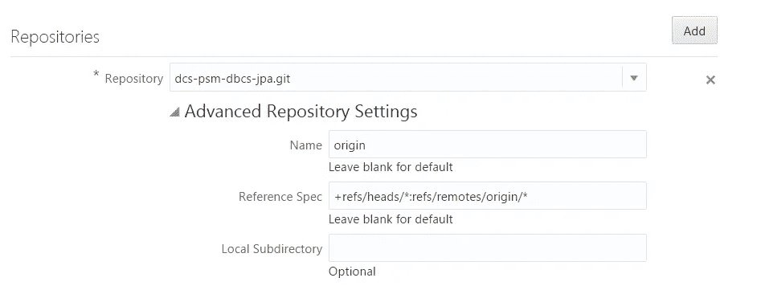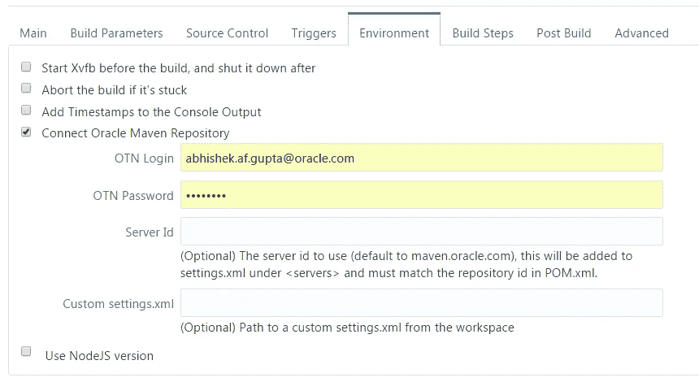

构建步骤调用 Maven

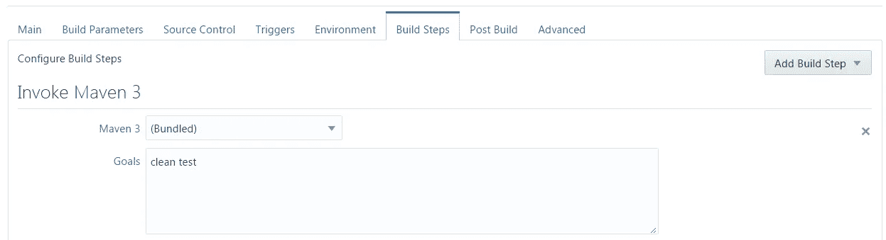

**发布**-构建步骤

*   调用管道中的下一个作业
*   归档测试结果并启用 JUnit 测试报告可用性

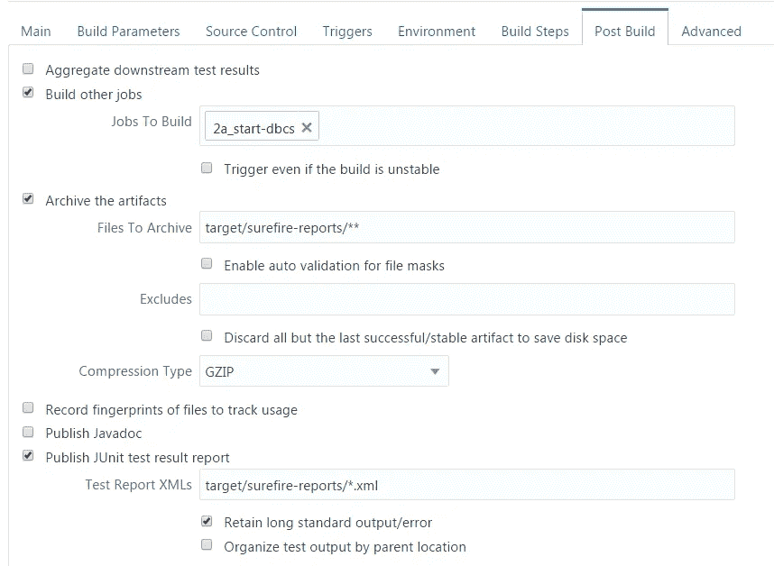

## 引导 Oracle 数据库云服务

*   这个阶段利用 **PSMcli** 首先启动 Oracle 数据库云服务，然后，
*   SQLcl 来创建表并加载测试数据。它由前一个作业调用

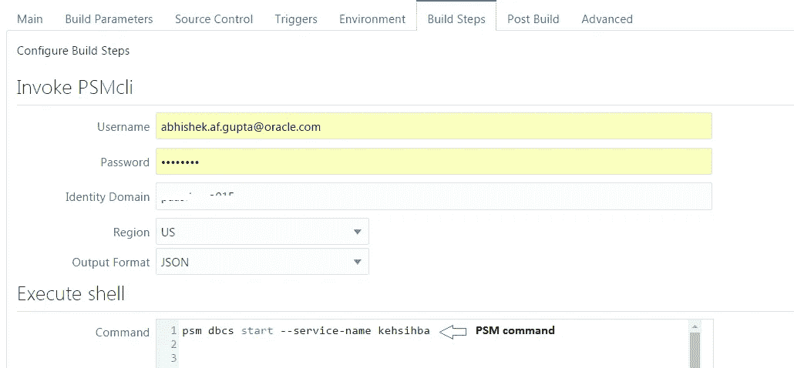

请注意，PSM 命令本质上是**异步**的，它返回一个**作业 ID** ，您可以进一步使用它(在 shell 脚本中)来轮询作业的状态

下面是这样一个脚本的例子

```
VALUE=`psm dbcs stop --service-name test` echo $VALUE #Split on ':' which contains the Job ID on the right side of : OIFS=$IFS IFS=':' JSONDATA=${VALUE} #trying to skip over the left side of : to get the JobID COUNTER=0 for X in $JSONDATA do   if [ "$COUNTER" -eq 1 ]   then   #clean string, removing leading white space and tab   X=$(echo $X |sed -e 's/^[ \t]*//')   JOBID=$X   else   COUNTER=$(($COUNTER+1))   fi done echo "Job ID is "$JOBID #Repeat check until SUCCEED is in the status PSMSTATUS=-1 while [ $PSMSTATUS -ne 0 ]; do CHECKSTATUS=`psm dbcs operation-status --job-id $JOBID`   if [[ $CHECKSTATUS == *"SUCCEED"* ]]   then   PSMSTATUS=0     echo "PSM operation Succeeded!"   else   echo "Waiting for PSM operation to complete"   fi   sleep 60 done
```

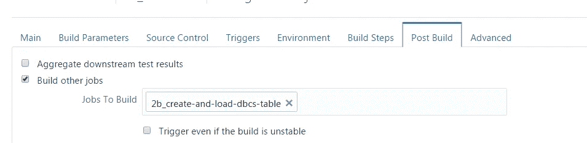

下面是填充 Oracle 数据库云服务表的 SQL 配置

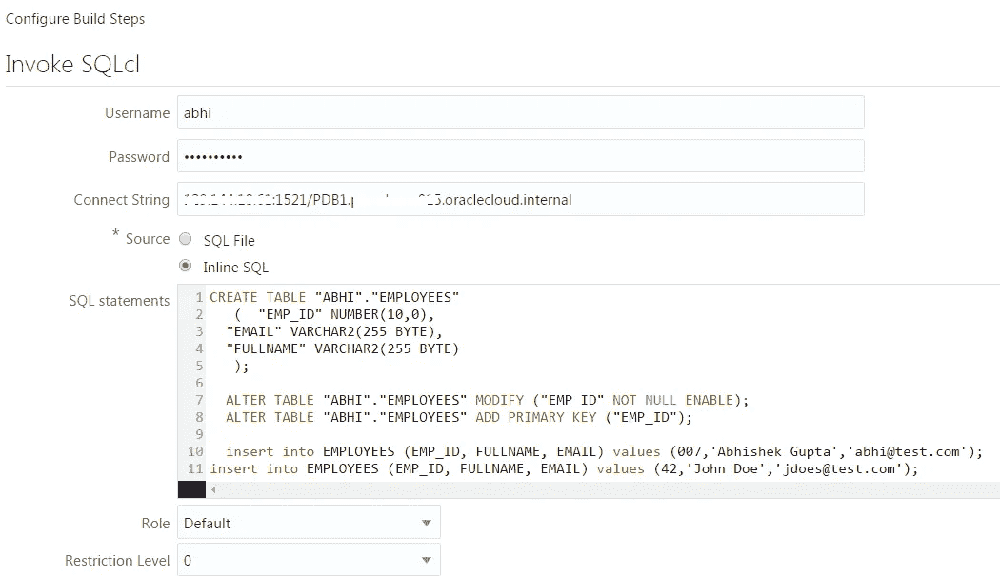

## 单元测试:第二部分

*   对我们刚刚引导的 Oracle 数据库云服务实例运行测试
*   触发应用程序部署(到 Oracle 应用程序容器云)
*   和前面的工作一样，这也链接到 Git repo 并连接到 Oracle Maven 存储库

测试代码的某些值作为参数传入

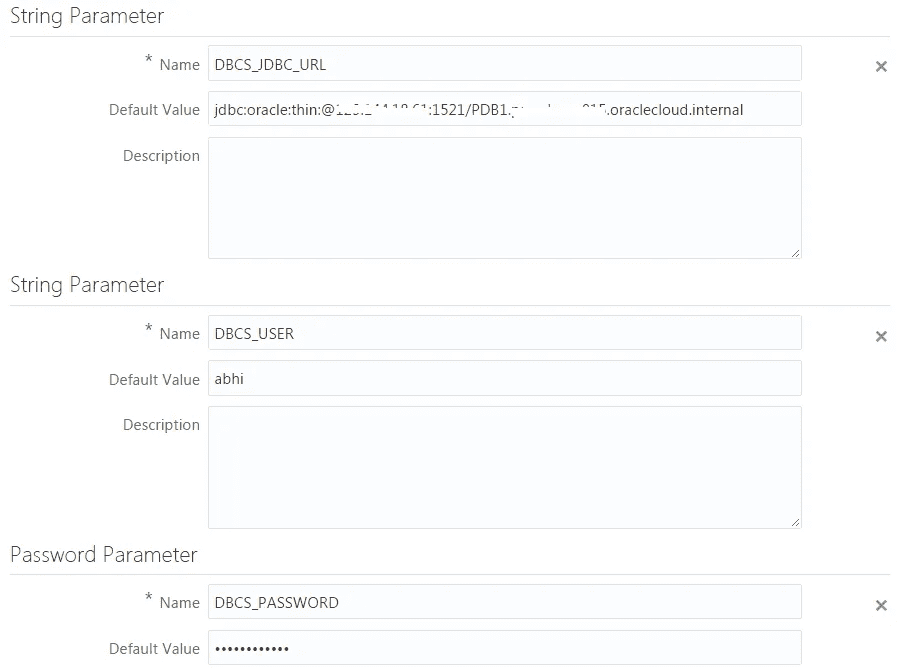

构建步骤包括调用 pom.xml 中定义的特定(Maven)概要文件

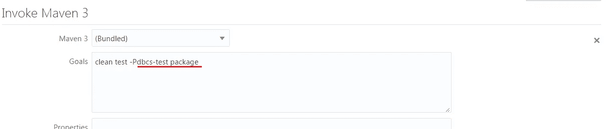

构建后部分做了很多事情

*   调用管道中的下一个作业
*   归档部署工件(在本例中，是 ACCS 的 ZIP 文件)
*   存档测试结果并提供测试报告
*   调用应用程序容器云的**部署**步骤

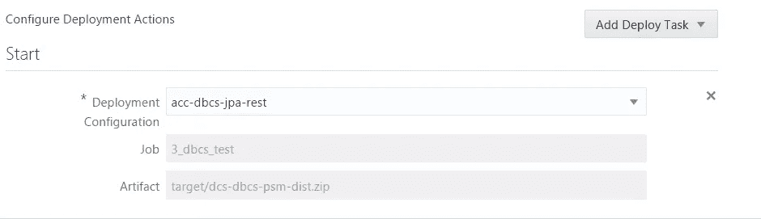

## 整合测试

既然我们已经执行了单元测试，并且部署了我们的应用程序，现在是时候对实际应用程序执行集成测试了。在这种情况下，我们测试应用程序公开的 REST API

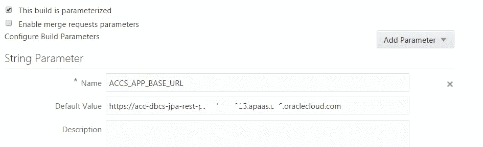

构建步骤调用 Maven 目标

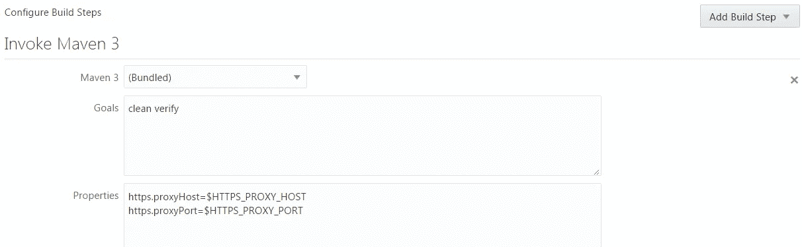

我们使用 HTTPS **代理**从 Oracle 开发人员云构建机器内部访问外部 URL(本例中是 ACC 应用程序)

Post build 部分调用两个后续的作业(它们都可以并行运行)以及测试结果存档

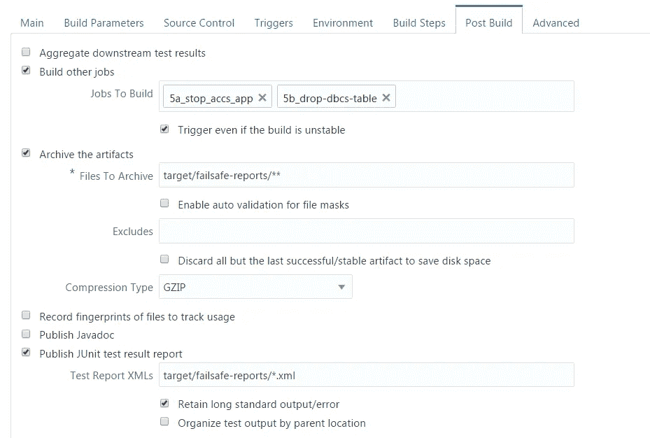

## 拆毁

*   PSMcli 用于停止 ACCS 应用程序，并与另一个使用 SQL 清理 Oracle 数据库云中数据的作业并行运行(删除表)
*   之后，调用最后一个拆除作业，关闭 Oracle 数据库云服务实例(再次使用 PSMcli)

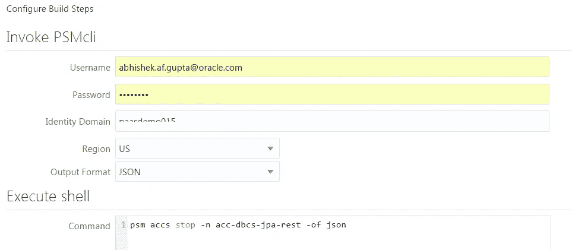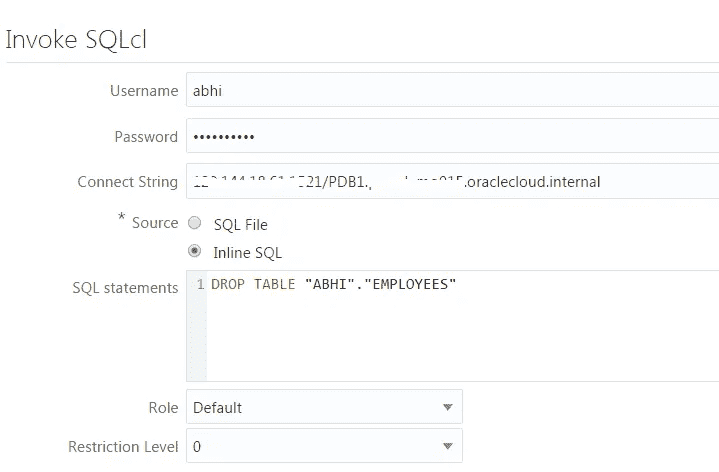

最后，关闭 Oracle 数据库云服务实例

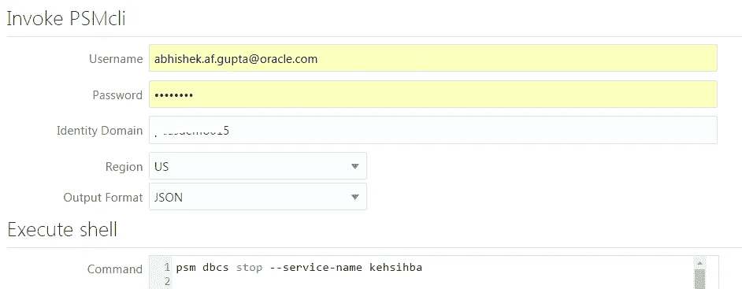

# 总回忆…

*   **将管道分成阶段**并使用**构建**作业来实现它们——粒度的选择由您决定，例如，您可以在同一个作业中调用 **PSMcli** 和**SQL**步骤
*   将**基础设施**(云服务)视为**代码**并**从您的管道内管理**它们——开发人员云通过 PSMcli 集成使跨越整个 Oracle PaaS 平台变得容易

> 本文表达的观点是我个人的观点，不一定代表甲骨文的观点