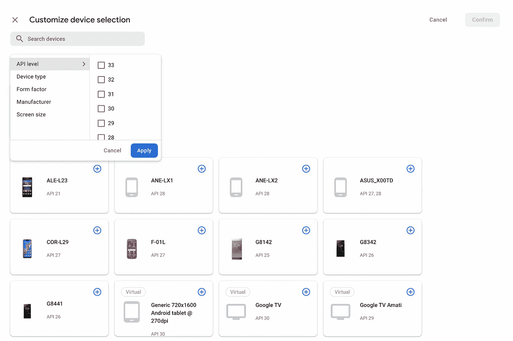
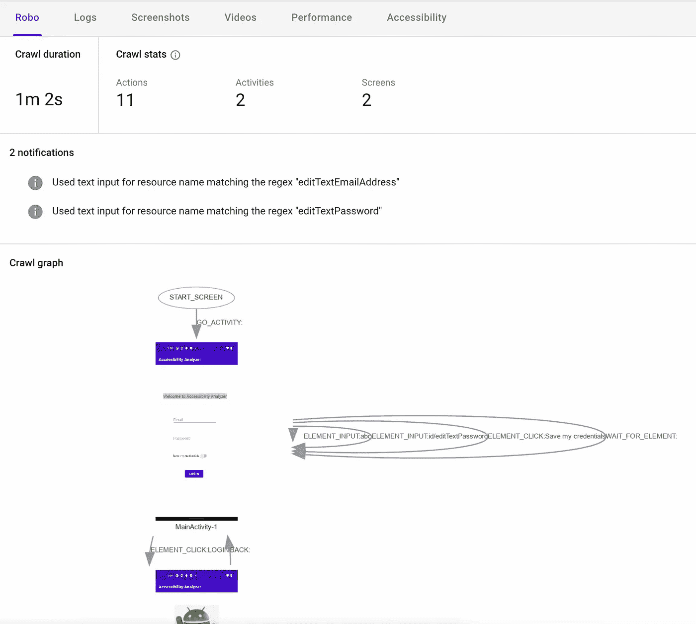

# Android 应用的自动化可访问性测试

> 原文：<https://medium.com/walmartglobaltech/automated-accessibility-testing-for-android-apps-57f9fe2f6dde?source=collection_archive---------8----------------------->

Image source: [https://www.flickr.com/photos/lwr/285539676](https://www.flickr.com/photos/lwr/285539676)

应用程序的可访问性意味着不同能力的人可以像没有残疾的人一样访问相同的信息。

对你的应用程序的可访问性分析可以揭示新的机会，使你的应用程序更容易被更广泛的受众访问和使用。这可以通过[辅助功能扫描仪](https://developer.android.com/guide/topics/ui/accessibility/testing#accessibility-scanner)应用程序手动扫描应用程序屏幕来完成。然而，自动化这个过程有助于覆盖我们在手动可访问性分析中可能错过的所有领域。Firebase test lab 帮助我们解决了这个问题，在没有任何人工干预的情况下，它向我们报告了应用程序中的所有可访问性错误。

因此，让我们开始利用 firebase 测试实验室，使我们的 android 应用程序更容易访问。

**第一步:**登录账号后，进入 firebase 控制台[这里](https://console.firebase.google.com/u/0/)。

**步骤 2:** 要开始创建一个新项目，请点击“添加项目”。然后输入项目名称。

Creating a Firebase project — step 1

您可以选择为项目启用或禁用 Google analytics。

Creating a firebase project — step 2

你的 Firebase 项目已经准备好了。

**步骤 3:** 在左侧导航菜单中，转到“发布&监视器”选项卡下的“测试实验室”。

**步骤 4:** 在“Android Robo 测试”部分，点击“浏览”并上传 apk 或 adb 文件。

Robo Test in Firebase Test Lab

这将在 apk 或 adb 上运行 robo 测试。

**步骤 5:** 在 Robo 测试屏幕上，我们可以看到运行测试的设备，以及测试是通过还是失败。

Robo test screen

Robo test finished and passed

单击设备详细信息查看该设备的测试结果。

单击“可访问性”选项卡查看可访问性问题。

Robo test accessibility results

这里我们看到的可访问性问题是警告、小问题和一些提示。

我们也可以看到这些问题的分类是基于四个可访问性指导原则-

***1-与触摸目标相关的问题:*** 当所考虑的可点击元素的宽度或高度小于“48dp”时，会出现这些问题。

Example of Touch target issue

***2-与低对比度相关的问题:*** 当所考虑的元素的对比度不符合 W3C 给出的对比度准则时，就会出现这些问题。

Example of Low Contrast issue

***3-与内容标签相关的问题:*** 当考虑中的元素没有内容描述或者与同一屏幕上的其他元素具有相同的内容描述(这使得辅助技术难以区分元素)时，就会出现这些问题。

Example of Content Labelling issue

**4- *与实现相关的问题:*** 当所考虑的元素具有此处[列出的实现问题](https://support.google.com/accessibility/android/answer/6376559#zippy=%2Cimplementation)时，这些问题就会出现。

Example of Implementation Issue in EditText element

从截图中，我们可以了解导致违反特定可访问性准则的屏幕和元素。通过查看屏幕截图，我们了解了元素 id、元素的问题以及如何修复。

**如何在不同的设备上开始另一个 Robo 测试？**

**步骤 1:** 在 Firebase 控制台的左侧导航菜单中，单击“测试实验室”。在打开的屏幕上，单击“运行测试”。

Running a new robo test

**步骤 2:** 在步骤 1(配置测试)中，上传 apk 或 adb 文件，并在“选择尺寸”选项卡中选择一个设备。

Selecting a device from the list of available devices.

您还可以根据 API 级别或外形(手机、平板电脑、可穿戴设备)过滤可用设备列表。

Filtering available devices based on API Level

Filtering available devices based on Form factor

之后，我们可以通过单击“+”按钮来选择设备，我们也可以选择各种设备，然后单击“继续”按钮。

Selecting a device

Selecting multiple devices

**如何让 Robo 测试考虑特定用户的用户旅程(或遇到的屏幕)？**

**步骤 1:** 在 Firebase 控制台的左侧导航菜单中，单击“测试实验室”。在打开的屏幕上，单击“运行测试”。

**步骤 2:** 在步骤 1(配置测试)中，上传 apk 或 adb 文件，并在“选择尺寸”选项卡中，选择一个设备并点击附加选项。在“测试帐户凭据”部分，输入用户名资源名称和值以及密码资源名称和值。

Configuring test.

Entering expected values for username and password

这将有助于捕捉登录用户遇到的可访问性问题(如果您的大多数应用程序屏幕都适用于登录用户)或特定用户使用应用程序的情况。

您还可以切换到“Robo”选项卡，了解 Robo 测试爬虫和爬行路径(遍历的屏幕)是否成功使用了所提供的凭证。

Crawl graph of Robo Test

**结论**

利用 Firebase Test Lab 进行自动化可访问性测试已被证明是一种有效而可靠的方法，可以发现 Android 应用程序中潜在的可访问性问题。我们可以在短短几分钟内了解各种潜在的可访问性缺陷，甚至不需要打开应用程序。

这个过程可以用于我们的任何版本的应用程序版本(调试或发布)，这有助于我们在开发周期的早期识别和修复可访问性问题，从而有助于更快地让更多的用户访问应用程序。

Firebase Test Lab 使用可访问性扫描仪应用程序(和[可访问性测试框架](https://github.com/google/Accessibility-Test-Framework-for-Android))来计算可访问性问题列表，因此是一种可靠且经济高效的方法来识别我们应用程序中的可访问性问题。我们可以在这里了解更多关于 Firebase 测试实验室可访问性问题类别[。](https://support.google.com/accessibility/android/answer/6376559#zippy=)

在这篇博客的最后，我鼓励大家尝试利用 Firebase Test Lab 对您的 Android 应用程序进行可访问性分析，以便您可以更快地识别和修复可访问性问题，并构建更好的包容性应用程序。

**参考文献:**
1。[https://developer.android.com/guide/topics/ui/accessibility](https://developer.android.com/guide/topics/ui/accessibility)

2.[https://firebase . Google . com/docs/test-lab/Android/analyzing-results # interpret _ accessibility _ results](https://firebase.google.com/docs/test-lab/android/analyzing-results#interpret_accessibility_results)