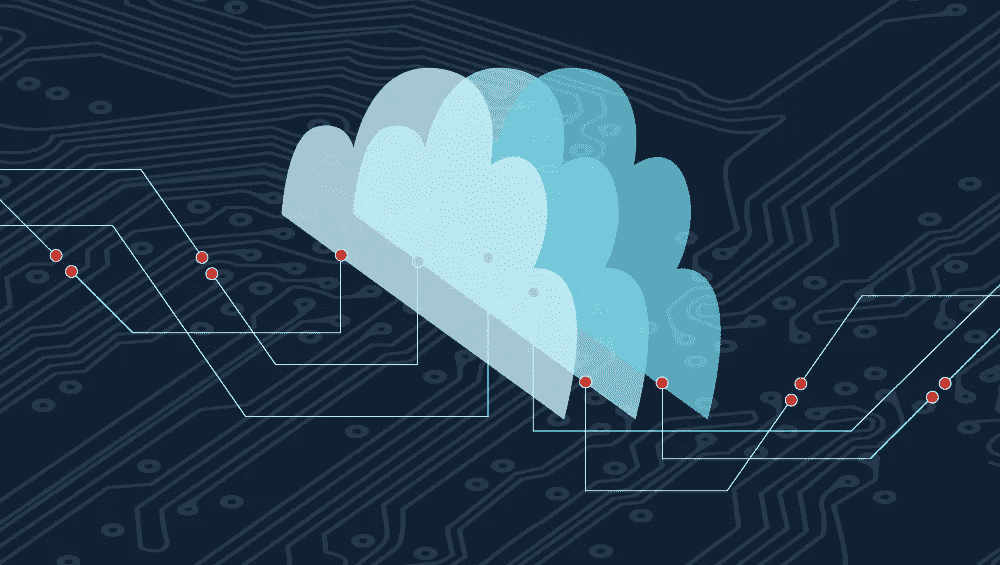
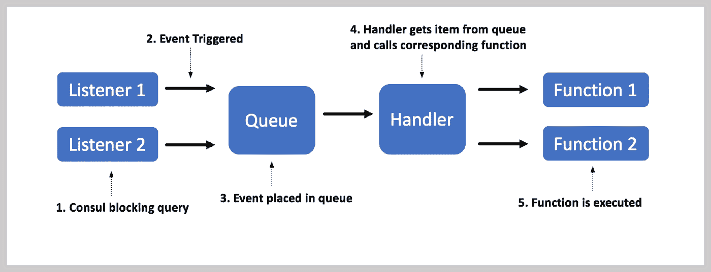
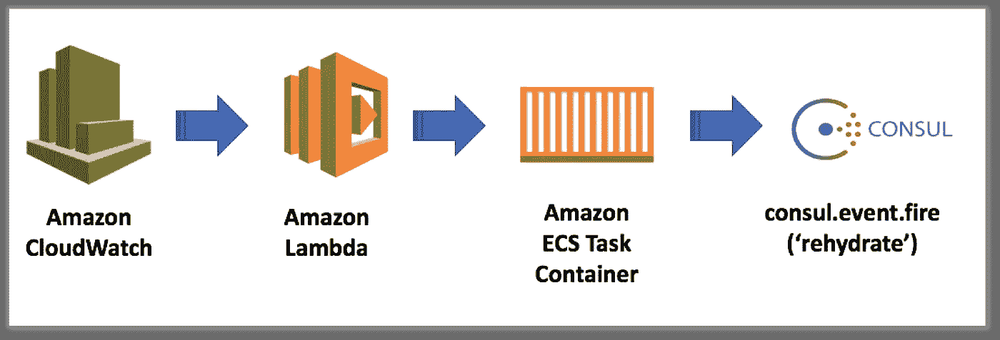

# Consul 集群的自动化和有状态修补

> 原文：<https://medium.com/capital-one-tech/automated-and-statefull-patching-of-consul-clusters-2ec8a066cabb?source=collection_archive---------0----------------------->

## 走向无运营之路

对机器的操作系统进行一致的修补是防止最新的安全漏洞和错误的极其重要的过程。在许多大型组织(如 Capital One)中，每个系列的补丁都作为新的机器映像来应用。更新应用程序所需的全部工作就是销毁旧机器，并使用基于新映像的机器重新创建应用程序。这在无状态系统中很简单，因为可以简单地删除机器并使用最新的补丁重新创建，不会有任何问题。然而，如果您有一个数据库，或者您有任何需要维护的信息，打补丁就变得更具挑战性。在这种情况下，您必须在更新机器之前将数据保存或移动到不同的位置，并最终再次检索数据。这个过程也没有问题，并且可以通过一些配置实现自动化。

然而，许多工程师现在面临的困难是在修补分布式系统时维护状态，在我的情况下，这是一个运行在亚马逊的弹性容器服务(ECS)上的 consul 服务器集群。 [Consul](https://www.consul.io/) 是一个服务发现和健康检查工具，允许 DNS 或 HTTPS 找到它们所依赖的服务，并向健康的主机提供路由。此外，Consul 是一个分布式和高度可用的系统，建立在基于 [Raft](https://raft.github.io/) 的共识协议之上。

运行 Consul 集群的修补机器之所以如此具有挑战性，是因为 Raft 需要大多数服务器持续运行，以保持集群的状态。因此，如果一个集群中有三台 Consul 服务器，那么至少有两台需要一直运行。

这种设置是有好处的。如果一个服务器与其他服务器断开连接，它可以在重新加入集群后重新获得正确的状态(因为大多数服务器会覆盖少数服务器)。虽然这提供了容错和高度可用的系统，但是更新底层机器可能是困难的，因为大多数服务器将总是需要运行。

通常，这是一个非常手动的过程。在删除一个过时的 Consul 服务器之前，创建一个新的 Consul 服务器并将其添加到集群中。对每台服务器重复这一过程，直到不再有过时的服务器。在本演练中，我将演示每当有新的操作系统更新时自动更新 Consul 底层计算机的过程。

*   首先，我们将创建一个框架，使用 Consul 的阻塞调用来监听与启动或移除机器相关的事件。
*   接下来，我们将回顾为了保证动作的一次性执行而使用的锁策略。
*   最后，我们将把我们已经构建的东西与 [CloudWatch](http://docs.aws.amazon.com/AmazonCloudWatch/latest/monitoring/WhatIsCloudWatch.html) 和 [Lambda](http://docs.aws.amazon.com/lambda/latest/dg/welcome.html) 集成起来，以便每当一个更新的[亚马逊机器映像](http://docs.aws.amazon.com/AWSEC2/latest/UserGuide/AMIs.html) (AMI)被创建和注册时，触发整个修补过程。

# 构建一个领事保护框架

本演练的第一部分将介绍计算机创建和删除功能的触发和执行。这些功能本身相当基本。

*   创建函数查看是否有更新的 AMI 映像。如果有，它会创建一台带有新 Consul 服务器的新机器。
*   删除功能查看是否有额外的机器运行 Consul 服务器。如果有，它会删除最旧的机器。

为了避免连续调用函数来检查它们是否应该被执行，我决定使用 [Consul 的阻塞查询](https://www.consul.io/api/index.html)让它们异步运行。这允许函数利用长轮询，并确保它们只在发生变化时才被执行。这简化了逻辑并节省了处理能力和复杂性。

我们将构建一个基本的 *Consul 阻塞框架*，而不是分别为这些函数中的每一个构建阻塞查询，这样在将来，任何数量的 Consul 阻塞查询都可以轻松有效地被合并。该框架将使用 Python 的 [Asyncio](https://docs.python.org/3/library/asyncio.html) 库构建，并使用[decorator](https://wiki.python.org/moin/PythonDecorators)创建 Consul 阻塞查询。装饰器基于咨询阻塞查询创建协程，并将该查询的结果输出到队列中。这确保了事件与函数执行相分离。如果函数失败或超时，这一点很重要，因为事件可以在失败时放回队列中，确保它最终会被执行。除了队列之外，还有一个处理程序，它是一个协程，轮询新事件的队列并调用相应的函数。

完整的流程如下图所示。

现在，可以添加任意数量的 Consul 阻塞查询，这些查询可以对应于 Consul 中的各种操作。下面是一个我如何设置创建和删除功能的例子——这些功能被称为*“向上旋转”*和*“向下旋转”。* Spin up 创建一个协程，等待查询***consul . event . list(name = consul-re hydrate)***，当调用一个名为***consul-re hydrate***的事件时，该查询被触发。降速等待***consul . catalog . service(service = Consul-dashboard)***及其在***Consul-dashboard***服务发生变化时触发(与 Consul 服务器数量有关)。

最后，这些函数的逻辑只需添加到异步定义中，并在相应的事件被触发时由处理程序调用。

这种方法的一个缺点是，如果运行该系统的机器出现故障，则不能保证事件能够运行。为了增加弹性，这个系统应该在多台机器上运行。然而，现在我们冒着每个函数被多次运行的风险，这会导致太多的新机器被创建或破坏。为了避免这种情况，并尽可能接近一次性执行，我们将使用 Consul 内置的锁定功能。

# 锁定策略

通过在多台机器上运行阻塞查询，我们可以实现至少一次执行。然而，我们希望避免在同一个事件上多次运行该操作，这正是锁发挥作用的地方。

当机器之间的状态和时间可能变化时，在分布式系统中实现锁是非常困难的。幸运的是，领事有一个易于使用的[锁定机制](https://www.consul.io/docs/commands/lock.html)内置于其 KV 商店。每个处理程序在执行与事件相关的函数之前都会尝试解除锁定。如果当前没有锁被占用，那么第一个处理程序将占用它，并用它唯一的会话 ID 更新它。所有后续处理程序都将收到锁定响应，并且不会执行该操作。

但是，如果第一个处理程序失败，就不能保证动作已经执行。为了确保动作已经被执行，我们可以简单地在动作完成时实现一个收据功能。现在，其他处理程序将在从队列中移除事件并继续处理下一个事件之前等待回执。可能出现的一个问题是，如果操作失败，并且收据从未被发送，那么其他处理程序将无限期地等待。因此，我们可以为执行操作的处理程序和等待接收的处理程序设置生存时间(TTL)。如果处理程序在其 TTL 期间未能完成操作，那么它将被销毁，锁现在可以自由地被另一个处理程序获取。

虽然操作不能保证只执行一次，因为如果所有三个处理程序都被销毁，操作就会失败，但是如果发生这种情况，那么操作本身或实际集群内部的逻辑可能会出现更大的问题。您还可以通过添加任意数量的额外处理程序来增加弹性。

# Lambda 点火咨询事件

本演练的最后一部分将集中在每当注册新的更新 AMI 时触发 Consul 创建。这是通过基于 ***RegisterImage*** 事件创建一个新的 CloudWatch 事件来实现的。这个事件触发了一个 Lambda，它将触发一个事件 ***领事-再水合*** 领事。

这里棘手的部分是如何在不知道实例 IP 地址或不暴露 Consul 端口的情况下，在 ECS 集群中触发 Consul 事件。我们可以通过创建一个 ECS 任务来解决这个问题，该任务使用 fire event 命令在集群中启动一个 Consul 容器(它只是执行 fire event 命令，然后删除该容器)。唯一需要的变量是 ECS 集群名称，它作为环境变量提供给 Lambda 函数。

到目前为止，我们已经设计了一个灵活的 consul 阻塞框架，允许任意数量的 consul 查询侦听和等待定义的事件。我们最初创建了两个侦听器，一个用于在更新的 AMI 可用时启动新机器，另一个用于删除过时的机器。然后，我们通过利用 consul 的内置锁定机制来添加分布式锁定功能，从而为该解决方案增加了弹性。最后，我们集成了亚马逊的 Cloudwatch 和 Lambda 服务，以定期触发补丁程序。

剩下要做的就是创建一个 Docker 映像——使用前面提到的 Consul blocking 框架以及创建和删除功能——并将该映像上传到 Docker 注册中心。最后，我们将使用这个映像向 ECS 集群添加三个容器，并创建上面提到的 Lambda 来指向集群。现在，我们已经为所有运行 Consul 的机器安装了自动补丁！通过适当的监控，您的集群现在几乎不需要任何维护操作，并将持续更新最新的安全补丁和软件。您应该能够使用这些步骤和方法来修补任何需要保持状态的分布式系统中的底层机器，同时最大限度地减少所涉及的任何操作。

*披露声明:这些观点是作者的观点。除非本帖中另有说明，否则 Capital One 不属于所提及的任何公司，也不被其认可。使用或展示的所有商标和其他知识产权都是其各自所有者的所有权。本文为 2018*