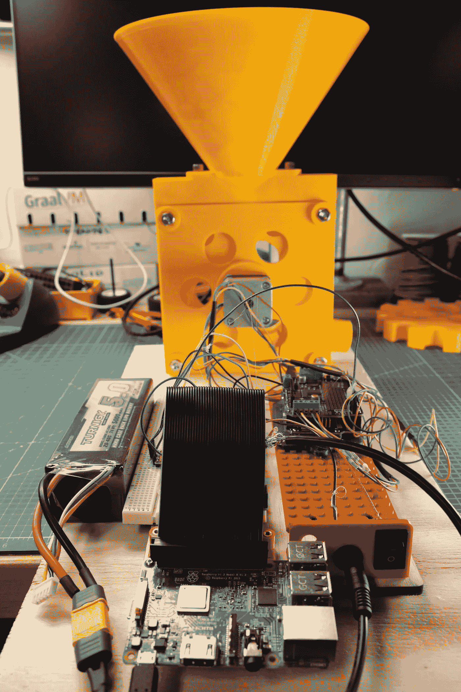
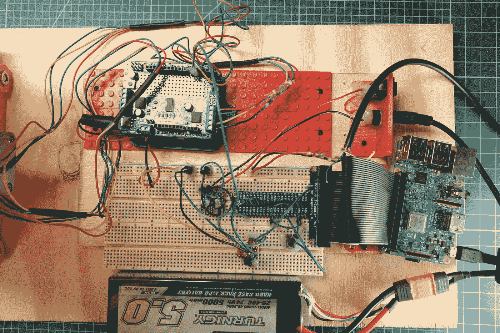

# 自动化糖果自动售货机周末黑客

> 原文：<https://medium.com/oracledevs/automated-candy-dispenser-weekend-hack-17e452be40f1?source=collection_archive---------0----------------------->

克里斯·本森



Automated Candy Dispenser

如果你愿意，你可以在[这里](https://github.com/chrisbensen/chris-blogs/blob/main/WeekendHacks/candy/candy.md)阅读这篇博客文章。

万圣节很快就要到了，我需要一种从远处分发糖果的方式。介绍自动糖果分配器！构建和设置糖果分发器，从它那里运行一个管道到不给糖就捣蛋的人会拿出他们的袋子的地方，用 Oracle Cloud 设置一个[免费计算，从你的手机在任何地方只需移动你的手指就可以分发糖果。在万圣节，你简直不能比这更懒了。](https://tinyurl.com/getoraclecloud)

这个项目将 Raspberry Pi、Arduino、步进电机、3D 打印、Python、REST 都与 Oracle Cloud 粘合在一起。我们也使用热熔胶。

请注意，这是一项正在进行的工作，还需要创建一个东西；搅拌器或糖果会被卡住。我很快就会这样做，但我需要在万圣节前把它出版，这样就有时间来制作你自己的了！

这个项目有三个部分:

1.  这个东西——自动糖果分配器
2.  服务器——云中的 REST 服务器
3.  你的手机——加载网页并带有分发糖果按钮的设备

# **服务器**

这里有很多步骤，所以我就开始钻研了。

1.  注册[免费甲骨文云](https://tinyurl.com/getoraclecloud)
2.  创建一个免费计算实例
3.  记下 IP 地址，从现在开始我将把它称为 ServerIP。任何时候你看到`<serverip>`就用这里记下的服务器 IP 地址替换它。必须对以下文件进行此更改:server/index.html 和 pi/candy.py。</serverip>
4.  使用菜单，单击虚拟云网络，然后单击创建的 VCN。
5.  现在，单击 VCN 左侧导航栏上的安全列表。
6.  点击默认安全列表。
7.  这里您需要打开端口 80。单击+另一个入口规则，并添加以下值，如下所示:

源类型:CIDR
源 CIDR: 0.0.0.0/0
IP 协议:TCP
源端口范围:所有
目的端口范围:80
点击底部添加入口规则。

7.这里您需要打开端口 80。单击+另一个入口规则，并添加以下值，如下所示:

来源类型:CIDR
来源 CIDR: <您的个人 IP 地址> /32
IP 协议:TCP
来源端口范围:全部
点击底部添加入口规则。

8.打开一个本地终端，通过 SSH 进入计算实例。

```
ssh opc@<ServerIP>91\. Create firewall rules to allow access to the ports on which the HTTP server listens.sudo firewall-cmd — permanent — zone=public — add-service=http
sudo firewall-cmd — reload
```

9.设置环境并克隆代码:

```
pip install requests
git clone [https://github.com/oracle-devrel/weekend-hacks.git](https://github.com/oracle-devrel/weekend-hacks.git)
cd weekend-hacks/candy/server
sudo python3 server.py&
```

如果您希望它在启动时自动运行，请这样做([从这些方向]([https://www . the geekdiary . com/centos-rhel-7-how-to-make-custom-script-to-run-automatically-during-boot/](https://www.thegeekdiary.com/centos-rhel-7-how-to-make-custom-script-to-run-automatically-during-boot/)):

```
sudo nano /etc/systemd/system/candy.service
```

将此复制到文件的内容中:

```
[Unit]
Description=Description for sample script goes here
After=network.target[Service]
Type=simple
ExecStart=/home/opc/candy/weekend-hacks/candy/server/server.py
TimeoutStartSec=0[Install]
WantedBy=default.target
```

启用 systemd 服务单元。

10.重新加载 systemd 进程以考虑新创建的 sample.service 或每次修改 sample.service 时。

```
systemctl daemon-reload
```

11.使该服务在重新启动后自动启动。

```
systemctl enable sample.service
```

12.启动服务。

```
systemctl start sample.service
```

13.重新启动主机，以验证系统启动期间脚本是否按预期启动。

```
systemctl reboot
```

server.py

```
#!/usr/bin/python3
from http.server import BaseHTTPRequestHandler, HTTPServer
import time
import json
from socketserver import ThreadingMixIn
import threading
import requestshostName = "0.0.0.0"
serverPort = 80speed = 0
status = 'green'
gimme = Falseclass Handler(BaseHTTPRequestHandler):def do_GET(self):
        global status
        global speed
        global gimme# curl http://<ServerIP>/index.html
        if self.path == "/":
            print('running server...')# Respond with the file contents.
            self.send_response(200)
            self.send_header("Content-type", "text/html")
            self.end_headers()
            content = open('index.html', 'rb').read()
            self.wfile.write(content)# curl http://<ServerIP>/candy
        elif self.path.upper() == "/candy".upper():
            self.send_response(200)
            self.send_header("Content-type", "text/html")
            self.end_headers()
            body = {'status': status}
            self.wfile.write(bytes(json.dumps(body), "utf8"))
            gimme = True# curl http://<ServerIP>/query
        elif self.path.upper() == "/query".upper():
            self.send_response(200)
            self.send_header("Content-type", "text/html")
            self.end_headers()
            body = {'status': status, 'speed': speed}
            self.wfile.write(bytes(json.dumps(body), "utf8"))else:
            self.send_response(404)returndef do_POST(self):
        global speed
        global status
        global gimme# refuse to receive non-json content
        if self.headers.get('content-type') != 'application/json':
            self.send_response(400)
            self.end_headers()
            returnlength = int(self.headers.get('content-length'))
        message = json.loads(self.rfile.read(length))response = 0
        body = {}# curl -X POST -H "Content-Type: application/json" -d '{"speed":5}' http://<ServerIP>/auto
        if self.path.upper() == "/auto".upper():
            response = 200
            body = {'status': 'true'}
            speed = message['speed']
            print(speed)# curl -X POST -H "Content-Type: application/json" -d '{"status":"green"}' http://<ServerIP>/whattodo
        elif self.path.upper() == "/whattodo".upper():
            status = message['status']
            response = 200
            body = {'gimme': gimme}
            gimme = Falseself.send_response(response)
        self.send_header("Content-type", "application/json")
        self.end_headers()
        self.wfile.write(bytes(json.dumps(body), "utf8"))class ThreadedHTTPServer(ThreadingMixIn, HTTPServer):
    """Handle requests in a separate thread."""if __name__ == "__main__":
    webServer = ThreadedHTTPServer((hostName, serverPort), Handler)
    print("Server started http://%s:%s" % (hostName, serverPort))try:
        webServer.serve_forever()
    except KeyboardInterrupt:
        passwebServer.server_close()
    print("Server stopped.")
```

# **那件事**


The CAD Model

要制作这个头部到 [Thingiverse](https://www.thingiverse.com/thing:5030261) 下载 STL 文件，用你的 3D 打印机打印它们，并得到所有需要的零件清单。

零件
- (2) 1/4" x 1/2 "螺栓
- (4) 1/4" x 3/4 "螺栓
- (6) 1/4 "螺母
- (4) M3 x 8 螺栓
- (1)步进电机
-(1)Arduino Leonardo/Uno
-(1)Rasbperry Pi 4
-(2)木螺钉(我使用了螺纹嵌件和 2 个 1/4 "螺栓)
- (1) Adafruit 电机控制器 v2【T12

工具
-热熔胶枪
-烙铁
-六角工具

## **圆周率**

打开命令提示符，键入运行以下命令:

```
sudo raspi-config
```

进入“接口选项”
，在每个子菜单中启用 I2C 和 SPI。

打开命令提示符，键入运行以下命令:

```
sudo apt update sudo apt upgrade
sudo apt install rpi.gpio
sudo restart
```

打开命令提示符，键入运行以下命令:

```
pip3 install requests
git clone [https://github.com/oracle-devrel/weekend-hacks.git](https://github.com/oracle-devrel/weekend-hacks.git)
cd weekend-hacks/candy/pi
sudo nano /etc/rc.locally
```

向下滚动到 rc.locally 的底部，并在末尾之前添加以下内容。
**注意**不要忘记在末尾加上 *&* 。

```
sudo python3 /home/pi/weekend-hacks/candy/pi/candy.py &
sudo python3 /home/pi/weekend-hacks/candy/pi/shutdown.py &
```

candy.py

```
#!/usr/bin/python3
import RPi.GPIO as GPIO
import time
import socket
import requests
import jsonoutPin = 16GPIO.setmode(GPIO.BCM)
GPIO.setup(outPin, GPIO.OUT)time.sleep(2)
GPIO.output(outPin, GPIO.LOW)GPIO.cleanup()GPIO.setmode(GPIO.BCM)
GPIO.setup(outPin, GPIO.OUT)while True:
    time.sleep(1)try:
        data = {'status': 'green'}
        headers = {'Content-type': 'application/json'}
        response = requests.post('http://<ServerIP>/whattodo', data = json.dumps(data), headers = headers)
        print(response)if response.json()["gimme"] == True:
            print("launch candy")
            GPIO.output(outPin, GPIO.HIGH)
            time.sleep(10)
            GPIO.output(outPin, GPIO.LOW)
            time.sleep(1)
            print('good')
            time.sleep(1)except socket.error:
        print("error")GPIO.cleanup()
```

关机. py

```
#!/usr/bin/python3
import time
import sys
import RPi.GPIO as GPIO
import osshutdownPin = 25GPIO.setmode(GPIO.BCM)
GPIO.setup(shutdownPin, GPIO.IN, pull_up_down=GPIO.PUD_UP)def Shutdown(channel):
    print("Shutting Down")
    time.sleep(5)
    os.system("sudo shutdown -h now")

GPIO.add_event_detect(shutdownPin, GPIO.FALLING, callback=Shutdown, bouncetime=2000)while True:
    time.sleep(1)
```

延伸阅读:[https://www . quartok nows . com/page/raspberry-pi-shut down-button](https://www.quartoknows.com/page/raspberry-pi-shutdown-button)

## 阿尔杜伊诺

Arduino 的速度非常快。插入 USB，打开令人惊讶的简单和工程，但仍有一些需要 Arduino IDE，上传这个草图，然后继续进行项目的其余部分。显然，你还需要在这篇文章周围点缀一些其他的东西，但它们都应该在这里。如果没有，就问我，我会修复错误或带你走一遍。

延伸阅读:[https://www . instructables . com/Understanding-the-Pull-up-Resistor-With-Arduino/](https://www.instructables.com/Understanding-the-Pull-up-Resistor-With-Arduino/)

```
#include <Adafruit_MotorShield.h>
#include <Wire.h>
#include <Servo.h>int servoPin = 6;
int inPin = 5;int i2cAddress = 0x8;
Adafruit_MotorShield shield = Adafruit_MotorShield();
Adafruit_StepperMotor *motor = shield.getStepper(200, 2);
Servo servo;void setup() {
  Serial.begin(9600);// pin, min pulse width in microseconds, max pulse width in microseconds
  servo.attach(servoPin, 0, 180);// create with the default frequency 1.6KHz
  if (!shield.begin()) {
    Serial.println("Could not find Motor Shield. Check wiring.");
    while (1);
  }

  Serial.println("Motor Shield found.");
  motor->setSpeed(5);  // rpm
  pinMode(inPin, INPUT);
  delay(3000);
  Serial.println("starting");
}int val = 0;
int steps = 16;void loop() {
  delay(1000);
  val = digitalRead(inPin);
  if (val == HIGH) {
    Serial.println("on");
    //motor->step(steps, FORWARD, SINGLE);
    //motor->step(50, FORWARD, MICROSTEP);
    motor->step(steps, FORWARD, MICROSTEP);
  } else {
    Serial.println("off");
  }
}
```

## 接线



Arduino 引脚 5 ->线路电平 Hi Rx 1
阿达果 Arduino 电机控制器帽子 V2 + - > 5v +
阿达果 Arduino 电机控制器帽子 V2-->5v-

5v+-->电机控制器+
5v-- >电机控制器-
电机控制器+ - > Arduino +在千斤顶上
电机控制器-->Arduino-在千斤顶上

Pi 3.3v ->线路电平 Lo LV
Pi 引脚 16 - >线路电平 Lo Rx1
Pi 引脚 25 - >按钮引脚 1
Pi GND - >按钮引脚 2

线路电平低 GND -> 5v -
线路电平高 GND - > 5v -

电压调节器 VIN -> 12v +
电压调节器 GND - > 12v -
电压调节器 OUT - > 5v +
电压调节器 GND - > 5v -

# 结论

这完全是个骗局。它完成了工作，是构建一个糟糕的 python REST 服务器来控制运行 Pi 和 Arduino 的 edge/IoT 设备的一个很好的例子。但是很有趣！这才是最重要的。当我在万圣节晚上把烟斗放进骷髅里，然后穿上我的骷髅杰克服装时，也会让很多孩子开心。

我将继续发展和完善这个项目，所以请继续关注更多…