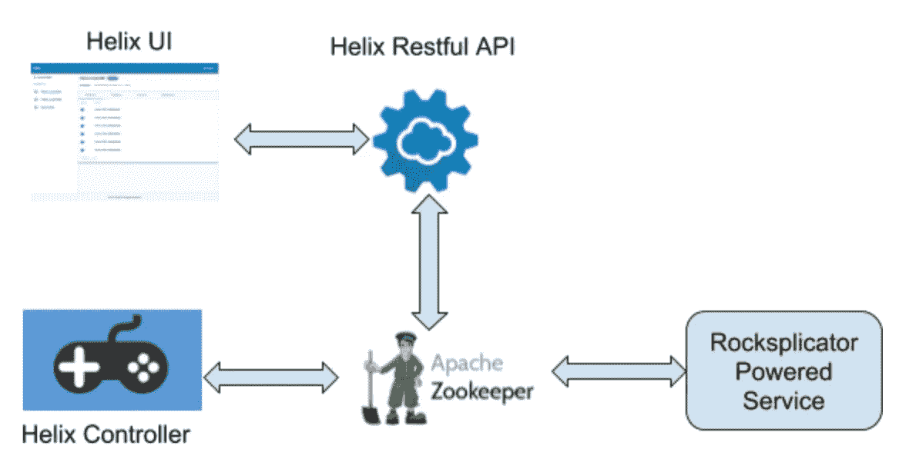

# Rocksplicator 的自动化集群管理和恢复

> 原文：<https://medium.com/pinterest-engineering/automated-cluster-management-and-recovery-for-rocksplicator-f1f8fd35c833?source=collection_archive---------2----------------------->

刘波|工程经理，服务系统团队

## Pinterest 上的摇滚歌手

Rocksplicator ( [github](https://github.com/pinterest/rocksplicator) )是 Pinterest 在一年半前开源的。它旨在解决在商用硬件上构建大规模在线有状态数据系统的常见问题，如 RocksDB 复制和请求路由。关于 Rocksplicator 如何解决这些问题的技术细节可以在博客文章[中找到，开源 Rocksplicator 是一个实时 RocksDB 数据复制器](/@Pinterest_Engineering/open-sourcing-rocksplicator-a-real-time-rocksdb-data-replicator-558cd3847a9d)。

自从两年前第一个 Rocksplicator 驱动的系统开始在生产中运行以来，一个工程师小组在 Rocksplicator 的基础上构建了九个不同的系统。它们现在运行在数千台主机上，在生产中每秒处理数千万次查询。这些系统是支持 Pinterest 产品的关键组件。以下是这些关键组件如何驱动 Pinterest 产品的几个例子:

*   他们中的一些人集体将 Pinterest newsfeed 从基于推的模式改为基于拉的模式，并使其实时响应用户的行为。
*   其中一个系统每秒产生超过 5000 万个在线 ML 推理，以支持广告、新闻提要、相关 pin 等。
*   其他系统正在跟踪站点事件，以进行 Pin 重复数据删除和各种类型的 ML 实时信号。

## 运营负担开始成为一个问题

最初，我们通过手动运行脚本来管理集群。随着 Rocksplicator 开始在越来越多的主机上运行，它很容易出错，并成为团队的一大负担。我们知道是时候为 Rocksplicator 实现自动化集群管理和恢复，以取代原始的脚本驱动方法了。我们构建了一个内部集群管理原型系统，并对现有的开源解决方案进行了一些研究。最终我们决定采用 Apache [Helix](https://helix.apache.org/) ，它是 Linkedin 开源的。这正是我们所寻找的，因为 Helix 被设计为“一个用于分区和复制分布式资源的集群管理框架”。然而，我们找不到太多关于如何将 Helix 应用于主从实时复制存储类系统的详细信息。我们必须在 Helix 邮件列表中提问，查阅 Helix 文档和代码，找出可用的特性，并在 Helix 提供的基础上构建我们自己的逻辑。这篇文章是为了分享我们的经验和教训。

# 整体架构

Figure 1\. Overall Architecture

图一。描述了 Helix 如何与 Rocksplicator powered services 一起工作的整体架构。Zookeeper 位于中心，存储资源映射、配置、螺旋控制器和 Rocksplicator 之间的消息等。所有螺旋组件都是无状态的。这个设计很好，因为它将关键数据管理委托给 Zookeeper，这已经被证明是高度可靠的。Helix controller 持续监控集群中发生的事件，包括配置更改、Rocksplicator 主机的加入和离开等。基于集群的最新状态，Helix controller 计算出资源映射的理想状态，并通过 Zookeeper 向 Rocksplicator 服务发送消息，使集群逐渐进入理想状态。每个 Rocksplicator 主机都与 Zookeeper 保持连接，以便让其他主机知道它的活动状态。同时，它通过 Zookeeper 从 Helix controller 获取消息，并根据收到的消息改变其本地状态。Rocksplicator 对在线可变集群采用主从螺旋状态模型，对批量更新或类似缓存的集群采用在线-离线螺旋状态模型。这篇文章将重点讨论主从模型，因为实现起来更具挑战性。Helix UI 和 Restful API 用于查看集群状态和更改集群配置。

## 将螺旋应用到 Rocksplicator

我们需要解决的第一个问题是，Helix 是 Java 框架，而 Rocksplicator 是 C++。Helix 提供了一个独立的代理，可以作为非 Java 服务和 Helix 之间的桥梁。我们没有采用这种方法，因为它需要仔细设计服务和代理流程生命周期管理。取而代之的是，通过 JNI 将一个 JVM 嵌入到 Rocksplicator 服务进程中来运行 Helix 库。这种单一进程方法比基于代理的解决方案更简单、更可靠。

为了充分利用 Helix 的能力，我们决定以 FULL_AUTO 模式运行它，在这种模式下，Helix 决定每个数据分区的位置和状态。为了在 FULL_AUTO 模式下高效、安全地运行 Rocksplicator 服务，需要设置几个螺旋配置。首先，需要正确设置 DELAY_REBALANCE_ENABLE 和 DELAY_REBALANCE_TIME，以便 Helix 不会过早地将碎片从离线主机上移走。因为在部署期间主机需要暂时离线，所以在主机之间移动数据分区对于类似存储的系统来说是非常昂贵的。另一方面，为了安全起见，当集群中某个分区的可用副本太低时，我们希望覆盖这种行为。因此，我们还需要正确设置 MIN_ACTIVE_REPLICAS。请注意，所有这些配置仅适用于分区移动。当主机脱机时，Helix 可以立即自由地改变分区状态(主、从等),从而最大限度地减少写入失败的次数。另一个重要的配置是 MAX_OFFLINE_INSTANCES_ALLOWED。当离线主机的数量超过这个阈值时，Helix 将被管理的集群置于维护状态，在这种状态下不允许移动分区。这有助于我们在网络分区或软件错误导致服务崩溃等灾难中保护我们的数据。

Rocksplicator 完全根据收到的状态转换消息来更改其本地数据分区的状态。有两种不同的场景会发送“离线->从”消息。一种情况是第一次将分区移动到主机时。另一种情况发生在 Rocksplicator 服务进程为部署而重新启动并重新联机时。不幸的是，Helix 不支持区分这两种场景。Rocksplicator 可以统一处理这两种情况，首先将分区的备份恢复到本地数据库，然后开始从主数据库复制更新。显然，对于第二种情况，这是不必要的。为了解决这个问题，我们在 Rocksplicator 中添加了逻辑来检查本地数据库在从脱机状态更改为从属状态时是否需要重建。这是通过检查本地 WAL 中最近更新所附带的时间戳，并将最新的本地序列号与远程副本上的序列号进行比较来实现的。

Rocksplicator 通常对每个数据分区都有多个副本。当更改本地副本的状态时，Rocksplicator 需要知道系统中其他副本的状态，以便正确设置复制拓扑。例如，当将副本从脱机状态更改为从属状态时，Rocksplicator 需要设置其本地数据库，以便从主服务器或另一个从属服务器(如果不存在主服务器)复制更新。Helix 可能同时改变多个副本的状态，这使得 Rocksplicator 几乎不可能可靠地计算出其他副本的当前状态。为了解决这个问题，我们尝试使用分布式 Zookeeper 锁来同步同一分区的副本的状态转换。不幸的是，仅仅这样还不足以完全解决问题。在 Rocksplicator 进程完成状态转换并释放锁之后，另一个进程可能会进入状态转换处理程序并在 Helix controller 公开状态更改之前获取锁。这种竞争使得在转换处理程序中观察到的远程副本的状态可能是其当前状态或先前状态。我们必须仔细设计 Rocksplicator 中的状态转换逻辑，以适应任何一种情况。

为了提高数据可用性，Rocksplicator 将数据副本分布在不同的可用性区域或放置组中。Helix 有一个很好的概念，叫做拓扑，来帮助我们实现这种数据分布。需要注意的一点是，我们需要更改我们的部署系统，以逐个区域或逐个组地部署 Rocksplicator 服务。没有这种支持，我们只能以非常小的步长进行部署。否则，我们可能会有一些副本数量低于 MIN_ACTIVE_REPLICAS 的分区，这将使 Helix 不必要地带来新的副本，甚至导致数据丢失。

根据 Helix 公开的外部视图，为每个 rocks cluster 集群生成一个分区映射文件。此文件是将流量路由到 Rocksplicator 服务所必需的。我们不使用 Helix Spectator 来路由流量，因为我们有用 Java 以外的语言构建的客户端，并且我们希望重用我们的内部配置传播系统。为了减少服务部署影响，我们从该文件中排除了正在部署/重新启动的主机。

## Pinterest 上的 Helix 管理的 Rocksplicator 集群

Helix managed Rocksplicator 服务已经在生产中运行了几个月，这极大地减轻了团队的操作负担和我们犯的操作错误。我们正在将其余的 Rocksplicator 服务迁移到它上面。通过将其与 [AWS ASG](https://docs.aws.amazon.com/autoscaling/ec2/userguide/AutoScalingGroup.html) (自动扩展组)结合，我们可以自动替换有状态集群中的死主机。要向集群添加更多容量，我们只需突破 ASG 限制。我们对 Rocksplicator 采用 Helix 的决定非常满意。

鸣谢:我们要感谢 Helix 团队开源了这个伟大的集群管理框架，并在邮件列表中回答了我们的问题。我们还要感谢 Pinterest CMP 团队的 Suli Xu，他为我们的部署系统 [Teletraan](https://github.com/pinterest/teletraan) 添加了分组部署策略。