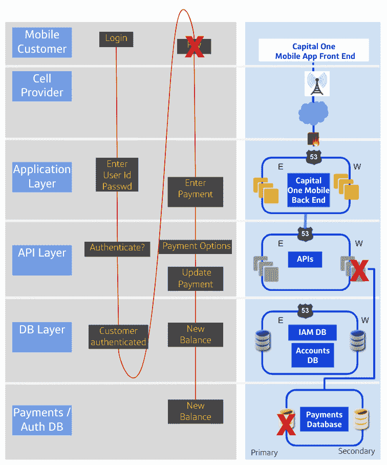
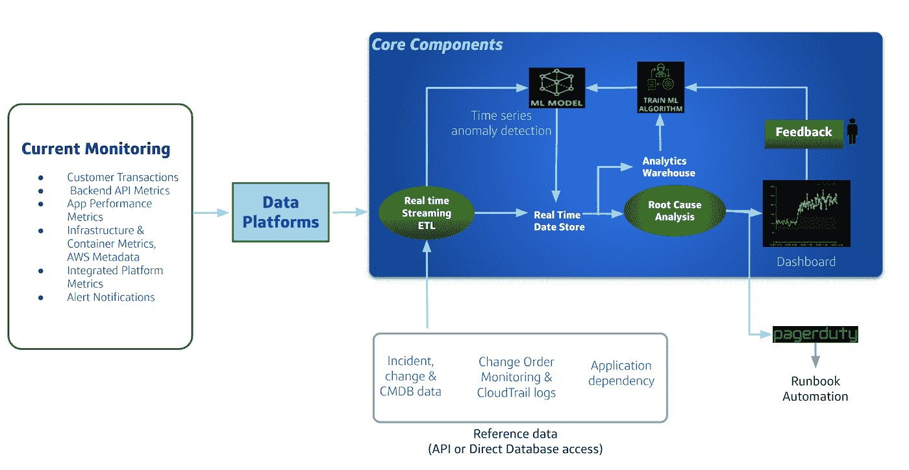

# 应用故障的自动检测、诊断和补救

> 原文：<https://medium.com/capital-one-tech/automated-detection-diagnosis-remediation-of-app-failure-9ee24fb97a35?source=collection_archive---------1----------------------->

## *机器学习如何在 Capital One 实现事故管理自动化*

## *软件工程总监 Arun Natarajan 和技术自动化副总裁 shek har Damle*

东西坏掉了。作为工程师和建筑师，我们努力构建健壮、有弹性的系统，但现代应用程序是复杂的。有时会发生意想不到的事情，失败也会发生。当这种情况发生时，我们必须尽快修复，以便将对客户的影响降至最低。在一个客户期望并且我们通过数字渠道提供 24/7 银行服务的世界里，这一点更加重要。

如今，许多应用程序都会产生大量数据。现代工程实践和工具使我们能够获取这些数据。“修复”已经“崩溃”的应用程序就变成了分析这些数据并根据结果采取行动的一项挑战。由于现代应用程序的复杂性，做到这一点是一项艰巨的任务，可能需要几个主题专家花几个小时来筛选大量数据，以理解它并采取行动。机器学习提供了一个实时做到这一点的机会，为我们如何检测、诊断和补救异常的应用程序行为开辟了一系列全新的可能性。

# 应用程序失败背后的原因可能很复杂

作为美国领先的数字银行之一，提供卓越的数字体验对于我们维护客户的信任和信誉至关重要。像 [Capital One 移动应用](https://www.capitalone.com/applications/mobile/)这样的应用是我们数百万客户金融生活中至关重要的一部分；如果他们不能访问所有的应用程序功能，我们可以看到对信任和可信度的数百万个负面影响；每个受影响的客户帐户一个。

因此，当应用程序(如 Capital One 移动应用程序)出现异常行为时，我们能够迅速恢复对客户的服务，这一点至关重要。认识到这一点后，Capital One 投入了相当大的精力来提高我们管理这些故障的能力，用一个技术术语来说，就是“事故”。我们已经用行业领先的监控工具装备了我们的应用程序，重新调整了我们的组织，并提升了我们的人才技能。我们的应用程序现在比以往任何时候都更有弹性，但我们相信，有了机器学习，我们可以做得更好。

然而，要做到这一点，我们首先需要克服两个挑战。

*   **复杂的互联系统—** 现代基于云的应用程序被设计和构建为一个由 API、微服务、数据库、计算和存储基础设施以及网络组件组成的高度互联的系统。故障可能发生在任何节点，并在整个网络中级联。因此，每当发生任何故障时，多个组件可能会同时出现故障。面临的挑战是快速确定出现故障的源组件。然后，工程团队可以将精力集中在遇到问题的实际组件上，而不是被审查其他组件所分散，这些组件可能错误地显示为故障，但只是问题的症状，而不是实际的问题。
*   **孤岛式数据—** 虽然我们拥有关于生产中的应用和基础架构的前所未有的详细信息，但这些数据中的大部分都是在孤岛中产生的。分析故障通常需要将来自基础设施、应用程序和 API 的大量实时监控和日志数据联系起来。如果这是一项手动任务，您自然会看到解决过程的局限性。

让我们看一下 Capital One 移动应用程序，以便更好地理解我们在现代应用程序中看到的复杂程度。通常，当客户通过 Capital One 移动应用程序支付账单时——从客户的角度来看，这似乎是一个常规流程——会涉及许多步骤。该过程从登录和身份验证开始，包括多层堆栈。然后，支付必须从移动客户端通过互联网服务提供商到达应用层，在那里进入防火墙。出于弹性目的，还在多个区域配置了应用程序基础架构。接下来，请求必须通过另一组负载平衡器，通过 API 网关到达 API 层。然后进入数据库层，在那里存储帐户。从那里，客户请求进入支付授权数据库，在本例中是一个第三方应用程序。

如上图所示，API 和支付数据库的故障可能表现为客户的支付处理失败。在这种情况下，我们不希望我们的工程师不得不手动筛选几十个组件，以确定哪一个是潜在的故障原因。当应用程序表现异常时，时间是至关重要的，这个工作流程花费了工程师大量的时间。此外，如果有多个其他服务使用这些 API，确定根本问题会变得更加复杂。

很容易理解为什么手动诊断应用程序故障具有挑战性。

# 构建实时故障检测和补救平台

但是，如果我们在我们的应用程序之上添加一个智能层，使用一个工具来监控和提取应用程序数据，不仅确定客户无法完成交易，而且确定原因，会怎么样呢？如果 it 部门能够实时做到这一点，并通知适当的工程师以便他们能够采取纠正措施，事故可以在很短的时间内得到解决，从而避免对客户造成更大的影响，并极大地提升客户体验。

要做到这一点，我们需要能够从多个来源流入万亿字节的数据，对其进行集成、实时分析，并以易于理解的方式呈现结果。在 Capital One，我们正在通过在我们的应用程序生成的监控数据流上大规模部署机器学习来实现这一目标。

本质上，我们构建了一个推理引擎，作为我们已经在应用程序中部署的所有监控工具之上的一层。该引擎捕获和集成来自技术堆栈所有层的每个组件的监控数据，并将其与适当的元数据联系起来。然后，使用适合数据流性质的机器学习算法，我们检测异常模式，这些异常模式是应用程序失败的有力指标。这些异常是一个因果模型的输入，该模型可以确定在由相互连接的组件组成的复杂网络中，哪个组件(其中一些组件表现异常，另一些则没有)最有可能是我们在该网络中看到的异常的来源。

例如，我们将告诉我们 API 调用的数量、错误代码和响应时间的度量标准流式传输。我们构建了一种独特的算法来检测每个流的异常，因为每个流中的数据性质不同，需要不同类型的时间序列异常检测模型。异常检测模型提供关于正在发生的故障类型的信息。我们还建立了一个依赖关系图，显示了我们的技术堆栈的所有组件之间的联系。这与异常数据一起被输入到基于[贝叶斯网络](https://en.wikipedia.org/wiki/Bayesian_network)的因果模型中，该模型锁定最有可能导致故障的组件。

但是仅仅检测异常及其根源是不够的。我们还必须使工具易于工程师使用。否则，我们最终只会构建另一个仪表板——好像它们还不够多似的！我们的方法是将其与我们的工程师已经使用的警报工具相集成。当检测到异常时，会根据受影响的应用程序组件向相应的工程师发送一个易于理解的警报。此警报包含一个链接，该链接指向一个直观的 UI，其中包含解决此问题所需的所有信息。UI 显示了哪些组件是有问题的，哪些指标是无序的，一个依赖图显示了它是如何链接到附近的组件的，以及为什么模型认为这是失败的根本原因。最终结果是，这缩短了工程师在故障排除事件中花费的时间，同时易于使用，并已纳入他们的工作流程。

# 成果和前进的道路

我们为我们的 DevOps 团队制造了这个工具作为催化剂，让他们更有活力，更有能力进行快速修复。它还减少了对那些 10 倍工程师的依赖，这些工程师似乎有一种近乎神奇的能力，可以在过多的监控工具和报告仪表板中检测故障源。毕竟，如果我们让自己变得过于依赖某个特定的工程师，那就意味着这个人必须总是可用的资源。如果他们去度假，或者转移到不同的团队，那么应用程序可能容易出现不可识别、不可修复的故障。通过使用机器学习来自动提供及时的见解，现在任何时候出现故障，我们的工程团队都可以清楚而直接地知道在哪里寻找问题。他们没有挣扎，试图同时扮演侦探和第一反应者，他们没有过度依赖任何一个特别有天赋的队友的可用性和技能。

虽然现在还为时尚早，但迄今为止的结果是令人鼓舞的，我们相信，由于我们能够更快地确定事件的真正根本原因，我们可以将解决事件的时间减少多达 50%。这意味着当故障发生时，我们的客户可以减少停机时间。该工具的功能也有巨大的增长潜力，包括从检测到预防事故，以及从识别故障到建议恢复步骤。将来，随着该工具的使用越来越频繁，我们收集的数据越来越多，我们希望探索一些其他方法来加快恢复过程，并改善我们为客户提供的体验。

*披露声明:2021 资本一。观点是作者个人的观点。除非本帖中另有说明，否则 Capital One 不隶属于所提及的任何公司，也不被这些公司认可。使用或展示的所有商标和其他知识产权是其各自所有者的财产。*