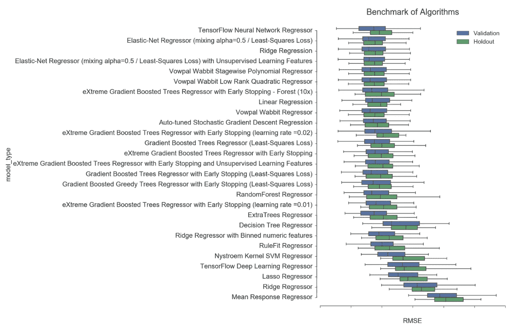

# 自动化机器学习——加速数据科学家生产力的范式转变@ Airbnb

> 原文：<https://medium.com/airbnb-engineering/automated-machine-learning-a-paradigm-shift-that-accelerates-data-scientist-productivity-airbnb-f1f8a10d61f8?source=collection_archive---------4----------------------->

由[哈默尔侯赛因](https://www.linkedin.com/in/hamelhusain/) & [尼克汉德尔](https://www.linkedin.com/in/nicholashandel/)

在 Airbnb，我们一直在寻找改进数据科学工作流程的方法。我们相当数量的数据科学项目涉及机器学习，并且这个工作流程的许多部分是重复的。这些重复性任务包括但不限于:

**探索性数据分析**:在开始建模练习之前，可视化数据是机器学习中至关重要的一步。自动化任务，如绘制所有变量与预测的目标变量的对比图，以及计算汇总统计数据，可以节省大量时间。

**特性转换**:在如何编码分类变量、估算缺失值、编码序列和文本等方面有许多选择。这些特征转换中的许多都是规范的，因此它们可以可靠地应用于许多问题。

**算法选择&超参数调整**:有令人眼花缭乱的算法可供选择，相关的超参数也可以调整。这些任务很容易自动化。

**模型诊断:** [学习曲线](http://scikit-learn.org/stable/modules/learning_curve.html#learning-curve)，[部分依赖图](http://scikit-learn.org/stable/auto_examples/ensemble/plot_partial_dependence.html)，特征重要度，ROC 等诊断对自动生成极其有用。

# 进入自动机器学习(AML)

有一个越来越多的社区围绕着创建工具来自动化上面概述的任务，以及作为机器学习工作流一部分的其他任务。概括这一思想的范式通常被称为自动机器学习，在本文的其余部分，我将简称为“AML”。

反洗钱的范围并没有达成普遍共识，但是在年度 ICML 会议上定期组织反洗钱研讨会的人员[在其网站上定义了一个合理的范围](http://www.automl.org/index.html)，其中包括自动执行上述定义的所有重复性任务。

反洗钱的范围很广，但是，它真的有效吗？答案是这取决于你如何使用它。我们的观点是，很难用 AML 框架大规模取代数据科学家，因为大多数机器学习问题需要领域知识和人类判断才能正确设置。

此外，我们发现 AML 工具对于涉及表格数据集的回归和分类问题最为有用，然而这一领域的发展很快。总之，**我们认为，在某些情况下，AML 可以极大地提高数据科学家的工作效率，通常提高一个数量级**。

我们在 Airbnb 通过以下方式利用反洗钱:

**标杆**

*   *不偏不倚地展示挑战者模型:* AML 可以使用与您的现任模型相同的训练集，快速展示过多的挑战者模型。这可以帮助数据科学家选择最佳的模型族。

**诊断和探测**

*   *检测目标泄漏*:由于 AML 以自动化的方式非常快速地构建候选模型，我们可以在建模生命周期的早期检测到[数据泄漏](https://www.kaggle.com/wiki/Leakage)。
*   *诊断*:如前所述，可以自动生成标准诊断，如学习曲线、部分依赖图、特征重要性等。

**自动化**

*   探索性数据分析、数据预处理、超参数调整、模型选择和将模型投入生产等任务可以通过自动化机器学习框架在某种程度上实现自动化。

# 自动化机器学习工具

有大量的商业和开源工具可以解决反洗钱问题。我们试验了以下工具:

*   [TPOT](https://github.com/rhiever/tpot)
*   [自动 Sklearn](https://github.com/automl/auto-sklearn)
*   [Auto-Weka](http://www.cs.ubc.ca/labs/beta/Projects/autoweka/)
*   [机-JS](https://github.com/ClimbsRocks/machineJS)
*   [数据机器人](https://www.datarobot.com/)

# 案例研究:具有客户终身价值模型的竞争基准

在 Airbnb，我们使用机器学习为客人和主人建立[客户终身价值模型](https://en.wikipedia.org/wiki/Customer_lifetime_value) (LTV)。这些模型允许我们在非常精细的级别上(如果我们愿意，可以到用户级别)改进我们的决策和与我们社区的交互。

LTV 模型被设置为客人的标准回归问题，其中目标变量是每个客人在一个时间范围内的花费。该模型的特征包括来自我们的网络和移动应用的人口统计、位置和活动信息。在这个模型中有许多移动的部分，考虑了供求弹性、预期成本和其他变量。

在构建模型的过程中，数据科学家在选择算法时保持客观是非常重要的。例如，与简单模型相比，复杂模型可能只能提供很小的增量收益，这种权衡应该慎重进行。例如，在建立 LTV 模型的过程中，我们屈服于对我们最喜欢的算法之一的偏见，[极端梯度增强树](https://github.com/dmlc/xgboost) (XGBoost)。我们产生偏见的原因如下:

*   这种算法在密切相关的问题上表现良好。
*   在模型开发期间，我们做了特别的交叉验证，XGBoost 似乎做得最好。
*   我们只有有限的时间来创建这个模型，并将大部分时间花在了功能工程、数据清理和将我们的模型粘贴到生产系统上，这使得我们几乎没有时间进行严格的算法选择和调整。

意识到我们的偏见，我们通过 AML 平台输入原始训练数据，以执行健全性检查并对我们的模型误差进行基准测试。

下图展示了这些基准测试。该图表显示了各种模型的 RMSE(均方根误差)在[过期交叉验证折叠](http://robjhyndman.com/hyndsight/tscv/)中的分布。y 轴对应于不同的“蓝图”，是算法和特征工程步骤的组合。虽然不可能深入这些蓝图中的每一个细节，但下面的图表让您对现代反洗钱系统的探索广度有所了解。

使用 AML，我们很快得到了另一个观点:线性模型对于这个问题非常有竞争力。事实证明，AML 平台测试了过多的替代功能工程步骤，并执行了更严格的超参数调整，我们没有时间手动探索。此外，这些发现使我们能够对我们的算法进行修改，并将模型误差减少 5%以上，这转化为实质性的影响。

# 结论

AML 是一套功能强大的技术，可通过模型调整和更好的诊断来加快数据探索以及提高模型准确性。上述案例研究强调了 AML 提高模型准确性的能力，但是我们也认识到了 AML 的其他优势。对于适合 AML 的问题，我们认为这种范式的使用是良好的建模卫生，因为一旦你已经组成了训练数据，尝试它是便宜的。AML 不能保证改善您的结果，但我们发现，如果使用得当，它通常会改善您的结果。

# 进一步阅读

*   [KDnuggets:自动机器学习的当前状态](http://www.kdnuggets.com/2017/01/current-state-automated-machine-learning.html)
*   [NIPS:高效稳健的自动化机器学习](https://papers.nips.cc/paper/5872-efficient-and-robust-automated-machine-learning.pdf)
*   【http://www.automl.org/ 
*   [http://www.ml4aad.org/](http://www.ml4aad.org/)

*好奇？我们一直在寻找* [*有才华的人加入我们的数据科学和分析团队*](https://www.airbnb.com/careers/departments/data-science-analytics) *！*

*特别感谢以下编辑:* [*迈克尔*](https://medium.com/u/7eb9280e24bb?source=post_page-----f1f8a10d61f8--------------------------------)*[*罗伯特·张*](https://medium.com/u/c00b242128fe?source=post_page-----f1f8a10d61f8--------------------------------)*[*克里希纳*](https://medium.com/u/f1bdf455696e?source=post_page-----f1f8a10d61f8--------------------------------)**