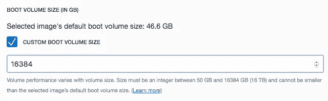
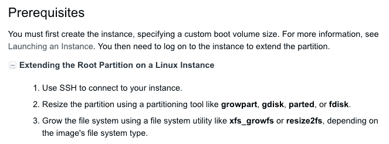
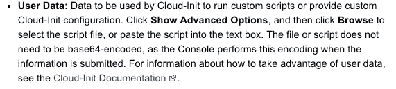
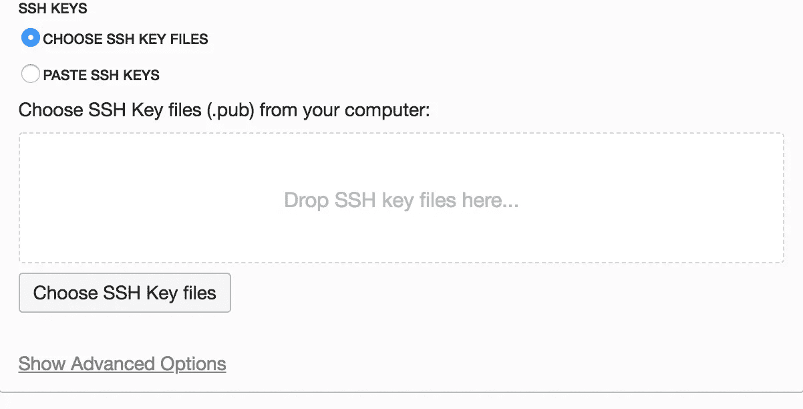
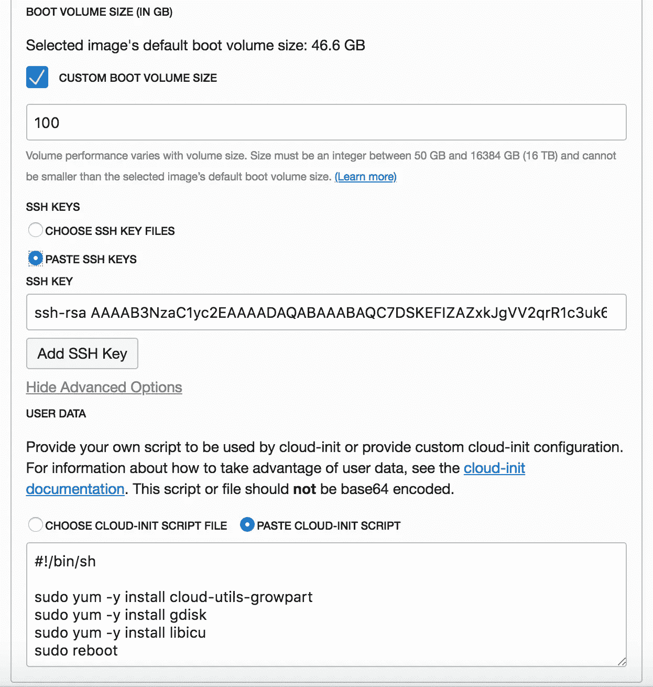
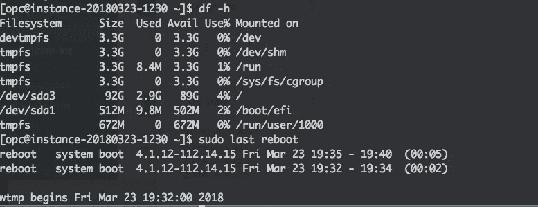

# 使用 cloud-init 在 OCI 上的新 Linux 实例上扩展根分区

> 原文：<https://medium.com/oracledevs/automated-process-to-extend-the-root-partition-on-a-new-linux-instance-using-cloud-init-on-oci-21c75a8e552a?source=collection_archive---------0----------------------->



自 2018 年 3 月开始，当您在 Oracle 云基础架构 OCI 上启动虚拟机或裸机实例时，您可以指定是否使用所选映像的默认启动卷大小(~46.6GB)，或者您可以指定高达 16 TB 的自定义大小。

Oracle 建议您使用分区工具 **growpart、gdisk、parted、**或 **fdisk** 调整分区的大小。为了扩展文件系统，你必须使用像 **xfs_growfs** 或 **resize2fs** 这样的工具，这取决于你的映像的文件系统类型和选择的 **Linux 发行版**。



在 Oracle Linux & CentOS 上，您可以使用`cloud-init-growpart`以及`gdisk`和`cloud-init`来完全自动化这个过程。`libicu`是运行`gdisk` 所需的库，自动安装在 OL7.x/CentOS 7.x 上，在 Release 6 上需要单独安装。

接下来，当您在 OCI 控制台(或通过 API/SDK/Terraform)中启动一个新实例时，您将创建一个 [cloud-init userdata 脚本](http://cloudinit.readthedocs.io/en/latest/topics/format.html) (shell 脚本)，它将自动安装这些包并自动重启您的实例以更新根分区(GPT)。



为了说明这一点，在 OCI 上创建一个新实例，指定一个定制的引导卷大小，并将下面的代码片段复制并粘贴到选择`PASTE CLOUD-INIT SCRIPT`时出现的框中。点击位于`Add SSH KEY button`下方的显示高级选项链接后，此框可用:



Show Advanced Options link

```
#!/bin/shsudo yum -y install cloud-utils-growpartsudo yum -y install gdisk#Required for OL6.x/CentOS6.x
sudo yum -y install libicusudo reboot
```



Custom Boot Volume size along with Cloud-init script at Launch Instance page on OCI

现在，您可以启动实例并等待所有过程完成(根据所选计算机形状，可能需要 2 到 5 分钟)。完成后(重启后)，您可以验证您的根分区应该具有您为自定义启动卷指定的大小。

