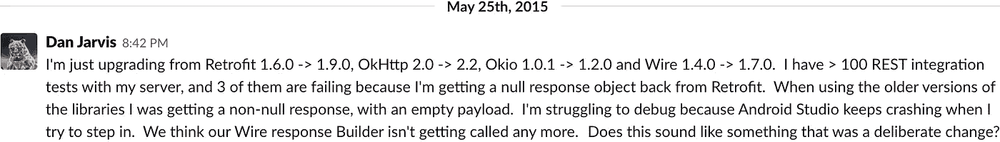

# 学会爱上自动化测试

> 原文：<https://medium.com/capital-one-tech/automated-tests-that-saved-me-2d38b7cb265b?source=collection_archive---------6----------------------->

## 我通往自动化测试启蒙之旅的 3 站


网上有很多观点解释了自动化测试的好处:更好的质量，更快的发布，以及最终更快的开发。

不幸的是，像任何技术一样，自动化测试有一个上升的成本——你需要学习工具和技能。在我职业生涯的早期，我被这些成本吓退了，我花了太长时间才真正感受到 T2 带来的好处。

随着我对自动化测试了解的越来越多，我发现具体的例子比更一般、更抽象的好处更有帮助和启发性。所以，我将分享一些自动化测试的真实例子，这些例子为我节省了大量的时间和尴尬。:-)

## 1)发现基本设计问题

几年前，我实现了一些代码来解密来自服务器的一些数据。服务器端团队给了我一些示例加密数据，我开始编写基本单元测试来检查我的`decrypt`实用程序是否工作正常。

```
@Test 
public void testDecrypt() {      
  String decryptedData = decrypt(EXAMPLE_ENCRYPTED_DATA);     
  assertThat("...43XabcGYvTwII=").isEqualTo(decryptedText); 
}
```

几乎立刻我就遇到了一个奇怪的问题，测试失败了，尽管预期和实际的结果看起来是一样的。

```
Expected: ...43XabcGYvTwII=
Actual:   ...43XabcGYvTwII=
```

从 Android Studio 复制输出并粘贴到纯文本编辑器中，我能够看到一些意想不到的字符。

```
Expected: ...43XabcGYvTwII=
Actual:   ...43XabcGYvTwII=����
```

我去和服务器端团队坐在一起，和他们一起看他们的代码。我们发现他们正在使用[零填充](https://en.wikipedia.org/wiki/Padding_%28cryptography%29#Zero_padding)来填充块。这是设计中的一个大错误，因为我们的有效载荷被允许包含零值。这意味着，如果我们的有效载荷以零结尾，那么这个零将被去掉，这将破坏我们的数据。

为了解决这个问题，我们更改为 Java 支持的标准填充方案之一(您可以在 Java 加密体系结构的[密码](https://docs.oracle.com/javase/7/docs/technotes/guides/security/StandardNames.html#impl)部分看到它们的列表)。

这个问题的根本原因是在一些代码是否是一个示例原型，或者它是否是一个应该交付给产品的准确规范上的误解。

iOS 与这个服务器端组件的集成似乎工作得很好，因为 Objective C 实用程序(这是在 2015 年)会自动删除补零中的零。

我写的自动化测试帮助我们在这个特性投入生产之前找到了这个 bug。这个问题每 256 次才会发生一次(任何时候有效载荷的最后一个字节都是零)，所以我怀疑我们可能没有注意到它…

**要点**:确保你为系统中的所有组件建立了基本的单元测试。如果你看到一些奇怪的东西，不要忽视它——背后可能隐藏着一个很大的设计问题！

## 2)依赖性被破坏

在构建特性时，我们通常从针对我们所依赖的 HTTP APIs 编写集成测试开始。好处是:

*   在开发过程中尽可能早地排除任何主要问题。如果需要与其他团队一起安排变更，这一点尤其重要。
*   为我们提供了一种快速检查服务是否启动并运行的方法。
*   提供了一个回归测试套件，我们可以用它来验证 API 更改是否有效。

早在 2015 年，我就试图从[改进版 1.6.0](https://github.com/square/retrofit/releases/tag/parent-1.6.0) 跳到 1.9.0。我删除了版本号，然后运行了我的测试。令我惊讶的是，我失败了三次——这是我请求帮助的原始 Slack 消息:



作者很快证实这是一个意外([https://github.com/square/retrofit/issues/854](https://github.com/square/retrofit/issues/854))，修复将在 2.0.0 版本中进行。他们随后从 GitHub 中移除了 1.9.0 版本，1.6.0 仍然被标记为“最新版本”。retrieval 是一个很棒的库，维护人员处理得很好。:-)

对我来说，关键的收获是**我能够避免打开包含错误代码**的拉请求。我避免了让糟糕的代码被审查、被合并到母版、被测试，甚至被交付到产品中。我不敢去想，要花多少时间才能诊断出一些由于第三方依赖行为而导致的边缘情况崩溃。

最近，类似的 API 集成测试拯救了我们两次:一个新版本的 HTTP API 发布了，我们的自动化测试立即揭示了新 API 已经破坏的多个边缘案例！🎉

**要点**:编写 HTTP API 集成测试——它们将帮助您尽早发现 API 问题，并在 API 关闭或出现问题时加快调试速度。

## 3)防止功能问题

很多年前，我在做一个交互式语音应答系统(IVR)。如果你打电话给客户支持热线，得到一份又长又复杂的菜单，那么你就知道 IVR 是什么了。:-)

主要的工程师有一个巨大的自动化测试套件，包括一些检查不同的时间表在正确的时间启动的测试。在本例中，我们预计当办公室在上午 9 点开门时，IVR 消息会发生变化。

```
testClosedOneMinuteBefore() {
  assertEqual(convertTime("8:59am"), "sorry, we are closed")
}testOpenExactStartTime() {
  assertEqual(convertTime("9:00am"), "welcome to ABC corp...")
}testOpenOneMinuteAfter() {
  assertEqual(convertTime("9:01am"), "welcome to ABC corp...")
}
```

我做了一个巨大的重构，在这个过程中，我采用了一些类似这样的代码

```
if (startTime >= currentTime) {
  // Offices are open
} else {
  // Offices are closed
}
```

我把`if`测试颠倒过来

```
if (startTime <= currentTime) {
  // Offices are closed
} else {
  // Offices are open
}
```

你能看出我做错了什么吗？


这个问题是因为我忘记了我的基本计算机科学规则，即如何反转一个布尔条件。倒相`<=`应该给`>`，而不是`>=`。

幸运的是，我一修改`testOpenExactStartTime()`测试就失败了，诊断和修复超级简单。我不敢想我是否会在我的手动测试中发现时间表晚了 1 分钟…

**秘诀**:使用自动化测试来帮助确保没有人会破坏你的代码！确保您的边缘案例得到了很好的测试，以及任何手动测试会很慢的东西。:-)

# ♥自动化测试

希望这些例子有助于展示自动化测试的真实好处。一旦你学会了在你的平台上进行自动化测试的工具，你的开发速度和质量都会提高。依靠你的测试来保持你的代码库的稳定，这是令人难以置信的解放。

当我第一次开始开发移动应用程序时，我会有一个长达数周的代码冻结，直到一个主要版本发布，疯狂地修复在手动回归测试中发现的错误，然后在每个产品发布后的两天里紧张地观察崩溃率和分析。现在我不需要了。:-)

我的团队正在招聘安卓开发者。如果你知道谁可能感兴趣，请给他们发送链接，并向他们介绍 [me](https://www.linkedin.com/in/danielalanjarvis/) ！

*披露声明:2019 资本一。观点是作者个人的观点。除非本帖中另有说明，否则 Capital One 不隶属于所提及的任何公司，也不被这些公司认可。使用或展示的所有商标和其他知识产权是其各自所有者的财产。*