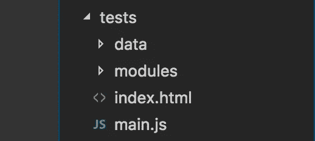

# 在 Oracle JET 项目中使用 QUnit JS 进行自动化单元测试

> 原文：<https://medium.com/oracledevs/automated-unit-tests-using-qunit-js-in-an-oracle-jet-project-fde456c199f9?source=collection_archive---------1----------------------->

**更新 2019 年 7 月** —我不会再推荐使用 QUnit 来测试 JET 应用。茉莉或 Jest 都是更好的选择。您可以在[实用 Oracle JET](https://www.amazon.co.uk/dp/1484243455/) 的第 13 章中找到更多关于如何在 Oracle JET 应用程序中设置和使用 Jasmine 的信息。


[1] ToolsQA

为什么单元测试总是一个令人头疼的话题？不应该是这样，但是要确保一个开发团队为他们的工作编写出好的自动化单元测试，需要很多东西。其中之一是决定要使用的单元测试框架(这有点像迷宫)，并使开发人员编写测试变得非常容易。

当您面临紧迫的最后期限时，您最不希望担心的是，除了积压的其他任务之外，还必须学习一个新的测试框架。希望接下来的几分钟能够让您在项目中获得一个框架单元测试框架，为那些重要的自动化测试的编写做好准备。

本文展示了在一个 Oracle JET 项目中的 QUnit(T4 ), QUnit 是被选中的框架，因为它有很多支持，并且是推荐 JET 使用的框架之一。

> 以下示例是用 Oracle JET 4.1 编写的

## 创建您的文件夹结构

首先，在您的 **/src/** 文件夹中创建一个名为“ **tests** 的文件夹。为了让 watch 任务监视您的测试*(在 JET v4+)* 中的变化，您必须将所有的单元测试放在 **/tests/** 目录中。

您还需要创建 **src/tests/modules** *和* **src/tests/data** 文件夹，这将保存您所有已调制的 QUnit 测试文件和模拟 JSON 有效负载。

> **注意:**可以在 **oraclejetconfig.json 中更改您的测试的目录名(因为它是您所有的 src 文件夹路径)**



你会注意到，如果你现在做一个 **ojet build** ，jet 会承认你的应用程序中已经有了单元测试，并且会自动将 QUnit 库放到你的 **web/libs** 文件夹中——太棒了！

## 导入 mockjax

jquery-mockjax 是一个非常有用的插件，它提供了 AJAX 响应的句柄，因此您可以操作响应并将模拟数据返回到您的测试中。

要安装 mockjax，请运行以下命令:

```
npm install jquery-mockjax --save
```

完成后，您需要将库文件复制到应用程序的登台目录中。对您的**/scripts/Oracle jet-build . js**文件进行以下更改:

```
copyCustomLibsToStaging: {
   fileList: [
      {
         cwd:'node_modules/jquery-mockjax/dist',
         src: ['jquery.mockjax.js'],
         dest: 'web/js/libs/jquery-mockjax'
      }
   ]
},
```

## 设置您的入口点

您必须为测试的入口点创建两个文件。一个是你的 index.html，在那里你将开始你的测试，并看到结果。第二个是你的 **main.js** 文件。

在您的 **src/tests/** 目录中创建一个新的 **main.js** 文件，这将是您的单元测试运行的入口点，并将加载所有 require.js 依赖项和测试模块。

**main.js** 将类似于您在 JET 应用程序中使用的那个，但有一些变化。因此，作为起点，您可以复制来自 **src/js/main.js** 的内容，并进行以下更改:

1.  您的 baseUrl 值会略有不同。您将不得不更改它来上移一个目录，所以它将是**../js** 而不仅仅是 **js。**
2.  确保您已经添加了 mockjax 和您的视图模型依赖项
3.  require 块是不同的，因为它用于加载所有的测试模块，也用于启动 QUnit。您可能希望在稍后阶段向该块中添加额外的功能。

**需要路径配置**

```
requirejs.config(
{
   baseUrl: '../js',
   // Path mappings for the logical module namespaths:
      {
         'knockout': 'libs/knockout/knockout-3.4.0.debug',
         'jquery': 'libs/jquery/jquery-3.1.1',
         'jqueryui-amd': 'libs/jquery/jqueryui-amd-1.12.0',
         'promise': 'libs/es6-promise/es6-promise',
         'hammerjs': 'libs/hammer/hammer-2.0.8',
         'ojdnd': 'libs/dnd-polyfill/dnd-polyfill-1.0.0',
         'ojs': 'libs/oj/v4.0.0/debug',
         'ojL10n': 'libs/oj/v4.0.0/ojL10n',
         'ojtranslations': 'libs/oj/v4.0.0/resources',
         'text': 'libs/require/text',
         'signals': 'libs/js-signals/signals',
         'customElements': 'libs/webcomponents/custom-elements.min',
         'proj4': 'libs/proj4js/dist/proj4-src',
         'css': 'libs/require-css/css',
         'mockjax': 'libs/jquery-mockjax', // View Models
         'dashboardViewModel': 'viewModels/dashboard.js' }, shim:
      {
         'jquery':
               {
                  exports: ['jQuery', '$']
               }
      }});
```

**要求封锁**

```
var **testModules** = [ // General Imports 'jquery',
   'knockout',
   'appController',
   'mockjax', // Test Suites - add all your test modules here

   'modules/dashboardTests.js'
];require(**testModules**, function ($, ko, app) {
   ko.applyBindings(app, document.getElementById('globalBody'));
   QUnit.start();
});
```

你的索引文件看起来会像这样，并且会存储在 **src/tests/index.html** 中

```
<!DOCTYPE html> <html> <head> <title>My first Oracle JET QUnit Tests</title>
         <link rel="stylesheet" href="../js/libs/qunit/qunit.css"> </head> <body> <div id="qunit"></div>
         <div id="qunit-fixture"></div>
         <script src="../js/libs/qunit/qunit.js"></script>
         <script data-main="main" src="../js/libs/require/require.js">
         </script> <div id="globalBody"></div>
         <script type="text/javascript" charset="utf-8">   
            QUnit.config.autostart = false;
         </script> </body>
</html>
```

## 创建 dashboardTests.js 文件

现在您已经有了自己的框架，您可以开始编写您的测试了！我不会详细介绍 QUnit 测试是如何工作的，因为这在网上和 QUnit 网站上都有广泛的记录。

我将展示一个如何在 Oracle JET 应用程序中运行 QUnit 测试的快速示例。

**仪表板视图模型示例**

假设我有一个返回日期的外部服务。然后我检查这个日期，看是否与今天的日期相符。结果存储在一个可观察的。

```
self.dateBoolean = ko.observable();self.runService = function() { // AJAX call and date check logic self.dateBoolean(result);};
```

**示例 dashboardTests.js**

现在我想写一个测试，以确保我的日期逻辑是正确的。我们可以使用 mockjax 来修改响应负载，因此我可以完全控制服务调用返回的日期。

我的模拟响应将存储在 **data/dashboard.json** 中，并分配给 mockjax 代理属性。

```
require(['dashboardViewModel'], function (viewModel) { QUnit.module("Dashboard tests", {}); var vm = new viewModel();   function init(){
      $.mockjax({
         url: 'http://myservicelocation',
         type: 'GET',
         responseTime: 0,
         contentType: 'text/json',
         proxy: 'data/dashboard.json'
      });
   } QUnit.test("Sample test", function (assert){
      init();
      vm.runService();
      var done = assert.async(); setTimeout(function () {
          assert.equal(vm.dateBoolean(), true, "Dates matched");
          done();
      }, 100);
   });
});
```

有关如何使用 QUnit 的更多信息，请访问网站，其中包含大量有用的示例:

[](https://qunitjs.com) [## 库奈特

### QUnit:一个 JavaScript 单元测试框架。

qunitjs.com](https://qunitjs.com) [](https://github.com/jakerella/jquery-mockjax) [## jakerella/jquery-mockjax

### jQuery Mockjax 插件提供了一个简单且极其灵活的接口来模仿或模拟…

github.com](https://github.com/jakerella/jquery-mockjax) 

— DC

[1]图片鸣谢—[http://tools QA . com/software-testing/software-testing-tutorial/](http://toolsqa.com/software-testing/software-testing-tutorial/)