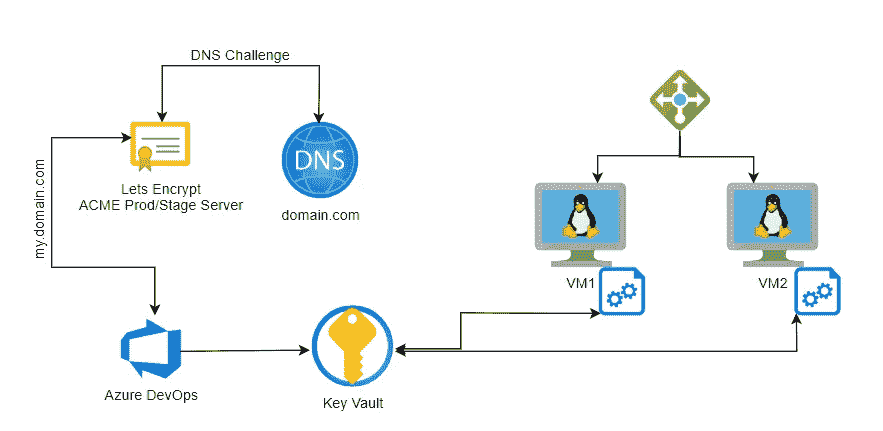

# 自动 ACME SSL 证书轮换

> 原文：<https://medium.com/version-1/automatic-acme-ssl-certificate-rotation-3707f2d5954c?source=collection_archive---------0----------------------->

技术需要安全，但我们也希望它易于使用。这对于管理 SSL 证书及其轮换的美国工程师来说是一样的。您可以获得长期证书，但是为什么您可以通过自动证书管理环境(ACME 协议)获得免费证书呢？这通常是因为它们将在 3 个月内到期，而您不希望每 3 个月更新和部署一次，尤其是当您有许多服务需要维护时。因此，我有一个更新证书的模式和设计，它也可以适用于任何服务或云提供商。

这种设计使用特定的技术，但是由于它的组成，每个组件都可以与您使用的任何技术进行交换。例如，我使用 Azure Key Vault 来存储证书，这可以很容易地交换为 AWS 证书管理器。这也是为什么它是一个非常好的设计，因为它可以支持多种类型的服务、语言和提供商。

对于本文，我使用了以下技术

azure devo PS-部署软件
[https://azure.microsoft.com/en-us/services/devops/](https://azure.microsoft.com/en-us/services/devops/)

莱斯加密证书提供商
【https://letsencrypt.org/docs/client-options/ 

azure Key Vault-证书存储
[https://docs . Microsoft . com/en-us/azure/Key-Vault/general/basic-concepts](https://docs.microsoft.com/en-us/azure/key-vault/general/basic-concepts)

Azure 虚拟机(Linux)-应用程序主机
[https://azure . Microsoft . com/en-us/services/Virtual-machines/Linux/](https://azure.microsoft.com/en-us/services/virtual-machines/linux/)

Azure DNS - DNS 提供商
[https://azure.microsoft.com/en-gb/services/dns/#overview](https://azure.microsoft.com/en-gb/services/dns/#overview)

自动生成证书
[https://poshac.me/docs/v4/Tutorial/](https://poshac.me/docs/v4/Tutorial/)

# 它是如何工作的



正如你从设计中看到的，是 Azure DevOps 完成了证书的请求。这是因为每个域都有一个单独的源来执行请求，而不是由每个资源来执行。这可以节省每个域所需的请求数和证书数。您可以申请一个证书，使用该域的所有资源都可以受益。

# 申请证书

本节将解释 Azure DevOps 从 let 获取新证书的工作，加密并将其存储在 Azure Key Vault 中。

# 获取证书脚本

我们从设置脚本中使用的变量开始，这些变量将配置脚本的使用方式。

环境是环境，它在以后用于决定让加密服务器使用什么。使用生产服务器时，您受限于每天每个域可以发出多少请求，因此对于较低的环境，使用分段服务器是有意义的，因为在部署期间您可能会多次请求该服务器。

acmeContact 是一个用于 Posh-ACME 帐户的电子邮件联系人，但也可以是任何电子邮件，只要其格式为电子邮件即可。

该域是您将为其请求证书的 URL 的完全限定域名。

最后，您拥有了 Azure Subscription 名称，该名称包含 Azure DNS 资源，稍后将使用该资源获取请求的访问令牌。这是因为您的资源没有托管在同一个 Azure Subscription 中，但是如果它们托管在同一个 Azure Subscription 中，那么您总是可以使用 az cli 来获取当前的 Subscription。

```
$env="staging"
$acmeContact="me@email.com"
$domain="www.example.com"
$dnsSubscription="DNS-Subscription-Example"if ($env -eq "production" -or $env -eq "staging") { $leServer="LE_PROD"}else { $leServer="LE_STAGE"}
```

然后，我们可以安装 Posh-ACME PowerShell 模块。

```
# Set Posh-ACME working directory
Write-Host "Install Module"
Install-Module -Name Posh-ACME -Scope CurrentUser -Force
```

设置让加密服务器并为脚本安装 Azure 插件。

```
# Configure Posh-ACME server
Write-Host "Configure LE Server $leServer"
Set-PAServer $leServer
Get-PAPlugin Azure
```

使用 Posh-ACME 时，您需要为续保设置一个附属于该域的帐户，该帐户可以使用我们之前设置的 acmeContact 电子邮件自动生成。如果您已经设置了帐户，下面的脚本也可以进行锻炼，如果是，它将使用现有的帐户。

```
# Configure Posh-ACME account
Write-Host "Setup Account"
$account = Get-PAAccountif (-not $account) {# New account
Write-Host "Create New Account"
$account = New-PAAccount -Contact $acmeContact -AcceptTOS} elseif ($account.contact -ne "[mailto:$acmeContact](mailto:$acmeContact)") {# Update account contact
Write-Host "Set Existing Account $($account.id)"
Set-PAAccount -ID $account.id -Contact $acmeContact}
```

然后，我们需要获取 Azure DNS 资源订阅 ID 和访问令牌，以传递到证书生成中。如果您的 DNS 资源没有托管在您当前的订阅中，那么您可以使用此脚本获取订阅详细信息，然后请求访问令牌。如果是，那么您可以删除设置订阅名称的部分，只显示当前订阅上下文(` az account show-query ' id '-o tsv ')。

```
# Acquire access token for Azure (as we want to leverage the existing connection)
Write-Host "Get Azure Details"
$azAccount = az account show -s $dnsSubscription -o json | ConvertFrom-Json
Write-Host "Azure DNS Sub $($azAccount.name)"
$token = (az account get-access-token --resource '[https://management.core.windows.net/](https://management.core.windows.net/)' | ConvertFrom-Json).accessToken
```

您现在可以使用 Post-ACME 命令和获得的设置请求新的证书。

```
# Request certificate
$pArgs = @{
AZSubscriptionId = $azAccount.id
AZAccessToken = $token
}New-PACertificate $domain -Plugin Azure -PluginArgs $pArgs -Verbose
$generatedCert=$(Get-PACertificate)
Write-Host($generatedCert)
```

# Azure DevOps 设置

现在我们不想每次都运行这个脚本，所以我们可以在之前添加一个额外的脚本来检查这一点。它将检查证书是否存在，如果存在，它将检查其有效期是否在 14 天内。

```
- task: AzureCLI@2
  displayName: 'Check if Cert expired in ${{ parameters.keyVaultName }}'
  name: cert
  inputs:
    azureSubscription: '${{ parameters.subscriptionName }}'
    scriptType: 'pscore'
    scriptLocation: 'inlineScript'
    inlineScript: | $keyVaultName="${{ parameters.keyVaultName }}"
      $certName="${{ parameters.certName}}"
      $exportedCerts = az keyvault certificate list --vault-name $keyVaultName --query "[? name=='$certName']" -o json | ConvertFrom-Json $expired=$false if ($null -ne $exportedCerts -and $exportedCerts.length -gt 0){ Write-Host "Certificate Found"
      $exportedCert = $exportedCerts[0] Write-Host "Certificate Expires $($exportedCert.attributes.expires)"
      $expiryDate=(get-date $exportedCert.attributes.expires).AddDays(-14) Write-Host "Certificate Forced Expiry is $expiryDate" if ($expiryDate -lt (get-date)){ Write-Host "Certificate has expired"
        $expired=$true } else { Write-Host "Certificate has NOT expired"
      } } else { Write-Host "Certificate NOT Found" $expired=$true
     } Write-Host "##vso[task.setvariable variable=expired;isOutput=true]$expired"
```

这可以用来决定是否运行证书请求脚本作为任务条件的一部分。

```
- task: AzureCLI@2
  name: acmecert
  displayName: 'Request LE Cert for ${{ parameters.domain }}'
  condition: and(succeeded(), eq(variables['cert.expired'], 'True'))
  inputs:
    azureSubscription: '${{ parameters.subscriptionName }}'
    scriptType: 'pscore'
    scriptLocation: 'inlineScript'
    inlineScript: | $env="${{ parameters.environment }}"
      $acmeContact="me@email.com"
      $domain="${{ parameters.domain }}"
      $dnsSubscription="Reform-CFT-Mgmt" if ($env -eq "production" -or $env -eq "staging") {
        $leServer="LE_PROD"
      }else {
        $leServer="LE_STAGE"
      } # Set Posh-ACME working directory
      Write-Host "Install Module"
      Install-Module -Name Posh-ACME -Scope CurrentUser -Force # Configure Posh-ACME server
      Write-Host "Configure LE Server $leServer"
      Set-PAServer $leServer
      Get-PAPlugin Azure # Configure Posh-ACME account
      Write-Host "Setup Account"
      $account = Get-PAAccount if (-not $account) { # New account
        Write-Host "Create New Account"
        $account = New-PAAccount -Contact $acmeContact -AcceptTOS
      }
      elseif ($account.contact -ne "[mailto:$acmeContact](mailto:$acmeContact)") { # Update account contact
        Write-Host "Set Existing Account $($account.id)"
        Set-PAAccount -ID $account.id -Contact $acmeContact
      } # Acquire access token for Azure (as we want to leverage the existing connection)
      Write-Host "Get Azure Details"
      $azAccount = az account show -s $dnsSubscription -o json | ConvertFrom-Json Write-Host "Azure DNS Sub $($azAccount.name)"
      $token = (az account get-access-token --resource '[https://management.core.windows.net/](https://management.core.windows.net/)' | ConvertFrom-Json).accessToken # Request certificate
      $pArgs = @{
        AZSubscriptionId = $azAccount.id
        AZAccessToken = $token
      } New-PACertificate $domain -Plugin Azure -PluginArgs $pArgs -Verbose $generatedCert=$(Get-PACertificate)
      Write-Host($generatedCert)Write-Host "##vso[task.setvariable variable=certPath;isOutput=true]$($generatedCert.CertFile)"Write-Host "##vso[task.setvariable variable=privateKeyPath;isOutput=true]$($generatedCert.KeyFile)"
Write-Host "##vso[task.setvariable variable=pfxPath;isOutput=true]$($generatedCert.PfxFullChain)"
Write-Host "##vso[task.setvariable variable=pfxPass;isOutput=true;issecret=true]$pfxPassword"
```

# 存储证书

最后，一旦生成了证书，我们就可以通过使用 az cli 导入生成的证书，将其导出并放入 Azure Key Vault 中。

```
- task: AzureCLI@2
displayName: 'Import Certificate into ${{ parameters.keyVaultName }}'
condition: and(succeeded(), eq(variables['cert.expired'], 'True'))
inputs:
  azureSubscription: '${{ parameters.subscriptionName }}'
  scriptType: 'pscore'
  scriptLocation: 'inlineScript'
  inlineScript: | $keyVaultName="${{ parameters.keyVaultName }}"
    $certName="${{ parameters.certName}}"
    $password="$(acmecert.pfxPass)"
    $pfxPath="$(acmecert.pfxPath)" az keyvault certificate import --vault-name $keyVaultName -n     $certName -f $pfxPath --password $password
```

# 安装证书

在此阶段，我们假设已经遵循了上述步骤，因此生成了有效的证书，并将其导入到 Azure Key Vault 中。

我们还将假设您为 Linux 虚拟机(虚拟机)安装了 Azure CLI，并将 Azure 托管身份(MI)附加到虚拟机以进行身份验证。

为了在虚拟机上存储证书，我们还使用了 Keytools，它与 Linux 机器上的 Java 应用程序一起使用。

在下面的脚本中，我们获取了所有变量并登录到 Azure CLI 中。

```
miClientId="${managedIdentityClientId}"
az login --identity --username $miClientIdkeyVaultName="${keyVaultName}"
certName="${certName}"
domain="${domain}"jksPath="/usr/local/conf/ssl.jks"
jksPass="${certPassword}"
```

然后，我们将获得证书列表，并生成我们认为过期的日期，即证书的过期日期减去 14 天。

```
expiryDate=$(keytool -list -v -keystore $jksPath -storepass $jksPass | grep until | sed 's/.*until: //')echo "Certificate Expires $expiryDate"
expiryDate="$(date -d "$expiryDate - 14 days" +%Y%m%d)"echo "Certificate Forced Expiry is $expiryDate"
today=$(date +%Y%m%d)
```

如果今天的日期早于到期日，我们将不会尝试获取新证书，但如果证书不存在或其到期日早于今天，我们将续订。

为此，我们将从密钥库中下载证书，但由于它下载时没有密码，因此我们使用开放 SSL CLI 来导入/导出带密码的证书。

这将生成一个新的 PFX，在删除现有证书后，我们将它导入到 Keytools 中。

```
if [[ $expiryDate -lt $today ]]; then
  echo "Certificate has expired"
  downloadedPfxPath="downloadedCert.pfx"
  signedPfxPath="signedCert.pfx" rm -rf $downloadedPfxPath || true az keyvault secret download --file $downloadedPfxPath --vault-name $keyVaultName --encoding base64 --name $certName rm -rf $signedPfxPath || true openssl pkcs12 -in $downloadedPfxPath -out tmpmycert.pem -passin pass: -passout pass:$jksPass openssl pkcs12 -export -out $signedPfxPath -in tmpmycert.pem -passin pass:$jksPass -passout pass:$jksPass keytool -delete -alias 1 -keystore $jksPath -storepass $jksPass keytool -importkeystore -srckeystore $signedPfxPath -srcstoretype pkcs12 -destkeystore $jksPath -deststoretype JKS -deststorepass $jksPass -srcstorepass $jksPasselse echo "Certificate has NOT expired"fi
```

然后，您可以将其放在每天的 cron 作业中，检查证书是否有效。

唯一遇到的问题是管道时间表和上面的更新脚本时间表重叠。如果您将它们都放在每日计划中，一个用于续订证书，一个用于获取新证书，则您可能会在证书续订之前运行证书提取计划。尽管这并不理想，但由于我们提前 14 天续订，因此您仍有 13 天的时间来赶上进度。


作者简介:
Christopher Pateman 是 Version 1 的高级 Azure DevOps 工程师。