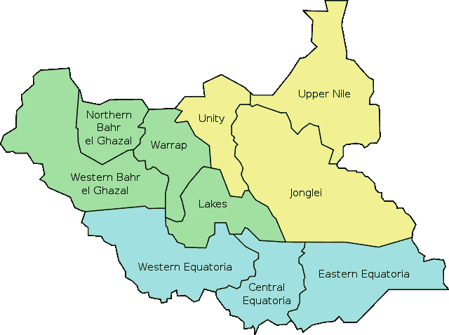

# 自动列表分区:开发人员会喜欢的 12 件事 Oracle Database 12c 第 2 版第 10 部分

> 原文：<https://medium.com/oracledevs/automatic-list-partitioning-12-things-developers-will-love-about-oracle-database-12c-release-2-278804c3b555?source=collection_archive---------0----------------------->

当您有一个包含一组特定值的列并希望将其划分到单独的分区中时，列表分区非常有用。州、国家和货币都是很好的例子。

像这样的参考数据很少改变。但是他们确实会改变。比如 2011 年诞生的南苏丹。



如果您按国家列出分区数据，您需要保持分区是最新的。尤其是如果你让顾客提供他们自己的价值观。否则，您可能会遇到令人尴尬的错误，例如:

```
SQL Error: ORA-14400: inserted partition key does not map to any partition
```

这当然会发生在凌晨 2 点。这是激怒随叫随到的 DBA 的好方法！

为了避免这种情况，您可以创建一个默认分区。任何新的值都会加入其中。这防止了插入引发异常。但是所有新值都进入默认分区。随着时间的推移，这将填满所有的新值。

所以你需要一个常规的维护任务来根据需要分割数值。

12.2 通过自动列表分区解决了这个问题。每次插入新值时，Oracle 数据库都会动态创建新分区！

要使用它，只需将 automatic 关键字放在分区列之后:

```
create table orders ( 
  customer_id integer not null, 
  order_datetime date not null, 
  country_iso_code varchar2(2) not null 
) partition by list (country_iso_code) automatic ( 
  partition pUS values ('US'), 
  partition pGB values ('GB'), 
  partition pDE values ('DE'), 
  partition pFR values ('FR'), 
  partition pIT values ('IT') 
); insert into orders values (1, sysdate, 'ZA'); select partition_name 
from   user_tab_partitions 
where  table_name = 'ORDERS'; PARTITION_NAME 
-------------- 
PDE 
PFR 
PGB 
PIT 
PUS 
SYS_P1386
```

注意，新分区将有一个系统生成的名称。所以你可能想把它们改成有意义的名字。您可以通过以下方式实现这一点:

```
alter table orders rename partition SYS_P1386 to pZA;
```

要注意。默认分区和自动列表分区是互斥的选项:

```
create table orders ( 
   customer_id integer not null, 
   order_datetime date not null, 
   country_iso_code varchar2(2) not null 
) partition by list (country_iso_code) automatic ( 
  partition pUS values ('US'), 
  partition pGB values ('GB'), 
  partition pDE values ('DE'), 
  partition pFR values ('FR'), 
  partition pIT values ('IT'), 
  partition pDEF values (default) 
); SQL Error: ORA-14851: DEFAULT [sub]partition cannot be specified for AUTOLIST [sub]partitioned objects.
```

仔细想想也说得通。但是如果您想将默认的列表分区迁移到自动分区，您需要经历一个过程。首先将所有内容从默认分区中分离出来，然后删除它:

```
create table orders ( 
  customer_id integer not null, 
  order_datetime date not null, 
  country_iso_code varchar2(2) not null 
) partition by list (country_iso_code) ( 
  partition pUS values ('US'), 
  partition pGB values ('GB'), 
  partition pDE values ('DE'), 
  partition pFR values ('FR'), 
  partition pIT values ('IT'),   
  partition pDEF values (default) 
); insert into orders values (1, sysdate, 'ZA'); 
insert into orders values (2, sysdate, 'JP'); alter table orders split partition pDEF into ( 
  partition pZA values ('ZA'), 
  partition pJP values ('JP'), 
  partition pDEF 
); 
alter table orders drop partition pDEF; 
alter table orders set partitioning automatic;
```

请注意，这确实会留下一段没有默认分区的短暂时间。自动分区还没有准备好。因此，您可能需要暂停一会儿来做这件事！

*全文原载于 2016 年 11 月 10 日*[*【blogs.oracle.com】*](https://blogs.oracle.com/sql/12-things-developers-will-love-about-oracle-database-12c-release-2)*。*