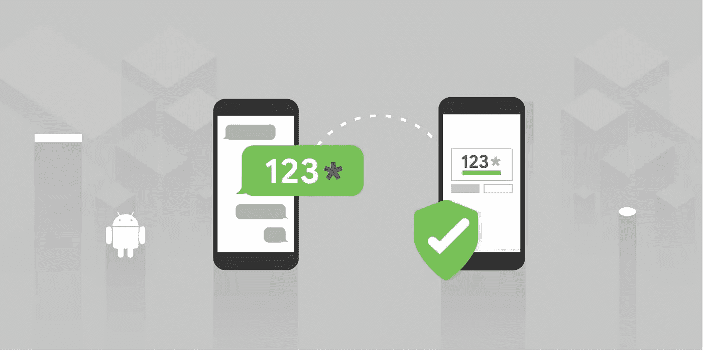
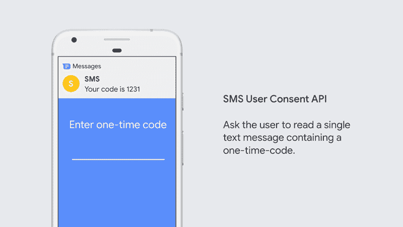
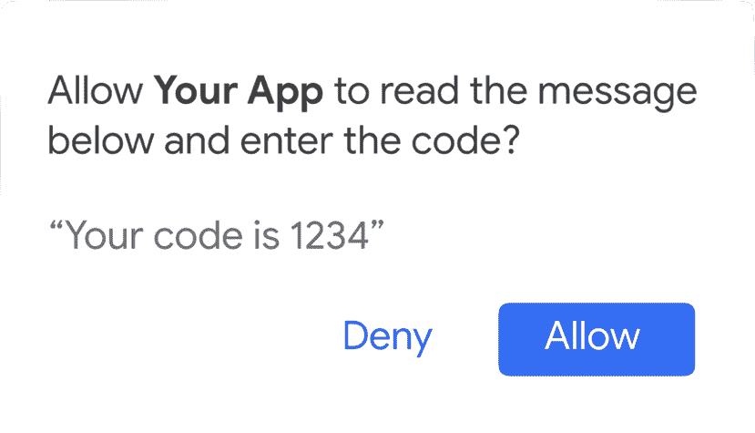

# 经 SMS 用户同意的自动 SMS 验证

> 原文：<https://medium.com/androiddevelopers/automatic-sms-verification-with-sms-user-consent-da8c16135e25?source=collection_archive---------0----------------------->



如果你在应用程序中使用一次性代码实现短信验证，请查看新的短信用户同意 API。

短信验证是向应用程序添加第二种验证形式的常用方法。通过向用户的电话号码发送包含一次性代码(如“1234”或“481236”)的短信，他们可以将代码输入到您的应用程序中，以确认他们收到了短信。

> 发件人:短信
> 
> 信息:您的一次性代码是 1234。

但是——说实话。没有人真正喜欢打出一次性代码。这既乏味又容易出错。因此，虽然它有助于验证您的应用程序，但让体验尽可能无缝也很重要。

SMS 用户同意 API 让您的应用程序提示用户允许阅读包含一次性代码的单个 SMS 消息的文本。然后，您的应用程序可以解析消息，并自动完成短信验证流程！



Ask the user to read a single text message containing a one-time-code.

如果您已经在使用 SMS 检索器 API，SMS 用户同意 API 不会弃用或替换它。我们添加了第二个 API，因为有时应用程序无法修改消息来支持 SMS 检索器 API。

在实现短信用户同意之前，你应该检查一下[短信检索器 API](https://developers.google.com/identity/sms-retriever/overview) ，看看它是否适用于你的应用。如果你能使用它，它会提供更好的用户体验，因为用户可以跳过提示！

# API 概述

Introducing the SMS User Consent API.

这篇文章涵盖了使用 API 的基础知识——足以让你熟悉方向。要获得完整的 API 指南(包括一个示例实现),请查看[文档](https://developers.google.com/identity/sms-retriever/user-consent/overview)!

SMS 用户同意 API 是 Google Play 服务的一部分。要使用它，您至少需要以下库的版本`17.0.0`:

```
implementation "com.google.android.gms:play-services-auth:17.0.0"
implementation "com.google.android.gms:play-services-auth-api-phone:17.1.0"
```

## 第一步:开始收听短信

SMS 用户许可将侦听包含一次性代码的传入 SMS 消息长达五分钟。在启动之前，它不会查看任何发送的消息。

SMS 用户许可绝不会提示不包含一次性代码(4-10 个字符，至少有一个数字)或来自用户联系人的消息。

如果你知道发送一次性代码的电话号码，你可以指定`senderPhoneNumber`，如果你不知道`null`将匹配任何号码。

要启动 SMS 用户同意，您可以使用`SmsRetriever`对象:

```
smsRetriever.startSmsUserConsent(
    senderPhoneNumber /* or null */)
```

## 步骤 2:请求同意阅读邮件

一旦你的应用收到包含一次性代码的消息，它将通过广播得到通知。在这一点上，你没有阅读该消息的许可——相反，你会得到一个`Intent`,你可以开始提示用户同意。



Use the Intent passed to your BroadcastReceiver to show the SMS User Consent prompt.

在您的`BroadcastReceiver`中，您使用`extras`中的`Intent`来显示提示。

当您启动该意图时，它将提示用户允许阅读一条消息。

他们将看到他们将与您的应用程序共享的全部文本。

```
val consentIntent = extras.getParcelable<Intent>(
    SmsRetriever.EXTRA_CONSENT_INTENT)startActivityForResult(
    consentIntent, 
    SMS_CONSENT_REQUEST)
```

## 步骤 3:解析一次性代码并完成短信验证

当用户点击`“Allow”`——是时候真正阅读消息了！在`onActivityResult`里面你可以从资料中得到短信的全文:

```
val message = data.
    getStringExtra(
        SmsRetriever.EXTRA_SMS_MESSAGE)
```

然后，您解析 SMS 消息，并将一次性代码传递到您的后端！

# 了解更多信息

SMS 用户同意 API 帮助您为用户提供良好的用户体验。通过自动解析一次性代码，用户能够轻松地完成短信验证流程，这样他们就可以回到他们正在做的事情。

要了解更多信息，包括完整的代码清单，请查看文档！

*   [通过短信用户同意 API 进行一键式短信验证](https://developers.google.com/identity/sms-retriever/user-consent/overview)
*   [请求一次性同意阅读短信验证码](https://developers.google.com/identity/sms-retriever/user-consent/request)