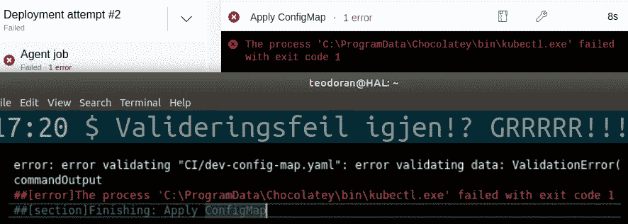
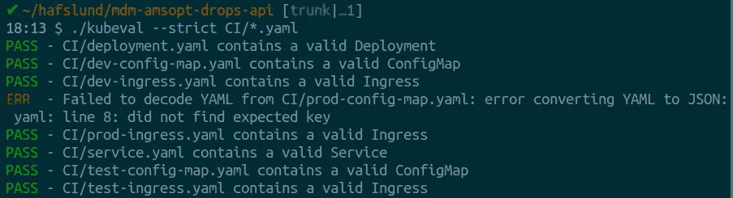

# Azure DevOps 中 Kubernetes 配置的自动验证

> 原文：<https://medium.com/compendium/automatic-validation-of-kubernetes-config-in-azure-devops-e9ae15d67d3e?source=collection_archive---------1----------------------->

厌倦了因为 YAML 文件中的缩进错误而导致的发布失败吗？希望语法错误像其他代码一样被构建管道捕获吗？那么这可能是你的解决方案！

Validation errors again!?

# TL；速度三角形定位法(dead reckoning)

*   您可以使用 [Kubeval](https://kubeval.instrumenta.dev/) 来验证您的 k8s 配置，作为构建管道的一部分。
*   将[这个](https://gist.github.com/teodoran/afb3b6888a7c40a0a2dc2fb399d4dd57)和[这个](https://gist.github.com/teodoran/9205f1974ef3dc985e1b658bf0c61e50)文件添加到 repo 中一个名为 *Kubeval* 的文件夹中，将[这两个任务添加到管道定义](https://gist.github.com/teodoran/b41b282c0f2705924903fe6bca8ffbde)中，就大功告成了！*

**我假设你已经忽略了* [*中的所有 bin 文件夹。gitignore*](https://git-scm.com/docs/gitignore) *，并在您的构建管道中使用基于 Linux 的代理。*

# 多给我讲讲！

## 记得吗-预演？

Kubectl 可以通过使用- dry-run 标志在本地验证 k8s 配置，而不需要实际部署任何东西。这很好，也是在您自己的机器上验证配置的一个很好的选择，但是让 Kubectl 作为构建管道的一部分工作可能会很棘手。因此，当您在提交之前忘记验证配置时，或者您只是懒得找到命令和参数的正确组合，而只是验证，而不是抱怨其他事情时，您就陷入了这样一种情况，在发布失败之前，一切看起来都很好💣

## 输入 Kubeval

[Kubeval](https://kubeval.instrumenta.dev/) 是一个专门用于在本地或 CI 管道中验证 Kubernetes 配置的工具。它是[开源软件](https://github.com/instrumenta/kubeval/)，支持多个 Kubernetes 版本，并且很好地发现了我们在编辑部署、服务、入口等时都会犯的所有小错误。

Kubeval in action

## 限制

即使 Kubeval 验证成功，发布仍然可能失败，因为只有在实际集群上执行配置时才能发现一些错误。例如，如果您引用集群上不存在的配置映射，Kubeval 将无法捕捉错误。尽管如此，它还是很擅长处理所有“没有找到预期的键”、“错误的缩进”和“无效类型”的错误。

# 将 Kubeval 添加到您的构建管道中

## 找到库贝瓦尔

Kubeval [以压缩二进制](https://kubeval.instrumenta.dev/installation/)的形式发布，可用于不同的平台。假设我们使用基于 Linux 的管道代理，您可以使用脚本来下载、验证和解压缩 *kubeval* 可执行文件。

新建一个名为 *Kubeval* 的文件夹，添加一个名为 [use-kubeval.sh](https://gist.github.com/teodoran/afb3b6888a7c40a0a2dc2fb399d4dd57) 的文件，内容如下所示。

由于我们从互联网下载并运行可执行文件，我们应该验证我们实际上已经得到了我们想要的可执行文件，而不是来自黑客或中间人攻击者的奇怪东西。这可以用 Linux 实用程序 [*sha256sum*](https://en.wikipedia.org/wiki/Sha1sum) 和一个校验和文件来完成，所以除了使用-kubeval.sh，我们还需要向 *Kubeval* 文件夹添加一个校验和文件，命名为 [kubeval-checksum](https://gist.github.com/teodoran/9205f1974ef3dc985e1b658bf0c61e50) ，内容如下所示。

> 当用作 use-kubeval.sh 脚本的一部分时，“sha256sum -c kubeval-checksum”将为我们下载的文件生成阿沙-256 哈希，并将其与存储在 kubeval-checksum 中的先前生成的哈希进行比较。您应该评估这个验证策略对于您的构建系统是否足够安全。可以用“sha 256 sum—tag bin/Kubeval-Linux-amd64 . tar . gz”为新版本的 kube val 生成新的校验和。如果要使用更长的校验和哈希，可以使用“sha512sum”。

# 向生成管道添加验证

现在我们需要向 [azure-pipeline.yml](https://gist.github.com/teodoran/b41b282c0f2705924903fe6bca8ffbde) 管道定义添加两个步骤。第一个执行 *Kubeval* 文件夹中的 use-kubeval.sh，第二个执行 *CI* 文件夹中所有 YAML 文件的严格验证。

因为我们使用 Linux 命令来下载、验证和解压缩 kubeval 可执行文件，所以您需要在构建管道中使用基于 Linux 的 vmImage，比如“ubuntu-latest”。

根据您是否使用 Docker 以及您在管道中放置 Kubeval-steps 的位置，您可能希望将 *Kubeval* 文件夹添加到您的[中。dockerignore](https://docs.docker.com/engine/reference/builder/#dockerignore-file) ，避免将内容复制到您的 Docker 图像中。

# 关于安全性和升级 Kubeval 的一些信息

如 use-kubeval.sh 脚本中所述，您应该检查是否有新版本的 kubeval 可用，如果有，就升级。在所有可预见的未来使用 v0.14.0 版本可能是一个非常糟糕的想法😅

*记得为新版本的 kubeval 生成一个带有“sha 256 sum-tag bin/kube val-Linux-amd64 . tar . gz”的新校验和。*