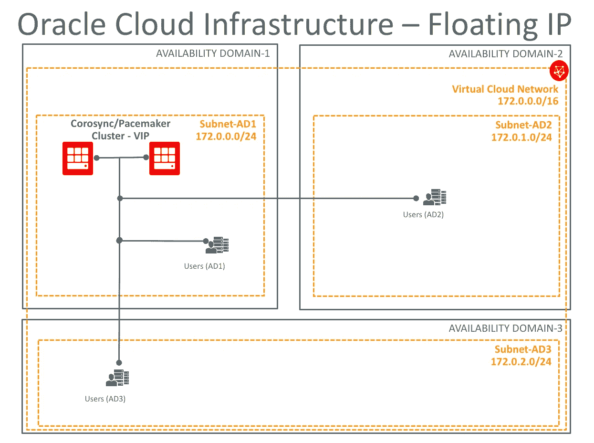

# Oracle 云基础架构上的自动虚拟 IP 故障转移

> 原文：<https://medium.com/oracledevs/automatic-virtual-ip-failover-on-oracle-cloud-infrastructure-ce28dc293b04?source=collection_archive---------0----------------------->

在当今世界，高可用性非常重要，因此，自动化虚拟 IP 故障切换对于保持应用程序的运行至关重要，这样，如果主云服务器出现问题，用户就可以在不受任何影响的情况下执行其职责。

本文介绍了如何使用 Linux Corosync/pacer 以及 OCI 命令行界面(CLI)在 Oracle 云基础架构(OCI)上轻松实现 VirtualIP 故障转移过程的自动化。

主要目标是展示如何将 [OCI 辅助 IP](https://docs.us-phoenix-1.oraclecloud.com/Content/Network/Tasks/managingIPaddresses.htm) 设置为在出现停机情况时自动进行故障切换。

# 入门指南

让我们先了解一下将要使用的组件。如上所述，有三个主要组件允许您的虚拟 IP (OCI 辅助 IP)自动进行故障切换:

*   [Corosync](http://clusterlabs.org/corosync.html) 是一个集团通信系统，具有在应用程序中实现高可用性的附加功能。
*   [起搏器](http://clusterlabs.org/pacemaker.html)这是一个开源、高可用性资源管理器，适用于小型和大型集群。
*   [OCI CLI](https://docs.us-phoenix-1.oraclecloud.com/Content/API/SDKDocs/cli.htm) 负责将 Linux Corosync/pacer virtuip IP addr 2 资源与 Oracle 云基础架构 vNIC 辅助 IP 集成。

# 要求

*   至少 2 个 Oracle Linux 7.x OCI 实例(虚拟机或 BM 形状)。也可以使用其他 Linux 发行版
*   coro sync/起搏器
*   OCI 国家牵头倡议
*   浮动知识产权(即:172.0.0.10/24)

完成 Oracle Linux 实例的资源调配后，您将需要按照[公共文档](https://docs.us-phoenix-1.oraclecloud.com/Content/API/SDKDocs/cli.htm)中的说明设置 OCI 命令行界面，安装并配置 Corosync/起搏器群集及其要求(一致性、仲裁、资源、约束等)。配置 Corosync/起搏器群集和 OCI CLI 后，您将需要设置 VirtualIP 资源。下面是一个关于如何使用命令行在 coro sync/pacer 上设置虚拟化资源的快速示例。同样的过程也可以通过 web 浏览器 UI 来完成。

> $ sudo pcs 资源创建 Cluster_VIP ocf:心跳:ipader 2 IP = 172 . 0 . 0 . 10 CIDR _ net mask = 24 op 监控间隔=20s

**注意**:pacer 命令中的“cidr_netmask=24”取决于子网大小为/24

下一步是选择一个 Oracle Linux coro syn/Pacemaker OCI 节点，并使用 OCI 控制台分配一个新的 OCI 辅助 IP 地址(将基于 VCN 172.0.0.0/16 使用 172.0.0.10 ),如[公共文档](https://docs.us-phoenix-1.oraclecloud.com/Content/Network/Tasks/managingIPaddresses.htm)中所述。该 OCI 二级 IP 将用作 Corosync/Pacemaker 浮动 IP。

# 将 Linux Corosync/Pacemaker 与 OCI CLI 集成

现在，您已经启动并运行了 Oracle Linux Corosync/Pacemaker OCI 实例以及 OCI CLI，您需要确定将用于自动执行故障切换流程的节点连接虚拟网络接口卡(vnic)Oracle Cloud IDs(OCID)。关于如何做的更多细节可以在[这里](https://docs.us-phoenix-1.oraclecloud.com/Content/Network/Tasks/managingVNICs.htm)找到。记下您的集群节点 ocid，使用您自己的 ocid 更新下面的 CLI，并在所有节点上运行以下命令来更新 Corosync/Pacemaker IPaddr2 资源。

> $ sudo sed-I ' 64i \ # # # # OCI 虚拟网卡变量\ '/usr/lib/ocf/resource . d/heart beat/IP addr 2
> 
> $ sudo sed-I ' 65i \ server = " ` hostname-s ` " \ '/usr/lib/ocf/resource . d/heart beat/IP addr 2
> 
> $ sudo sed-I ' 66i \ node 1 vNIC = " ocid 1 . vNIC . oc1 . phx . node 1-vNIC-OCID " \ '/usr/lib/ocf/resource . d/heart beat/IP addr 2
> 
> $ sudo sed-I ' 67i \ node 2 vNIC = " ocid 1 . vNIC . oc1 . phx . node 2-vNIC-OCID " \ '/usr/lib/ocf/resource . d/heart beat/IP addr 2
> 
> $ sudo sed-I ' 68i \ vnicip = " 172 . 0 . 0 . 10 " \ '/usr/lib/ocf/resource . d/heart beat/IP addr 2
> 
> $ sudo sed-I ' 614 I \ # # # # # OCI/IP addr 集成\ '/usr/lib/ocf/resource . d/heart beat/IP addr 2
> 
> $ sudo sed-I ' 615 I \ if[$ server = " node 1 "]；然后\ '/usr/lib/ocf/resource . d/heart beat/IP addr 2
> 
> $ sudo sed-I ' 616 I \/root/bin/OCI network vnic assign-private-IP-unassign-if-has-assigned-vnic-id $ node 1 vnic-IP-address $ vnicip \ '/usr/lib/ocf/resource . d/heart beat/IP addr 2
> 
> $ sudo sed-I ' 617 I \ else \ '/usr/lib/ocf/resource . d/heart beat/IP addr 2
> 
> $ sudo sed-I ' 618 I \/root/bin/OCI network vnic assign-private-IP-unassign-if-has-assigned-vnic-id $ node 2 vnic-IP-address $ vnicip \ '/usr/lib/ocf/resource . d/heart beat/IP addr 2
> 
> $ sudo sed-I ' 619 I \ fi \ '/usr/lib/ocf/resource . d/heart beat/IP addr 2

**注:**

1.  将 ocid 1 . vNIC . oc1 . phx . node 1-vNIC-OCID 和 ocid 1 . vNIC . oc1 . phx . node 2-vNIC-OCID 替换为您自己的 OCI vNICs ocid。
2.  如果您在不同的位置安装了 OCI CLI，请替换/root/bin/ path。
3.  用您自己的集群节点主机名条目替换“节点 1”和“节点 2”主机名条目。
4.  上面的示例是针对 2 个 Oracle Linux 7.4 Corosync/Pacemaker 云节点的，如果您的集群有 2 个以上的节点，可以很容易地针对其他节点进行调整。

# 测试虚拟化故障转移

您的配置已经完成，现在是测试虚拟化故障转移的时候了。您可以通过模拟崩溃、禁用启动虚拟 IP 的节点或简单地通过命令行将 Corosync/Pacemaker VirtualIP 资源从一个节点移动到另一个节点来实现。

以下示例假设您的 VirtualIP (Cluster_VIP)资源正在节点 1 上运行，因此，要将其移动到节点 2，您需要运行以下命令:

> $ sudo pcs 资源移动 Cluster_VIP 节点 2

# 示范

观看此[OCI 自动虚拟化故障转移视频(4 分钟)](https://youtu.be/MbM4H5i1rVE)了解故障转移如何在停机或资源迁移过程中自动发生，而不会影响您的最终用户访问通信。

*注意——自由级用户可能会体验到其帐户所含服务的变化。*