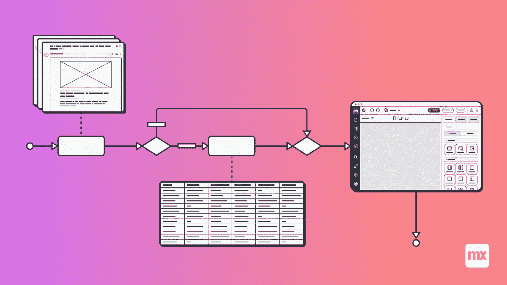
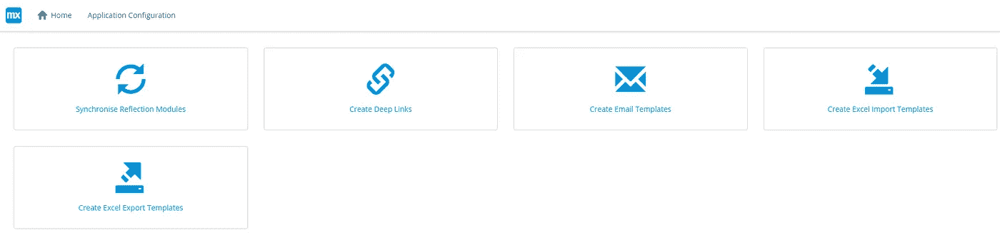
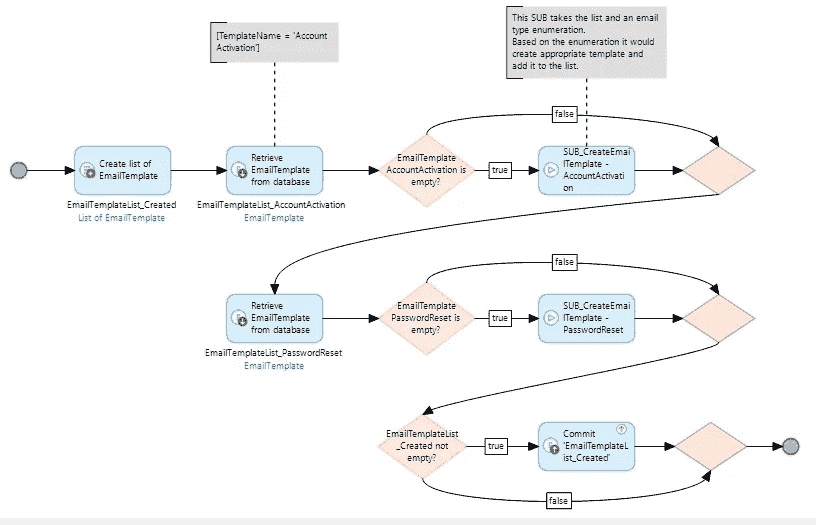

# 为您的 Mendix 应用程序自动配置数据

> 原文：<https://medium.com/mendix/automatically-configuring-data-for-your-mendix-app-b8cac62bd683?source=collection_archive---------5----------------------->

# 当您开始着手第一个 Mendix 项目时，需要考虑的一个重要部分是如何首次在环境之间移动应用程序，以及配置某些应用程序数据可能需要完成的初始设置。

虽然这可能与您开发的任何本地应用程序都不相关，但由于您在开发时自然地设置了配置数据。但是，在不同环境之间移动会迫使您考虑这一点，因为现在您需要确保任何必要的数据都以与本地环境相同的方式设置，以允许特性以正确的方式和开发方式运行。

您可以每次手动设置这些数据，使用各种数据的前端表单。但是，每次迁移到新环境时都必须这样做，这将花费不必要的时间，并且还会带来发生人为错误的风险，因为数据可能会丢失或输入不正确。

在这篇博客中，我将根据我的经验，探索一些你可以使用的自动设置选项，并分享如何最好地实现这一转变！

# 配置数据

对于每个环境，应用程序中的大多数数据都是不同的。例如，在开发数据库中没有实时的客户数据。但是，为了在开发测试和最终部署到生产中保持一致性，有些数据会保持不变。我将把它称为配置数据。以下信息属于此标题下:

*   模块同步
*   电子邮件模板
*   Excel 导入/导出模板
*   深度链接配置

(*这篇博文假设你知道以上是什么以及使用它们涉及到什么，但是关于这些点的更多信息可以在 [Mendix 文档/论坛](https://docs.mendix.com/developerportal/community-tools/mendix-forum)中找到。)

# 避开初学者陷阱！

当您第一次不得不考虑移动数据时，您可能会陷入初学者的陷阱。我自己也陷入了这种情况，认为我可以将不同的微流添加到主“启动后(ASU)”微流中，以检查必要数据的存在，如果找不到就创建它。

虽然这可行，但不是最佳实践方法。只需要在初始设置期间创建数据，ASU 微流将在每次系统需要重新启动以进行部署时运行。一旦创建了数据，就不需要每次都进行更改，因此没有必要在每次系统重新启动时都运行这些检查。如果您确实需要更改此配置数据，您可以临时更改。

这种方法还可能导致环境重启/发布之间的长时间停机，因为每次尝试启动时都必须经过这些过多的检查。这是因为对于配置数据的每一部分，您都需要调用数据库来执行检查。

随着应用程序的开发和新功能的添加，您将需要添加额外的配置数据。这将使每次启动应用程序所需的时间增加。

[https://bit.ly/MXW21](https://bit.ly/MXW21)

# 在不同环境之间轻松移动数据

移动数据最简单的方法是让应用程序的一部分专用于此设置。该部分将包括操作按钮，用于分别运行这些按钮，如下图所示:

由于这些配置按钮有自己单独的部分，您可以轻松地定义访问权限，以确保只有具有正确权限的帐户有权执行这些配置。例如，这些帐户可能包括系统管理员或 MxAdmin。您还可以分割访问权限，以确保某些帐户只能查看和创建他们应该查看和创建的部分。

# 首次发布

我们建议，在新环境中首次发布应用程序时，MxAdmin 帐户只能点击按钮来同步模块和创建电子邮件模板和深层链接。然后可以创建实际的系统管理员，并向他们发送激活电子邮件。

此时，系统管理员将完成 Excel 导入/导出模板的配置或创建，以及应用程序所需的任何其他配置。这样，您就有了适当的职责分离，因为 MxAdmin 帐户仅在初始设置时需要，并且是默认情况下创建的唯一帐户。

您可以定制这些微流来满足您的应用程序的需求，但是本例中使用的微流都遵循一种模式，即检查模板是否存在，以确定是否需要创建它。如果它不存在，那么微流将运行一个子微流，根据它的类型创建模板，然后将它添加到一个总列表中。因此:

这是这个概念的基本版本，您可以在自己的系统中扩展它以满足您的需求。例如，您可以创建一个系统，将这些配置按一定的顺序排队运行，然后让某人激活这个队列，使它们在初始配置期间都按适当的顺序运行。

这将是一个好主意，仍然可以选择单独运行它们，而且毫无疑问，未来会有变化，需要某种新的模板，例如，新的电子邮件类型。在这种情况下，您只需要用相关的模板创建来更新电子邮件模板微流，并让系统管理员在部署更改后只运行电子邮件模板配置按钮。

# 摘要

总之，当您需要将 Mendix 应用程序迁移到新环境时，您需要考虑设置必要配置数据的方法。虽然有多种方法可以做到这一点，但我希望这篇博客已经向您展示了通过设置一个配置区域并让一个系统管理员负责执行设置的最佳方法。你可以使用这个概念作为基础，并根据你的应用程序的需求进行修改。

## 阅读更多

 [## Mendix World 2021 |召集您的应用开发团队 2021 年 9 月 7 日至 9 日

### 好像你需要说服…在一个全球制造商社区，他们想通过探索什么来相互学习…

bit.ly](https://bit.ly/MXW21)  [## 曲目|门迪克斯世界 2021

### 在今年 Mendix World 开幕之前，手工制作您的议程。浏览专为您量身定制的 8 个专题讲座中的 85 个以上专题讲座…

www.mendix.com](https://www.mendix.com/mendix-world/tracks/) 

*来自发布者-*

*如果你喜欢这篇文章，你可以在我们的* [*媒体页面*](https://medium.com/mendix) *或我们自己的* [*社区博客网站*](https://developers.mendix.com/community-blog/) *找到更多类似的文章。*

*希望入门的创客，可以注册一个* [*免费账号*](https://signup.mendix.com/link/signup/?source=direct) *，通过我们的* [*学苑*](https://academy.mendix.com/link/home) *即时获取学习。*

有兴趣更多地参与我们的社区吗？你可以加入我们的 [*Slack 社区频道*](https://join.slack.com/t/mendixcommunity/shared_invite/zt-hwhwkcxu-~59ywyjqHlUHXmrw5heqpQ) *或者想更多参与的人，看看加入我们的* [*遇见 ups*](https://developers.mendix.com/meetups/#meetupsNearYou) *。*