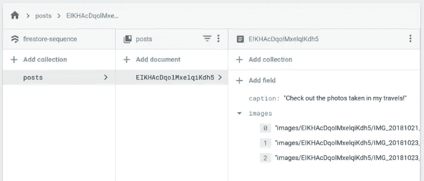
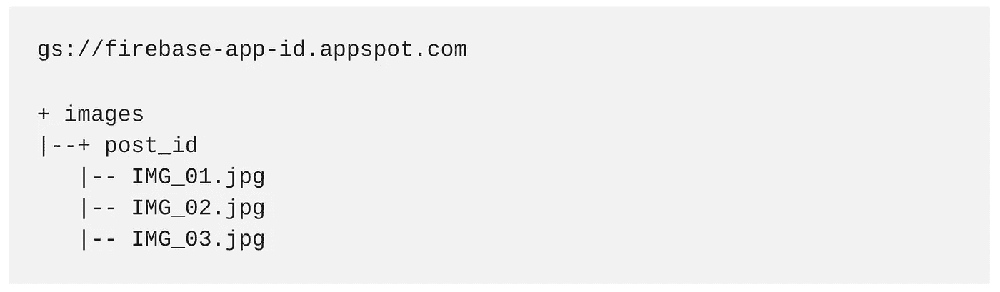

# 使用 Firebase 的云功能从 Firestore 中自动删除 Firebase 存储文件

> 原文：<https://medium.com/google-developer-experts/automatically-delete-your-firebase-storage-files-from-firestore-with-cloud-functions-for-firebase-36542c39ba0d?source=collection_archive---------1----------------------->

举个例子，你有一个漂亮的 Firebase 应用程序，可以让你上传文件，这些文件保存在 Firebase 存储中，并把文件的路径写入 Firestore 文档或集合。然后，用户将能够从您的应用程序中查看这些文件。

然而，也有用户删除这些文档或集合的用例，但这不会删除存储中的文件。因此，如果你不做一些家务，你的储存很快就会用完。

# 云功能可助您一臂之力！

Firebase 的云函数允许您编写可以通过触发器执行的代码，即 HTTP 触发器和后台触发器。使用云功能，您可以处理云 Firestore 中的事件，比如每次创建、更新或删除文档时。让我们进一步探索我们的用例。

# 现在是示范时间！

这里我有一个 Cloud Firestore，收藏名为`posts`。每个 post 都有一个`caption`和一个`images`数组，其中基本上包含了存储桶的图像路径。这样，当我在应用程序上加载内容时，我可以使用路径来获取图像并显示它们。

Cloud Firestore schema

Firebase Storage bucket structure

Finally here’s how the app looks like!

# 删除文件夹中的所有文件

当用户点击删除按钮时，我们实际上发出了一个`documentReference.delete()`来删除 Firestore 上的帖子。这本身不会对存储中的文件产生任何影响。为了实现这一点，让我们编写一个云函数来删除与这篇文章完全相关的文件夹:

**注意:这是用打字稿写的。**

当`document("posts/{postId}")`上有`onDelete()`删除时，我们触发后台功能。`postId`是被用户删除的文档的键，我们可以从`context.params`中获取。

我们可以使用 **Firebase Admin SDK** 中提供的 **Google 云存储 API**来访问存储桶并删除文件，而不是遍历您的`post.images`属性来逐个删除文件。`**prefix**`允许你指定路径，以便它只删除你想要的文件，因为我们的存储结构利用`postId`来轻松地分隔后图像。

> 附注:请注意，我们在初始化时不需要向 Firebase Admin SDK 提供凭证，因为云 Firestore 和实时数据库触发器已经有足够的凭证，不需要额外的设置。这不是很棒吗？

# 删除文件夹中的一些文件

有时，用户只想删除文档中的一些图像，而不是全部图像，这些文件也应该从存储器中删除:

注意:这是用打字稿写的。

在这里，我们实际上是在听`onUpdate()`，因为我们已经用较少的照片更新了`images`字段。`**onUpdate**` **为您提供** **更新发生前和更新后的数据快照。**通过这种方式，您可以比较并找出哪些图像被删除，然后遍历以准备删除数据。最后`Promise.all`让我们确保每个图像删除的所有承诺都已解决。

> 附注:如果您有大量图像要删除，我会创建一个名为 images 的集合，而不是使用一个字符串数组来保存所有这些图像，这样我就可以轻松地连接`onDelete`事件处理程序来监听`posts/{postId}/images/{imageId}`以获得要删除的确切的`imageId`图像，这样我就不需要编写更多的逻辑来判断哪些图像被删除了。

# 演示时间！

请观看此视频，了解实际运行的代码。

# 结论

Firebase 的云功能提供了创建一个真正的无服务器应用程序所需的东西，并扩展了在 Firebase 中做更多事情的可能性。我强烈建议您查阅[文档](https://firebase.google.com/docs/functions/)并了解您可以利用 Firebase 的云功能实现什么。