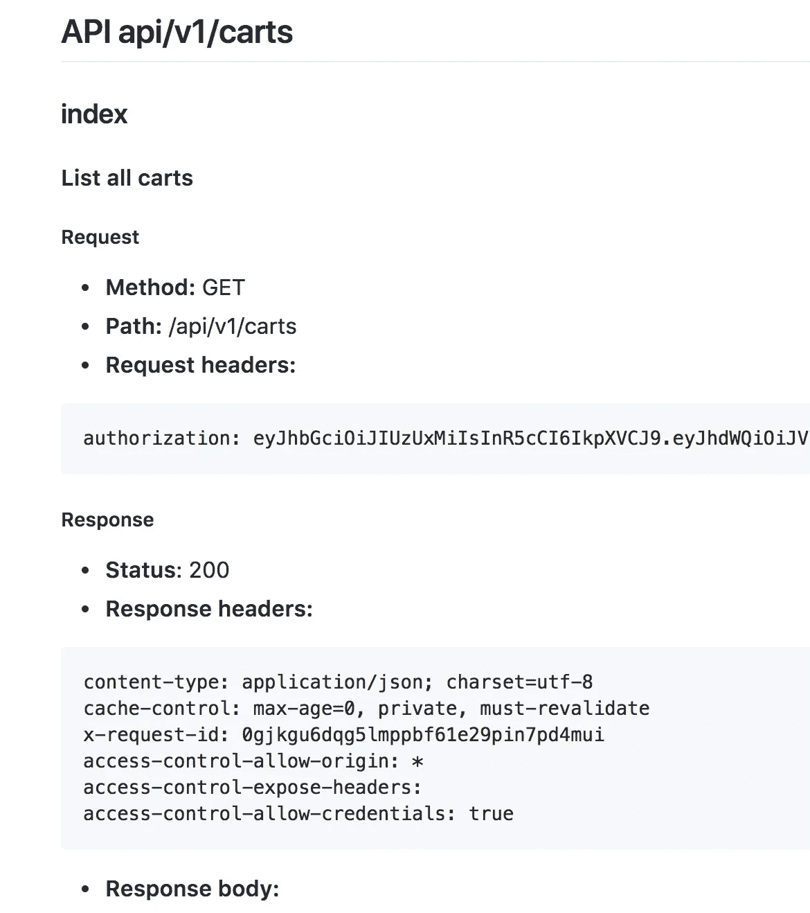
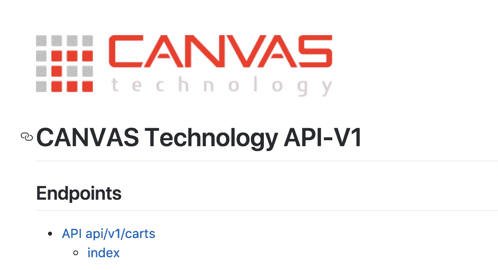
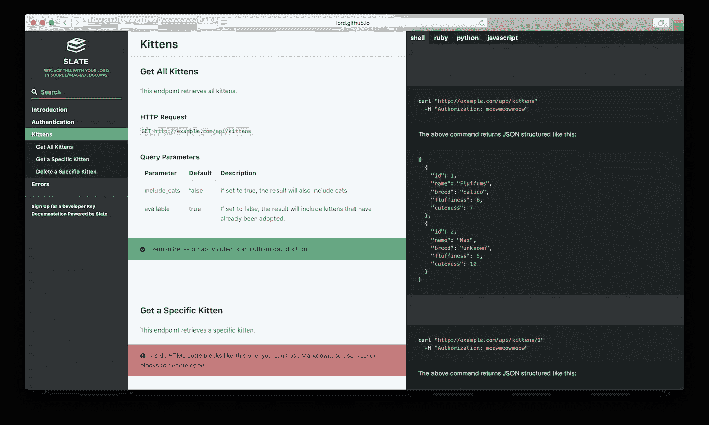

# 自动生成酏剂 API 文档

> 原文：<https://medium.com/quick-code/automatically-generate-elixir-api-docs-986ad60721e7?source=collection_archive---------0----------------------->

## 官僚简介

## 首先,(非常)简要地介绍一下长生不老药

[Elixir](https://en.wikipedia.org/wiki/Elixir_(programming_language)) 是一种高效、可读、可扩展的语言；非常适合构建 API。它被设计成容错的，使用单独的筒仓进程来防止孤立的错误引起应用程序范围的错误。在 Elixir 中构建应用程序最流行的框架是 Phoenix，它的设计感觉就像 Rails。Elixir 编译为 [erlang](https://en.wikipedia.org/wiki/Erlang_(programming_language)) ，这是一种(相对)古老的语言，根据维基百科，它最早出现在 1986 年。人们花了 30 年才发现它的价值，但现在凭借其新鲜的灵药包装和 Ruby-ish 语法，它已经成为各地大公司的基石。

我将把关于 Elixir 比 Ruby 更快/更有效的细节留给更有资格的专业人员，但是我想为没有背景知识的读者简单介绍一下这个主题。

## 什么是官僚？

[官僚](https://github.com/api-hogs/bureaucrat)是一个你可以添加到你的 Phoenix 项目中的依赖项，它将使用你的测试(是的，你必须写测试…)来自动编译 api 文档。随着端点的添加或更改，这个方便的工具将重新生成 markdown(或带有一些定制的 HTML ),因此没有人需要完成确保文档是最新的这一令人羡慕的任务。

该软件包缺乏适当的文档，按照 github 上的自述文件将会不可避免地把你引入歧途。正是这种困惑激励我花点时间整理我的想法，希望它能帮助其他人避免一些相当恼人的缺点。

## 基本实现

官僚可以用简单的内置减价软件编写基本的减价程序。该配置看起来

```
# in test/test_helper.exsBureaucrat.start(
 writer: Bureaucrat.MarkdownWriter,
 default_path: "docs/api-v1.md",
 paths: [],
 titles: [
  {ApplicationCartController, "API /carts"},
  {Canvaserver.V1.RouteController, "API /routes"},  
  {Canvaserver.V1.WaypointController, "API /waypoints"},  
  {Canvaserver.V1.ChargerController, "API /chargers"}],
  env_var: "DOC"
)# titles add extra metadata to alias controllers# add Bureaucrat formatter to ExUnit.start()ExUnit.start(formatters: [ExUnit.CLIFormatter, Bureaucrat.Formatter])
```



现在，我们所需要做的就是添加一个文档调用到我们想要被记录的端点测试，这样我们的基本文档就完成了！

```
conn = conn
 |> api_login(user) # helper method
 |> get(v1_cart_path(conn, :index))
 |> doc(description: "List all carts")# description is an extra option for basic metadata with the basic bureaucrat implementation# calling tests, include the DOC=1 flag to trigger bureaucrat
DOC=1 mix test
```



使用 _intro 保存在目标文件夹中的任何文件都会自动包含在输出文件的开头，因此您可以进行一些自定义。

这是 markdown writer 内置的官僚程序所能达到的最好效果。

## 神气活现的官僚

官僚主义者提供了第二种选择，用 SwaggerSlateMarkdown writer 生成文档。这种方法的配置如下所示:

```
Bureaucrat.start(
 writer: Bureaucrat.SwaggerSlateMarkdownWriter,
 default_path: "ext/doc/source/index.html.md",
 swagger: "swagger.json" |> File.read!() |> Poison.decode!()
)# default_path points to a cloned slate project
# swagger points to a generated swagger.json fileExUnit.start(formatters: [ExUnit.CLIFormatter, Bureaucrat.Formatter])
```

遵循开放 API 语法，或普遍接受的语言来记录 API 的目的和用途。 [PhoenixSwagger](https://github.com/xerions/phoenix_swagger) 允许我们在控制器中填充这些元数据，并执行一个命令来生成 swagger.json 文件。安装步骤可以在上面的链接中找到，但这里有一个如何使用它的例子。

```
# import PhoenixSwagger before using to gain access to swagger_path and swagger_definition methodsuse PhoenixSwagger# define basic get all carts methodswagger_path :index do
  get "api/v1/carts"
  summary "Query for carts"
  description "Query returns all carts"
  produces "application/json"
  tag "Carts"
  operation_id "list_carts" # used to link to test examples
  parameters do
    authorization :header, :string, "authorization token", required: true
  end
  # define expected parameters
  response 200, "OK", **Schema.ref(:CartsResponse)**
  response 400, "Client Error" # define responses
end
```

我们还可以定义模式，所以我可以简单地告诉用户，如果他们感兴趣，我将返回一个购物车数组并链接到购物车的结构。

```
def swagger_definitions do
 CartsResponse: swagger_schema do
   title "Carts Response"
   description "response template for carts"
   properties do
     success :boolean, "success boolean", required: true
     data :array, "array of carts", items: Schema.ref(:Cart), required: true
   end
 end
end# we would then have to define :Cart
```

这些数据模型在输出中有很好的超链接。假设一切都已正确配置，您可以通过为您的项目调整这个脚本并运行。

```
mix phx.swagger.generate --router Application.Router --endpoint Application.Endpoint
```

您的 swagger.json 文件现在应该填充了在 *swagger_definition* 语句中定义的所有模型，在 *swagger_path* 语句中定义的所有路径，以及您的测试中引用的所有示例。

```
# ...in tests...|> doc(operation_id: "list_carts")# refers to operation_id in swagger_path
```

下一步是将 json 转换成一个漂亮的交互式文档。

## 通过 Swagger.json 使用 Slate

[石板](https://github.com/lord/slate)要靠红宝石，邦德勒，中间人。对于某些人来说，这可能会导致部署过程中出现问题，但对于大多数人来说，这只是一次性的不便。



输出是一个干净的交互式文档，任何开发人员都会乐于使用。

现在，当我们再次在测试脚本中包含 DOC=1 时，官僚将为我们做两件事:

*   用测试库中的例子更新 swagger.json
*   用 swagger.json 的最终内容更新 slate index.html.md 文件

剩下要做的就是重建石板回购:

```
# /doc/bundle exec middleman build
```

您可以在浏览器中打开 index.html.md 文件，并(希望)开始与您的文档进行交互。

## 把所有的事情都联系起来

这篇文章失去了控制，但是这里的总体思想是自动化文档。帮助未来的开发人员，尤其是您自己，避免更新文档的单调任务，确保这些文档保持最新。最新的文档确保顾客和客户能够尽他们最大的能力使用您的服务，而您的企业不必处理来自问题和议题的流失。

一如既往，欢迎对这些帖子的反馈。如果你发现任何误导或困惑，请让我知道，这样我就可以更新这个帖子。