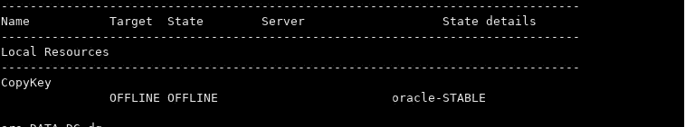

# 使用 Oracle 集群件资源和 Hashicorp Vault 自动管理和维护 Oracle 透明数据库加密机密

> 原文：<https://medium.com/version-1/automatically-manage-and-maintain-oracle-transparent-database-encryption-secrets-using-oracle-6f4bfdaa1956?source=collection_archive---------2----------------------->

# **背景**

几年前，第 1 版的一个客户做出了一个战略决策，让所有 Oracle 数据库使用数据库加密技术作为加密标准的一部分，独立于磁盘/存储的静态/传输中加密标准。为了实现这一目标，我们采用了 Oracle 的 TDE 解决方案，目前正在所有 Oracle 数据库上使用，包括内部部署和云平台。

# **问题陈述**

TDE 使用数据库启动期间需要在钱包中可用的加密密钥，如果密钥缺失或丢失，Oracle 的数据库将无法恢复。

在整个客户状态中，Oracle wallets 是在本地数据库服务器上创建和存储的，并使用标准密钥，因此如果有人进入主机并获得一个密钥，他们就可以访问所有数据库中的数据。因此，作为加强数据安全措施的战略性解决方案，客户决定从本地钱包中取出 TDE 密钥，并将其保存在保险库中。要求是将 TDE 与 Hashicorp vault 集成为一个钱包安全解决方案。为此使用 Hashicorp vault 的原因是为了保持该解决方案与云无关。

***下面是关键技术要求:***

1.  将 TDE 加密密钥从本地钱包上传到保管库。
2.  将 TDE 加密密钥从保险箱下载到本地钱包并成功启动数据库。
3.  打开数据库和加密钱包后删除密钥。
4.  在数据库启动并运行后，持续扫描 wallet，并确保本地 wallet 中没有密钥。

# **解决方案**

TDE 保险库集成解决方案对于客户的安全性和加密密钥管理非常重要，因为它将在所有其他项目中使用。

解决方案是使用 b64 加密将二进制文件上传到 vault 或从 vault 下载二进制文件。

## **上传 Hashicorp 金库的本地钱包**

wallet_upload.sh

*cat<path _ to _ wallet _ location>/cwallet . SSO | base64 | vault kv put<path _ to _ secret>cwallet . SSO =-*

*cat<path _ to _ wallet _ location>/e wallet . p12 | base64 | vault kv patch<path _ to _ secret>e wallet . p12 =-*

## **从 Hashicorp 金库下载密钥到本地钱包**

钱包 _ 下载. sh

*vault kv get-field = cwallet . SSO kv/<path _ to _ secret>| base64—decode><path _ to _ wallet _ location>/cwallet . SSO*

*vault kv get-field = e wallet . p12 kv/<path _ to _ secret>| base64—decode><path _ to _ wallet _ location>/e wallet . p12*

之后，有了这个解决方案，我们通过创建一个完全集成的 Oracle 集群件资源来自动化上传和下载密钥的过程。

***该自动化以给定的顺序无缝执行以下任务:***

1.  在资源调配期间将 TDE 钱包上传到 Vault。
2.  移除本地 TDE 钱包
3.  在数据库启动期间从保管库下载钱包。
4.  数据库启动后删除本地 TDE 钱包。
5.  连续扫描本地钱包并删除密钥(如果可用)。

## **安装步骤**

1.  为 TDE 钥匙设置保险库
2.  将 iam_role 授予“网格”用户以允许 vault 访问
3.  添加新的群集复制密钥资源。

**crsctl** 添加资源 CopyKey-type local _ resource-attr " ACTION _ SCRIPT =<SCRIPT _ location>/<manage _ key _ SCRIPT>。sh "

4.修改数据库群集资源以更改 START_DEPENDENCIES 包括 CopyKey 资源。

*crsctl 修饰资源 ora。< db_resource >。db-attr " START _ DELENDERS = ' hard(ora)。DATA_DG.dg，ora。REDO_DG.dg，ora。FRA_DG.dg，CopyKey)上拉(ora。DATA_DG.dg，ora。REDO_DG.dg，ora。FRA_DG.dg，CopyKey)弱(类型:ora.listener.type，uniform:ora.ons)'"*

5.修改 CopyKey 群集资源以更改数据库资源上的 STOP_DEPENDENCIES

*crsctl 修改资源 CopyKey-attr " STOP _ DEPENDENCIES = ' hard(关机:ora。< db_resource >。db，中间值:ora。< db_resource >。db，关机:ora。< db_resource >。db，关机:ora。< db_resource >。db)'"*

# **保险金**

*   成本效益
*   云不可知
*   全自动解决方案
*   最佳支持标准
*   简化的钱包操作

**关于作者:** Fawad Haider 是第 1 版的神谕师。