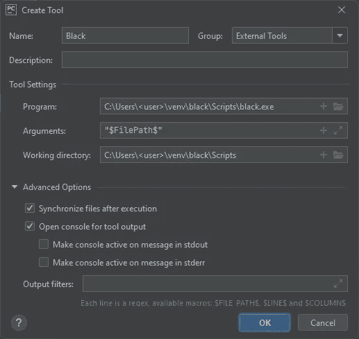
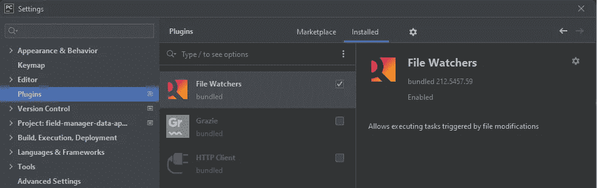
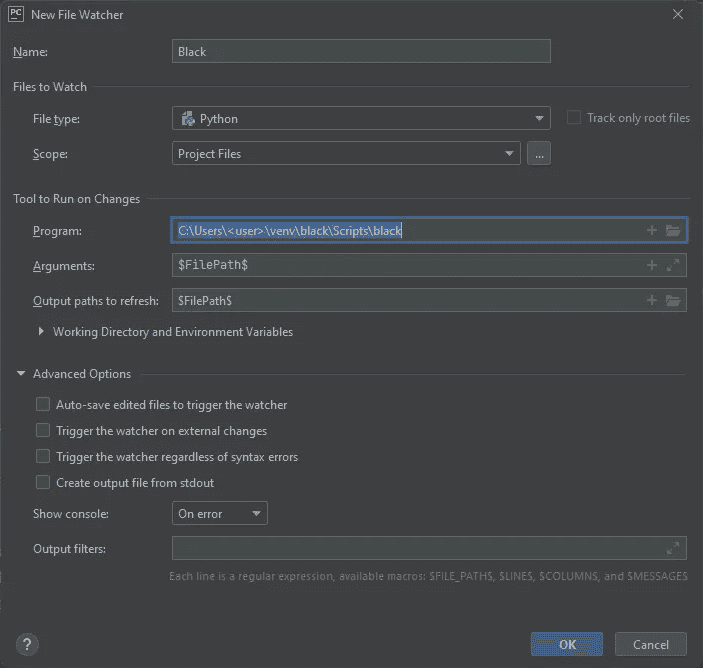
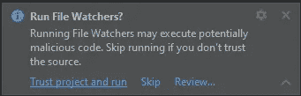

# 在 Windows 上的 PyCharm 中自动运行黑色

> 原文：<https://medium.com/compendium/automatically-run-black-in-pycharm-on-windows-d2eab855a918?source=collection_archive---------0----------------------->


# (2021 年 12 月)

从 2022 年 12 月开始的更新和更短的版本是[这里是](/@josteinleira/automatically-run-black-in-pycharm-on-windows-december-2022-746d7b06ef52)。

我经常忘记在将代码提交给 git 之前运行代码格式化程序。这是不好的，因为下面的提交将包含不相关的格式更改。

我希望代码格式化程序自动运行。我听说过 git 预提交挂钩，但从未在 Windows 上使用过。

以下是安装步骤:

# 概观

1.  在 Windows 上安装系统 Python
2.  为黑色格式化程序创建虚拟环境
3.  在 PyCharm 的外部工具中添加黑色(可选步骤)
4.  启用 PyCharm 中的文件监视器插件

# 在 Windows 上安装系统 Python

您需要在系统上安装 Python。去 python.org[下载并安装，如果还没好的话。您需要知道下一步(下面的创建虚拟环境)的 python.exe 文件的路径。](https://python.org)

在 Windows 上，如果我能控制的话，我不会让任何安装程序把自己加入到路径中。对 Python 也有效，所以我们必须找到系统 python.exe 文件。

打开命令提示符窗口并运行“dir \python.exe /s”:

```
C:\>dir \python.exe /s(ignore any virtual environment ones)(ignore Windows apps)This is the one:Directory of **C:\Users\<user>\AppData\Local\Programs\Python\Python39**30.08.2021  20:36           101 608 **python.exe**1 File(s)        101 608 bytes
```

注意到到 python.exe 的 **<完整路径>** ，用你的实际用户名代替<用户>。

```
**C:\Users\<user>\AppData\Local\Programs\Python\Python39**
```

通过使用版本选项“-V”运行 python.exe，检查它是否是您想要的。

```
**<full path>\python -V
Python 3.9.7**
```

# 为黑色格式化程序创建虚拟环境

我总是为新的应用程序创建一个新的虚拟环境，而不是扰乱系统 Python 或其他应用程序。

将末尾的目标路径更改为您想要的路径，然后运行命令:

```
<full path>\python -m venv C:\Users\**<user>**\venv\black
```

然后在新的虚拟环境中安装黑色包。

```
**C:\Users\<user>\venv\black**\Scripts\pip install black
```

# 在 PyCharm 的外部工具中添加黑色

如果您只想自动格式化，而不想从 PyCharm 菜单中选择运行黑色，这是一个可选步骤。

进入设置|工具|外部工具，将 Balck 添加到 PyCharm 的外部工具中。选择+创建新的工具条目:



Settings | Tools | External Tools | + (Add)

填写字段:

```
Name: Black
Program: C:\Users\<user>\venv\black\Scripts\black.exe
Arguments: "$FilePath$"
```

如果您想重新格式化当前文件，新工具现在可以从主菜单中获得:工具|外部工具|黑色。

# 启用 PyCharm 中的文件监视器插件

文件监视插件与 PyCharm 捆绑在一起。首先，我们需要启用插件。选择菜单选项设置|插件|文件观察器|启用。



Settings | Plugins | File Watchers | Enable

然后进入菜单选项设置|工具|文件观察器| +(添加<custom>模板)创建一个新的文件观察器。</custom>



Settings | Tools | File Watchers | + (Add)

填写字段:

```
Name: Black
File type: Python
Scope: Project Files
Program: C:\Users\<user>\venv\black\Scripts\black
Arguments: "$FilePath$"
Output paths to refresh: "$FilePath$"
Uncheck all advanced options.
```

当你的文件改变时，文件监视插件将会显示为黑色。

# 摘要

我体验到在安装过程中一些 PyCharm 重启是必要的。安装后，我还收到了以下警告:



# 来源

黑色文档:[黑色编辑器集成](https://black.readthedocs.io/en/stable/integrations/editors.html#pycharm-intellij-idea)

PyCharm 徽标版权所有 2000–2021 JetBrains s.r.o . JetBrains 和 JetBrains 徽标是 JetBrains s . r . o .的注册商标

黑色标志版权所有 2018 年

Windows 徽标版权所有 2021 Microsoft