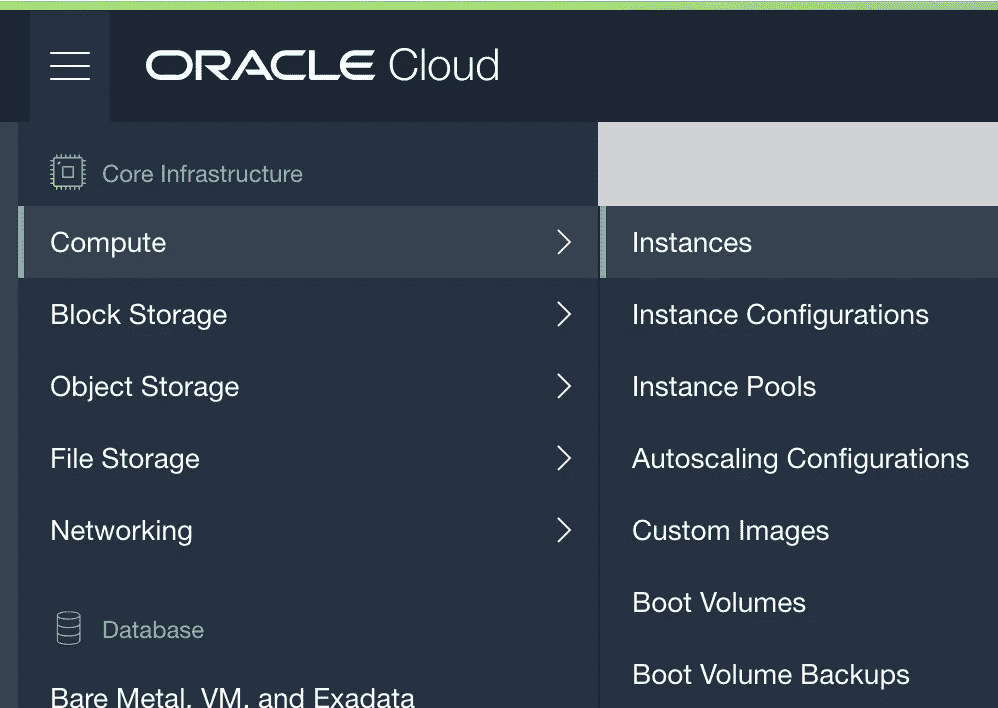
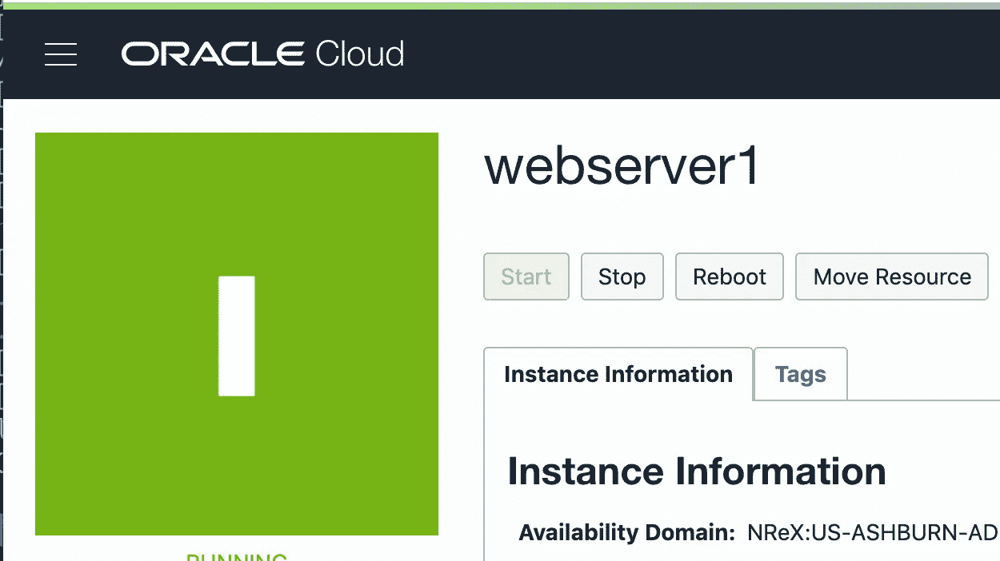

# 2.自动启动您的 Web 服务器

> 原文：<https://medium.com/oracledevs/automatically-starting-your-web-server-2b7b793dfcb4?source=collection_archive---------0----------------------->


在本系列的第一部分中，我向您展示了如何注册 Oracle Cloud Infrastructure (OCI)的免费试用版，以及如何创建一个简单的 web 服务器并部署到云中。在本文中，我将向您展示如何在实例重启时自动启动 web 服务器。这一点很重要，因为在大规模情况下，您不希望手动 SSH 到每个服务器实例并启动 web 服务器。

请注意，这篇文章假设你有一个 OCI 的试用账户，并且你已经完成了第一篇文章中概述的所有步骤。本文直接建立在第一篇文章的基础上。

# 将 Web 服务器配置为自动启动

我们需要 web 服务器在服务器启动或重启时自动启动。为此，我们需要创建一个系统服务。SSH 进入 ***webserver1*** 实例并执行以下命令:

```
cd /etc/systemd/system
sudo vi starthelloserver.service
```

下面是***starthello server . service***脚本的内容:

```
[Unit]
Description=Start the Node helloserver web server on startup[Service]
Type=oneshot
ExecStart=/home/opc/node-v12.7.0-linux-x64/bin/node /home/opc/helloserver/index.js
StandardOutput=syslog
StandardError=syslog
RemainAfterExit=yes[Install]
WantedBy=multi-user.target
```

请注意， ***ExecStart*** 行在本文中可能出现在 2 行中，但它实际上是单行，显示了到 ***节点*** 程序的完整路径和到 ***index.js*** 程序的完整路径。如果你从上面的源代码中复制粘贴，应该会很好。保存文件。现在，您需要使用以下命令激活服务:

```
sudo systemctl enable starthelloserver.service
```

现在，让我们确保脚本工作正常。登录你在 https://cloud.oracle.com 的审判实例。使用浏览器屏幕左上角的菜单导航到计算实例，并选择计算->实例



点击您的 ***webserver1*** 实例查看详情。靠近屏幕上方是一个 ***重启*** 按钮。现在点击那个按钮。



计算实例状态将更改为停止，然后迅速返回运行状态。一旦计算实例再次处于运行状态，打开浏览器访问 URL http:// <your public="" ip="">:3000，您应该会看到 ***Healthy*** 消息。</your>

# 就这些了！

尽管这很简单，但我还是花了一番功夫才弄明白。多年来，Linux 自动运行脚本或服务的方法已经发生了变化，网上有太多过时的信息，这些信息已经不再有效。如果你是 Linux 专家，知道更好的方法，请在评论中告诉我。

## 正误表

当我今天第一次发表这篇文章时，它在 starthelloserver.service 文件中包含了一个 bug。我去掉了超时指令，让它在 300 秒后继续运行！如果你以某种方式获得了这个故事的最初版本，请放心，它现在都工作正常。