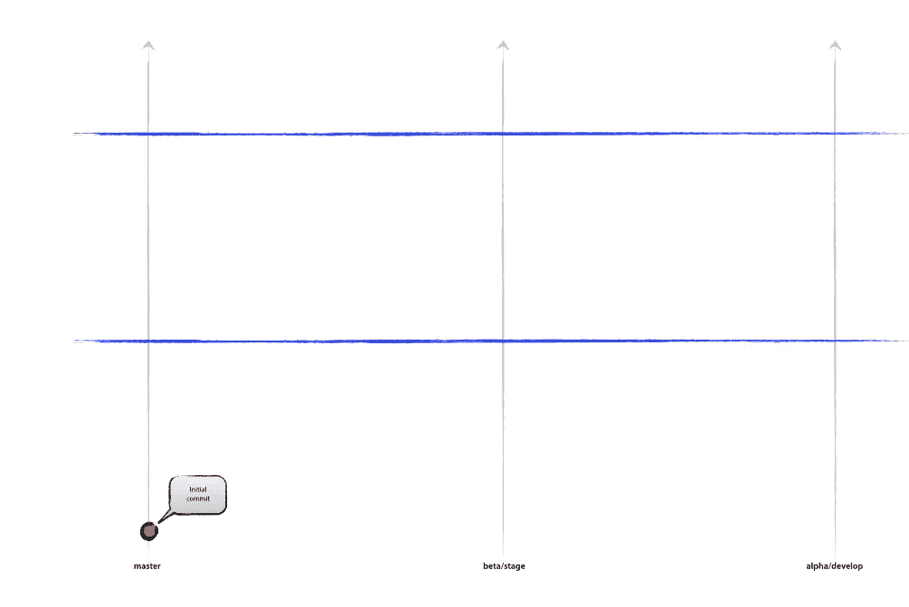
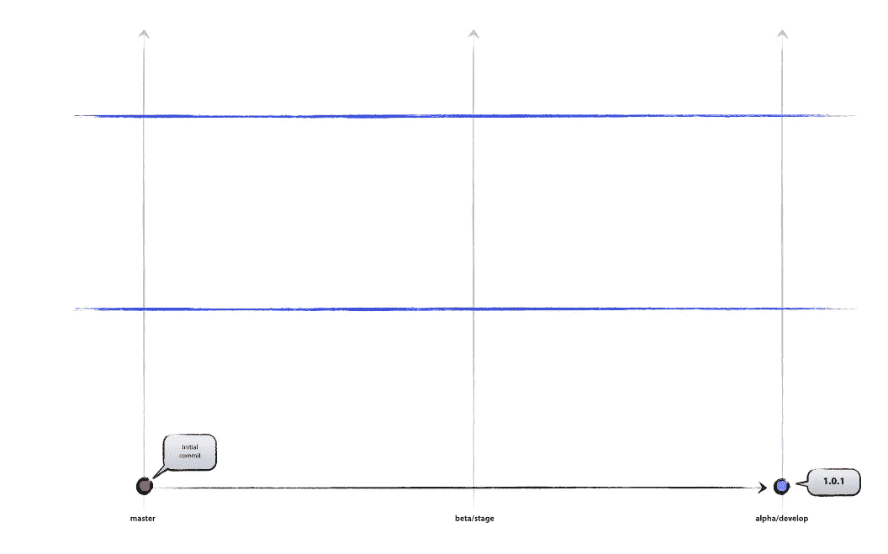
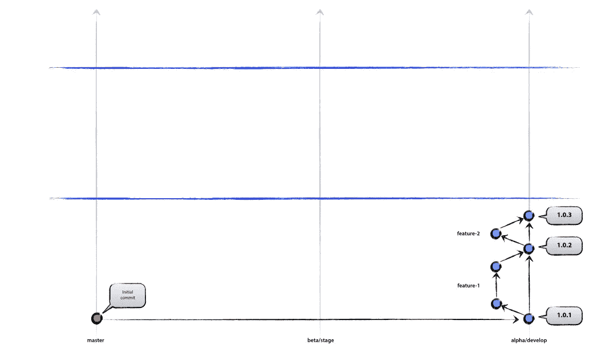
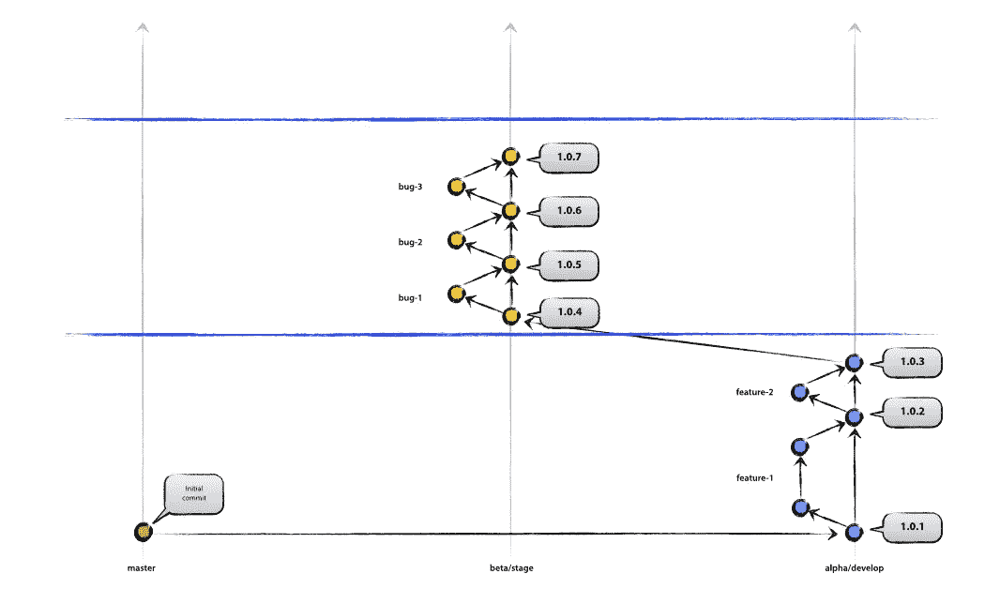
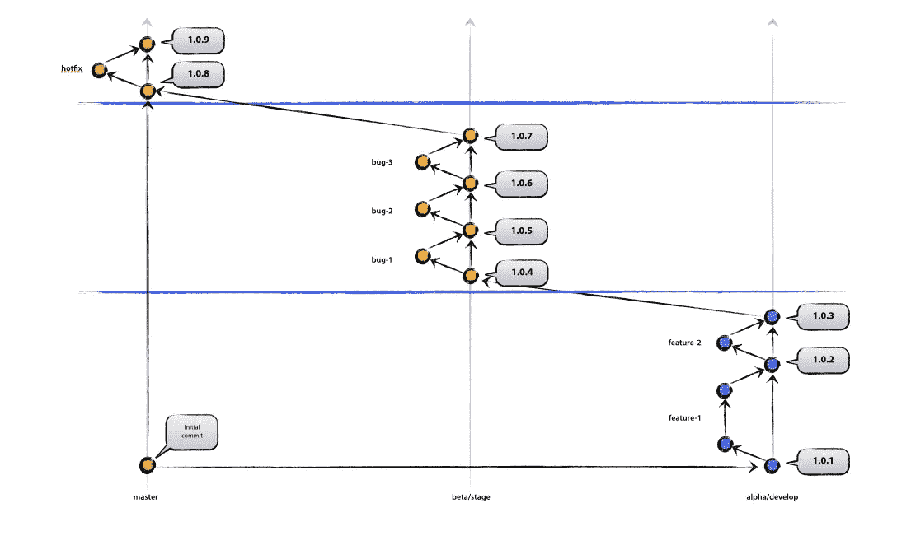
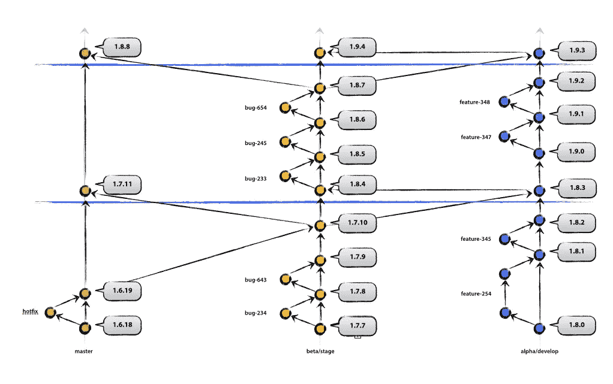
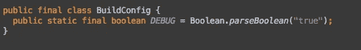
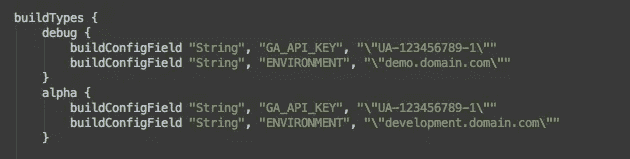
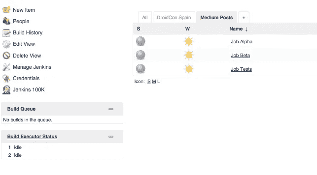
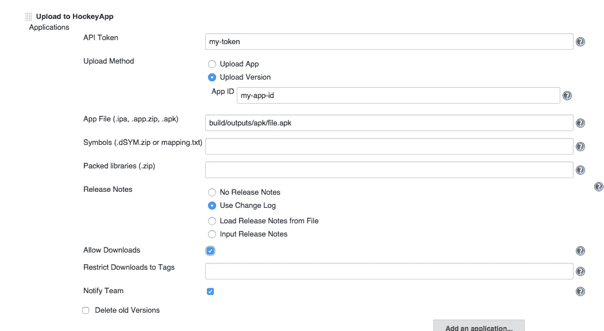

# 自动化 Android 开发

> 原文：<https://medium.com/google-developer-experts/automating-android-development-6daca3a98396?source=collection_archive---------0----------------------->

我最近在西班牙机器人大会和 T2 机器人大会上谈论如何自动化传统的 Android 工作流程。令我惊讶的是，仍然有许多组织缺乏持续集成(CI)战略。这是大错特错！我决定用文字写下我对如何有效实施 CI 的想法。

作为一名软件工程师，你的目标是自动化尽可能多的过程。机器比人更有效率:它们既不需要食物也不需要睡眠，它们执行任务时不会出错，而且它们让你的生活更轻松。*努力工作是为了少干活*。

尽管如此，持续集成是一个复杂的领域，它涉及许多分散的不同点，您需要将它们放在一起。你需要谈论吉拉，你需要提到测试和分支，你需要编写脚本和构建。

我想在这篇文章中加入一些大的内容。他们每个人都应该有一个单独的帖子来解释他们是如何工作的，但这不是这篇帖子的目的。其目的是向您展示每种方法的基础，以及如何将它们结合起来。

1.  -定义分支策略。
2.  -使用敏捷方法
3.  - Gradle 和构建脚本
4.  -测试
5.  -使用 CI 服务器。

# 分支策略

分支很重要。当你和一群人一起构建一个新产品时，你想要建立一个关于如何工作的协议。人们应该如何提交他们的功能？我们如何释放？我们如何确保我们没有打破东西？要回答这些问题，您需要采用分支策略。

我使用的是 Vincent Driessen 提出的分支策略的一个分支，略有修改。让我们为我们的应用程序考虑三种状态: **alpha** 、 **beta** 和 **release** 。

**Alpha** 是您的系统在开发时的状态。

**测试版**在您的功能被批准和合并时出现。

**版本**是系统交付时的状态。

(有些人喜欢把 alpha 称为“开发”，beta 称为“阶段”。我觉得希腊字母表的字母总是比较酷)。

下图显示了项目的最初状态。您已经向主分支进行了初始提交。

Our system is just starting. There is a first commit in master, and the other branches still empty

该工作了。你需要从这个初始状态转移到开发阶段。这将是您的版本 1.0.1。

At this point, alpha is exactly the same as master.

现在，您将开始处理功能。对于每个特性，您将创建一个特性分支。这里使用正确的命名很重要，有几种方法可以做到这一点。如果你使用的是像[吉拉](https://www.atlassian.com/software/jira)这样的问题跟踪系统，你可能会有一个与某个功能相关联的标签名称(可能是功能-123)。当我提交特性时，我会在提交消息中包含分支名称，并添加完整的描述。

*[功能-123]创建一个执行动作的新屏幕。*

请注意，分支中的每个单独项目都有自己的版本号。你也可以使用 [git 标签](http://git-scm.com/book/en/v2/Git-Basics-Tagging)来控制版本。

某个功能完成后，将会打开一个拉动式请求，以便您组织中的其他成员可以批准它。这是确保您交付高质量软件的关键部分。在 [Sixt](http://www.sixt.de/mobileapps/) 另一个成员被分配到你的代码评审中，这个人将会检查你的全部代码。我们确保我们的代码符合我们的[编码约定](https://speakerdeck.com/kikoso/android-coding-guidelines)，并且我们对过程非常严格——拉请求中的典型注释强调了 XML 文件中有额外的空间。我们对命名进行评论(“功能的名称我不清楚”)，检查我们的设计是否像素完美(“您的文本视图的颜色是#DCDCDC，但设计是#DEDEDE”)，并有一个功能测试来检查该功能是否涵盖问题跟踪器中写的验收标准。我们甚至经历了一些关于空变量的哲学讨论。这听起来很烦人，但是很有趣。如果它被热情地完成了，当你的代码进入生产阶段时，你知道你正在提交高质量的代码。

# 冲刺和迭代

你可能会使用 [SCRUM](http://en.wikipedia.org/wiki/Scrum_(software_development)) 、[看板](http://en.wikipedia.org/wiki/Kanban_(development))或其他敏捷方法。通常你会在几周的冲刺中工作。我们认为将冲刺分成两周是一个好主意:第一周用于开发特性，而第二周将稳定在第一次冲刺中创建的特性。在第二次冲刺中，我们将修复我们发现的错误，实现像素完美的布局，或者改进-重构我们的代码。这项工作在 beta/stage 分支中完成。下图以图形方式展示了它

The yellow dots belong to the bug fixing and stabilisation sprint

如果你遵循我们的约定，在 sprint 结束时，你将有一个可交付的成果。该交付物将是一个准备在谷歌 Play 商店出版的文件。此时，我们应用程序的最后一个版本已经合并到 master 中。

另一个重要的主题是如何创建一个修补程序。我们的模型试图通过代码审查和第二周的错误修复和产品稳定来阻止他们，但是错误还是发生了。当这种情况发生在生产中时，该模型要求直接在主分支中修复 bug。

你知道这个模型里有一面旗子吗？对，就是这样！修补程序不在我们的 alpha 和 beta 分支中。经过修复和稳定期(第二周)后，我们的 alpha 分支处于旧状态，bug 仍然存在。我们需要将每个分支合并到紧挨着右边的分支中，从而确保每个修复都出现在所有分支中。

难以理解？可能比付诸实践更难读懂。如果你还没有分支策略，就试着用这个模型开发一个特性。你会看到这是很容易的工作，你甚至会开始定制它！

# Gradle 和脚本

现在您已经阅读了分支模型，我们准备继续讨论下一步。Gradle 是一个可以帮助我们自动完成很多事情的工具。你可能很熟悉 Gradle(或者这个家族的成员 Maven 和 Ant)。Gradle 是一个项目自动化工具，我们将在构建应用程序时使用它来执行功能和定义属性。Gradle 引入了一种基于 Groovy 的领域语言，使用它的极限基本上是我们的想象力。

我之前写了一篇[文章](http://codetalk.de/?p=112)，介绍了一些使用 Gradle 的技巧。其中一些将有助于你的申请，但还有一些我一直在申请，我想在这里介绍一下。

## BuildConfig 的威力

*BuildConfig* 是我们编译 Android 应用时自动生成的文件。默认情况下，该文件如下所示:

BuildConfig 包含一个名为 **DEBUG** 的字段，指示应用程序是否已经在调试模式下编译。这个文件是高度可定制的，这在我们处理不同的构建类型时非常方便。

一个应用程序通常使用[谷歌分析](http://www.google.com/analytics/ce/mws/)、 [Crashlytics](https://try.crashlytics.com/) 或其他平台来跟踪其行为。我们可能不希望在开发应用程序时影响这些指标(想象一个用户界面测试，每天自动发布，跟踪您的登录屏幕？).根据我们想要自动使用的构建，我们也可能有不同的域(例如 development.domain.com，staging . domain . com……)。如何才能干净利落地做到这一点？轻松点。在 Gradle 的字段构建类型中，我们可以添加任何我们想要的新字段。这些字段将在以后通过 BuildConfig(这意味着，使用 BuildType。字段我们可以阅读它们)。

在[这篇文章](http://codetalk.de/?p=112)中，我展示了如何使用不同的图标以及如何改变包名。使用它，我们可以安装不同版本的应用程序。这是非常方便的，可以同时看到我们的测试版、阿尔法版和发布版。

# 测试

测试本身是一个完整的学科，可以有自己的媒介。当我们谈论测试时，我们谈论模仿组件、UI 和集成测试、工具和所有可用于 Android 的不同框架。

测试非常重要，因为它防止开发人员破坏现有的东西。如果没有测试，当我们开发新功能时，我们很容易破坏旧功能。当新功能提交时，很难手动测试整个系统，但是自动测试更容易控制系统的稳定性。

有许多不同的测试可以在移动设备中执行:仅列举几个，我们可以想到集成测试、功能测试、性能或 UI 测试。每个都有不同的功能，并且它们通常被定期触发，以确保新的功能不会破坏或降低系统。

为了展示一个关于测试如何集成到 Jenkins 中的基本示例(以及它们如何在出错时实现停止构建的功能),我们将展示一个用 [Espresso](https://code.google.com/p/android-test-kit/wiki/Espresso) 完成的 UI 测试的小示例，该测试在每次 Jenkins 中构建我们的 Android 应用程序时进行测试。

# 示例应用程序

我已经创建了一个小的示例应用程序，并上传到了 [GitHub](https://github.com/kikoso/Android-Testing-Espresso) ，所以你可以在那里查看。还有一些带有命名约定和拉请求的分支，您可以在那里查看到目前为止解释的所有内容。这个应用程序相当简单:它有一个带有文本视图的屏幕。在文件[MainActivityInstrumentationTest](https://github.com/kikoso/Android-Testing-Espresso/blob/master/src/androidTest/java/com/dropsport/espressoreadyproject/tests/MainActivityInstrumentationTest.java)中还执行了三个 UI 测试:

1.  -检查屏幕中是否有文本视图。
2.  -检查文本视图是否包含文本“Hello World！”
3.  -检查文本视图是否包含文本“多么好的标签！”

最后两个测试是互斥的(也就是说，一个或另一个成功，但不是同时两个都成功)。我们使用以下命令让应用程序发布测试:

。/gradlew 清理连接的检查。

如果你检查代码，你可以自己尝试取消对函数 *testFalseLabel* 的注释。这会使测试失败。

# 把所有东西放在一起放进詹金斯

现在我们已经检查了一些东西，让我们看看它们如何适合 Jenkins。如果你还没有安装，可以从网站下载[最新版本](https://jenkins-ci.org/)。

我们还没有提到它，但是因为有分支策略。有许多不同的方法，它们都有优点和缺点:

1.  -您可以在构建分支之前触发测试。
2.  -您可以拥有不阻止构建的夜间或每日构建，但仍会在构建失败时发送通知。

对于本教程，我选择了第一种方法，以便展示 Jenkins 的一个特性:作业之间的依赖性。让我们创建三个作业:**作业 Beta** 、**作业 Alpha** 和**作业测试**。

1.  - **作业 Alpha** 将构建分支 Alpha(用。/gradlew 清洁组件α)
2.  - **作业 Beta** 将对 Beta 分支做同样的事情(用。/gradlew clean assembleBeta)。每当一个分支被合并到 beta 中时，都会这样做。
3.  **作业测试**将在每次合并到分支 alpha 时被触发。如果成功，将触发**作业 Alpha** 。

Jenkins 是一个高度基于插件的平台。公司不断为他们的产品发布插件，它们集成在 Jenkins 中，我们可以轻松地与其他平台互连。让我们看看詹金斯的一些选择

## 属国

使用 Jenkins 中的依赖项，我们可以互连项目。也许我们希望将测试与作业联系起来，并根据测试结果启动它们。或者，我们在库中有一部分逻辑需要在实际应用程序首次构建之前进行编译。

## 通知

詹金斯可以通知一个人或一组人工作或失败的建设。通知通常是电子邮件，但也有插件可以在即时消息系统中发送消息，如 [Skype](https://wiki.jenkins-ci.org/display/JENKINS/Skype+Plugin) 甚至 [SMS](https://wiki.jenkins-ci.org/display/JENKINS/SMS+Notification) (当你有关键测试失败时，最新的可以非常方便)。

## 递送

你可能知道此时的[霍克亚普](http://hockeyapp.net/)或另一个[运送平台](http://alternativeto.net/software/hockeyapp/)。它们基本上可以存储二进制文件，创建组，并在应用程序上传时通知它们。想象一下，测试人员在他/她的设备中自动接收每次创建的最后文件，并且当一个新的测试版本准备好的时候，产品所有者被通知。Jenkins 有一个 [HockeyApp 插件](https://wiki.jenkins-ci.org/display/JENKINS/HockeyApp+Plugin)，可以上传一个二进制文件到 Hockey(甚至通知成员，或者使用你最近使用的提交作为发布说明)。

我仍然喜欢手动将发布这一步保留到生产中，这可能是一种对发布过程中所有人为控制的非理性恐惧。但是，有一个[插件](https://wiki.jenkins-ci.org/display/JENKINS/Google+Play+Android+Publisher+Plugin)可以直接发布到 Google Play。

# 结论

在*构建*、*测试*、*交付*和*发布*中实现自动化主要是选择一套正确的策略与团队合作的问题。当这个策略被很好地定义后，我们就可以进行技术实现了。

有一件事是肯定的:以前由人类行为造成的错误大大减少了，结合强大的测试覆盖率，我们软件的质量将会大大提高。我在这里窃取了我的同事西里尔·莫提尔的座右铭:

> **做的少**，但是**做的**却**大得吓人**

在你的职业生涯中，有那么一个时刻，你想在工作中争取最高的质量，而不是生产数量。根据我对这个行业的理解，实现这个目标的第一步是尽可能地实现自动化。事实上，我可以把前面的格言换成另一句话，我正试图把它应用到我的日常职业生活中:

> 自动化程度越高，做的事情就越少。

编码快乐！