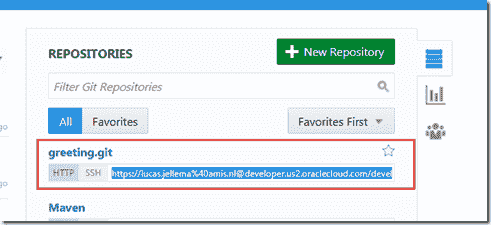
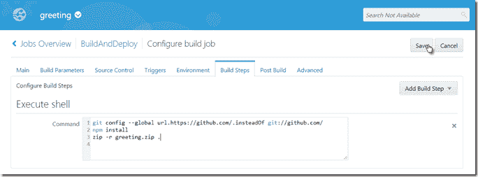
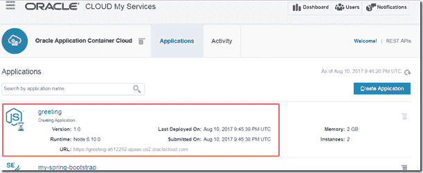
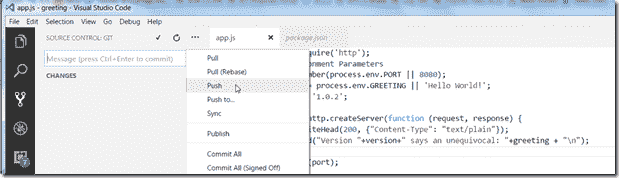

# 在 Oracle 云中自动构建和部署 Node.js 应用程序

> 原文：<https://medium.com/oracledevs/automating-build-and-deployment-of-node-application-in-oracle-developer-cloud-to-application-9c33133e0e54?source=collection_archive---------0----------------------->

一个熟悉的故事:

*   与一个或多个开发人员一起开发 Node.js 应用程序
*   使用 Oracle Developer Cloud Service 来组织开发工作、托管源代码以及协调构建工作和后续部署
*   在 Oracle 应用程序容器云上运行节点应用程序

我读过许多教程和博客文章，它们似乎都提供了一块拼图。本文以最简单的形式展示了整个故事。

我们将:

*   在开发者云服务上启动一个新项目
*   为这个新项目克隆 Git 存储库
*   在本地处理节点应用程序，并为应用程序容器云进行配置
*   提交源代码并将其推送到 Git repo
*   在 Developer Cloud service 中创建一个生成作业，该作业会创建适合部署的 zip 文件；Git repo 中主分支上的更改会触发该作业
*   创建链接到现有 Oracle 应用程序容器云服务实例的部署；将部署与构建任务相关联(反之亦然)
*   运行构建作业，并验证应用程序将被部署到 ACCS
*   添加带有环境变量定义的 ACCS 部署描述符(在节点应用程序中使用)
*   在应用程序的源代码中进行更改，提交和推送，并验证实时应用程序是否得到更新

先决条件:访问开发人员云实例和应用程序容器云服务。本地访问 git，最好是节点和 npm。

本文来源于 GitHub:[https://github.com/lucasjellema/greeting](https://github.com/lucasjellema/greeting)。

# 在开发者云服务上启动一个新项目

在开发者云中创建新项目*问候*。

按照向导说明进行操作。

在您按下 Finish 之后，新项目以及所有相关的资源和工具都将被初始化，比如一个新的 Git 存储库、一个 Wiki、一个问题库。

配置完成后，就可以访问项目了。

# 在本地处理节点应用程序

复制源代码存储库的 git URL。

为这个新项目克隆 Git 存储库

> *git clone*[*https://Lucas . jellema % 40 amis . nl @ developer . us2 . Oracle cloud . com/developer 73410-a 512292/s/developer 73410-a 512292 _ greeting _ 19451/SCM/greeting . git*](https://lucas.jellema%40amis.nl@developer.us2.oraclecloud.com/developer73410-a512292/s/developer73410-a512292_greeting_19451/scm/greeting.git)

使用 npm init 启动新的节点应用程序:

这将创建 package.json 文件。

为了准备最终部署到应用程序容器云的应用程序，我们需要添加 manifest.json 文件。

我们还需要创建一个. gitignore 文件，以防止 node_modules 被提交和推送到 Git。

在 app.js 文件中实现应用程序本身。这是一个非常简单的应用程序，它将处理传入的请求并返回某种问候:

请注意如何从环境变量中读取问候语，就像应该侦听请求的端口一样。如果没有提供环境值，则使用默认值。

# 提交源代码并将其推送到 Git repo

开发者云服务项目中的 Git 存储库是空的，除了第一次创建项目时的 readme.md:

现在，我们提交并推送本地创建的文件:

过了一会儿，这些来源出现在开发者云服务控制台中:

# 在开发人员云服务中创建构建作业

要构建应用程序，我们可以在开发人员云服务中创建一个构建作业，创建适合部署的 zip 文件；这个 zip 文件需要包含 Git 的所有源代码和 package.json 中指定的所有依赖项(所有节点模块)。注意:构建工作在理想情况下还应该执行自动化测试——比如 Yannick [在这里](http://www.ateam-oracle.com/automated-unit-tests-with-node-js-and-developer-cloud-services/)所描述的。

指定自由式作业。指定名称—此处为 BuildAndDeploy。

配置包含要构建的源代码的 Git 存储库；这是项目创建时第一次设置的存储库。

将构建作业配置为在源代码提交到 Git 存储库(中的主分支)时执行:

创建一个执行 Shell 类型的构建步骤:

输入以下 shell 脚本命令:

> *git config–global URL . https://github . com/。代替 git://github.com/*
> 
> *npm 安装*
> 
> zip -r greeting.zip。

这将下载所有需要的节点模块，并将所有源代码打包到一个名为 greeting.zip 的 zip 文件中。

将 greeting.zip 文件归档定义为构建后步骤。这使得这个 zip 文件可以作为构建作业生成的工件使用——用于部署或其他构建作业。

使用“立即构建”首次运行作业。

显示了运行 shell 命令的控制台输出。注意，在构建中执行的隐含的第一步包括从 git 存储库检索所有源代码到构建服务器的文件系统。显式 shell 命令随后被执行，并且可以利用这些克隆的 git repo 源。

构建作业生成 greeting.zip 作为工件:

# 创建链接到现有 Oracle 应用程序容器云服务实例的部署

构建作业生成一个可以部署到 ACCS 实例的工件。我们需要一个部署来基于那个工件创建一个 ACCS 实例。部署是构建工件和特定目标环境之间的桥梁——在本例中是 ACCS 实例。

指定将在应用程序容器云中使用的配置(用于开发人员云服务)和应用程序的名称。指定部署的类型——我们需要按需部署，因为这种部署类型可以与在构建结束时自动执行的构建作业相关联。指定部署目标—新的应用程序容器云类型。

提供 ACCS 实例的连接详细资料。按“测试连接”来验证这些详细信息。

成功后，点击使用连接。

指定运行时的类型——在本例中为节点。选择此部署所基于的构建作业和工件:

注意:目前，部署被绑定到构建作业的一个特定实例。当将部署作为构建后步骤添加到构建作业中时，我们将总是使用由特定构建实例产生的工件。

保存部署后，它会立即开始执行部署:

在应用程序容器云控制台中，我们可以看到正在创建新的节点应用程序 *greeting*

一段时间后(实际上是相当长的一段时间),应用程序被部署并准备好被访问:

这是在浏览器中打开应用程序的结果

现在将构建作业与部署相关联，以便在每个成功的构建结束时执行部署:

转到“Post Build”选项卡，选中“Oracle Cloud Service Deployment”复选框，并添加一个部署类型为 Deploy 的部署任务:

选择我们之前创建的部署:

并按 Save 保存对构建作业定义的更改。

# 运行构建作业，并验证应用程序将被部署到 ACCS(再次)

如果我们现在运行构建作业，作为它的最后一个操作，它应该执行部署:

ACCS 控制台显示，现在我们已经部署了 2.0 版。

# 添加带有环境变量定义的 ACCS 部署描述符

app.js 文件包含以下行

> *var greeting = process . env . greeting | | ' Hello World！'；*

这一行引用了当前未设置的环境变量 GREETING。通过将部署描述符定义为部署定义的一部分，我们不仅可以指定实例的数量及其大小以及任何服务绑定*和*环境变量(如 GREETING)的值。

添加部署描述符 json:

> *{
> "内存": " 1G "，
> "实例":" 1 "，
> "环境":{
> "问候":"问候你"，
> "应用 _ 前缀":" GRTZ"
> }
> }*

注意:变量 APPLICATION_PREFIX 目前没有使用。

保存并将再次执行部署:

完成后，就可以访问应用程序了。这一次，返回的问候语是在部署描述符 deployment.json(作为环境变量)中指定的，并由应用程序在运行时获取(使用 process.env.GREETING)。

# 对应用程序的源代码进行更改，并执行端到端的工作流

如果我们在应用程序中做了一个更改，然后提交并将更改推送到 Git，那么过一段时间后，我们应该能够验证实时应用程序是否得到了更新。

进行更改—一个新的版本标签和应用程序返回的文本中的一个小更改。

然后提交更改并将更改推送到开发人员 CS Git repo:

Git repo 中出现了变化:

现在 Git repo 已经更新，构建作业应该被触发:

一些控制台输出—显示部署已经开始:

ACCS 服务控制台也清楚地表明了这一点

部署完成后，很明显，代码更改已经影响到了正在运行的应用程序:

因此，编辑源代码并提交和推送到 git 足以触发应用程序的构建和重新部署——这要感谢 Developer Cloud Service 的设置。

# 后续步骤

展示应用程序的多个实例如何各自拥有自己的状态，以及如何使用应用程序缓存使它们共享状态。

展示 ACCS 应用程序如何通过服务绑定轻松访问 DBaaS 实例(在节点应用程序的情况下，通过 oracle 节点驱动程序和 OCI 库，这些库预装了 ACCS 节点运行时。

展示如何将 Oracle Management Cloud APM 设置为 ACCS 实例的一部分，以便对在 ACCS 上运行的应用程序执行应用程序监控；可能也适用于日志分析。

# 资源

本文的资料来源可以在 GitHub 中找到:[https://github.com/lucasjellema/greeting.](https://github.com/lucasjellema/greeting.)

Abhinav Shroff 撰写的 Oracle 社区文章—[Oracle 开发人员云在应用容器云上构建和部署 Nodejs REST 项目](https://community.oracle.com/community/oracle-cloud/platform/oracle-developer-cloud-service/blog/2016/09/07/oracle-developer-cloud-to-build-and-deploy-nodejs-rest-project-on-application-container-cloud)

团队编年史作者 Yannick Ongena- [用 Node 进行自动化单元测试。JS 和开发者云服务](http://www.ateam-oracle.com/automated-unit-tests-with-node-js-and-developer-cloud-services/)

Fabrizio Marini 的文章—[Oracle Application Container Cloud&开发者云服务:如何在 pool(云中)创建带有 DB 连接的 Node.js 应用，以及如何使用开发者云服务将其部署在 Oracle Application Container Cloud(node . js)上](http://www.fabriziomarini.com/2016/03/oracle-application-container-cloud_30.html)

创建 Node.js 应用程序(Oracle 文档)—[https://docs . Oracle . com/en/cloud/PAAs/app-container-cloud/create-sample-node . js-Applications . html](https://docs.oracle.com/en/cloud/paas/app-container-cloud/create-sample-node.js-applications.html)

开发者云服务文档— [在 Oracle 开发者云服务中管理版本](https://docs.oracle.com/en/cloud/paas/developer-cloud/csdcs/managing-releases-oracle-developer-cloud-service.html#GUID-A44F8A67-1A25-424E-9569-D53EB574CF9B)

Oracle 文档—为 ACCS 部署创建元文件—[https://docs . Oracle . com/en/cloud/PAAs/app-container-cloud/dvcjv/Creating-Meta-data-Files . html](https://docs.oracle.com/en/cloud/paas/app-container-cloud/dvcjv/creating-meta-data-files.html)

*原载于 2017 年 8 月 11 日*[*technology . amis . nl*](https://technology.amis.nl/2017/08/11/automating-build-and-deployment-of-node-application-in-oracle-developer-cloud-to-application-container-cloud/)*。*