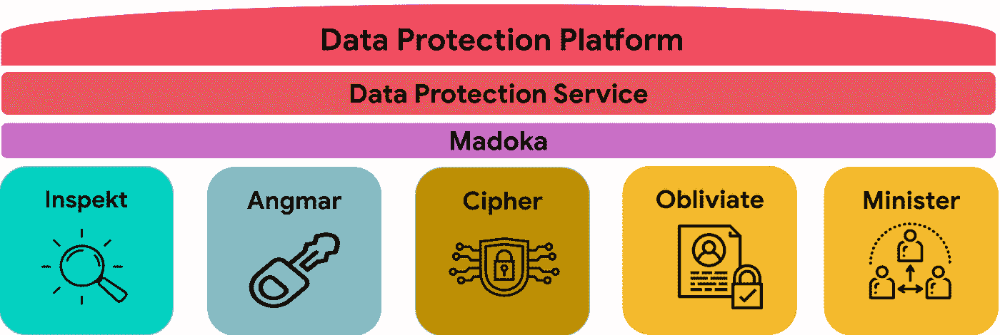
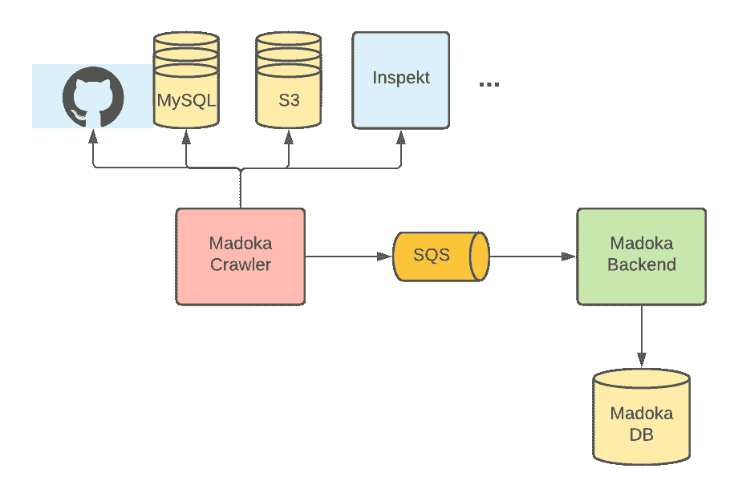

# 大规模自动化数据保护，第 1 部分

> 原文：<https://medium.com/airbnb-engineering/automating-data-protection-at-scale-part-1-c74909328e08?source=collection_archive---------1----------------------->

关于我们如何在 Airbnb 提供强大、自动化和可扩展的数据隐私和安全工程能力的系列文章的第一部分。

[伊丽莎白·南摩](https://www.linkedin.com/in/elizabethnammour/)、[温迪·金](https://www.linkedin.com/in/wendy-jing-jin-81452921/)、[圣普·刘](https://www.linkedin.com/in/shengpu-liu/)

我们的主人和客人社区相信我们会保护他们的数据安全，尊重他们的隐私权。随着有关数据安全违规的新闻报道频繁出现，再加上全球法规和安全要求，监控和保护数据已成为一个更需要解决的关键问题。

在 Airbnb，数据在不同的数据存储和基础设施之间收集、存储和传播，这使得很难依靠工程师手动跟踪用户和敏感数据如何在我们的环境中流动。这反过来又使他们很难保护它。虽然有许多供应商提供不同方面的数据安全性，但没有一种工具能够满足我们在数据发现和自动化数据保护方面的所有要求，也没有一种工具能够支持我们生态系统中的所有数据存储和环境。

在这个由三部分组成的博客系列中，我们将分享我们在 Airbnb 构建和运营数据保护平台以应对这些挑战的经验。在这第一篇文章中，我们将概述为什么我们决定构建数据保护平台(DPP)，浏览其架构，并深入研究数据清单组件 Madoka。

# 数据保护平台(DPP)

由于没有一种工具能够满足我们的需求，我们决定构建一个数据保护平台，使 Airbnb 能够按照全球法规和安全要求保护数据。然而，为了保护数据，我们首先需要了解数据及其相关的安全和隐私风险。

## 了解 Airbnb 的数据

在 Airbnb，我们在不同的文件格式和数据存储中存储数 Pb 的数据，如 MySQL、Hive 和 S3。在我们的整个生态系统中，数据每天都在生成、复制和传播。为了监控和了解不断变化的数据，我们构建了一个集中的清单系统来跟踪所有存在的数据资产。该库存系统还收集和存储围绕每项资产的安全和隐私属性的元数据，以便 Airbnb 的相关利益攸关方能够了解相关风险。

由于一些数据资产可能包含敏感的商业秘密或公共信息，因此了解数据资产中存储的数据类型对于确定所需的保护级别至关重要。此外，隐私法，如欧盟一般数据保护条例(GDPR)和加州消费者隐私法(CCPA)，已授予用户访问和删除其个人数据的权利。然而，个人数据是一个不太精确的术语，它代表许多不同的数据元素，包括电子邮件地址、在平台上发送的消息、位置信息等。为了遵守这些法律，我们需要精确定位所有个人数据的确切位置。为此，我们构建了一个可扩展的数据分类系统，该系统持续扫描和分类我们的数据资产，以确定其中存储的数据类型。

## 实现自动化数据保护

基于对数据的理解，DPP 努力实现数据保护的自动化，或者启用并通知整个公司的团队来保护数据。这种自动化集中在几个关键领域:数据发现、防止敏感数据泄漏和数据加密。

发现个人数据是隐私合规的第一步。当个人数据需要根据请求被删除或返回给用户时尤其如此。我们的平台使我们能够在数据存储中检测到新的个人数据时自动通知数据所有者，并将这些数据与我们的隐私协调服务集成，以确保在需要时删除或返回这些数据。

数据泄露的一个常见原因是敏感机密(如 API 密钥或凭证)在内部泄露，然后落入攻击者手中。这可能来自于工程师在他们的服务中记录秘密或将秘密提交给代码。我们的数据保护平台可以识别各种端点的潜在泄漏，并通知工程师通过从代码或日志中删除机密、旋转机密，然后使用我们的加密工具集隐藏新的机密来缓解泄漏。

最流行和最重要的数据保护方法之一是加密，因为即使在渗透的情况下，攻击者也无法获得敏感数据。然而，不幸的是，由于未加密的敏感数据而导致的违规在行业内屡见不鲜。

为什么还会发生？通过适当的密钥管理实现安全加密在技术上极具挑战性，而且组织并不总是知道敏感数据存储在哪里。DPP 旨在通过提供工程师可以使用的数据加密服务和客户端库来抽象这些挑战。它自动发现敏感数据，让我们不依赖人工识别。

## 平台架构

Figure 1: DPP Overview

DPP 旨在发现、理解和保护我们的数据。它集成了我们为解决数据保护的不同方面而构建的服务和工具。该端到端解决方案包括:

*   Inspekt 是我们的数据分类服务。它不断扫描 Airbnb 的数据存储，以确定其中存储了哪些敏感和个人数据类型。
*   **Angmar** 是我们的秘密检测管道，发现我们代码库中的秘密。
*   [**Cipher**](/airbnb-engineering/one-step-forward-in-data-protection-8071e2258d16) 是我们的数据加密服务，为 Airbnb 的开发者提供了一个简单透明的框架，方便他们对敏感信息进行加密和解密。
*   **Obliviate** 是我们的编排服务，它处理所有隐私合规性请求。例如，当用户请求从 Airbnb 中删除时，obliviate 会将此请求转发给所有必要的 Airbnb 服务，以从其数据存储中删除用户的个人数据。
*   **部长**是我们的第三方风险和隐私合规服务，负责处理并向我们的外部供应商转发所有隐私数据主体权利请求。
*   **Madoka** 是我们的元数据服务，从不同来源收集我们数据资产的安全和隐私属性。
*   最后，我们有我们的**数据保护服务**、表示层，我们在其中定义作业，以使用来自 Madoka 的信息实现自动化数据保护操作和通知(例如，自动化与我们的隐私框架的集成)

# 圆:一个元数据系统

Madoka 是一个用于数据保护的元数据系统，它维护 Airbnb 平台上所有数据资产的安全和隐私相关元数据。它提供了一个集中的存储库，允许 Airbnb 工程师和其他内部利益相关者轻松跟踪和管理他们的数据资产的元数据。这使我们能够对 Airbnb 的数据安全和隐私状况保持全面的了解，并在整个公司的安全和隐私自动化方面发挥重要作用。

Figure 2: Madoka Architecture

由两个不同的服务实现，一个爬虫和一个后端，Madoka 有三个主要职责:收集元数据、存储元数据和向其他服务提供元数据。Madoka crawler 是一个日常爬行服务，它从其他数据源获取元数据，包括 Github、MySQL 数据库、S3 桶、Inspekt(数据分类服务)等。然后，它将元数据发布到 AWS 简单队列服务(SQS)队列中。Madoka 后端是一种数据服务，它从 SQS 队列中获取元数据，协调任何冲突信息，并将元数据存储在其数据库中。它为其他服务提供 API 来查询元数据结果。

Madoka 收集的主要元数据包括:

*   数据资产列表
*   所有权
*   数据分类

对于上述每一种，我们都处理 MySQL 和 S3 格式。

## 数据资产列表

需要收集的第一种元数据是 Airbnb 上存在的所有数据资产的列表，以及它们的基本元数据，例如模式、资产位置和资产类型。

对于 MySQL，crawler 收集我们的生产 AWS 帐户中存在的所有列的列表。它调用 AWS APIs 来获取我们环境中所有集群的列表，以及它们的读取器端点。然后，crawler 使用 JDBI 连接到该集群，并列出所有数据库、表和列，以及列数据类型。

crawler 保留以下元数据信息，并将其传递给 Madoka 后端进行存储:

*   集群名称
*   数据库名称
*   表名
*   列名
*   列数据类型

对于 S3，爬虫收集存在于我们所有 AWS 帐户中的所有对象的列表。

在 Airbnb，我们使用 [Terraform](https://www.terraform.io/) 在代码中配置 AWS 资源，包括 S3 桶。爬虫解析地形文件以获取 S3 元数据。

爬行器首先获取所有 AWS 帐号和名称的列表，它们存储在我们的 Terraform 存储库中的配置文件中。然后，它获取所有 bucket 名称的列表，因为每个 bucket 配置都是帐户子报告下的一个文件。

为了获取桶中的对象列表，爬虫使用由 AWS 提供的工具 [S3 库存报告](https://docs.aws.amazon.com/AmazonS3/latest/userguide/storage-inventory.html)。该工具生成并存储 bucket 中包含的所有对象的每日或每周 CSV 文件，以及它们的元数据。与调用 list AWS API 相比，这是一种更快、成本更低的获取 List 的方法。我们已经在 Terraform 中的所有生产 S3 存储桶上启用了库存报告，存储桶配置将指定库存报告的位置。

爬虫保留以下信息，并将其传递给 Madoka 后端进行存储:

*   账号
*   帐户名
*   假定角色名称
*   存储桶名称
*   库存时段帐号
*   库存承担角色名称
*   库存时段前缀
*   库存时段名称
*   目标键

## 所有权

所有权是描述谁拥有特定数据资产的元数据属性。

我们决定收集服务所有权，这允许我们将数据资产链接到特定的代码库，并因此自动化任何需要代码更改的数据保护操作。

我们还决定收集团队成员资格，这对于执行任何需要工程师做一些工作或需要批准的数据保护操作来说是至关重要的。我们选择收集团队所有权，而不是用户/员工所有权，因为团队成员不断变化，而数据资产仍然属于团队。

在 Airbnb，自从我们迁移到面向服务的架构(SOA)后，大多数 MySQL 集群都属于单个服务和单个团队。为了确定服务所有权，crawler 获取连接到 MySQL 集群的服务列表，并将过去 60 天内连接数量最多的服务设置为该集群中所有表的所有者。有许多服务连接到所有集群，用于监控、观察和其他常见目的，因此我们创建了一个角色列表，在确定所有权时应该过滤掉这些角色。

仍然有一些遗留集群被许多服务共享，其中每个服务在集群中拥有特定的表。对于这些集群，并非所有的表都分配了正确的服务所有者，但是我们允许手动覆盖来纠正这些错误。

爬虫使用服务所有权来确定团队所有权，因为在 Airbnb，团队所有权是在 Git 上的服务代码库中定义的。

在 Airbnb，所有 S3 桶在其 Terraform 配置文件中都有一个项目标签，该标签定义了哪个服务拥有该桶。爬虫从该文件中获取服务所有权，并使用它来确定团队所有权，就像上面对 MySQL 所描述的那样。

## 数据分类

数据分类是一种元数据属性，它描述了存储在资产中的数据元素的类型，例如，存储电子邮件地址或电话号码的 MySQL 列将被分类为个人数据。通过收集数据分类，我们可以了解每个数据集的风险，从而确定所需的保护级别。

爬虫从两个不同的来源获取数据分类。首先，它从我们的 Git 存储库中获取数据分类，因为数据所有者可以在他们的数据模式中手动设置分类。然而，依靠人工分类是不够的。数据所有者并不总是知道资产包含什么，或者当更新数据资产以存储新的数据元素时，他们可能会忘记更改分类。

然后，爬虫将从我们的自动化数据分类工具 Inspekt 获取数据分类，我们将在以后的博客文章中详细描述。Inspekt 不断扫描和分类我们所有的主要数据存储，如 MySQL 和 S3。它输出在每个数据资产中找到了哪些数据元素。这确保了我们的数据不断受到监控，并且分类随着数据的变化而更新。与任何自动化检测工具一样，精确度和召回率都不是 100%，因此可能会出现误报和漏报。

Figure 3: Classification Reconciliation

由于 crawler 从两个不同的来源获取数据分类，可能会出现一些差异，其中手动分类包含 Inspekt 找不到的数据元素，反之亦然。爬虫将把所有发现转发到 Madoka 后端，它将解决任何冲突。默认情况下，手动分类的状态标记为*新*，Inspekt 分类的状态标记为建议。如果手动分类与 Inspekt 结果一致，则自动确认分类。如果有任何差异，我们将通过数据保护服务向数据所有者提交票证。如果 Inspekt 分类正确，所有者可以更新 Git 存储库中的数据模式，或者他们可以将 Inspekt 分类标记为不正确，以解决冲突。

## 其他与安全和隐私相关的属性

Madoka 还存储数据资产如何与我们的安全和隐私工具集成。例如，对于数据主体权利请求，我们可能会存储数据资产是否使用密码加密，或者是否与我们的隐私合规服务 Obliviate 集成。我们将 Madoka 构建为易于扩展，并不断收集和存储更多与安全和隐私相关的属性。

# 结论

在第一篇文章中，我们概述了为什么要构建 DPP，描述了平台的架构，并深入研究了数据清单组件 Madoka。在我们的下一篇文章中，我们将重点关注我们的数据分类系统，它使我们能够大规模检测个人和敏感数据。在我们的最后一篇文章中，我们将深入探讨我们如何使用 DPP 来实现各种安全和隐私用例。

# 承认

DPP 的成功要归功于数据安全团队的许多成员:郭品尧、Julia Cline、Jamie Chong、、Jesse Rosenbloom、Serhi Pichkurov 和 Gurer Kiratli。感谢数据治理团队成员合作并支持我们的工作:Andrew Luo、和 Tang。感谢 Tina Nguyen 的帮助，使这篇博文成为可能。感谢我们的领导 Marc Blanchou、Brendon Lynch、Paul Nikhinson 和 Vijaya Kaza 对我们工作的支持。感谢之前为这项工作做出巨大贡献的团队成员:莫砺锋桑、曾斌、亚历克斯利什曼和朱莉特里亚斯。

如果你对这类工作感兴趣，请查看[我们的职业页面](https://careers.airbnb.com/)了解当前的职位空缺。

标签:数据，安全性