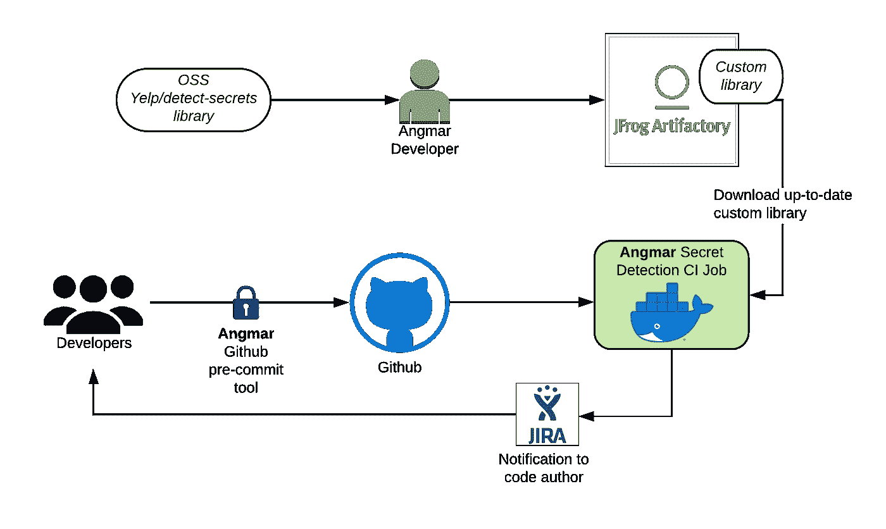

# 大规模自动化数据保护，第 2 部分

> 原文：<https://medium.com/airbnb-engineering/automating-data-protection-at-scale-part-2-c2b8d2068216?source=collection_archive---------2----------------------->

关于我们如何在 Airbnb 提供强大的、自动化的、可扩展的数据隐私和安全工程能力的系列文章的第二部分

[伊丽沙白](https://www.linkedin.com/in/elizabethnammour/)，[品尧](https://www.linkedin.com/in/pinyao-guo-6b621684/)，[金雯丽](https://www.linkedin.com/in/wendy-jing-jin-81452921/)

# 介绍

在我们的博客系列的[第 1 部分中，我们介绍了数据保护平台(DPP ),它使我们能够按照全球法规和安全要求保护数据。我们强调，通过跟踪个人和敏感数据在我们的生态系统中的存储位置来了解我们的数据，是保护数据的必要组成部分。在这篇博文中，我们将讨论公司在试图精确定位个人和敏感数据时经常面临的挑战。作为权宜之计，许多公司依靠工程师手动跟踪个人和敏感数据在其环境中的流动位置和方式。然而，依赖手动数据分类会带来一些挑战:](/airbnb-engineering/automating-data-protection-at-scale-part-1-c74909328e08)

1.  **数据在不断进化**。这使得工程师很难全面了解数据以及数据如何在公司的基础设施中流动。数据可以被复制和传播到不同的数据存储中。此外，随着产品的出现或变化，可以收集新类型的数据。
2.  **手工分类更容易出错。**工程师可能会忘记数据资产是否包含个人数据，或者可能不知道资产包含什么，就像自由格式的用户条目一样。
3.  **安全和隐私个人数据元素不断膨胀。**对于新的隐私法规和安全合规性要求的任何新数据元素，工程师必须再次执行手动数据分类工作，这给公司带来了高成本和低劳动效率。
4.  秘密可能会泄露到我们的代码库和各种数据存储中。机密，如生产 API 密钥、供应商机密和数据库凭证，通常由工程师使用。代码库中的秘密泄露是科技行业的一个已知问题，通常是由于工程师偶然或无意的代码泄漏，他们并不总是被审查者发现。一旦入住，秘密就成了大海捞针，不容易被发现。

为了应对这些挑战，我们构建了数据分类工具来检测数据存储、日志和源代码中的个人和敏感数据。请继续阅读，我们将逐步了解我们的数据分类工具的架构。具体来说，我们将深入研究 Inspekt 的技术组件，这是我们用于数据存储和日志的数据分类系统，以及 Angmar，这是我们用于 Github Enterprise 上的代码库的秘密检测和防范系统。

# Inspekt:一种数据分类服务

Inspekt 是一款自动化、可扩展的数据分类工具，可确定个人和敏感数据在我们生态系统中的存储位置。Inspekt 由两个服务组成:第一个服务称为任务创建者，它确定需要扫描的内容，第二个系统称为扫描器，它对数据进行采样和扫描，以检测个人和敏感数据。

## 任务创建者

任务创建系统负责确定要扫描的内容，并将其拆分为供扫描系统接收的任务。

Inspekt 任务创建者定期调用 Madoka，我们的元数据服务[在我们之前的博客文章](/airbnb-engineering/automating-data-protection-at-scale-part-1-c74909328e08)中描述过，以获取 Airbnb 中存在的数据资产列表。从 MySQL 和 Hive 数据存储中，该服务获取所有表的列表。对于 AWS S3，该服务获取每个 AWS 帐户的存储桶列表及其对应的对象键列表。由于数据量巨大，任务创建者从每个桶中随机抽取一小部分对象键。对于应用程序日志，该服务获取 Airbnb 上所有服务的列表以及存储日志的相应 Elasticsearch 集群。然后，任务创建者为每个表/对象/应用程序创建一个 SQS 消息(称为任务),并将其添加到扫描 SQS 队列中，该队列将在稍后阶段由扫描器使用。

## 扫描仪

扫描系统负责对数据进行采样和扫描，以检测个人信息。Inspekt 提供了一个接口来定义扫描方法和算法，以扫描采样数据。对于每个数据元素，我们将“验证者”定义为一种或多种扫描方法的组合。

Inspekt 目前支持四种类型的扫描方法:

*   **正则表达式(regexe):**正则表达式对于遵循固定格式的数据元素很有用，比如经度和纬度坐标、出生日期、电子邮件地址等。Inspekt 允许我们定义正则表达式来匹配数据资产的元数据(例如列名、对象键名)或资产的内容。Inspekt 允许我们将正则表达式定义为 allowlists 和 denylists。例如，我们可以定义一个正则表达式来检测列名包含“出生日期”，或者内容包含单词“出生日期”，或者内容不包含单词“出生日期”的数据资产。
*   **尝试:**我们收集的一些数据元素不遵循固定的模式，例如名和姓，并且不能使用正则表达式来检测。当数据元素存储在已知的源数据存储中时，我们可以利用 [Aho-corasick 算法](https://en.wikipedia.org/wiki/Aho%E2%80%93Corasick_algorithm)，该算法尝试检测数据的有限样本的子串匹配。
*   **机器学习(ML)模型:**由于多种原因，使用基于正则表达式的扫描无法准确或有效地检测到大量数据元素。首先，一些数据元素，如物理地址，具有不同的格式或不完全的内容。其次，作为一家在 200 多个国家运营的全球性公司，Airbnb 以不同的语言托管数据。第三，一些数据，如图像，不是基于文本的，因此不能使用常规扫描方法识别。基于机器学习的算法是应对这些挑战的天然选择。我们开发了不同的机器/深度学习模型，如多任务 CNN、伯特-NER 和 WiDeText 分类模型，用于检测几种复杂的数据元素。这些模型要么使用我们生产数据库中的数据样本(如 Airbnb 房源表中的用户地址)进行训练，要么使用公共数据集或在大型文本军团中预训练的模型进行训练。我们在名为 [Bighead](https://databricks.com/session/bighead-airbnbs-end-to-end-machine-learning-platform) 的 Airbnb 机器学习平台上托管这些模型，该平台为 Inspekt 提供 API 端点，以使用机器学习扫描方法检测每个数据元素。
*   **硬编码方法:**我们收集的一些数据元素遵循固定的模式，但要么太复杂而无法用正则表达式描述，要么已经存在一个开源解决方案，可以检测高质量的数据元素。Inspekt 允许我们定义一个代码块来检测数据元素。例如，我们利用开源库中的验证器创建了一个国际银行账号(IBAN)数据元素验证器。

在 Inspekt 中，验证器被定义为 JSON blobs，并存储在扫描器读取的数据库中。这使我们能够轻松地修改现有的验证器或添加新的验证器，以便在运行中检测新的数据元素，而无需重新部署服务。

下面是一个验证器配置的示例，它旨在检测任何包含单词“birthdate”的列名，或者内容包含单词“birthdate”的列名:

Inspekt 扫描仪是一个使用 Kubernetes 的分布式系统。根据工作负载(即队列中的任务)，它可以根据需要进行水平扩展。每个扫描器节点从 SQS 任务队列中获取任务消息。为了保证扫描的稳定性，每条消息都会在队列中重复出现 N 次，直到扫描器节点将其删除。扫描仪架构的示意图如下所示。

Figure 1: Inspekt Scanner Architecture

启动时，每个 Inspekt 扫描器节点从数据库中获取并初始化验证器。验证器被定期刷新以获取新的验证器或验证器配置变化。验证器初始化后，每个扫描器节点从任务创建者创建的任务队列中取出一个任务。每个任务包含要执行的任务的规范，即扫描哪个数据资产、采样量等。然后，节点将每个任务提交给执行采样和扫描作业的线程池。扫描作业按如下方式运行:

1.  Inspekt scanner 连接到任务中指定的数据存储，并从数据存储中采样数据。对于 MySQL，scanner 节点将连接到 MySQL 数据库，并对每个表的行子集进行采样。为了每次扫描不同的行集而不导致全表扫描，我们随机生成一个小于主键最大值的值 X，并选择一个主键> = X 的行子集。对于 Hive，我们从最新的分区中为每个表采样一个行子集。对于服务日志，我们每天对每个服务的日志子集进行采样。为了更好地覆盖不同的日志，我们查询我们的弹性搜索日志集群，从不同的日志记录点选择日志。对于 S3，我们生成一个小于对象大小的随机偏移量，并从该偏移量开始对一组可定制的字节进行采样。我们还支持跨 AWS 帐户扫描。如果对象所在的 AWS 帐户与运行扫描器的帐户不同，Inspekt 会自动使用适当的承担角色 IAM 权限从外部帐户访问和读取对象。
2.  对于来自数据存储的每个采样数据，Inspekt Scanner 根据数据运行每个验证器，以确定是否找到任何匹配。
3.  Inspekt 扫描仪将匹配结果存储在数据库中。对于每个匹配，我们将存储找到匹配的数据资产的元数据、匹配的内容以及匹配的验证器。我们还将这些信息的子集存储在一个单独的表中，只包含数据资产和找到的数据元素。我们定期从匹配结果表中删除记录，以确保我们数据的安全性和隐私性。
4.  Inspekt 扫描仪删除 SQS 邮件

# Inspekt 质量测量服务

正如我们在[之前的博客](/airbnb-engineering/automating-data-protection-at-scale-part-1-c74909328e08)中所述，我们的数据保护平台利用分类结果来启动保护措施。为了让下游利益相关方信任并采用 Inspekt 的分类结果，我们需要持续确保每个数据元素都得到高质量的检测。导致太多的假阳性对那些被警告有发现的团队来说是破坏性的，并且会败坏团队的名声。导致太多的假阴性意味着我们不能成功地捕获数据元素的所有出现，从而引发隐私和安全问题。

## 质量测量策略

为了持续监控和提高每个数据元素验证器的质量，我们构建了 Inspekt 质量测量服务来测量它们的精度、召回率和准确性。

对于每个数据元素，我们将真阳性数据和真阴性数据作为基础事实存储在 Inspekt 质量测量数据库中。然后，我们针对地面真实数据集运行验证器。根据真阳性数据，我们输出验证器生成的真阳性(TP)数和假阴性(FN)数。从真阴性数据中，我们输出验证器生成的假阳性(FP)和真阴性(TN)的数量。然后，我们可以从 TP、FN、FP、TN 计数中计算精度、召回率和准确度。

Figure 2: Inspekt Quality Calculation

## 取样和填充测试数据

如上所述，对于每个个人数据元素，我们需要收集真实的正面和真实的负面数据集。为了使这些指标准确，用于测试的数据集必须尽可能全面并与生产数据相似。我们通过从以下来源定期采样数据来填充该数据集:

*   生产中的已知数据集:我们的在线数据库或数据仓库中的一些列已知包含并表示特定的数据元素，例如，已知存储电子邮件地址的 MySQL 列。我们可以用这些列作为真阳性。
*   Inspekt 结果:当 Inspekt 运行并生成结果时，结果可能代表真阳性或假阳性。因此，我们可以使用这些数据来填充数据集。
*   已知的自由形式/非结构化数据:我们的在线数据库或数据仓库中的一些列代表自由形式的用户输入数据或非结构化 blobs，例如消息、JSON 对象等。这些列可以包含任何类型的数据元素，并代表一个良好的测试数据源，以确保我们的系统检测非结构化格式和不同边缘情况下的数据元素。
*   生成虚假的合成数据:一些数据元素，如用户的身高和体重，在我们的数据存储中并不常见，也没有存储它们的已知源列。为了让这些数据元素有足够的测试数据，我们以适当的格式生成假数据，并用它填充我们的测试数据库。

## 标记

在对数据进行采样后，我们需要确保在将数据存储到测试数据集之前，每个样本代表的是真阳性还是真阴性。为了实现这一点，我们使用 [AWS 地面真实](https://aws.amazon.com/sagemaker/groundtruth/)手动标记采样数据。对于每个数据元素，我们都制定了说明，并对 Airbnb 员工进行了培训，以正确区分每个样本的真假。然后，我们的系统将把每个数据元素的原始采样数据上传到 AWS S3 公司，并按照正确的说明在 Ground Truth 上创建一个标签作业。一旦员工完成标记数据，标记的输出将存储在 S3 桶中，供我们的系统读取。Inspekt 质量测量服务将定期检查桶，以确定标记数据是否就绪。如果准备好了，它将获取数据并存储在我们的测试数据集中，然后删除来自 S3 的原始和标记数据。

Figure 3: Inspekt Test Labeling Pipeline

## 重新训练最大似然模型

来自 Inspekt 质量测量服务的标记数据对提高 Inspekt 验证器的性能很有价值。具体来说，标记的结果可以成为增强 Inspekt 机器学习模型性能的有用来源。我们将标记的数据馈入一些机器学习模型的训练样本中。在重新训练期间，新标记的数据与训练样本一起使用。每次重新训练后，我们都会为相应的数据元素获得更好的模型。

# Angmar:代码中的秘密检测和预防

在前几节中，我们描述了 Inspekt 如何专注于检测数据存储中的个人和敏感数据。然而，一些敏感数据，如商业和基础设施机密，也可能存在于公司代码库中，如果泄露给非预期方，可能会导致严重的漏洞。我们将范围扩大到一个名为 Angmar 的秘密检测解决方案，该解决方案利用检测和预防方法来保护 Github Enterprise (GHE)中的 Airbnb 秘密数据。

## 体系结构

Angmar 由两部分组成，一个是 CI 检查，旨在检测推送至 GHE 的秘密；另一个是 Github 预提交钩子，旨在首先防止秘密进入 GHE。

我们建立了一个 CI 检查来扫描每一个推送到 Airbnb GHE 服务器的提交。当提交被推送到 GHE 时，CI 作业被启动，在允许合并到主分支之前，CI 作业需要通过。CI 作业下载开源库的最新定制版本库 [Yelp/detect-secrets](https://github.com/Yelp/detect-secrets) 并在提交中对每个修改或添加的文件运行秘密扫描作业。在 CI 作业中检测到机密后，它会触发数据保护平台创建 JIRA 票证，并自动将该票证分配给代码作者进行解析。票证生成的细节将在本博客系列的第 3 部分中讨论。我们要求使用 SLA 内名为[风笛手](/airbnb-engineering/production-secret-management-at-airbnb-ad230e1bc0f6)的生产机密管理工具移除、轮换和再次检入所有生产机密。

Figure 4: Angmar Architecture

然而，由于 CI 检查监督每一次代码库的推送，秘密暴露时间窗口仍然会给公司基础设施带来一定的安全风险。此外，在某些情况下，秘密轮换在工程时间和费用方面可能非常昂贵。因此，我们建议采取积极主动的方法，首先阻止秘密进入 GHE，以进一步消除秘密暴露，并节省轮换秘密的努力。我们使用相同的自定义检测库为开发人员构建了一个 Angmar 预提交工具，以阻止将秘密提交到 Git 提交中。一旦在提交中检测到秘密，Git commit 命令将提示一个错误并阻止新的提交。

## 用户化

我们为 Airbnb 的用例对 detect-secrets 开源库进行了一些定制:

*   我们在库插件中添加了一些 Airbnb 特有的秘密数据元素。
*   根据我们对库中误报检测的分析，一些测试机密、分级机密或占位符被误检测为机密。我们添加了一个路径过滤逻辑来跳过提交中的某些文件。
*   我们还实现了一些重复数据删除逻辑，使用散列来减少由于在不同提交中对同一文件进行修改而导致的重复标签。
*   在极少数情况下，当误报发生时，我们允许开发人员跳过某些代码行或某些文件，以避免阻止紧急代码合并到生产中。安全团队定期检查跳过的代码，以确保没有真正的秘密被绕过。

# 未来的工作

我们正在不断改进和扩展 Inspekt 和 Angmar，以扫描更多的数据源，检测更多的隐私和敏感数据元素。我们目前正在探索或开展的几项计划包括:

1.  扫描 Thrift 接口描述语言 API 请求和响应，以跟踪个人和敏感数据如何在服务之间流动。
2.  扫描我们的第三方应用程序，如 Google Drive、Box，以了解数据如何流入第三方应用程序，以及如何在内部和外部访问数据。
3.  将我们的扫描能力扩展到 Airbnb 使用的更多数据存储，如 DynamoDB、Redis 等。

# 可供选择的事物

市场上有几种解决数据分类的商业解决方案。在构建我们的解决方案之前，我们评估了几家商业供应商，看看我们是否可以利用现有的工具，而不是构建我们自己的解决方案。出于以下原因，我们决定构建内部解决方案:

*   数据存储覆盖:我们需要一个能够覆盖我们生态系统中存在的大部分数据存储的工具，因为为数据存储子集构建一个定制工具与为我们所有的数据存储构建一个定制工具需要非常相似的工作量。大多数供应商只支持扫描 SAAS 应用程序和 S3 桶。
*   定制扫描:我们需要能够定制扫描算法来扫描。这一点很重要，因为我们希望确保能够扫描所有个人和敏感数据元素，并确保所有数据元素都能获得最佳性能(精确度、召回率和准确度)。许多供应商支持对自定义正则表达式进行扫描，但是没有一个供应商支持对自定义 ML 模型进行扫描。
*   成本效率:我们发现，就我们的目的而言，构建我们的解决方案比使用商业解决方案更具成本效率。

# 结论

在这第二篇文章中，我们深入探讨了数据分类系统的动机和架构，该系统使我们能够大规模检测个人和敏感数据。在我们的下一篇文章中，我们将深入探讨我们如何使用数据保护平台来实现各种安全和隐私用例。

# 感谢

Inspekt 和 Angmar 是由数据安全团队的所有成员促成的:Shengpu Liu、Jamie Chong、、Jesse Rosenbloom、Serhi Pichkurov、PM 团队 Julia Cline 和 Gurer Kiratli。感谢 AI Labs 团队的 Bo Zeng 帮助开发 Inspekt 机器学习模型。感谢我们的领导 Marc Blanchou、Joy Zhang、Brendon Lynch、Paul Nikhinson 和 Vijaya Kaza 对我们工作的支持。感谢安全工程团队的 Aaron Loo 和 Ryan Flood 的支持和建议。感谢数据治理团队成员合作并支持我们的工作:Andrew Luo、和 Tang。感谢蒂娜·阮和郭晓婷·沙恩的帮助，使这篇博文成为可能。感谢之前为这项工作做出巨大贡献的团队成员:莫砺锋·桑、曾斌、普拉萨德·凯萨纳、亚历克斯·利什曼和朱莉·特里亚斯。

如果你对这类工作感兴趣，请查看 https://careers.airbnb.com 的招聘信息。

所有产品名称、标识和品牌都是其各自所有者的财产。本网站中使用的所有公司、产品和服务名称仅用于识别目的。使用这些名称、标志和品牌并不意味着认可。