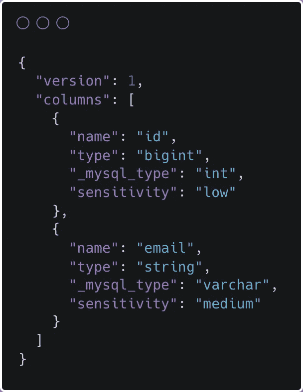
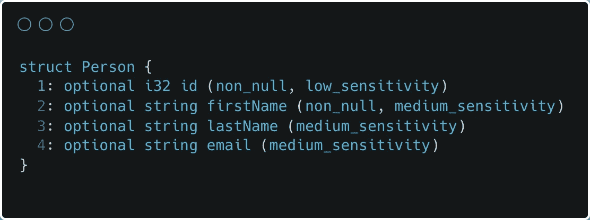
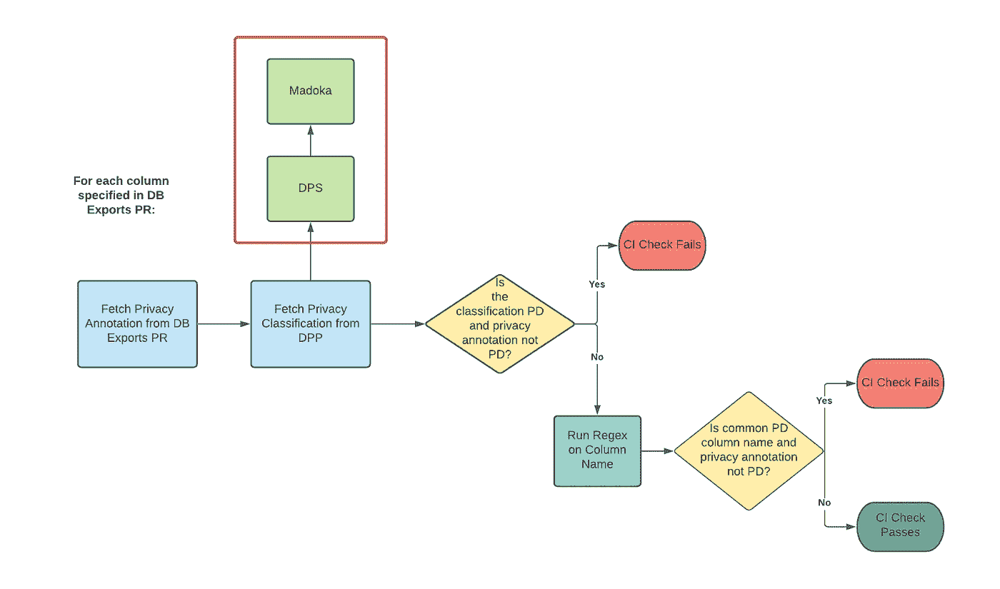
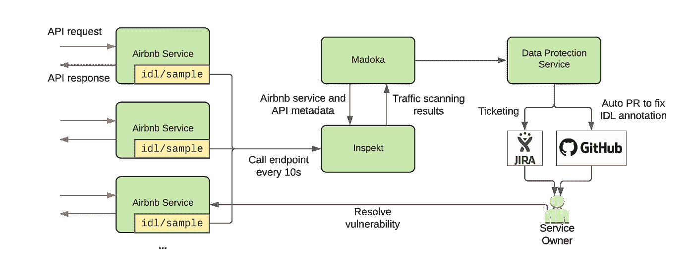
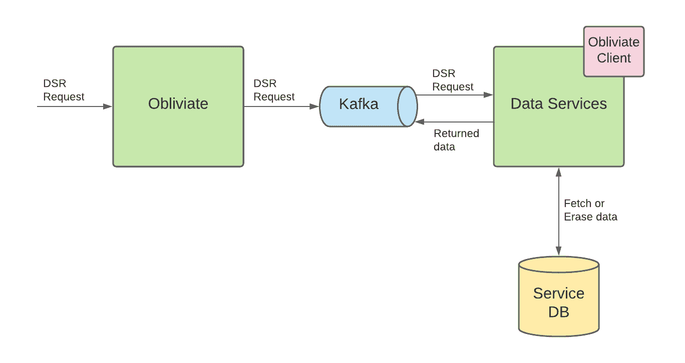

# 大规模自动化数据保护，第 3 部分

> 原文：<https://medium.com/airbnb-engineering/automating-data-protection-at-scale-part-3-34e592c45d46?source=collection_archive---------3----------------------->

关于我们如何在 Airbnb 提供强大的、自动化的、可扩展的数据隐私和安全工程能力的系列文章的第三部分

[伊丽沙白](https://www.linkedin.com/in/elizabethnammour/)、[郭品瑶](https://www.linkedin.com/in/pinyao-guo-6b621684/)、钟嘉敏、[金文迪](https://www.linkedin.com/in/wendy-jing-jin-81452921/)

# 介绍

在我们博客系列的[第 1 部分](/airbnb-engineering/automating-data-protection-at-scale-part-1-c74909328e08)和[第 2 部分](/airbnb-engineering/automating-data-protection-at-scale-part-2-c2b8d2068216)中，我们给出了数据保护平台(DPP)的概述。我们专注于如何建立对 Airbnb 数据及其相关安全和隐私风险的全球理解。在这篇博文中，我们将描述我们如何利用这种理解来提供强大的自动化安全和隐私工程功能，并支持数据治理。为了降低整个 Airbnb 组织的风险，我们寻求解决以下问题:

*   **责任:**安全和隐私合规不仅仅是安全和隐私团队的责任，还应该贯穿 Airbnb 平台、开发经验、产品生命周期和企业供应商解决方案。随着数据量的增长和服务变得越来越复杂，我们需要让 Airbnb 中控制这些数据的团队(“服务所有者”)对这些数据的安全性和隐私性负责
*   **最小开销:**虽然服务所有者分担降低风险的责任，但我们希望确保我们能够自动化大部分工作，并最小化他们的操作负载
*   **全局协调:**并非每个人都对数据分类和保护策略有完全相同的理解。我们的目标是在安全、隐私、法律和服务所有者之间达成共识，并为隐私和安全注释和操作提供单一的真实来源

在以下几节中，我们将首先分享对数据保护服务的深入了解，该服务集成了我们 DPP 的所有组件，使我们能够根据我们的调查结果定义自定义数据保护作业。然后，我们将演示 DPP 如何降低安全和隐私风险的具体用例。

# 数据保护服务

我们构建了数据保护服务(DPS)来集成 DPP 的所有组件，并为利益相关方自动执行安全和隐私操作。

DPS 向 DPP 之外的利益相关者或服务提供 API 端点，这允许他们查询存储在 [Madoka](/airbnb-engineering/automating-data-protection-at-scale-part-1-c74909328e08) 中的隐私和安全元数据。例如，我们有一个 API 端点，允许服务查询包含任何类型个人数据的数据资产列表。这使得下游数据服务或管道能够构建它们的集成。

DPS 还使我们能够轻松定义自定义“作业”来自动化特定步骤，例如:

*   **创建 JIRA 通知:**为了创建 JIRA 的机票，DPS 使用了一个内部机票生成器，它抽象出了票务机制，并允许我们轻松过滤掉任何重复的机票。我们只需要为这些发现定义一个唯一的标识符，这样就不会有两张票是为相同的发现提交的。JIRA 是通知数据所有者的众多方式之一。Slackbots、电子邮件通知和其他内部供应商工具也是可行的选择。
*   **生成拉请求(PRs):** 为了在 GitHub Enterprise (GHE)中创建 PRs，我们创建了一个包装 GHE API 的包装器，以便轻松地克隆一个 repo，创建一个 PR，并获得 PR 的状态。在每个作业中，我们实现了如何修改回购的目标文件并将它们添加到 PR 的逻辑。

# 数据保护注释验证

为了帮助我们有效地遵守数据隐私法，我们需要了解个人数据在其生命周期中的位置。我们还需要保护跨不同数据存储和服务传播的数据。为了帮助实现这一目标，我们定义了三个级别的数据分类注释—关键、个人、公共—并用注释标记数据。

在 Airbnb，工程师和数据科学家可以定义数据库导出管道，将在线 MySQL 表快照导出到离线 Hive 表进行数据分析。我们要求所有者用数据分类注释标记每个表列。使用这些标签，我们能够通过适当的访问控制和保留限制来隔离和进一步保护最敏感的数据类别。

Example of database exports definition

服务所有者使用节俭接口描述语言(IDL)的扩展来定义服务间通信的数据接口。我们要求端点中的每个字段都用数据分类注释进行标记，用于限制来自高风险位置的服务 API 访问。注释还用于帮助评估服务的安全性和隐私风险。下面是一个节俭 IDL API 定义的例子。

Example Service IDL API definition

然而，依赖于人的判断的注释容易出错。服务所有者可能会误判或不知道他们的 API 或数据列中的字段，并错误地注释数据。出于这个原因，我们验证数据分类注释的正确性。

# 数据库导出验证

Figure 1: Database Exports Data Classification Validation CI Check

为了验证数据库导出注释，我们创建了一个 CI 检查，它利用 DPS 并在有人创建数据库导出 PR 时运行。

对于 PR 中指定的每个列，CI 检查会执行以下操作:

1.  查询 DPS 以确定该列的隐私分类。如果分类和 PR 注释不匹配，CI 检查将失败。
2.  否则，我们运行一组额外的正则表达式来确定该列的数据分类注释应该设置为什么。这主要适用于不包含任何数据的表格，或者在出现漏报的情况下。
3.  如果这两项检查都通过，则 CI 检查也会通过。

数据仓库还使用数据分类结果来验证已经签入的数据库导出文件上的注释。每日作业查询 DPS 以获取所有配置单元表的数据分类。如果分类和标注不匹配，作业会通知服务所有者。如果服务所有者不采取任何行动，这些不正确注释的表将被自动删除。

# IDL 验证

Figure 2: Service API Interface Data Language Validation

我们利用 Airbnb 服务的流量捕获特性来获取 IDL APIs 的请求和响应对。Inspekt 定期向每个服务发送请求，以获取流量样本。Inspekt 然后扫描流量样本并将其分类为数据元素。然后，Madoka 从 Inspekt 收集扫描结果，并确定它们与注释标记之间是否存在任何差异。扫描结果分类由所有检测到的数据元素的最高灵敏度决定。例如，如果扫描结果包含一个银行帐号(高)和一个邮寄地址(中)，最终分类将是高。差异将被定位到 IDL 定义中的特定字段。

当发现差异时，DPS 创建一个 JIRA 票证，并为服务所有者打开一个 PR 来修复 IDL 注释。DPS 在 IDL 注释文件中定位不一致的字段，并使用 GHE 客户端来查找代码的相关贡献者。然后，它打开一个带有建议更改的 PR，并链接到已创建的 JIRA 票证中的 PR。

# 隐私数据主体权利编排

随着隐私法的发展，如[通用数据保护条例](https://gdpr-info.eu/)和[加州消费者隐私法](https://leginfo.legislature.ca.gov/faces/codes_displayText.xhtml?division=3.&part=4.&lawCode=CIV&title=1.81.5)，个人能够对其个人数据的收集、存储和使用进行更多的选择和控制。某些数据保护法授予个人与其个人数据相关的特定数据主体权利。这些权利包括“被遗忘权”，它赋予用户要求删除其个人数据的权利，以及访问权，它赋予用户了解和获取某个组织所掌握的关于他们的数据的某些信息的权利。

## 一忘皆空

为了帮助我们有效地遵守这些法规，我们建立了一个名为 Obliviate 的数据主体权利(DSR)协调服务，帮助协调和跟踪用户的 DSR 擦除、访问或可移植性请求。

Figure 3: Obliviate Workflow

当消费者向 Airbnb 提交 DSR 擦除或访问和可移植性请求时，该请求会被转发到 Obliviate。Obliviate 通过将请求发布到 Kafka 队列，将请求传播到下游服务。在 Airbnb 存储和“拥有”数据的服务负责通过删除或获取存储在其表中的所有个人数据来执行 DSR 请求。

为了简化数据服务与 Obliviate 的交互，我们构建了 Obliviate 客户端来支持所有的数据服务。客户端提供带有空的节俭 IDL 模式的服务，这些模式需要被填充，一个模式对应一个 DSR 请求—擦除、访问和可移植性。服务所有者用服务“拥有”的包含个人数据的所有列填充每个模式。

客户端还为服务提供了一个要实现的公共接口，该接口包含几个方法，这些方法负责在给定用户 id 的情况下执行每个 DSR 请求。客户端负责抽象出其余的逻辑(例如初始化 Kafka 消费者和生产者)。

对于每个 DSR 请求，Obliviate 服务监视并等待来自与客户端集成的每个数据服务的响应，并在完成后通知合规性。如果数据服务没有响应，该服务允许多次重试，直到它完成。

## 自动化删除集成

即使从客户端代码中抽象出大量的逻辑，与 Obliviate 集成仍然需要大量的工程工作。服务所有者必须手动筛选他们的数据，以确定存储个人数据的确切列，这非常耗时。他们还必须将客户端代码及其依赖项集成到他们的服务中，这可能需要一些时间来测试和调试。除了耗时之外，依靠服务所有者来确定其数据存储中的所有个人数据可能会出错，因为他们可能会忽略某一列或不确定该列包含什么。

我们决定使用 DPS 来尽可能自动化这些集成。自动化集成作为日常工作运行，包括以下步骤:

1.  DPS 向 Madoka 发送请求，并获取包含个人数据但尚未与 Obliviate 集成的列的列表，以及拥有每个列的服务。
2.  DPS 为该映射中的每个服务创建一个 PR，它将服务与被删除的客户机代码及其依赖项(如果还没有被集成的话)集成在一起，并将与该服务相关联的每一列附加到 Thrift 结构中。
3.  DPS 创建一个链接到 PR 的 JIRA 票证，并将其分配给服务所有者。

服务所有者所要做的就是通过从 Thrift 结构中包含的列中删除或返回与该用户相关联的所有行来实现上述接口中的三种方法。

# 消除意外泄密

在我们之前的博文中，我们描述了如何构建 Angmar 来检测代码中的业务和基础设施“秘密”,以及 Inspekt 如何检测数据存储和服务日志中的个人数据和业务或基础设施秘密。DPS 支持基于这些发现和来自数据保护平台中其他上游服务的元数据的自动通知和操作。接下来，我们将看看几个 DPS 如何在 Airbnb 消除这种潜在泄漏的例子。

## 数据存储和日志中的“秘密”

一旦定位到潜在泄漏区域，DPS 会自动创建一个安全漏洞标签，指定确切的泄漏点，并将该标签分配给所有者。每张票据都有一个标签，允许安全操作员跟踪票据的解析并收集指标。在检测到数据存储和服务日志中的秘密之后，必须找到对检测到的记录负责的适当的服务所有者。

在我们博客文章第 1 部分的[所有权部分](/airbnb-engineering/automating-data-protection-at-scale-part-1-c74909328e08)中，我们描述了 Madoka service 如何为我们的数据资产收集服务所有权属性。一旦找到记录，DPS 就用检测到的记录中包含的数据资产元数据对 Madoka 进行 API 调用。例如，对于 MySQL，DPS 向 Madoka 发送一个请求，在调用中包含数据库集群名和表名；对于服务日志，DPS 用呼叫中的服务名称调用 Madoka。然后，Madoka 会回复相应的团队或资产的个人“所有者”。

为了避免进一步的数据泄漏，票证仅包含数据资产元数据，而不包含检测到的数据内容。例如，对于服务日志中检测到的记录，我们只记录引入漏洞的服务日志代码模板和在票据扫描期间发现的秘密类型，而不是实际内容。一旦被拥有者接收，他们被期望在他们的数据存储和服务日志中发现秘密。

我们在推出 DPS 后观察到的一个瓶颈是，生成的票证解析仍然需要手动验证。也就是说，当所有者解决票证时，安全团队需要验证泄漏的机密是否已从数据存储和服务日志中删除，或者导致泄漏的日志模板是否已从源代码中删除。为了进一步降低运营成本，我们计划在未来创建一个自动化验证解决方案，当所有者解决秘密泄漏票据时，该解决方案会触发回归扫描。例如，对于已解析的秘密日志记录票据，DPS 可以触发对受影响的源代码的扫描，并查看先前的日志记录模板是否被移除。DPS 还可以触发对受影响的日志集群的扫描，并搜索泄漏的机密，以确保机密被安全地移除。

## 代码中的秘密

在 CI 检查作业中检测到秘密后，CI 作业执行“git 责备”,以找到秘密的最近贡献者。在最近的贡献者已经离开公司的情况下，我们追溯到贡献者的管理链，直到我们找到一个活跃的人。识别所有者后，DPS 执行一些操作:

*   **它消除了秘密发现的重复:**为了避免相同文件中相同秘密的重复标签和通知，我们计算了秘密的散列和目标文件的路径名。当哈希值看起来是一个现有值时，我们忽略 DPS 中的发现。
*   **它发送一个通知:**警报被发送到一个专用的 Slack 通道和 Datadog，用于收集指标。当联系安全操作员时，这些通知可以作为提供适当指导的上下文的参考。

DPS 自动保护 Airbnb 代码库中的秘密数据，并最小化安全操作的操作负荷。与 pentest 程序(pentesters 手动筛选机密泄漏并操作解决过程)相比，Angmar 的操作要少得多。

# 结论

这篇文章总结了我们如何在 Airbnb 大规模自动化数据保护的三部分系列。我们解释了如何通过将隐私和安全元数据存储在中央服务中并自动对存储在何处的数据类型进行分类来理解数据，这是保护数据的必要组成部分。在这篇博文中，我们重点介绍了数据保护平台帮助我们降低安全和隐私风险的使用案例。

如果你对这类工作感兴趣，请查看 careers.airbnb.com 的招聘信息。

# 感谢

数据安全团队的所有成员使数据保护平台成为可能:刘胜普、、Jesse Rosenbloom、Serhi Pichkurov 和 Julia Cline。感谢我们的领导 Marc Blanchou、Joy Zhang、Brendon Lynch、Paul Nikhinson 和 Vijaya Kaza 对我们工作的支持。感谢 Christopher Barcellos 评论我们的博客文章。感谢 Trust Privacy 团队的大力合作:Jujhaar Singh、Ansuman Acharya、丹娘·苏丹纳、史蒂夫·希尔、利亚姆·麦金纳尼、Mamman Fan、Gustavo Alza、Shazad Sahak、爱丽丝·帕克、埃利奥特·贝哈尔等。感谢漏洞管理团队构建了标签机制:Kadia Mashal，Keziah Plattner。感谢数据治理团队合作并支持我们的工作:Andrew Luo、和 Tang。感谢蒂娜·阮和郭晓婷·沙恩的帮助，使这篇博文成为可能。感谢之前为这项工作做出巨大贡献的团队成员:莫砺锋·桑、曾斌、普拉萨德·凯萨纳、亚历克斯·利什曼和朱莉·特里亚斯。

*所有产品名称、标识和品牌均为其各自所有者的财产。本网站中使用的所有公司、产品和服务名称仅用于识别目的。使用这些名称、标志和品牌并不意味着认可。*