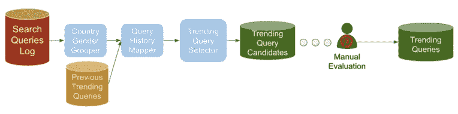
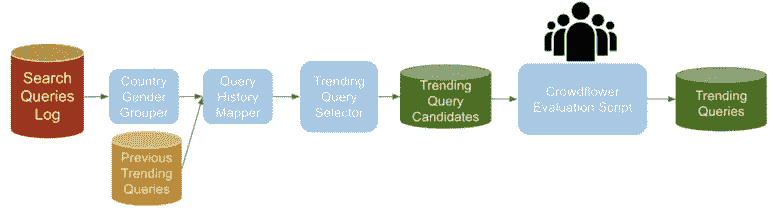
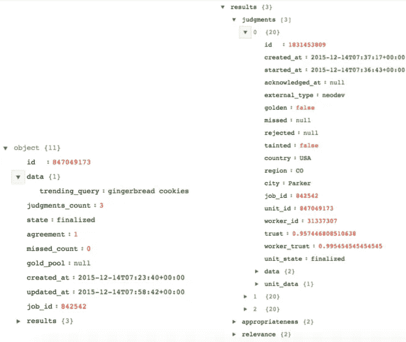

# Pinterest 的自动化人工评估

> 原文：<https://medium.com/pinterest-engineering/automating-human-evaluation-at-pinterest-cad2f41cbe39?source=collection_archive---------1----------------------->

梅森·丘吉尔|发现网站 Pinterest 工程师

现在的电脑太智能了。机器学习在 Pinterest 上完成了一些相当惊人的壮举，从做出复杂的[推荐](https://engineering.pinterest.com/blog/building-interests-platform)到构建[更高质量的](https://engineering.pinterest.com/blog/pinnability-machine-learning-home-feed)主页订阅。有些事情人类往往做得更好，比如评估内容，但让 pinemployees(Pinterest 的员工)监管 Pinterest 上的内容是不可扩展的。出于这个原因，我们已经自动进行人工评估，以分析搜索结果的相关性，并过滤掉某些类型的内容。借助众包的力量，通过利用[弹球](https://engineering.pinterest.com/blog/open-sourcing-pinball)(我们的工作流管理器)，我们以类似于使用其他数据处理工具的方式使用人类决策，使我们能够建立新的功能，包括趋势搜索。

## 趋势搜索:起源故事

去年，我们推出了[趋势搜索](https://blog.pinterest.com/en/pinterest-search-just-got-smarter)，让 Pinners 通过日常搜索建议探索和发现新想法。它很快成为一个流行的搜索功能，每个月都有数百万人使用。为了确保查询是新鲜的和季节性的，当我们看到它们被搜索的频率出现巨大峰值时，它们就会出现在趋势列表中。

然而，偶尔会有拼写错误、无意义或敏感的查询出现在列表中。例如，我们已经看到类似“国庆节”趋势的片段。此外，趋势搜索每天都在更新，因此它们可能在事件和假期后立即过时。例如，在 11 月 1 日建议“DIY 万圣节服装”对时尚一族来说不是一个好的体验。

当我们最初推出趋势搜索时，日常工作流程是这样的:

*   配置单元作业将前一天的搜索数据构建到数据库中。
*   Hadoop 作业根据前一天的搜索频率与其历史最大搜索率之间的差异(通过搜索率偏差进行标准化)，为每个国家/性别群组确定前一天的“热门”搜索。
*   Python 脚本将候选搜索词通过电子邮件发送给 Pinterest 安全团队的一名专门成员。
*   安全团队成员审查搜索结果，并从管理的暂存列表中删除任何敏感的查询或打字错误。
*   当天晚些时候，Cron 作业会在设定的时间将暂存列表发送到生产环境。

*图 1:趋势查询管道的 V1*

推出 V1 的专题总是令人兴奋的，但在这种情况下，出于几个原因，我们有点担心。我们不想在工作日(和周末)占用我们安全小组评审员的时间！)长期。此外，美国以外的增长是我们的重中之重，我们的系统无法扩展到其他语言。我们不能国际运输这个。

## 自动众包人工审查流程

在一个完美的世界中，我们可以调用一个函数来要求一个人回答一个问题，然后根据回答做出代码中的决定。我们能够建造的东西实际上非常接近。我们对管道进行了如下修改:

*   在我们为每个国家/性别组合建立候选人名单后，我们仍然会向安全团队发送一封包含候选人的电子邮件。
*   同时，我们还使用 Python 脚本将候选查询发送给众包网站 [CrowdFlower](http://www.crowdflower.com/) 。
*   然后，Cron 作业从 CrowdFlower 中提取结果，并将相关的趋势候选项推向生产。

*图 2:带有自动化人工评估的趋势查询管道。*

CrowdFlower 的 API 允许您指定调查格式，然后动态构建数据，因此我们为人工评估人员创建了一个表格，以评估我们的趋势搜索候选人的适当性。我们现在有工具来创建多个评估，每个国家和它的主要语言一个。在我们的日常工作流程中自动利用众包，使我们能够在法国、巴西和德国推出趋势搜索。

像任何新系统一样，使用 CrowdFlower 优化以获得好的结果需要一些迭代。最初，我们给了我们的评估者关于如何基于几个例子来衡量查询的适当性的指导。然而，我们没有给评审者任何练习题来加强他们对如何评估查询的理解。因此，对于我们关于趋势搜索的适当性的问题，回答是不一致的。我们更新了模板，增加了测试问题。例如，如果评估者错过了太多的测试问题，他们就没有机会提交当天候选问题的答案。测试问题帮助我们提高了判断的质量，以至于我们的安全团队在二次审查中通常不会做出调整。我们进一步构建了模板，并要求评论者查看 Pinterest 上的搜索结果，并对搜索相关性以及适当性进行评级。这为我们提供了更多信息，有助于为 Pinners 提供更好的体验。

我们有时仍然会看到一个有问题的查询通过了众包审查，但是通过在每天的同一时间部署作业(而不是在众包审查完成后)，我们的安全团队能够在二次审查中发现它们。从长远来看，我们希望这一过程完全自动化。

## 展望未来

我们还想在趋势搜索方面做更多的事情。除了优化我们的人工评估渠道，我们还将使趋势搜索更加个性化和及时:

*   我们可以使用带有人工评级的查询搜索性能的历史数据，只显示带有大量 repin 或值得点击的 pin 的趋势搜索。
*   我们可以将日历数据构建到管道中，以提升与事件/假日相关的术语，并在之后将其降级。我们将使用前一年的趋势数据来丰富这个日历。(我们不想错过国际大象日！)
*   我们还可以使用历史众筹评估结果来预测可能不合适的搜索词，并在结果中查看 Pin 级别的安全信号。这两个建议都将减少我们每天发送给 CrowdFlower 的新搜索词的数量。

最终，我们的目标是拥有 Pinterest 支持的 30 多种语言的趋势搜索。

自动人类评估在 Pinterest 也有光明的前景。探索科学团队建立了一个插入多个众包服务的库，包括 CrowdFlower 和 [Mturk](https://www.mturk.com/mturk/welcome) 。我们可以使用众包来做任何事情，从评估搜索相关性到比较实验的治疗组。将此与我们的工作流管理系统相结合，我们就建立了“人工”人工智能。