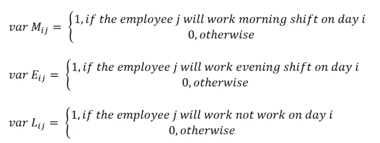
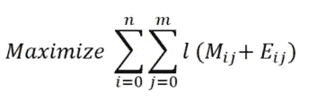
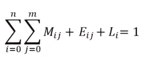
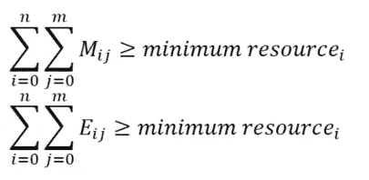
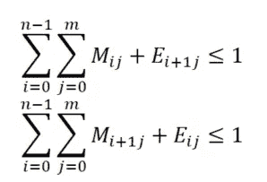
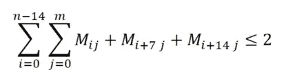
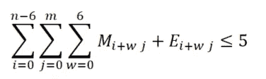
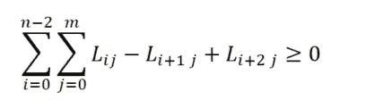

# 用线性规划实现自动排班

> 原文：<https://medium.com/walmartglobaltech/automating-shift-scheduling-with-linear-programming-fe1720f13620?source=collection_archive---------0----------------------->

# 求解排班优化问题的线性规划方法。


Photo by [Volodymyr Hryshchenko](https://unsplash.com/@lunarts?utm_source=medium&utm_medium=referral) on [Unsplash](https://unsplash.com?utm_source=medium&utm_medium=referral)

# **简介**

在任何组织中，日程安排都是计划工作量的重要一步。适当的调度有助于优化许多业务途径，从员工调度到车队调度，其中有许多不同的利用具有不同约束集的资源的组合。当手动完成时，这被证明是非常耗时的，并且通常可能不会导致最佳解决方案，并且是不确定的。这就是线性和整数规划(离散优化问题的关键技术)帮助我们解决具有多组约束的复杂调度问题的地方。通过将调度公式化为线性规划问题，我们能够确定许多约束条件的最佳可能结果，例如资源数量、班次数量、每个资源的休息时间、基于预算或工作量分配资源等等。当新的约束或新的资源被添加到环境中时，程序也变得高度可伸缩。

在这个特殊的例子中，我们将花名册的准备表述为一个线性规划问题。当手工完成时，为团队准备花名册对于经理来说是一项耗时的活动，尤其是在有大量员工的团队中，经理必须考虑每个员工的偏好。此外，需要轮班的员工人数可能会因各种因素而异，如工作日与周末、一周的预测工作量。利用来自管理人员的最少数量的输入参数实现轮班日程的自动化是一种有效的解决方案，将减少管理人员准备花名册所花费的时间。

# **线性编程**

线性规划是一种数学建模技术，它使用优化来给出一组输入约束的最佳可能结果。这是商业计划中定量决策的一种非常有用的技术，并在许多实际应用中广泛使用。可用于线性编程的不同开源解算器，如 SCIP、GLPK 或 Google 的 GLOP，python 编程框架的进步使解算器能够理解编写约束，这导致许多应用程序被解算为线性或整数编程。进度优化是一类可以用线性规划有效解决的问题。

# **问题陈述**

对于一个合适的花名册来说，必须处理几个约束条件。花名册通常提前 5 至 6 周在每月的最后一周准备，并且还考虑了员工的偏好，如计划休假、某些天的轮班偏好、周休、员工连续工作的最大天数等。

目前，许多团队遵循用 excel 表准备花名册的手动过程，然而，这导致违反某些约束，并且需要大量的手动工作来为整个团队提供可接受的花名册。

自动排班程序将考虑到各种限制，并将提供未来数周的花名册，可以对花名册进行审查，然后只针对少数特定情况进行修改。

排班计划的几个约束条件是:

1.  有两个班次(或者某些团队有三个班次)，每个班次包含 8 个工作小时，并且每个班次应该有最少数量的资源。
2.  每个员工每天最多只能轮班一次。
3.  每个员工每周只工作 5 天，每周休息 2 天。因此，任何员工不得在任何时间连续工作超过 5 天。
4.  每隔一周或每两周应进行一次轮班
5.  第二天，每个员工都应该在同一个班次工作，从早到晚的轮班(反之亦然)应该在休息一周后进行。
6.  不同级别的员工应平均分配到不同的班次。

# **程序的输入**

执行程序所需的最少输入是资源列表及其可用性、每天的班次数量以及每个班次中要填充的时间段数量。额外的信息，如每个雇员在某一天国家法定假日的首选班次，可以添加到程序中，以处理特定的情况。我们将程序执行所需的强制输入保持在最低限度，以便程序可以在多个团队中重用。

此外，作为未来的改进范围，我们可以查看上一个花名册的资源利用率，我们可以看到计划容量的利用率，并可以进一步调整计划以优化当月所需的资源。

# **问题公式化**

问题公式化是线性规划的关键步骤。决策变量和约束必须被正确地声明以产生期望的最优结果。线性规划问题由一组决策变量组成，这些决策变量被优化为最小化或最大化其最终在最优解中的值。此外，还有一组约束，对决策变量可以取什么值有限制。

# **符号**

```
*n*: Number of days for which the schedule has to be prepared
*m*: Number of employees
*l*: The level of each employee
```

# **决策变量**

每个雇员和每天(两班制)有三个二元决策变量。他们是 *Mij* 值早班， *Eij* 值晚班，以及 *Lij* 如果员工正在休假或休假。对于一个雇员来说，一天中只有一个变量被设置为 1，因为他们可以上早班、晚班或者可以休假。



```
*# Generate variables which represent each members attends or not.**var_M = pulp.LpVariable.dicts(‘Morning’, (range(days), range(employees)), 0, 1, ‘Binary’)**var_E = pulp.LpVariable.dicts(‘Evening’, (range(days), range(employees)), 0, 1, ‘Binary’)**var_L = pulp.LpVariable.dicts(‘Leave’, (range(days), range(employees)), 0, 1, ‘Binary’)*
```

**目标函数:**

我们在这里最大化的目标函数是员工的级别乘以他们工作的班次总和。我们已经对目标函数进行了最大化，因为约束将确保给员工提供最少的周休假，并且如果任何班次在完成该班次的最少数量的员工后有更多的员工工作，这是有利的结果。



```
*obj = None
for i in range(days):
    for j in range(employees):
        obj += (level * var_M[i][j]) + (level * var_E[i][j]) # + var_L[i][j]
problem = pulp.LpProblem(‘shift’, pulp.LpMaximize)
problem += obj*
```

**约束:**

1.  每个员工每天最多工作一班。对于某一天的雇员*j*I，那么只有变量 *M* 、 *E* 和 *L* 中的一个应该等于 1。员工 *j* 在 *i* 日只能在早上、晚上工作，或者可以休一周假。



```
*# Each employee should work at most one shift per day.**for i in range(days):
    for j in range(employees):
        c = None
        c += var_M[i][j] + var_E[i][j] + var_L[i][j]
        problem += c == 1*
```

2.每天和每班应满足最低资源限制。获得最小资源约束作为对计划的输入，并且每天我们确保班次装载的员工多于班次所需的最小值。



```
*#Minimum resource constraint**for i in range(0, days):
    c = None
    d = None* *for j in range(employees):
        c += var_M[i][j]
        d += var_E[i][j]* *problem += c >= min_resource_constrain
    problem += d >= min_resource_constrain*
```

3.每个员工第二天都应该轮班工作，但是可以在休息一周后轮换。该约束负责为员工分配连续的班次。例如，如果一名员工在前一天上夜班，我们就不能在周二为他分配早班。但是在员工休假一周后，允许轮班。



```
*# Each employee should work same shift the next day.**for j in range(employees):
    for i in range(days — 1):
    c = None
    c += var_M[i][j] + var_E[i+1][j]
    problem += c <= 1* *for j in range(employees):
        for i in range(days — 1):
            if ((i + 1) % 7 != 0) and ((i + 2) % 7 != 0):
            c = None
            c += var_E[i][j] + var_M[i+1][j]
            problem += c <= 1*
```

4.两周至少轮班一次。我们必须至少每两周一次在早班和晚班之间轮换员工。如果没有这个约束，程序会继续将员工分配到一个月中他们工作的所有日子的同一个班次。



```
*#Rotating shifts for at least two weeks**for j in range(employees):
    for i in range(0, days — 14, 2):
        c = None
        c += var_M[i][j] + var_M[i+7][j] + var_M[i+14][j]
        problem += c <= 2*
```

5.每个员工连续工作时间不得超过 5 个工作日。



```
*# Each employee should work at most 5 days per week.**max_consecutive_days = 5
for j in range(employees):
    for i in range(0, days-6):
    c = None
        for w in range(7):
            c += var_M[i+w][j] + var_E[i+w][j]
        problem += c <= max_consecutive_days*
```

6.应该有连续两个星期的休假。这是迄今为止最难写的约束。对于二元变量 L，连续三天要避免的模式仅为 0–1–0，以确保员工获得连续两天的休假。



```
*#Two consecutive days off:**for j in range(employees):
    for i in range(0, days-2):
    c = None
    c += var_L[i][j] — var_L[i+1][j] + var_L[i+2][j]
    problem += c >= 0*
```

# **执行和结果**

我们在 python 中使用了 PuLP 包来解决这个优化问题。对于 10 名员工和 35 天(5 周)，我们总共有 1775 个约束条件和 3 个班次 x 10 名员工 x 35 天= 1，050 个决策变量。纸浆能够在 2 分钟内解决优化问题的最佳解决方案。

```
*# Solve problem. Whole tasks is passes pulp framework!
status = problem.solve(solver)**# If pulp can find optimal values which satisfies conditions, print “Optimal”
print(“Status”, pulp.LpStatus[status])*
```

我们还在这个 python 优化的基础上构建了一个 R-Shiny 应用程序，这样用户就可以输入他们的输入约束，并每月自动为他们的团队生成输出。

# **结论**

自动生成排班表的主要目的是大大减少人工工作量。即使有一些小的变化，团队可能需要在个案的基础上手工完成，这个程序给出了一个名册的框架，在这个框架上可以做那些最小的变化，而不是每次从头开始准备时间表。

**鸣谢:**这是 [Sreeraman Krishnan](https://in.linkedin.com/in/sreeraman-k-krishnan-77839016) 和许多其他团队的合作成果，他们为我们打造这个工具提供了宝贵的意见。

# **参考文献**

1.  [在银行安排 IT 员工:数学规划方法](https://www.hindawi.com/journals/tswj/2014/768374/)
2.  [优化轮班工作](https://www.lewuathe.com/python/math/optimized-shift-work.html)