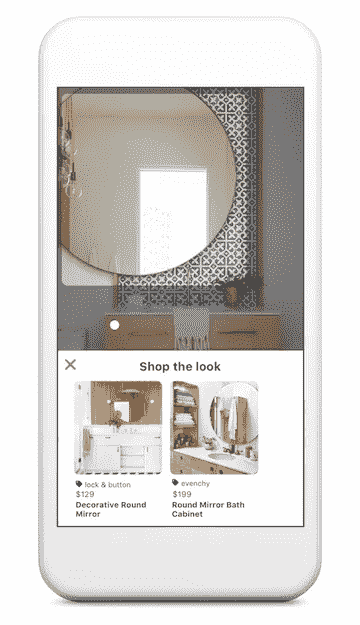
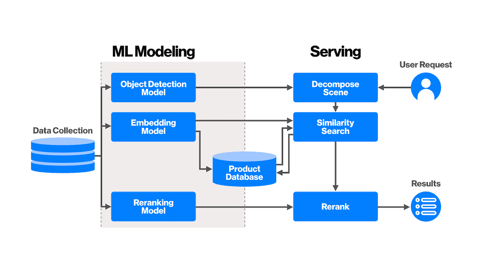
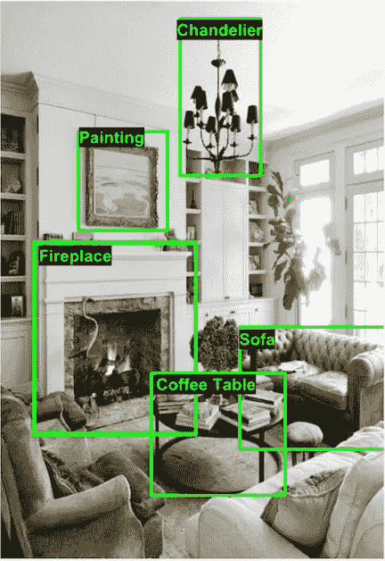
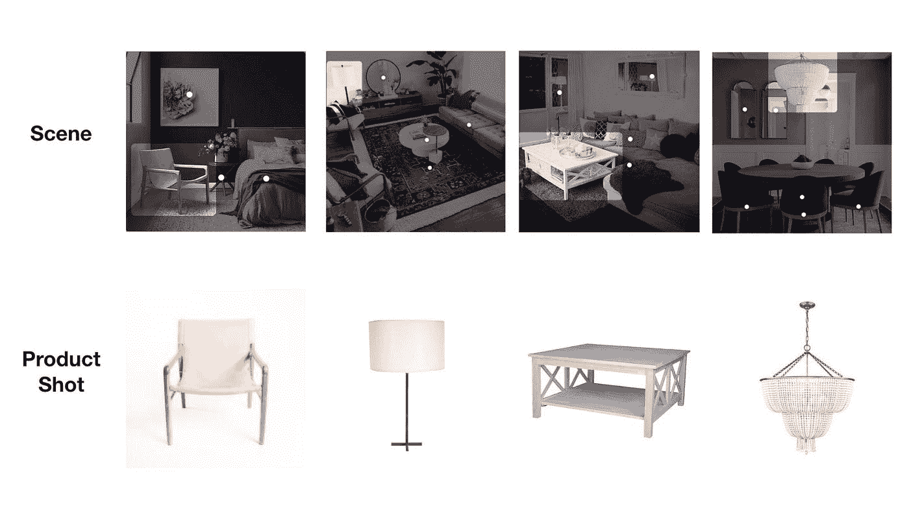
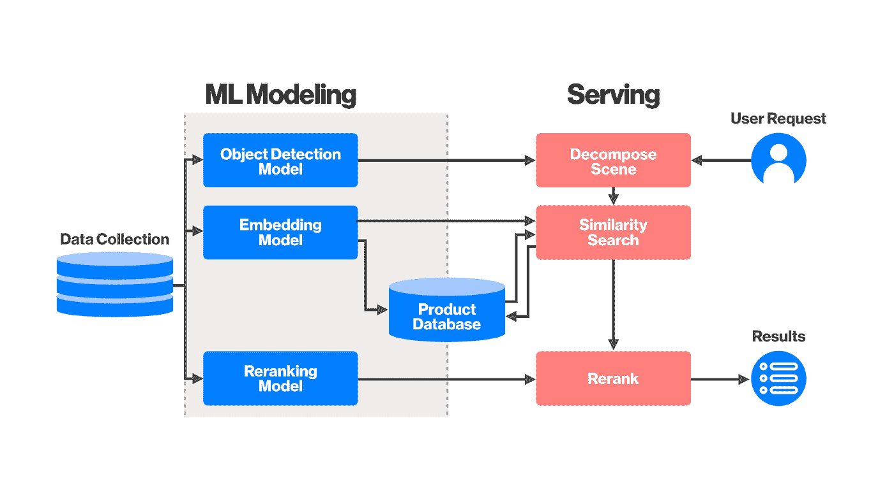

# Pinterest 上的自动化商店外观

> 原文：<https://medium.com/pinterest-engineering/automating-shop-the-look-on-pinterest-a17aeff0eae2?source=collection_archive---------1----------------------->

Kunlong Gu |工程师，发现

每天，人们都会来到 Pinterest 寻找新的想法——当他们找到想要购买的产品时，应该会很容易购买。特别是在家居装饰方面，数百万人来到 Pinterest 寻找灵感。这就是为什么在 2017 年，我们[推出了](https://newsroom.pinterest.com/en/post/introducing-the-next-wave-of-visual-search-and-shopping) Shop The Look，以此来帮助顾客更快地找到他们喜欢的产品，并让品牌引导顾客走上购买之路。商店外观通过白点识别更大场景中的特定对象，白点将 Pinner 连接到结账页面。

我们之前试验了一种[人在回路的方法](/@Pinterest_Engineering/engineering-shop-the-look-on-pinterest-45bdfa7a8d03)来匹配产品链接和 pin，但需要一种更好的方法来扩展我们展示给 Pinners 的数十亿张图片。作为一种解决方案，我们使用计算机视觉来完全自动化产品与场景的匹配过程。今天，我们宣布在 iOS 上实现家庭装饰场景的全自动体验，Android 即将推出。此次更新将我们商店的 Look Pin 覆盖范围扩大了 22.5 倍，涵盖数十亿种 Pin 和产品，在早期测试中，参与度已经提高了 7%。

在这里，我们将分享我们如何利用计算机视觉和 Pinterest 独有的数据集(175 b+pin 保存有用户添加的上下文)来自动化这一体验。

# **从销到购**

在 Pinterest 上，1000 个最受欢迎的搜索中有 97%是非品牌的(这意味着人们通常从“鞋子”或“沙发”等产品的基本搜索开始)，因此各种规模的品牌都有机会接触到处于购物心态的人。随着我们规模的扩大，自动化商店的外观将标记尚未与商业帐户关联的有机 pin。对于那些不想被贴标签的品牌，他们可以[要求自己的域名](https://help.pinterest.com/en/business/article/claim-your-website)。

# **幕后*幕后***

我们分三个阶段构建这项技术:数据收集、机器学习(ML)建模和服务。

数据收集阶段准备我们的机器学习模型用于训练的数据，而 ML 建模阶段准备我们的模型来识别和定位场景中的家居装饰对象。该过程将对象分类为产品类别，并用嵌入来表示它们，嵌入是图像的数字表示，使得视觉上相似的图像与不相似的图像相比，嵌入之间的距离更短。(你可以在我们最近提交的[论文](https://arxiv.org/pdf/1811.12649.pdf)中找到更多信息。)最后，服务阶段使用我们训练的模型从查询 Pin(“外观”)中识别产品类别，然后使用视觉嵌入来找到与“外观”最接近的候选产品。

# **Pinterest 的独特数据集**

每个计算机视觉任务都是从图像数据开始的。Pinterest 的一个特别之处在于，人们保存的大多数大头针都是较大的图片(来自博客、零售网站等)。)在一个场景中有许多产品(一盏灯、沙发、地毯)。通过早期的策展工作，我们已经积累了 270，000 个场景-产品(大约 100 万个对象-产品)匹配对的高质量数据集。此外，我们用基于[谷歌产品分类法](https://www.google.com/basepages/producttype/taxonomy-with-ids.en-US.txt) (GPT)的边界框和类别注释了内部 80，000 幅场景图像(250，000 多个对象)。在我们有一个理想的注释指南之前，我们经历了 GPT 的多次迭代。最初，我们严格遵循 GPT，但该模型在一些粗粒度的类别(如床上用品、桌子)中表现不佳。我们发现，这些粗粒度类别中的产品具有非常不同的形状和功能。例如，“床上用品”的类别包括床罩、床单、枕头。然后，我们手动清理了现有的数据集(细粒度标记)，并显著改进了模型。

# **ML 建模**

在这一阶段，我们训练了一个特征金字塔网络更快的 R-CNN 检测模型，该模型将场景解析为对象，并用产品类别对其进行注释。

我们还训练了一个嵌入模型来表示上面提到的图像(我们将在下一篇博客文章中讨论——兴奋起来！).嵌入从大头针图像的视觉相似性中学习。特别是，我们添加了这个由 270，000 个场景-产品匹配对组成的高质量数据集，以便嵌入可以处理从场景到产品图像的域转换。域转移意味着场景中的对象具有各种光照条件、旋转和嘈杂的背景，而产品图像通常包含具有清晰白色背景的高质量正面照片。我们的嵌入模型很好地捕捉了这些信息，同时提供了产品相似性。

第三个模型是重新排序模型，主要根据用户参与度数据进行训练，并对视觉上相似的候选人进行重新排序，从而优化产品的参与度。重新排序模型还接受语义和上下文信息，例如场景图像的类别、经常包含此 Pin 的电路板以及场景中的其他对象。

# **上菜**

发球阶段有三个步骤。

当用户使用大头针时，我们首先使用检测模型分解场景。我们通过匹配来自检测的注释和购物语料库中的类别注释来限制搜索空间。然后，我们使用购物索引中的视觉相似性评分(嵌入之间的距离)来生成候选结果。最后，我们对这些候选人应用重新排序模型来微调结果。

# **冲击**

此次更新为 Pinterest 带来了更多基于计算机视觉的结果，向更多人展示了视觉上相似的想法。随着系统中更多的商店外观 pin，Pinners 可以期待在所有家居装饰场景中看到更加一致的用户体验。

就内部运作而言，自动化将人们从重复性工作中解放出来，因此他们可以花更多时间进行创新。

从长远来看，场景图像是了解对象之间关系的重要资源，即哪些对象在某种风格上互补或搭配良好。我们希望利用这些丰富的对象出现数据，为世界上的每个对象建立一个复杂的对象图，使 Pinterest 成为家居、时尚等领域的个性化设计师。

在接下来的几个月里，您将会在购物和视觉搜索领域看到更多我们的产品！

*鸣谢:自动化商店外观是 Pinterest 的合作成果。特别感谢 Chuck Rosenberg、Andrew Zhai、Dmitry Kislyuk、Raymond Shiau、Eric Kim、Francis Chen、Jeffrey Harris、Angela Guo、Tim Weingarten、Jen Chan、Joyce Zha、Amanda Strickler 和在本产品上的合作。*