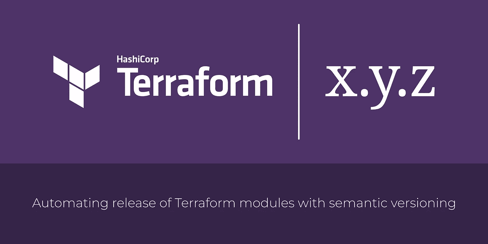
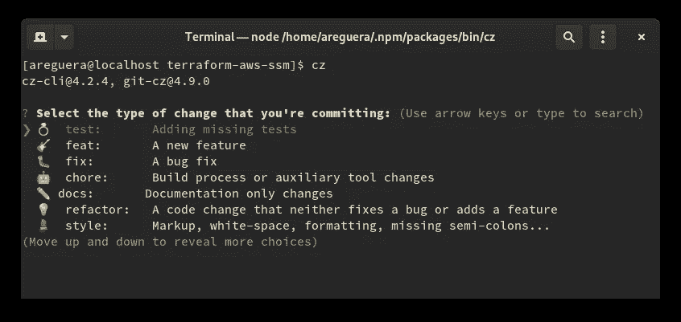
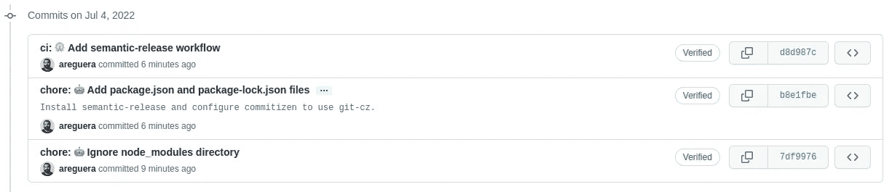
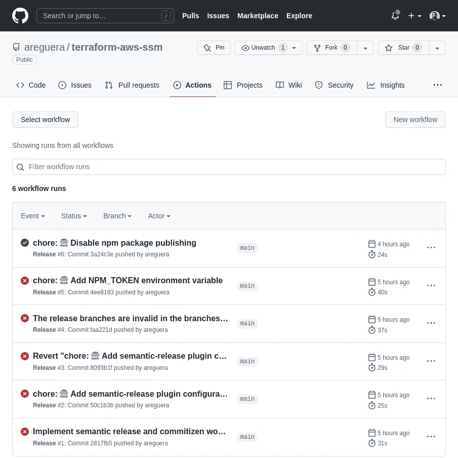
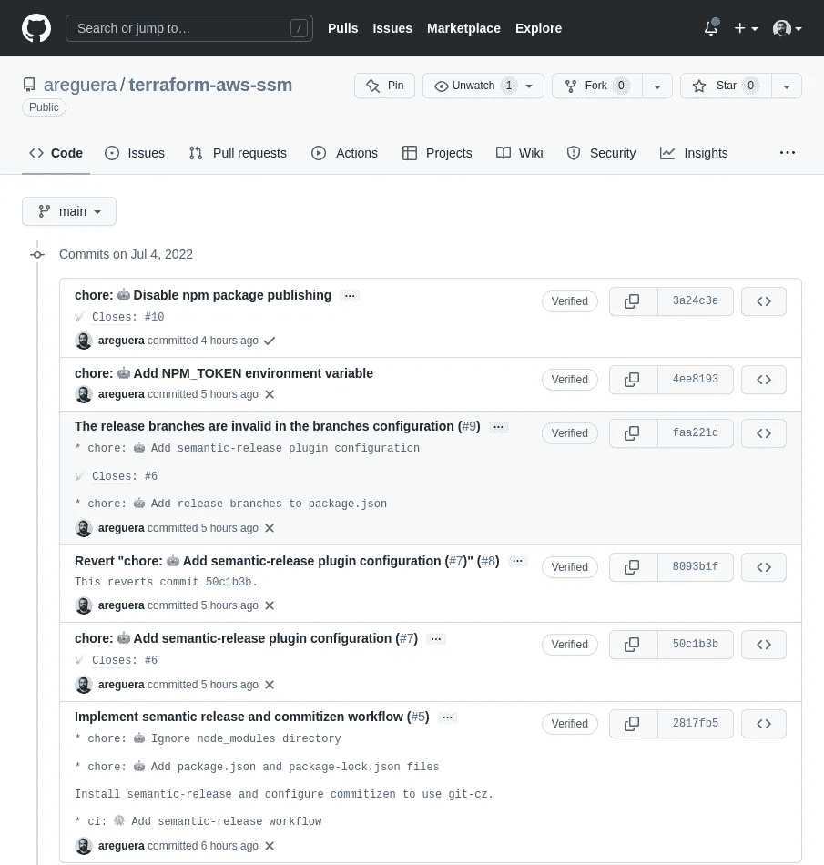
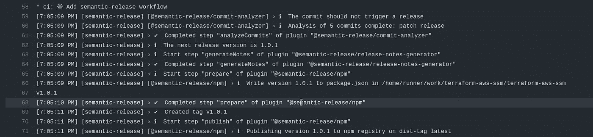
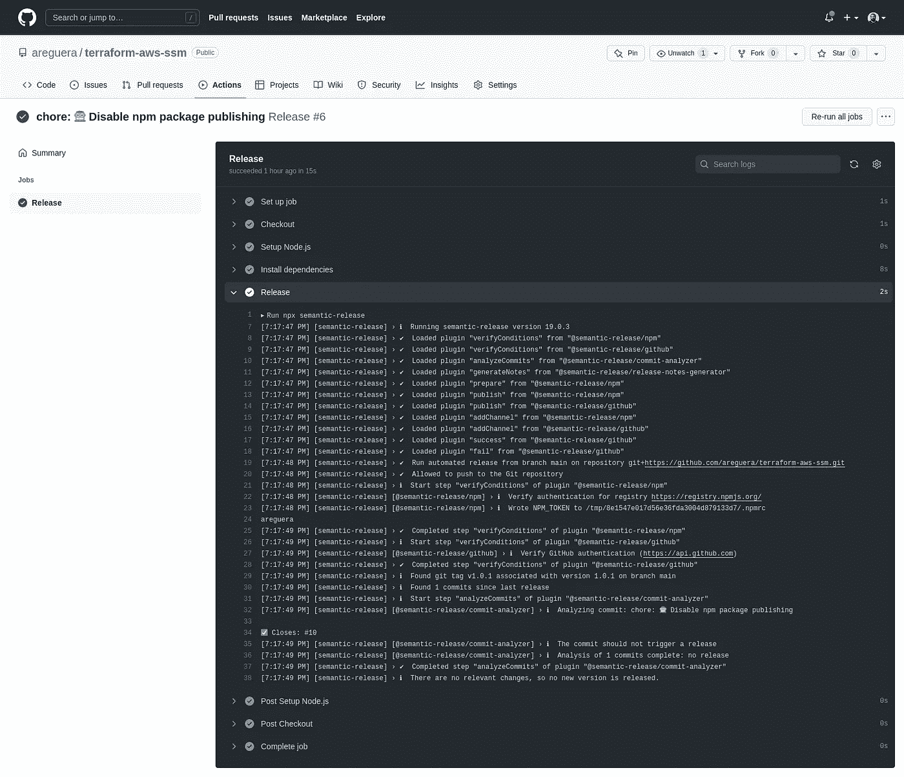
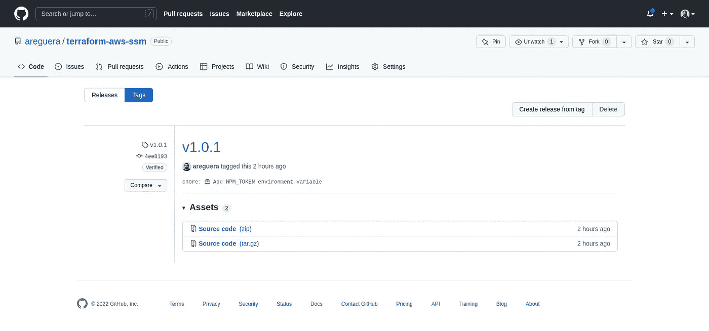
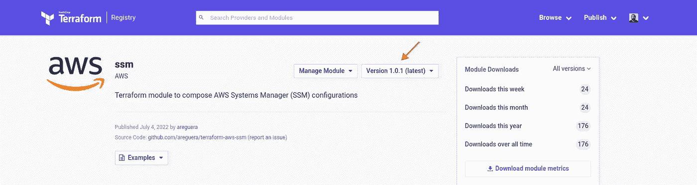

# 使用语义版本控制自动化 Terraform 模块的发布过程

> 原文：<https://medium.com/globant/automating-the-release-process-of-terraform-modules-with-semantic-versioning-104bab1793b7?source=collection_archive---------0----------------------->



为你的 Terraform 模块发布新的变更意味着维护遵循[语义版本](https://semver.org/)规范的版本号。当你的项目很小的时候，这样的任务看起来没什么大不了的，考虑到你所要做的就是把一个标签以`x.y.z`的形式推送到你的 git 库。但是，在某些时候，您会问自己是否有任何方法可以让这个过程自动发生，这样您就可以在代码上花更多的时间，而不用担心版本和推送标签中数字的正确顺序。

有几个选项可以帮助你在项目中自动化[语义版本化](https://semver.org/)。他们中的绝大多数都是以[常规提交](https://www.conventionalcommits.org/)规范为参考，来分析你的存储库的特定分支中的提交消息的格式，并在此分析的基础上，确定正确的版本号。

本文探索了在 [terraform-aws-ssm](https://github.com/areguera/terraform-aws-ssm) 项目中[语义发布](https://github.com/semantic-release)、[提交](https://github.com/commitizen-tools/commitizen)和 [GitHub 动作](https://github.com/semantic-release/semantic-release/blob/master/docs/recipes/ci-configurations/github-actions.md)的组合，以自动化发布过程，terraform 模块用于[编写 aws 系统管理器(ssm)配置](/globant/composing-aws-systems-manager-configurations-with-terraform-part-1-939585ee9b7d)。章节是逐步组织的，因此您可以在自己的项目中重现它们。主要部分包括:

1.  第一步。安装 NPM 软件包管理器。
2.  第二步。安装和配置 NPM 软件包
3.  第三步。理解常规提交
4.  第四步。检查发布过程自动化
5.  结论

# 第一步。安装 NPM 软件包管理器

本文中使用的`semantic-release`和传统工具是用 JavaScript 编写的，并作为一个包发布在[npmjs.org](https://www.npmjs.com/)注册表中。要安装这些包，您在 GitHub actions 上用作工作站或容器映像的操作系统中必须有 NPM 包管理器。

如果您使用的是 [Fedora Linux](https://getfedora.org/) 或类似软件，请执行以下操作:

1.  安装 NPM 安装`nodejs`包。

```
$ sudo dnf install nodejs
```

2.创建`~/.npm/packages`目录来存储全球 NPM 软件包(即使用`-g`选项安装的软件包)。

```
$ mkdir ~/.npm/packages/
```

3.更新您的`~/.bashrc`文件，以配置环境变量。

```
NPM_PACKAGES="${HOME}/.npm/packages"
export PATH="${PATH}:${NPM_PACKAGES}/bin"
export MANPATH="${MANPATH-$(manpath)}:${NPM_PACKAGES}/share/man"
```

4.检查 NPM 是否安装成功:

```
$ npm --version
8.3.1
```

# 第二步。安装和配置 NPM 软件包

## package.json 文件

`package.json`文件描述了您将在项目中安装的 NPM 包。通常，这个文件不存在，您需要创建它。要在存储库中安装和配置语义发布，请执行以下操作:

1.  创建运行 [npm init](https://docs.npmjs.com/cli/v8/commands/npm-init) 命令的`package.json`文件:

```
$ npm init
```

当你执行 [npm init](https://docs.npmjs.com/cli/v6/commands/npm-init) 命令时，它会问你一些问题，你可以回答或者跳过。并非所有在`package.json`文件中默认创建的属性都是自动化发布所必需的。这里最相关的属性是用于跟踪软件版本的`devDependency`，以及用于配置软件使用的`config`。

2.运行以下命令为 GitHub 安装 semantic-release 及其插件:

```
$ npm install -g commitizen
$ npm install --save-dev git-cz
$ npm install --save-dev semantic-release [@semantic](http://twitter.com/semantic)-release/github
```

3.编辑`package.json`文件，用`git-cz`配置`commitizen`。

```
{
    "config": {
        "commitizen": {
            "path": "git-cz"
        }
    }
}
```

4.编辑`package.json`文件以配置插件。

```
{
    "plugins": [
        "[@semantic](http://twitter.com/semantic)-release/commit-analyzer",
        "[@semantic](http://twitter.com/semantic)-release/release-notes-generator",
        "[@semantic](http://twitter.com/semantic)-release/github",
        "[@semantic](http://twitter.com/semantic)-release/npm", {
            "npmPublish": false
        }
    ]
}
```

注意在`[@semantic](http://twitter.com/semantic)-release/npm`插件中`npmPublish`是如何被设置为`false`的，以防止 semantic-release 试图向 nodejs.org 注册表推送任何东西。这稍微加快了像 [terraform-aws-ssm](https://github.com/areguera/terraform-aws-ssm) 这样不需要在 npmjs.org 注册表中发布包的项目的发布过程。您可以更改更多配置选项来满足您的需求。要了解这些插件的更多信息，请访问以下链接:

*   h[ttps://github . com/semantic-release/commit-analyzer/](https://github.com/semantic-release/commit-analyzer/)
*   [https://github.com/semantic-release/release-notes-generator](https://github.com/semantic-release/release-notes-generator)
*   [https://github.com/semantic-release/github](https://github.com/semantic-release/github)
*   [https://github.com/semantic-release/npm](https://github.com/semantic-release/npm)

5.编辑`package.json`文件以配置分支名称，语义发布程序将分析提交消息，并基于它们创建版本号。

```
{
    "release": {
        "branches": ["main"]
    }
}
```

安装 semantic-release、常规提交工具、删除一些未使用的属性，并编辑添加其他属性后，terraform-aws-ssm 中使用的`package.json`如下所示:

The package.json file of terraform-aws-ssm project

## package-lock.json 文件

`package-lock.json`是从`package.json`中产生的，它必须在版本控制下，因此您可以稍后在 CI/CD 配置期间使用 [npm ci](https://docs.npmjs.com/cli/v6/commands/npm-ci) 命令。

## 的。github/workflow/release.yml 文件

`.github/workflow/release.yml`文件指定了 GitHub 动作将执行的工作流。这是控制自动化本身的配置，在这里执行语义发布并创建发布版本。

```
---
name: Release
on:
  push:
    branches:
      - mainjobs:
  release:
    name: Release
    runs-on: ubuntu-latest
    steps:
      - name: Checkout
        uses: actions/checkout@v2
        with:
          fetch-depth: 0
      - name: Setup Node.js
        uses: actions/setup-node@v2
        with:
          node-version: 'lts/*'
      - name: Install dependencies
        run: npm ci
      - name: Release
        env:
          GITHUB_TOKEN: ${{ secrets.GITHUB_TOKEN }}
          NPM_TOKEN: ${{ secrets.NPM_TOKEN }}
        run: npx semantic-release
```

这种配置可以通过多种方式进行改进(例如，在执行发布作业之前添加测试)。当有人使用传统的提交规范将变更推入`main`分支时，这是创建一个发布的起点，并激励您继续挖掘这个主题。要了解更多关于如何用 GitHub 动作配置语义发布的信息，请参见[用 GitHub 动作使用语义发布](https://github.com/semantic-release/semantic-release/blob/master/docs/recipes/ci-configurations/github-actions.md)。

## 节点模块目录

当您运行像`npm install`或`npm update`这样的命令时，`node_modules`目录存储了在`package.json`文件中指定的软件包。考虑到上面显示的`package.json`的内容，该目录的大小可以达到接近 150MB，并且必须在`.gitignore`文件中为其添加一行，将其排除在版本控制之外。

## 1.0.0 版标签

语义发布实现希望您的存储库中至少有一个名为`v1.0.0`的标签。通常，这个标签是不存在的，你需要手动创建它。这是所有语义版本分析的起点。因此，检查您的存储库中是否有一个`v1.0.0`标签，如果没有就创建它。

> 观看 Stephan bnne Mann 关于语义版本化的视频。

# 第三步。理解常规提交

此时，您的工作站已经准备好记录常规提交。为此，在发出`git add`命令后，使用`cz`命令而不是`git commit`命令。

## 传统提交的用户界面

在您的工作站终端中，`cz`命令提供了一个交互式界面，引导您完成常规提交过程。它看起来像下面这样:



Conventional commits user interface in the terminal.

在 GitHub web 界面上，常规提交如下所示:



Conventional commit format in the GitHub commits interface.

## 定制传统的提交用户界面

如果您想要不同的消息，您可以[定制该界面](https://github.com/streamich/git-cz#custom-config)以满足您的需求。但是，请记住，语义发布完全是关于常规提交消息的，无论您在这里执行什么更改，也必须在语义发布的配置中进行更改。

## 了解提交消息和版本号之间的关系

发布版本由三个不同的提交消息控制。从[常规提交 1.0.0](https://www.conventionalcommits.org/en/v1.0.0/) 规范:

> 提交包含以下结构元素，用于向库的使用者传达意图:
> 
> 1.fix 类型的提交修补了代码库中的一个错误(这与语义版本化中的修补相关)。
> 
> 2.feat 类型的提交为代码库引入了一个新的特性(这与语义版本化中的 MINOR 相关)。
> 
> 3.`**BREAKING CHANGE:**`一个有页脚`BREAKING CHANGE:`的提交，或者在类型/范围后面附加一个`!`，引入了一个突破性的 API 变化(与语义版本控制的主要部分相关)。一个`BREAKING CHANGE`可以是任何类型的提交的一部分。

# 第四步。是时候检查自动化了

## GitHub 操作

查看 terraform-aws-ssm 项目 GitHub 操作，可以观察到一些失败的作业，成功的作业不是创建`v1.0.1`版本的作业。这里发生了什么？



让我们仔细看看从`v1.0.0`标记开始推送到存储库的`main`分支的提交:



这里所有的提交都以`chore:`开始，除了其中的三个。有趣的是，在其中一个提交的主体中有一个`ci:`字符串，它是按照传统的提交规范由三个提交合并而成的。语义发布程序解析了从`v1.0.0`标签到存储库中最后一次提交之间的所有提交，结果发现了一个`ci:`字符串，并因此触发了一个新的补丁版本。

[查看那个特定的作业](https://github.com/areguera/terraform-aws-ssm/runs/7185753978?check_suite_focus=true#step:5:59)，可以观察到它是负责创建`v1.0.1`版本的，在它尝试向 npmjs.org 注册中心发布内容失败之前。



Semantic-release runs in GitHub Actions creating a new version.

后来，当`package.json`文件再次被更改时，添加其他`chore:`提交，以避免将内容发布到 npmjs.org 注册中心，语义发布再次运行，但它没有创建任何版本，因为传统提交规范中的`chore:`提交不影响语义版本化。他们只是路过。



Semantic-release runs on GitHub Actions without creating a new version.

## GitHub 标签

查看 terraform-aws-ssm 项目 GitHub 标签，可以看到一个自动创建的新标签。厉害！



New version available in GitHub tags

## 地形注册表

查看 terraform-aws-ssm 项目的 Terraform 注册表，还可以看到当您访问该模块的页面时，自动选择了一个新版本。厉害！



New module version available on Terraform registry

# 结论

本文一步一步地探索了如何使用语义发布、常规提交和 GitHub 动作来自动化 Terraform 模块的发布过程。本文中实现的自动化允许开发人员将更多的时间用于编码，而将更少的时间用于规划版本号和将相关标签推送到存储库。该配置非常灵活，可以适用于其他项目。

谢谢！