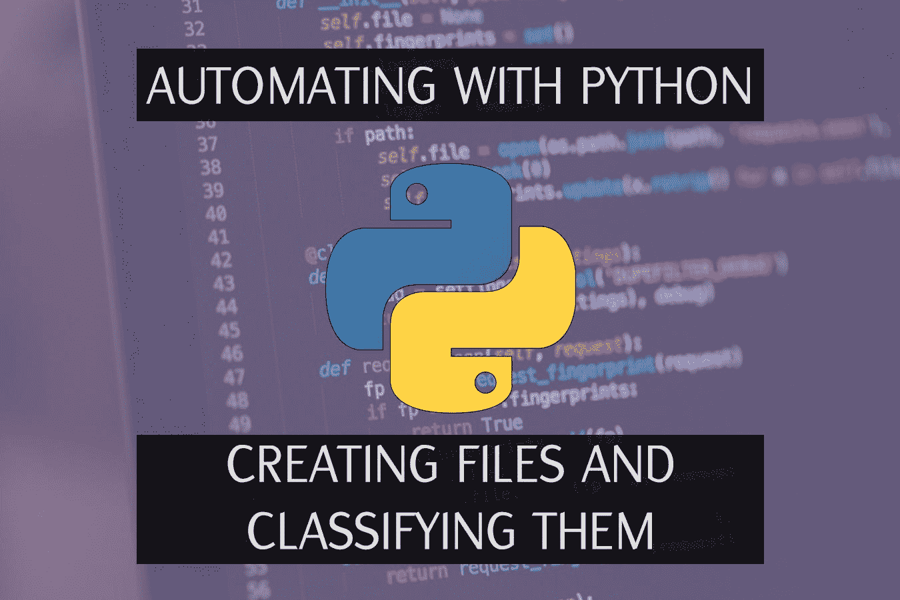

# 使用 Python 实现自动化|创建和分类文件

> 原文：<https://medium.com/quick-code/automating-with-python-creating-and-classifying-files-7095b33562f7?source=collection_archive---------0----------------------->

网站，机器学习，REST API……专业 Python 有很多用处。但是 Python 也可以帮助我们完成平凡的任务，例如，自动化重复的任务。

在视频的第一部分，我们将生成随机的学生报告，包含随机的姓名、主题、文件创建日期、主题和分数。以及如何只删除？txt 文件生成来清理我们的文件夹。

第二次，我们将读取文件，统计学生有多少门科目不及格，通过添加及格或不及格来重命名文件，将文件移动到“及格”或“不及格”文件夹，然后将两个文件夹都压缩到。zip 文件

在本视频中，您将学习如何:

*   创建文件
*   读取文件
*   删除文件
*   移动文件
*   随机化文件的内容
*   压缩文件夹

还有更多。只使用 Python，不需要包和模块。

# 教训

你有我的 Github 账户的密码。虽然这很容易学，但我还是推荐你看视频，在视频中我解释了我在每一行代码中做了什么以及为什么。

当然还有，[记得订阅](https://www.youtube.com/channel/UC9OLm6YFRzr4yjlw4xNWYvg?sub_confirmation=1)！

[我的 Youtube 教程视频](https://www.youtube.com/channel/UC9OLm6YFRzr4yjlw4xNWYvg?sub_confirmation=1)

[Github 上的最终代码](https://github.com/david1707/auto_teacher)

[在 Twitter 上联系我](https://twitter.com/DavidMM1707)

[我博客上的更多教程](https://letslearnabout.net/category/tutorial/)

*原载于 2019 年 10 月 4 日*[*https://letslearnabout.net*](https://letslearnabout.net/tutorial/automating-with-python-creating-and-classifying-files/)*。*