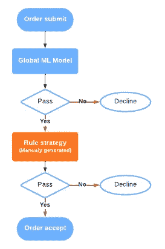
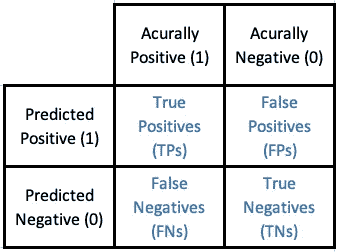
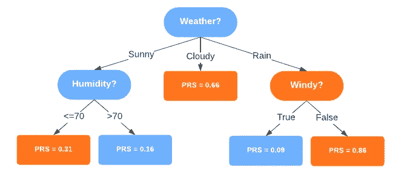
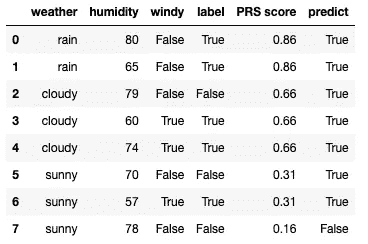
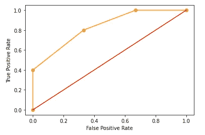
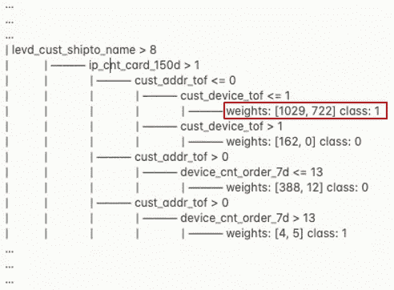
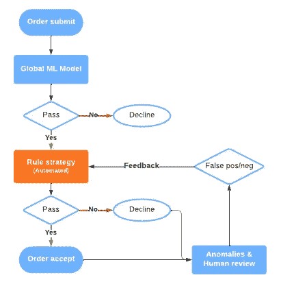

# 电子商务中异常检测策略生成的自动化

> 原文：<https://medium.com/walmartglobaltech/automation-of-strategy-generation-for-anomaly-detection-in-e-commerce-f901b04290c7?source=collection_archive---------3----------------------->


Picture credit: [https://corporate.walmart.com/newsroom/innovation/20170807/5-ways-walmart-uses-big-data-to-help-customers](https://corporate.walmart.com/newsroom/innovation/20170807/5-ways-walmart-uses-big-data-to-help-customers)

# 介绍

自 2020 年以来，电子商务和在线零售业务在新冠肺炎疫情期间激增并持续增长。随着越来越多的人接受在线购物体验，在线平台变得越来越受欢迎。疫情不仅继续以历史上最快的速度推动电子商务和在线零售增长，还显著改变了消费者的购物行为。为了建立值得信赖的品牌和改善客户体验，电子商务和在线零售企业比以往任何时候都更加注重适应变化并及时为异常订单制定策略或规则。

在线零售业务中异常检测的规则策略生成面临一些挑战:

1.  顾客的购物模式变得越来越复杂。因此，必须迅速制定相应的战略，以应对日益加剧的异常现象。
2.  传统的策略生成方法严重依赖于人工审查。然而，人类的智能极难捕捉和理解每一个模式变化，从而在速度和准确性方面产生了瓶颈。
3.  数据是巨大的。尽管有成千上万的特征可用于异常检测，但手动穷尽所有特征并选择最相关的特征来使用是非常困难的。

在下面的章节中，我们将介绍一个利用机器学习技术和创新的测量分数来生成策略而无需人工干预的过程。此外，该过程以非线性方式组合特征，以高效地识别异常模式。

# 方法学

在当代风险管理实践中，策略是保护客户和公司的风险防御引擎的基本构件。从技术上讲，策略相当于迷你机器学习模型，它针对正在进行的订单趋势，分析购买行为，并揭示异常模式。生成高效、持久和敏捷的规则策略是风险防御成功的主要因素。



Figure 1\. Overview of a contemporary risk defense engine infrastructure. The strategy component plays an important role in defending risk and improving customer experience as it adapts to changing purchasing behaviors.

**决策树，**一种机器学习算法，可以从成千上万的输入特征变量中分析和识别模式。由于其非线性特性，决策树比线性算法(如逻辑回归)更灵活。决策树不仅输出二进制结果，允许人们做出风险决策，它还明确地体现了决策规则。因此，决策规则可以用作策略，并直接在风险防御引擎中实现。

**精度**和**召回**是执行模型选择和模型评估的常用指标。这两个指标在策略生成和开发中也非常有用。技术上，Precision 衡量策略的准确性，Recall 衡量覆盖率。除了精确度和召回率，我们还引入了一个**稳定性**指标，通过置换和引导训练数据集来评估策略的健壮性。

**精确召回稳定性(PRS)评分**

在介绍新设计的综合 PRS 评分之前，值得注意的是分类算法模型评估中常用的混淆矩阵、精度公式和召回公式。



Figure 2\. Confusion Matrix

*   精度=真阳性/(真阳性+假阳性)
*   覆盖率或召回率=真阳性/(真阳性+假阴性)
*   鲁棒性或稳定性


新的 PRS 分数本质上是精确度、召回率和稳定性的加权调和平均值。它也是对准确性、覆盖面以及健壮性的全面衡量。参数⍺、β和𝞬用于根据焦点调整每个分量的不同权重。⍺、β或𝞬值越高，PRS 分数中的相应部分越受关注。最终，PRS 分数提供了比普通指标(如 F1 分数)更广泛、更灵活的决策树性能测量。

**使用 PRS 分数和 AUC 分数评估决策树**

通常，决策树或预测模型是在具有真实标签和特征变量的训练数据集上训练的。曲线下面积(AUC)通常用于报告模型性能。一旦模型为验证数据集中的每个数据观察值产生了数值分数，通过对分数进行排序，我们可以相应地计算 AUC。这种机制可以很容易地扩展到决策树，即使它产生的是因子结果而不是数字分数。例如，我们可以用概率来代替分数。请注意，当我们使用决策树模型进行预测时，我们从根节点向下到叶节点，在叶节点处，我们使用多数类进行预测。除了概率之外，每个叶节点还可以返回数字分数(例如 PRS 分数)，用于对观察结果进行排序。

假设我们有一个训练好的决策树来预测 2 类结果: **P** (正)或 **N** (负)，多数类标签如下:



Figure 3\. A trained decision tree to predict positive or negative outcomes. The decision tree has 5 leaf nodes. Orange leaf nodes predict positive outcomes, and blue leaf nodes predict negative outcomes.

同时，表 1 显示了按照 PRS 分数降序排列的验证数据集。验证数据集包含 4 个分数仓:0.86、0.66、0.31 和 0.16。我们还使用真实标签和预测结果来计算每个分数仓的真阳性率(TPR)和假阳性率(FPR)。

*   TPR =真阳性/总阳性
*   FPR =假阳性/总阴性



借助 TPR 和 FPR，我们可以绘制一条接收操作特征(ROC)曲线，如图 4 中黄色部分所示。注意，曲线上的每个点代表一个容器。给定曲线，我们可以计算 ROC 曲线下的面积，也就是 AUC 得分。在这种情况下，AUC 得分为 0.73。



Figure 4\. ROC curve

一旦基于 AUC 分数选择了最佳决策树模型，我们就可以很容易地从具有最高 PRS 分数的树的分支中挑选出策略。在这种情况下，最佳策略是导致 PRS 得分= 0.86 的叶节点的决策规则。也就是说，当天气多雨但没有风时，该策略预测一个积极的结果。

**机器人检测的真实使用案例**

该流程的一个真实用例打印了决策树模型的以下输出。最佳策略是下图中突出显示的分支。权重是分支中阴性样本的数量和阳性样本的数量。



然后，我们将这个输出翻译成 JavaScript 语言，以便在决策引擎中使用。本质上，如果订单符合以下四个标准，我们会因异常风险高(僵尸攻击)而拒绝订单:

*   帐户名称和收货方名称之间的字符串距离很大
*   订单 IP 地址中不同信用卡的数量≥ 1
*   发货地址是新的(存档 0 天)
*   设备是新的(存档时间≤ 1 天)

```
if (levd_cust_shiptp_name > 8 && 
    ip_cnt_cc_150d > 1 && 
    cust_addr_tof <= 0 && 
    cust_device_tof <= 1) { recommendation = 'Decline'}
```

**反馈回路提炼策略生成**

每个决策规则或策略都不可避免地会产生误报和漏报。因此，通常采用反馈回路机制来弥补这一差距。



反馈循环有助于注入领域知识和来自人工代理的深入理解。与此同时，现实生活中的异常现象将继续提供错误的负面信号。对于下一轮策略生成，该模型可以在训练阶段获取假阳性和假阴性信号，并对错误决策的情况增加更多权重，从而提高策略决策的准确性。

# 结论

策略生成的自动化克服了依靠人眼穷尽大量特征变量和捕捉快速变化模式的瓶颈。下表列出了提议的策略生成流程相对于传统流程的优势。

```
 | Approach |    Coverage    |     LOE     |
                    | -------- | -------------- | ----------- |
   Proposed process |   Auto   | ~1000 features |   3 hours   |
Traditional process |  Manual  |   ~50 features |   >= 1 day  |
```

为了保护一个典型的异常情况，人工审查可能需要一天甚至一周的时间来提出一个合理的策略，但是这种自动化可以减少 80%的时间。凭借机器学习算法和全面的指标评估，自动化策略生成实现了更高的效率、覆盖范围和适应性。