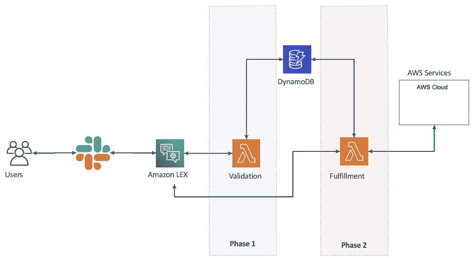
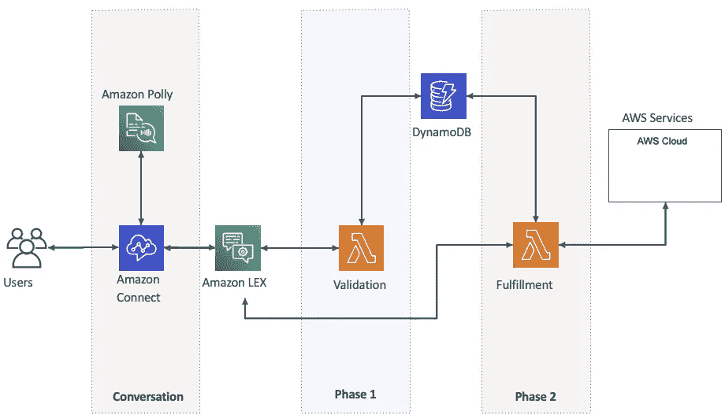
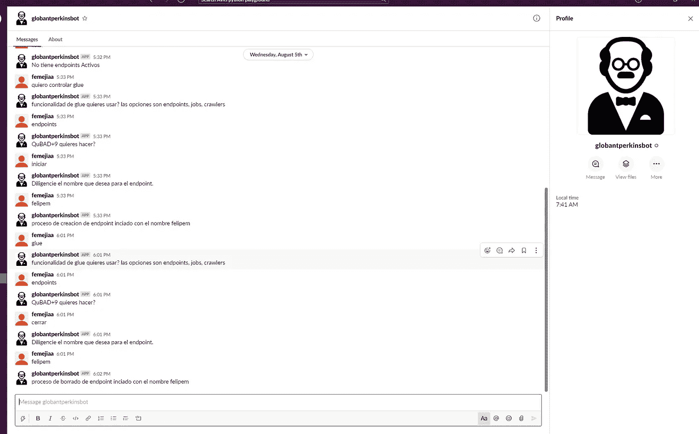

# 通过 Chatbot 无服务器实现 AWS 自动化

> 原文：<https://medium.com/globant/automation-on-aws-with-chatbot-serverless-a9c3f77544b3?source=collection_archive---------0----------------------->

聊天机器人最近获得了很大的优势，它们是一种可以与我们的客户互动的对话系统，或者可以通过使用人工智能来自动化手动任务。然而，为了在公司层面实现它，重要的是要问自己一些问题，以确定我是否真的需要聊天机器人:

# 我需要什么类型的聊天机器人？

这就是我们应该检查一下有哪些类型的地方:

*   **信息:**他们关注来自客户的重复请求，例如，关于帐户报表、产品状态、天气、新闻的信息...
*   **应用:**它们可以集成到移动应用中，以改善用户体验并促进与 it 的交互。
*   **企业:**通常与 ERP 或 CRM 等企业平台集成。
*   **联络中心:**它们用于通过语音与用户进行交互，例如，它们可以用于解决问题、查看运输指南，甚至用信用卡进行支付。

# 我与客户之间有哪些类型的沟通渠道？

在这里，了解我目前与客户的沟通渠道非常重要，例如:

*   免费热线电话— 01800
*   做服务线。
*   通过社交网络。
*   WhatsApp。
*   短信。

根据与客户沟通渠道的类型，我们必须验证其实施的可行性，并为其选择最佳技术。

现在我要告诉你实现聊天机器人的过程，这是我们不久前为了自动化一些任务和节省时间而做的

# 方案

我和我的朋友费利佩·梅希亚在一个非常大的项目中开发了一个具有强大数据组件和实时性的应用程序，在这个项目中使用了许多 AWS 服务，如 Fargate、Kinesis、Glue、Athena、Quicksight 等。当项目开始呈指数级增长时，挑战增加了，复杂性也增加了，这就是我们关注于寻找自动化工作的方法的地方。

*   **项目**:数据和分析。
*   **处理**:每天实时处理 8000 万个事件。
*   **月成本:**25，000 美元
*   我们花了 20%的时间来尝试新的服务和运行 PoC，在许多情况下，几个服务正在产生额外的成本(Glue 的开发端点)。

# 解决办法

我们用 Amazon LEX 创建了一个名为 Perkins 的聊天机器人来控制 AWS 服务:

*   创建和删除 AWS 服务。
*   关于已打开服务的每日通知。
*   管理任务的自动化。
*   用自然语言与机器人交流。

# 聊天机器人架构

下面我描述一下组件的功能:

*   **验证λ**:从 slack 接收的输入被验证，一旦流被验证，它继续到阶段 2。
*   **实现λ**:采取来自验证λ的动作。在这种情况下，它负责在 AWS 服务上执行操作。
*   **DynamoDB** :存储所有关于要交互的服务的信息，以及验证 Lambda 的输入。

# 带有 Amazon Connect 的聊天机器人架构

*   **Amazon Connect**:AWS 中的联络中心，我们可以创建复杂的流程联系，并重定向到代理队列，以便获得服务。
*   **Amazon Polly** :是将文本转换成不同声音和语言的语音的服务。

# **聊天机器人无服务器的安全性**

在实现的体系结构中，安全性是通过以下方式处理的:

*   **Lambda Role** :它拥有与我们将要自动化的 AWS 服务进行交互的特定权限。
*   **Slack** :我们有一个私人通道，只有授权人员才能使用珀金斯完成自动化任务。
*   **加密**:我们用 KMS 完全加密了发电机表，以及 lambda 函数中使用的环境变量。

# 珀金斯和斯莱克互动公司

这是直接与珀金斯互动的方式，我们的聊天机器人无服务器。

# 资源

*   **Github 库**:[https://github.com/czam01/chatbot-serverles-lex](https://github.com/czam01/chatbot-serverles-lex)
*   亚马逊 Lex 文档。
*   [AWS Lambda 文档](https://docs.aws.amazon.com/lambda/)。
*   [亚马逊连接文档](https://docs.aws.amazon.com/connect/)。