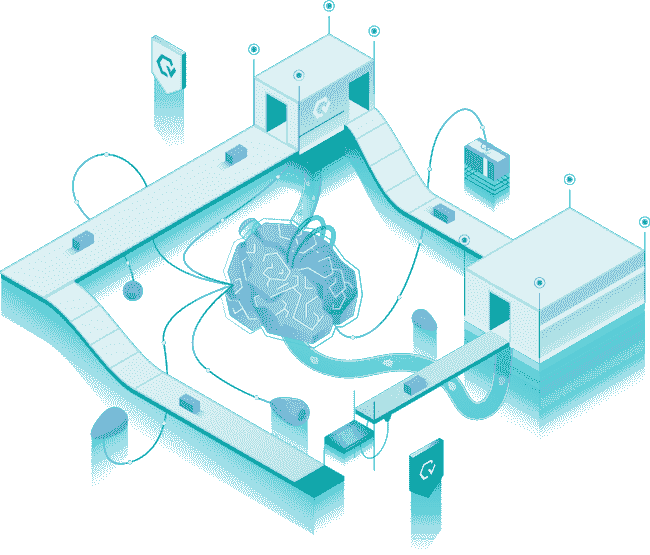

# 自动化测试期望

> 原文：<https://medium.com/globant/automation-testing-expectations-bfd377117279?source=collection_archive---------0----------------------->

# 介绍

许多公司尝试、挣扎、抗争，并且许多最终在采用成功的测试自动化策略上失败了，并且结果得出了错误的结论，即测试自动化不起作用，而事实上，它只是在他们试图实现它的方式上没有效果。我所看到的测试自动化失败的一个主要原因，是由于不合理的期望或者对自动化错误的期望。所以，也就是说，为了避免这些常见的陷阱，这里有一些你可以遵循的建议。

*   定义现实的期望。
*   利益的清晰性。
*   确保每个人都在船上。
*   确定什么是好的自动化。
*   选择正确的自动化策略。

# 定义现实的期望

您可以期望您的自动化测试节省您的团队时间，以及不得不手动测试一切的头痛。然而，当谈到软件测试时，你不能完全依赖自动化，因为**不是*所有的*都可以自动化，或者甚至应该自动化**。当您自动化测试时，您实际上只是让一个计算机程序以预先确定的方式检查系统，但是仍然需要人来做测试的非自动化方面。此外，请记住，您必须在之前完成您的手动测试，至少是测试设计，以便您首先知道您正在自动化什么。爬，走，然后跑！

重要的是要记住，自动化测试的价值来自于它揭示的关于软件质量的信息，而不是来自于执行的测试数量，也不是它们运行的频率。最重要的是获得正确的信息，并与团队分享，以便做出关键的业务决策。所以，不要期望通过自动化一切，你所有的问题都会消失。

此外，一旦自动化完成，由于应用程序更改、数据更新等原因，仍然需要大量的工时来维护脚本。自动化不是一种“设置好就忘了”的测试方式。

# 目标是 100%自动化测试

我们都知道 100%的测试是不可能的。这与测试的设计和应用程序的开发成正比。明智的做法是瞄准测试的功能，这对任何组织来说都是最重要的。没有一个自动化工具能够做所有的事情。因此，在一个简单测试的层次上，自动化并不难，但是在一个集成层次上有几个更复杂的测试，需要不同的测试类型，这将变得复杂。

即使您成功地自动化了所有的测试(正如前面提到的，这不太可能发生)，您仍然需要测试人员来管理这些自动化测试。应用程序是不断变化和发展的，因此，您需要随着应用程序的变化更新您的测试，并添加新的测试。最重要的是，自动化所有的测试通常是不划算的。非功能性测试方面，如可用性、布局、可访问性等等，自动化所有方面是非常困难和昂贵的。通常，自动化部分，手动检查其余部分要便宜得多。

# 利益的清晰性

关于测试自动化的最大误区之一是自动化会导致资源数量的下降。测试自动化工具将需要人来支持和编写开发脚本。测试自动化不能取代手工测试。手工测试是绝对必要的。由于测试自动化将遵循手工测试，它需要真正体现这种观点。所以，在一个组织中自动化会减少你的手工团队是不正确的。

由于这种误解，最终发生的是，管理者和公司没有从自动化中获得他们期望的价值。他们期望大幅度削减人员成本，但没有实现。因此，即使你成功地编写了一个奇妙的框架，并且自动化了所有的事情，你还是失败了。相反，你需要适当地设定期望值。不，我们不会解雇所有的测试人员，相反，我们会更有效地利用他们的时间。因为你会发现，当你不需要测试 X 的时候，假设它是自动化的，你最终可以抽出时间来测试 y。我们的时间有限，我从来没有遇到过一个测试人员有足够的时间来测试他们想要的一切，自动化可以让他们腾出一些时间来完成那些被忽略的工作。这反过来产生了更大的测试覆盖率，当发布的时候，这可以导致更好的(希望更低的)风险描述。

能够扩大覆盖面的一个副作用是，更多的 bug 应该能够更快地被发现。这反过来又节省了资金。

这种额外的自动化还可以减少开发时间，无论是通过加速 CI，更少的 QA 部署，甚至只是更短的回归周期；这对每个人来说都是立竿见影的生产力提升。虽然这些事情需要时间来实现，但还是有好处的，只是不是你老板所期望的。因此，一定要概述真正的好处，尤其是当你听到人们表达错误的期望时。减少重复性任务也将使团队表现得更好，对他们的动机产生积极的影响。

# 确保每个人都在船上

任何项目要取得成功，都需要所有相关人员和领域的全力支持。也许，不是你的老板坚持实现测试自动化，而是相反。也许您需要一些帮助来让团队和您的领导意识到测试自动化的价值。您可能还需要让您的开发人员养成自动化单元测试的习惯，因为这将给您的团队带来最大的经济效益。

如果是这样的话，您可以提供一些关于测试自动化投资回报的信息。

记住要对团队非常透明，并确保每个人都分享您为自动化项目设定的相同的现实期望。不要断言自动化不需要太多的前期工作和资源来误导他们，因为它肯定需要。

# 识别哪些是需要自动化的

既然我们知道不是所有事情都可以或者应该自动化，这就引出了一个问题，我们应该自动化什么？

当你的软件积累了大量的技术债务时，当测试非常耗时时，当你在一个长期的环境中处理多个复杂问题时，自动化是特别有用的。

这就是为什么大多数团队从自动化冒烟测试开始，然后是回归，假设他们已经有了一个定义的测试套件，在每个产品发布之前必须定期执行。在这种情况下，手动运行它们的工作变得重复，并占用了其他不容易自动化但非常有价值的任务的时间，例如运行可访问性测试。

# 选择正确的自动化策略

比您可能选择的任何自动化工具更重要的是，遵循一个经过深思熟虑的策略来指导您的自动化是非常重要的。这里我将提到两个:测试自动化金字塔和基于风险的测试。

# 测试自动化金字塔

敏捷测试自动化金字塔提高了自动化的投资回报率，并为从自动化中获得最大收益设定了指导方针。

金字塔指出，大多数测试应该发生在开发阶段，开发人员在每次构建之后运行他们自己的单元测试。这些测试是最简单、最便宜、完成最快的。在这里，任何现有的 bug 都将具有最短的生命周期，因为开发人员几乎可以立即找到并删除它们。在运行单元测试并全部通过之后，金字塔建议进入 API/集成/组件测试阶段。

这是测试逻辑和业务流程的地方，不需要通过 UI。与 UI 级别的测试相比，这里的问题更少，维护更容易，测试执行更快。最后，也是最不常见的，自动化一些 UI 测试。尽可能少地运行这些，因为它们是最昂贵、最耗时和最脆弱的。小心这些测试，因为它们最有可能提供假阳性和假阴性。到达金字塔的顶端后，可以进行手动和探索性测试。

# 基于风险的测试

与测试自动化金字塔一起，考虑基于风险的测试是一个好主意。这种测试策略将更高的优先级放在测试系统中最有失败风险的元素上，这些元素的失败对业务来说是最关键的。

为了开始这个策略，需要运行一个风险分析来决定自动化哪些测试用例，考虑不同的因素。根据优先级对考试进行分类，一种广泛使用的方法是 MoSCoW，这是 Must、Should、Could 和 will Won 的缩写。一旦确定了测试的优先级，建议每隔一段时间检查一次，因为业务或客户需求可能会改变。

# 最后的想法

拥有一个成功的自动化项目不仅仅是选择一个自动化工具和开始编码。有时候，让每个人都有明确/具体的期望和目标甚至更重要。定义正确的策略与自动化工程师的经验和选择的工具一样重要，因此，在开始之前做好功课，不要急着写代码。