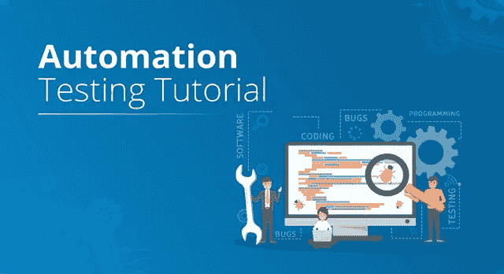
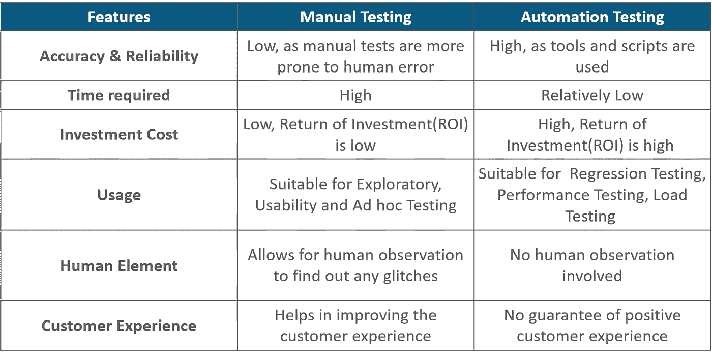
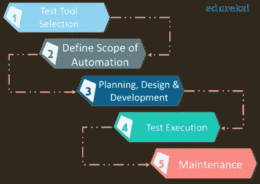
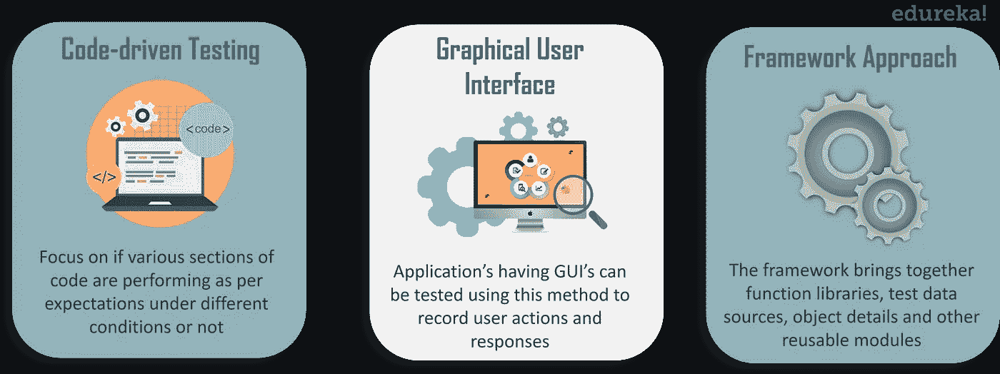
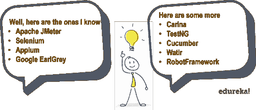

# 自动化测试教程——知道如何自动化软件测试

> 原文：<https://medium.com/edureka/automation-testing-tutorial-157d269e60db?source=collection_archive---------1----------------------->

Automation Testing Tutorial - Edureka

任何软件项目的主要目标都是获得高质量的产品，同时减少完成项目所需的成本和时间。这是通过定期测试软件实现的。软件测试是任何 IT 项目不可或缺的一部分。对软件进行测试是为了检测错误并找出可能对用户体验产生负面影响的问题。测试主要分为手工测试和自动化测试。通过这个自动化测试教程，我们将学习所有关于测试自动化的知识。

让我们来看看这个自动化测试教程中涵盖的主题:

1.  什么是自动化测试？
2.  手动测试和自动化测试的区别
3.  你如何为自动化选择测试用例？
4.  自动化测试是怎么做的？
5.  自动化测试的不同方法
6.  自动化测试工具

# 什么是自动化测试？

自动化测试是利用工具、脚本和软件的辅助，通过重复预定义的动作来执行测试用例的过程。测试自动化关注于用提高效率的系统或设备代替人工活动。

测试对任何软件产品的成功都至关重要。如果你的软件不能正常工作，很可能大多数人甚至不会购买或使用你的软件产品，如果他们购买或使用的时间不长的话。但是手动测试查找缺陷或 bug 是耗时、昂贵、经常重复的，并且容易出现人为错误。这就是自动化发挥作用的地方。自动化对于软件开发团队来说是必不可少的，以便以闪电般的速度跟上对更高质量软件不断增长的需求。

当您开始测试时，您必须做出的主要决定之一是您是要手动测试还是使用自动化测试。因此，您应该意识到手工测试和自动化测试之间的明显区别。

# 手动测试和自动化测试的区别

这些选择在技术上并不比另一个更好或更差。但是项目的规模、预算和时间余量肯定是影响哪种方法在您的测试过程中最有效的决定性因素。人工测试允许人类从测试中获得洞察力，否则自动化测试程序可能会遗漏这些。而自动化测试非常适合需要反复测试相同区域的大型项目。但是我们能自动化每一个测试用例吗？

# 哪些测试用例需要自动化？

嗯，自动化所有的测试是不可能的，所以确定哪些测试用例应该自动化是很重要的。您可以应用自动化的一些测试用例有:

*   重复性任务是自动化的主要候选对象。这些任务不仅对你来说很无聊，而且经常是你犯错的地方。
*   与其自己手动导出数据、处理数字和制作复杂的图表，不如投资一个工具或自动化策略来帮你做这些。
*   您可以为需要多个数据集的测试应用自动化。不要手动在表单中输入信息，而是自动化这个过程。
*   另一个可以应用自动化的好例子是负载测试。
*   您可以对运行在几个不同的硬件或软件平台和配置上的测试用例应用自动化。

到目前为止，您已经知道了何时执行自动化测试。在这个自动化测试教程的下一部分，我们将讨论一个逐步的过程，它将帮助你制定一个自动化计划。

# 你如何执行自动化测试？

测试自动化的成功需要仔细的计划和设计工作。在自动化过程中遵循以下步骤:

## 测试工具选择

任何过程都是从定义开始的，因此在应用测试自动化之前，您应该定义自动化的目标。一旦您确定了您正在执行哪种类型的测试，您就需要选择工具。有几种可用的测试工具，但是，选择适合您的测试需求的工具，对于自动化来说是非常重要的。选择自动化工具时，请考虑以下关键点:

*   开发和维护该工具的脚本是否容易？
*   它能在网络、手机、桌面等平台上工作吗？
*   该工具有测试报告功能吗？
*   这个工具可以支持多少种测试类型？
*   该工具支持多少种语言？

## 定义自动化的范围

接下来，您定义自动化的范围，因为您需要决定自动化哪些测试用例。您可以遵循的一些指示如下:

*   拥有大量数据的场景
*   跨应用程序具有通用功能的测试用例
*   技术可行性
*   业务组件被重用的程度
*   测试用例的复杂性

## 规划、设计和开发

在确定了您的目标和要自动化的测试类型之后，您应该决定您的自动化测试将执行什么操作。规划、设计和开发包括:

*   **开发测试用例:**开发您选择的测试用例。不要只是创建测试用例，一次性测试应用程序行为的各个方面。大型、复杂的自动化测试总是很难编辑和调试。最好把你的测试分成几个简单的，有逻辑的，更小的测试。
*   **开发测试套件:**开发测试套件来容纳你的测试用例。测试套件确保自动化测试用例在没有任何人工干预的情况下一个接一个地运行。这可以通过创建包含多个测试用例的测试套件、运行测试套件的库和命令行工具来轻松完成。

## 测试执行

自动化脚本在这个阶段执行。可以直接使用自动化工具或者通过调用自动化工具的测试管理工具来执行。为了从自动化测试中获得最大的收益，测试应该尽可能早地开始，并根据需要尽可能频繁地执行。测试人员越早参与项目的生命周期越好，测试越多，发现的 bug 就越多。

## 维护

一旦执行了测试用例，下一步就是创建报告，以便记录测试期间执行的操作。随着新的功能被添加到您在连续周期中测试的软件中，需要为每个发布周期添加、审查和维护自动化脚本。为了提高自动化的效率，维护变得很有必要。

因此，在执行自动化测试时，您可以遵循这些步骤来获得有效的结果。接下来是自动化工具。有几个创新的自动化测试工具，但是在我们讨论之前，我们需要理解不同种类的自动化方法。

# 自动化测试的不同方法

您可以考虑执行自动化测试的三种主要方法如下:

*   **代码驱动:**这里的重点主要是测试用例的执行，以发现代码的各个部分是否按照预期执行。代码驱动测试方法是敏捷软件开发中一种流行的方法。
*   **图形用户界面(GUI)测试:**拥有 GUI 的应用程序可以使用这种方法进行测试。测试人员可以记录用户的动作，并对其进行任意次数的分析。测试用例可以用许多编程语言编写，如 C#、Java、Perl、Python 等。
*   **测试自动化框架:**框架是一套用于产生自动化测试活动有益结果的指南。它集合了函数库、测试数据源、对象细节和其他可重用模块。不同类型的框架包括:

1.  **线性脚本框架:**以连续或线性的方式记录和重放测试脚本。
2.  **数据驱动框架:**专注于将测试脚本逻辑和测试数据相互分离。
3.  **关键字驱动的框架:**基于 excel 表中指定的关键字，测试脚本完成并执行测试。
4.  **模块化测试框架:**测试人员将应用分成多个模块，分别创建测试脚本。
5.  **混合测试框架:**框架的组合，以利用各自的优势。

基本上，这些是你可以在软件测试时实现自动化的方法。现在让我们继续我们的自动化测试教程，并找出一些用于自动化测试的最佳工具。

# 自动化测试工具

选择一个自动化测试工具对于测试自动化是至关重要的。市场上有很多自动化测试工具，选择最适合您的总体需求的自动化测试工具非常重要。在选择自动化测试工具时，请考虑以下要点:

1.  彻底理解您的项目需求，并确定您想要自动化的测试场景。
2.  搜索符合项目要求的工具列表。
3.  确定自动化工具的预算。
4.  现在比较每个工具的关键标准，如:是否容易开发和维护工具的脚本，它是否能在 web、移动、桌面等平台上工作。该工具有测试报告功能吗？这个工具可以支持多少种测试类型？该工具支持多少种语言？
5.  比较工具后，选择您预算内的工具。根据上面列出的关键标准，确保它能给你带来更多的优势。

既然你知道了如何选择一个合适的工具，让我们继续这个自动化测试教程，并且列出一些用于自动化测试的最好的工具。

*   Selenium 是一个流行的测试框架，用于跨各种浏览器和平台(如 Windows、Mac 和 Linux)执行 web 应用程序测试。
*   **Watir** — Watir，发音为 water，是一个由 Ruby 库组成的开源测试工具，用于自动化 web 应用测试。
*   **Ranorex** — Ranorex 是一款灵活的一体式 GUI 测试工具，使用它您可以在所有环境和设备中完美地执行自动化测试。
*   Appium 是一款开源的移动测试自动化软件，由高度活跃的开发者和专家社区免费提供支持。

这就把我们带到了这个自动化测试教程的结尾。我希望你发现它信息丰富，并有助于增加你的知识价值。

如果你想查看更多关于 Python、DevOps、Ethical Hacking 等市场最热门技术的文章，那么你可以参考 [Edureka 的官方网站。](https://www.edureka.co/blog/?utm_source=medium&utm_medium=content-link&utm_campaign=automation-testing-tutorial)

请留意本系列中的其他文章，它们将解释软件测试的各个方面。

> 1.[移动应用测试简介](/edureka/mobile-application-testing-51140ebe4a87)
> 
> 2.[软件测试工具](/edureka/software-testing-tools-ebd9ebac6f29)
> 
> 3.[软件测试的类型](/edureka/types-of-software-testing-d7aa29090b5b)
> 
> 4.[应用教程](/edureka/appium-tutorial-28e604aebeb)
> 
> 5. [JMeter 教程](/edureka/jmeter-tutorial-774856163ee9)
> 
> 6.[使用 JMeter 进行负载测试](/edureka/load-testing-using-jmeter-3da837c11a02)
> 
> 7.[什么是功能测试？](/edureka/what-is-functional-testing-complete-guide-to-automation-tools-183e42ad517a)
> 
> 8.[功能测试与非功能测试](/edureka/functional-testing-vs-non-functional-testing-a08bc732fbdd)
> 
> 9. [JMeter vs LoadRunner](/edureka/jmeter-vs-loadrunner-c1ab63acd935)
> 
> 10.[回归测试](/edureka/regression-testing-b913b7064824)
> 
> 11.[性能测试生命周期](/edureka/performance-testing-life-cycle-d4242d39a5aa)
> 
> 12. [JMeter 插件](/edureka/jmeter-plugins-1bceec7f6226)
> 
> 13. [Appium 建筑](/edureka/appium-architecture-505f70bf3484)
> 
> 14.[如何在网站上使用 JMeter 进行压力测试？](/edureka/stress-testing-using-jmeter-e6b3c64299d0)

*原载于 2019 年 3 月 26 日 www.edureka.co**的* [*。*](https://www.edureka.co/blog/automation-testing-tutorial/)